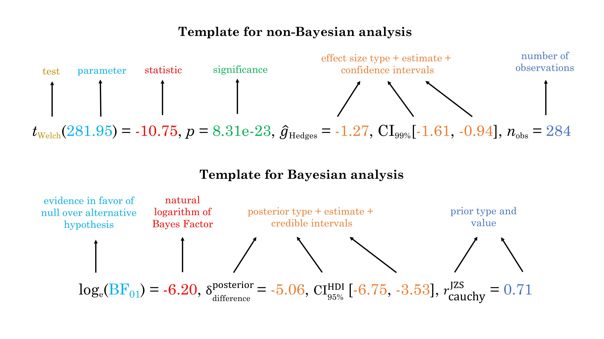

  <!-- README.md is generated from README.Rmd. Please edit that file -->

```{r, echo = FALSE}
knitr::opts_chunk$set(
  collapse = TRUE,
  dpi = 200,
  out.width = "100%",
  comment = "#>",
  fig.path = "man/figures/README-"
)
```

# `ggstatsplot`: `ggplot2` Based Plots with Statistical Details

Package | Status | Usage | GitHub | References
----------------- | ----------------- | ----------------- | ----------------- | -----------------
[](https://CRAN.R-project.org/package=ggstatsplot) | [](https://travis-ci.org/IndrajeetPatil/ggstatsplot) | [](https://CRAN.R-project.org/package=ggstatsplot) | [](https://github.com/IndrajeetPatil/ggstatsplot/) | [](https://indrajeetpatil.github.io/ggstatsplot/)
[](https://cran.r-project.org/web/checks/check_results_ggstatsplot.html) | [](https://ci.appveyor.com/project/IndrajeetPatil/ggstatsplot) | [](https://CRAN.R-project.org/package=ggstatsplot) | [$forks[[1]]`-blue.svg)](https://github.com/IndrajeetPatil/ggstatsplot/) | [](https://www.rdocumentation.org/packages/ggstatsplot)
[](https://cran.r-project.org/) | [](https://www.tidyverse.org/lifecycle/) | [](https://CRAN.R-project.org/package=ggstatsplot) | [$open_issues[[1]]`-red.svg)](https://github.com/IndrajeetPatil/ggstatsplot/issues) | [](https://CRAN.R-project.org/package=ggstatsplot/vignettes/)
[](https://github.com/IndrajeetPatil/ggstatsplot) | [](https://coveralls.io/github/IndrajeetPatil/ggstatsplot?branch=master) | [](https://CRAN.R-project.org/package=ggstatsplot) | [](https://github.com/IndrajeetPatil/ggstatsplot) | [](https://doi.org/10.5281/zenodo.2074621)
[](https://www.gnu.org/licenses/gpl-3.0.en.html) | [](https://codecov.io/gh/IndrajeetPatil/ggstatsplot?branch=master) | [](http://hits.dwyl.io/IndrajeetPatil/ggstatsplot) | [)`-yellowgreen.svg)](https://github.com/IndrajeetPatil/ggstatsplot/commits/master) | [](https://github.com/IndrajeetPatil/ggstatsplot/commits/master)
[](https://CRAN.R-project.org/package=ggstatsplot) | [](https://github.com/IndrajeetPatil/ggstatsplot/blob/master/tests/README.md) | [](https://saythanks.io/to/IndrajeetPatil) | [](http://www.repostatus.org/#active) | [](https://github.com/IndrajeetPatil/ggstatsplot/issues)
[](https://gitter.im/ggstatsplot/community) | [](https://dependencyci.com/github/IndrajeetPatil/ggstatsplot) | | |

# Overview

[`ggstatsplot`](https://indrajeetpatil.github.io/ggstatsplot/) is an extension
of [`ggplot2`](https://github.com/tidyverse/ggplot2) package for creating
graphics with details from statistical tests included in the plots themselves
and targeted primarily at behavioral sciences community to provide a one-line
code to produce information-rich plots. In a typical exploratory data analysis
workflow, data visualization and statistical modeling are two different phases:
visualization informs modeling, and modeling in its turn can suggest a
different visualization method, and so on and so forth. The central idea of
*ggstatsplot* is simple: combine these two phases into one in the form of
graphics with statistical details, which makes data exploration simpler and
faster.

Currently, it supports only the most common types of statistical tests:
**parametric**, **nonparametric**, **robust**, and **bayesian** versions of
**t-test**/**anova**, **correlation** analyses, **contingency table** analysis,
and **regression** analyses.

It, therefore, produces a limited kinds of plots for the supported analyses:

  - **violin plots** (for comparisons *between* groups or conditions), 
  - **pie charts** and **bar charts** (for categorical data),
  - **scatterplots** (for correlations between two variables),
  - **correlation matrices** (for correlations between multiple variables),
  - **histograms** and **dot plots/charts** (for hypothesis about distributions),
  - **dot-and-whisker plots** (for regression models).

In addition to these basic plots, `ggstatsplot` also provides **`grouped_`**
versions for most functions that makes it easy to repeat the same analysis for
any grouping variable.

Future versions will include other types of statistical analyses and plots as
well.

# Statistical reporting

For all statistical tests reported in the plots, the default template abides
by the [APA](https://my.ilstu.edu/~jhkahn/apastats.html) gold standard for
statistical reporting. For example, here are results from Yuen's test for
trimmed means (robust *t*-test):



# Summary of supported statistical analyses

The table below summarizes all the different types of analyses currently
supported in this package-

Functions | Description | Parametric | Non-parametric | Robust | Bayes Factor
------- | ------------------ | ---- | ----- | ----| ----- 
`ggbetweenstats` | Between group/condition comparisons | <font color="green">Yes</font> | <font color="green">Yes</font> | <font color="green">Yes</font> | <font color="green">Yes</font>
`ggwithinstats` | Within group/condition comparisons | <font color="green">Yes</font> | <font color="green">Yes</font> | <font color="green">Yes</font> | <font color="green">Yes</font>
`gghistostats`, `ggdotplotstats` | Distribution of a numeric variable | <font color="green">Yes</font> | <font color="green">Yes</font> | <font color="green">Yes</font> | <font color="green">Yes</font>
`ggcorrmat` | Correlation matrix | <font color="green">Yes</font> | <font color="green">Yes</font> | <font color="green">Yes</font> | <font color="red">No</font>
`ggscatterstats` | Correlation between two variables | <font color="green">Yes</font> | <font color="green">Yes</font> | <font color="green">Yes</font> | <font color="green">Yes</font>
`ggpiestats`, `ggbarstats` | Association between categorical variables | <font color="green">Yes</font> | `NA` | `NA` | <font color="green">Yes</font>
`ggpiestats`, `ggbarstats` | Equal proportions for categorical variable levels | <font color="green">Yes</font> | `NA` | `NA` | <font color="red">No</font>
`ggcoefstats` | Regression model coefficients | <font color="green">Yes</font> | <font color="red">No</font> | <font color="green">Yes</font> | <font color="red">No</font>

# Effect sizes and confidence intervals available

`ggstatsplot` provides a wide range of effect sizes and their confidence
intervals.

Test | Parametric | Non-parametric | Robust | Bayes Factor
---------------------------- | ------ | ------ | ------ | ------
one-sample *t*-test | <font color="green">Yes</font> | <font color="green">Yes</font> | <font color="green">Yes</font> | <font color="red">No</font>
two-sample *t*-test (between) | <font color="green">Yes</font> | <font color="green">Yes</font> | <font color="green">Yes</font> | <font color="red">No</font>
two-sample *t*-test (within) | <font color="green">Yes</font> | <font color="green">Yes</font> | <font color="green">Yes</font> | <font color="red">No</font>
one-way ANOVA (between) | <font color="green">Yes</font> | <font color="green">Yes</font> | <font color="green">Yes</font> | <font color="red">No</font>
one-way ANOVA (within) | <font color="green">Yes</font> | <font color="green">Yes</font> | <font color="red">No</font> | <font color="red">No</font>
correlations | <font color="green">Yes</font> | <font color="green">Yes</font> | <font color="green">Yes</font> | <font color="red">No</font>
contingency table | <font color="green">Yes</font> | `NA` | `NA` | <font color="red">No</font>
goodness of fit | <font color="green">Yes</font> | `NA` | `NA` | <font color="red">No</font>
regression | <font color="green">Yes</font> | <font color="red">No</font> | <font color="green">Yes</font> | <font color="red">No</font>

# Installation

To get the latest, stable `CRAN` release (`0.0.11`):

```{r installationCRAN, eval = FALSE}
utils::install.packages(pkgs = "ggstatsplot")
```

*Note*: If you are on a linux machine, you will need to have OpenGL libraries
installed (specifically, `libx11`, `mesa` and Mesa OpenGL Utility library -
`glu`) for the dependency package `rgl` to work.

You can get the **development** version of the package from GitHub
(`0.0.11.9000`). To see what new changes (and bug fixes) have been made to the
package since the last release on `CRAN`, you can check the detailed log of
changes here: <https://indrajeetpatil.github.io/ggstatsplot/news/index.html>

If you are in hurry and want to reduce the time of installation,
prefer-

```{r installation1, eval = FALSE}
# needed package to download from GitHub repo
utils::install.packages(pkgs = "remotes")

# downloading the package from GitHub
remotes::install_github(
  repo = "IndrajeetPatil/ggstatsplot", # package path on GitHub
  dependencies = FALSE, # assumes you have already installed needed packages
  quick = TRUE # skips docs, demos, and vignettes
)
```

If time is not a constraint-

```{r installation2, eval = FALSE}
remotes::install_github(
  repo = "IndrajeetPatil/ggstatsplot", # package path on GitHub
  dependencies = TRUE, # installs packages which ggstatsplot depends on
  upgrade_dependencies = TRUE # updates any out of date dependencies
)
```

If you are not using the [RStudio IDE](https://www.rstudio.com/) and you get an
error related to "pandoc" you will either need to remove the argument
`build_vignettes = TRUE` (to avoid building the vignettes) or install
[pandoc](http://pandoc.org/). If you have the `rmarkdown` R package installed
then you can check if you have pandoc by running the following in R:

```{r pandoc}
rmarkdown::pandoc_available()
```

# Citation

If you want to cite this package in a scientific journal or in any other
context, run the following code in your `R` console:

```{r citation, eval=FALSE}
utils::citation(package = "ggstatsplot")
```

There is currently a publication in preparation corresponding to this package
and the citation will be updated once it's published.

# Documentation and Examples

To see the detailed documentation for each function in the stable **CRAN**
version of the package, see:

  - README:
    <https://CRAN.R-project.org/package=ggstatsplot/readme/README.html>
  - Presentation:
    <https://indrajeetpatil.github.io/ggstatsplot_slides/slides/ggstatsplot_presentation.html#1>
  - Vignettes: <https://CRAN.R-project.org/package=ggstatsplot/vignettes/additional.html>

To see the documentation relevant for the **development** version of the package,
see the dedicated website for `ggstatplot`, which is updated after every new
commit: <https://indrajeetpatil.github.io/ggstatsplot/>.

## Help

In `R`, documentation for any function can be accessed with the standard `help`
command (e.g., `?ggbetweenstats`).

Another handy tool to see arguments to any of the functions is `args`. For
example-

```{r args, message = FALSE, warning = FALSE}
args(name = ggstatsplot::specify_decimal_p)
```

In case you want to look at the function body for any of the functions, just
type the name of the function without the parentheses:

```{r funbody, message = FALSE, warning = FALSE}
# function to convert class of any object to `ggplot` class
ggstatsplot::ggplot_converter
```

If you are not familiar either with what the namespace `::` does or how to use
pipe operator `%>%`, something this package and its documentation relies a lot
on, you can check out these links-

  - <http://r-pkgs.had.co.nz/namespace.html>
  - <http://r4ds.had.co.nz/pipes.html>

## Usage

`ggstatsplot` relies on non-standard evaluation (NSE), i.e., rather than looking
at the values of arguments (`x`, `y`), it instead looks at their expressions.
This means that you **shouldn't** enter arguments with the `$` operator and
setting `data = NULL`: `data = NULL, x = data$x, y = data$y`. You **must**
always specify the `data` argument for all functions. On the plus side, you can
enter arguments either as a string (`x = "x", y = "y"`) or as a bare expression
(`x = x, y = y`) and it wouldn't matter. To read more about NSE, see-
<http://adv-r.had.co.nz/Computing-on-the-language.html>

`ggstatsplot` is a very chatty package and will by default print helpful notes
on assumptions about linear models, warnings, etc. If you don't want your
console to be cluttered with such messages, they can be turned off by setting
argument `messages = FALSE` in the function call.

Here are examples of the main functions currently supported in `ggstatsplot`.

**Note**: If you are reading this on GitHub repository, the documentation below
is for the **development** version of the package. So you may see some features
available here that are not currently present in the stable version of this
package on **CRAN**. For documentation relevant for the `CRAN` version, see:

  - vignettes: <https://CRAN.R-project.org/package=ggstatsplot/vignettes/>
  - README: <https://CRAN.R-project.org/package=ggstatsplot/readme/README.html>

## `ggbetweenstats`

This function creates either a violin plot, a box plot, or a mix of two for
**between**-group or **between**-condition comparisons with results from
statistical tests in the subtitle. The simplest function call looks like this-

```{r ggbetweenstats1, message = FALSE, warning = FALSE}
# loading needed libraries
library(ggstatsplot)

# for reproducibility
set.seed(123)

# plot
ggstatsplot::ggbetweenstats(
  data = iris,
  x = Species,
  y = Sepal.Length,
  messages = FALSE
) + # further modification outside of ggstatsplot
  ggplot2::coord_cartesian(ylim = c(3, 8)) +
  ggplot2::scale_y_continuous(breaks = seq(3, 8, by = 1))
```

Note that this function returns a `ggplot2` object and thus any of the graphics
layers can be further modified.

The `type` (of test) argument
also accepts the following abbreviations: `"p"` (for *parametric*) or `"np"`
(for *nonparametric*) or `"r"` (for *robust*) or `"bf"` (for *Bayes Factor*).
Additionally, the type of plot to be displayed can also be modified (`"box"`,
`"violin"`, or `"boxviolin"`).

A number of other arguments can be specified to make this plot even more
informative or change some of the default options. 

```{r ggbetweenstats2, message = FALSE, warning = FALSE}
library(ggplot2)

# for reproducibility
set.seed(123)

# let's leave out one of the factor levels and see if instead of anova, a t-test will be run
iris2 <- dplyr::filter(.data = iris, Species != "setosa")

# let's change the levels of our factors, a common routine in data analysis
# pipeline, to see if this function respects the new factor levels
iris2$Species <-
  base::factor(
    x = iris2$Species,
    levels = c("virginica", "versicolor")
  )

# plot
ggstatsplot::ggbetweenstats(
  data = iris2,
  x = Species,
  y = Sepal.Length,
  notch = TRUE, # show notched box plot
  mean.plotting = TRUE, # whether mean for each group is to be displayed
  mean.ci = TRUE, # whether to display confidence interval for means
  mean.label.size = 2.5, # size of the label for mean
  type = "p", # which type of test is to be run
  k = 3, # number of decimal places for statistical results
  outlier.tagging = TRUE, # whether outliers need to be tagged
  outlier.label = Sepal.Width, # variable to be used for the outlier tag
  outlier.label.color = "darkgreen", # changing the color for the text label
  xlab = "Type of Species", # label for the x-axis variable
  ylab = "Attribute: Sepal Length", # label for the y-axis variable
  title = "Dataset: Iris flower data set", # title text for the plot
  ggtheme = ggthemes::theme_fivethirtyeight(), # choosing a different theme
  ggstatsplot.layer = FALSE, # turn off ggstatsplot theme layer
  package = "wesanderson", # package from which color palette is to be taken
  palette = "Darjeeling1", # choosing a different color palette
  messages = FALSE
)
```

In case of a parametric t-test, setting `bf.message = TRUE` will also attach
results from Bayesian Student's *t*-test. If the null hypothesis can't be
rejected with the NHST approach, the Bayesian approach can help index evidence
in favor of the null hypothesis (i.e., `BF01`).

By default, Bayes Factor quantifies the support for the alternative hypothesis
(H1) over the null hypothesis (H0) (i.e., `BF10` is displayed). Natural
logarithms are shown because BF values can be pretty large. This also makes it
easy to compare evidence in favor alternative (`BF10`) versus null (`BF01`)
hypotheses (since `log(BF10) = - log(BF01)`).

Additionally, there is also a `grouped_` variant of this function that makes it
easy to repeat the same operation across a **single** grouping variable:

```{r ggbetweenstats3, message = FALSE, warning = FALSE, fig.height = 14, fig.width = 12}
# for reproducibility
set.seed(123)

# plot
ggstatsplot::grouped_ggbetweenstats(
  data = dplyr::filter(
    .data = ggstatsplot::movies_long,
    genre %in% c("Action", "Action Comedy", "Action Drama", "Comedy")
  ),
  x = mpaa,
  y = length,
  grouping.var = genre, # grouping variable
  pairwise.comparisons = TRUE, # display significant pairwise comparisons
  pairwise.annotation = "p.value", # how do you want to annotate the pairwise comparisons
  p.adjust.method = "bonferroni", # method for adjusting p-values for multiple comparisons
  conf.level = 0.99, # changing confidence level to 99%
  ggplot.component = list( # adding new components to `ggstatsplot` default
    ggplot2::scale_y_continuous(sec.axis = ggplot2::dup_axis())
  ),
  k = 3,
  title.prefix = "Movie genre",
  caption = substitute(paste(
    italic("Source"),
    ":IMDb (Internet Movie Database)"
  )),
  palette = "default_jama",
  package = "ggsci",
  messages = FALSE,
  nrow = 2,
  title.text = "Differences in movie length by mpaa ratings for different genres"
)
```

### Summary of tests

Following (between-subjects) tests are carried out for each type of analyses-

Type | No. of groups | Test
----------- | --- | -------------------------
Parametric | > 2 | Student's or Welch's one-way ANOVA
Non-parametric | > 2 | Kruskal–Wallis one-way ANOVA
Robust | > 2 | Heteroscedastic one-way ANOVA for trimmed means
Bayes Factor | > 2 | Student's ANOVA
Parametric | 2 | Student's or Welch's *t*-test
Non-parametric | 2 | Mann–Whitney *U* test
Robust | 2 |  Yuen's test for trimmed means
Bayes Factor | 2 | Student's *t*-test

Here is a summary of *multiple pairwise comparison* tests supported in
*ggbetweenstats*-

Type | Equal variance? | Test | *p*-value adjustment? 
----------- | --- | ------------------------- | ---
Parametric | No | Games-Howell test | <font color="green">Yes</font>  
Parametric | Yes | Student's *t*-test | <font color="green">Yes</font>  
Non-parametric | No | Dwass-Steel-Crichtlow-Fligner test | <font color="green">Yes</font>  
Robust | No | Yuen's trimmed means test | <font color="green">Yes</font>  
Bayes Factor | No | <font color="red">No</font> | <font color="red">No</font>
Bayes Factor | Yes | <font color="red">No</font> | <font color="red">No</font>

For more, see the `ggbetweenstats` vignette:
<https://indrajeetpatil.github.io/ggstatsplot/articles/web_only/ggbetweenstats.html>

## `ggwithinstats`

`ggbetweenstats` function has an identical twin function `ggwithinstats` for
repeated measures designs that behaves in the same fashion with few minor
tweaks. As can be seen from an example below, the only difference between the
plot structure is that now the group means are connected by paths to highlight
the within-subjects nature of the data.

```{r ggwithinstats1, message = FALSE, warning = FALSE, fig.width = 7, fig.height = 5}
# for reproducibility and data
set.seed(123)
library(WRS2)

# plot
ggstatsplot::ggwithinstats(
  data = WRS2::WineTasting,
  x = Wine,
  y = Taste,
  sort = "descending", # ordering groups along the x-axis based on
  sort.fun = median, # values of `y` variable
  pairwise.comparisons = TRUE,
  pairwise.display = "s",
  pairwise.annotation = "p",
  title = "Wine tasting",
  caption = "Data from: `WRS2` R package",
  ggtheme = ggthemes::theme_fivethirtyeight(),
  ggstatsplot.layer = FALSE,
  messages = FALSE
)
```

As with the `ggbetweenstats`, this function also has a `grouped_` variant that
makes repeating the same analysis across a single grouping variable quicker. We
will see an example with only repeated measurements-

```{r ggwithinstats2, message = FALSE, warning = FALSE, fig.height = 6, fig.width = 12}
# common setup
set.seed(123)
library(jmv)
data("bugs", package = "jmv")

# getting data in tidy format
data_bugs <- bugs %>%
  tibble::as_tibble(x = .) %>%
  tidyr::gather(data = ., key, value, LDLF:HDHF) %>%
  dplyr::filter(.data = ., Region %in% c("Europe", "North America"))

# plot
ggstatsplot::grouped_ggwithinstats(
  data = dplyr::filter(data_bugs, key %in% c("LDLF", "LDHF")),
  x = key,
  y = value,
  xlab = "Condition",
  ylab = "Desire to kill an artrhopod",
  grouping.var = Region,
  outlier.tagging = TRUE,
  outlier.label = Education,
  ggtheme = hrbrthemes::theme_ipsum_tw(),
  ggstatsplot.layer = FALSE,
  messages = FALSE
)
```

### Summary of tests

Following (within-subjects) tests are carried out for each type of analyses-

Type | No. of groups | Test
----------- | --- | -------------------------
Parametric | > 2 | One-way repeated measures ANOVA
Non-parametric | > 2 | Friedman test
Robust | > 2 | Heteroscedastic one-way repeated measures ANOVA for trimmed means
Bayes Factor | > 2 | One-way repeated measures ANOVA
Parametric | 2 | Student's *t*-test
Non-parametric | 2 | Wilcoxon signed-rank test
Robust | 2 | Yuen's test on trimmed means for dependent samples
Bayes Factor | 2 | Student's *t*-test

Here is a summary of *multiple pairwise comparison* tests supported in
*ggwithinstats*-

Type | Test | *p*-value adjustment? 
----------- | ---------------------------- | ---
Parametric | Student's *t*-test | <font color="green">Yes</font>  
Non-parametric | Durbin-Conover test | <font color="green">Yes</font>  
Robust | Yuen's trimmed means test | <font color="green">Yes</font>  
Bayes Factor | <font color="red">No</font> | <font color="red">No</font>

For more, see the `ggwithinstats` vignette:
<https://indrajeetpatil.github.io/ggstatsplot/articles/web_only/ggwithinstats.html>

## `ggscatterstats`

This function creates a scatterplot with marginal
histograms/boxplots/density/violin/densigram plots from `ggExtra::ggMarginal`
and results from statistical tests in the subtitle:

```{r ggscatterstats1, message = FALSE, warning = FALSE}
ggstatsplot::ggscatterstats(
  data = ggplot2::msleep,
  x = sleep_rem,
  y = awake,
  xlab = "REM sleep (in hours)",
  ylab = "Amount of time spent awake (in hours)",
  title = "Understanding mammalian sleep",
  messages = FALSE
)
```

Number of other arguments can be specified to modify this basic plot-

```{r ggscatterstats2, message = FALSE, warning = FALSE}
# for reproducibility
set.seed(123)

# plot
ggstatsplot::ggscatterstats(
  data = dplyr::filter(.data = ggstatsplot::movies_long, genre == "Action"),
  x = budget,
  y = rating,
  type = "robust", # type of test that needs to be run
  conf.level = 0.99, # confidence level
  xlab = "Movie budget (in million/ US$)", # label for x axis
  ylab = "IMDB rating", # label for y axis
  label.var = "title", # variable for labeling data points
  label.expression = "rating < 5 & budget > 100", # expression that decides which points to label
  line.color = "yellow", # changing regression line color line
  title = "Movie budget and IMDB rating (action)", # title text for the plot
  caption = expression( # caption text for the plot
    paste(italic("Note"), ": IMDB stands for Internet Movie DataBase")
  ),
  ggtheme = hrbrthemes::theme_ipsum_ps(), # choosing a different theme
  ggstatsplot.layer = FALSE, # turn off ggstatsplot theme layer
  marginal.type = "density", # type of marginal distribution to be displayed
  xfill = "#0072B2", # color fill for x-axis marginal distribution
  yfill = "#009E73", # color fill for y-axis marginal distribution
  xalpha = 0.6, # transparency for x-axis marginal distribution
  yalpha = 0.6, # transparency for y-axis marginal distribution
  centrality.para = "median", # central tendency lines to be displayed
  messages = FALSE # turn off messages and notes
)
```

Additionally, there is also a `grouped_` variant of this function that makes it
easy to repeat the same operation across a **single** grouping variable:

```{r ggscatterstats3, message = FALSE, warning = FALSE, fig.height = 12, fig.width = 14}
# for reproducibility
set.seed(123)

# plot
ggstatsplot::grouped_ggscatterstats(
  data = dplyr::filter(
    .data = ggstatsplot::movies_long,
    genre %in% c("Action", "Action Comedy", "Action Drama", "Comedy")
  ),
  x = rating,
  y = length,
  conf.level = 0.99,
  k = 3, # no. of decimal places in the results
  xfill = "#E69F00",
  yfill = "#8b3058",
  xlab = "IMDB rating",
  grouping.var = genre, # grouping variable
  title.prefix = "Movie genre",
  ggtheme = ggplot2::theme_grey(),
  ggplot.component = list(
    ggplot2::scale_x_continuous(breaks = seq(2, 9, 1), limits = (c(2, 9)))
  ),
  messages = FALSE,
  nrow = 2,
  title.text = "Relationship between movie length by IMDB ratings for different genres"
)
```

**Using `ggscatterstats()` in R Notebooks or R Markdown**

If you try including a `ggscatterstats()` plot inside an `R Notebook` or
`R Markdown` code chunk, you'll notice that the plot doesn't get output. In
order to get a `ggscatterstats()` to show up in these contexts, you need
to save the `ggscatterstats` plot as a variable in one code chunk, and
explicitly print it using the `grid` package in another chunk, like
this:

```{r ggscatterstats_notebook, eval = FALSE}
# include the following code in your code chunk inside R Notebook or Markdown
grid::grid.newpage()
grid::grid.draw(
  ggstatsplot::ggscatterstats(
    data = ggstatsplot::movies_wide,
    x = budget,
    y = rating,
    marginal = TRUE,
    messages = FALSE
  )
)
```

### Summary of tests

Following tests are carried out for each type of analyses. Additionally, the
correlation coefficients (and their confidence intervals) are used as effect
sizes-

Type | Test | CI?
----------- | ------------------------- | ---
Parametric | Pearson's correlation coefficient | <font color="green">Yes<font>
Non-parametric | Spearman's rank correlation coefficient | <font color="green">Yes<font>
Robust | Percentage bend correlation coefficient | <font color="green">Yes<font>
Bayes Factor | Pearson's correlation coefficient | <font color="red">No<font>

For more, see the `ggscatterstats` vignette:
<https://indrajeetpatil.github.io/ggstatsplot/articles/web_only/ggscatterstats.html>

## `ggpiestats`

This function creates a pie chart for categorical or nominal variables with
results from contingency table analysis (Pearson's chi-squared test for
between-subjects design and McNemar's test for within-subjects design) included
in the subtitle of the plot. If only one categorical variable is entered,
results from one-sample **proportion test** will be displayed as a subtitle.

```{r ggpiestats1, message = FALSE, warning = FALSE}
# for reproducibility
set.seed(123)

# plot
ggstatsplot::ggpiestats(
  data = ggplot2::msleep,
  main = vore,
  title = "Composition of vore types among mammals",
  messages = FALSE
)
```

This function can also be used to study an interaction between two categorical
variables. Additionally, this basic plot can further be modified with additional
arguments and the function returns a `ggplot2` object that can further be
modified with `ggplot2` syntax:

```{r ggpiestats2, message = FALSE, warning = FALSE}
# for reproducibility
set.seed(123)

# plot
ggstatsplot::ggpiestats(
  data = mtcars,
  main = am,
  condition = cyl,
  conf.level = 0.99, # confidence interval for effect size measure
  title = "Dataset: Motor Trend Car Road Tests", # title for the plot
  stat.title = "interaction: ", # title for the results
  legend.title = "Transmission", # title for the legend
  factor.levels = c("1 = manual", "0 = automatic"), # renaming the factor level names (`main`)
  facet.wrap.name = "No. of cylinders", # name for the facetting variable
  slice.label = "counts", # show counts data instead of percentages
  package = "ggsci", # package from which color palette is to be taken
  palette = "default_jama", # choosing a different color palette
  caption = substitute( # text for the caption
    paste(italic("Source"), ": 1974 Motor Trend US magazine")
  ),
  messages = FALSE # turn off messages and notes
)
```

In case of within-subjects designs, setting `paired = TRUE` will produce results
from McNemar test-

```{r ggpiestats3, message = FALSE, warning = FALSE}
# for reproducibility
set.seed(123)

# data
survey.data <- data.frame(
  `1st survey` = c("Approve", "Approve", "Disapprove", "Disapprove"),
  `2nd survey` = c("Approve", "Disapprove", "Approve", "Disapprove"),
  `Counts` = c(794, 150, 86, 570),
  check.names = FALSE
)

# plot
ggstatsplot::ggpiestats(
  data = survey.data,
  main = `1st survey`,
  condition = `2nd survey`,
  counts = Counts,
  paired = TRUE, # within-subjects design
  conf.level = 0.99, # confidence interval for effect size measure
  stat.title = "McNemar Test: ",
  package = "wesanderson",
  palette = "Royal1"
)
```

Additionally, there is also a `grouped_` variant of this function that makes it
easy to repeat the same operation across a **single** grouping variable:

```{r ggpiestats4, message = FALSE, warning = FALSE, fig.height = 10, fig.width = 10}
# for reproducibility
set.seed(123)

# plot
ggstatsplot::grouped_ggpiestats(
  dplyr::filter(
    .data = ggstatsplot::movies_long,
    genre %in% c("Action", "Action Comedy", "Action Drama", "Comedy")
  ),
  main = mpaa,
  grouping.var = genre, # grouping variable
  title.prefix = "Movie genre", # prefix for the facetted title
  label.text.size = 3, # text size for slice labels
  slice.label = "both", # show both counts and percentage data
  perc.k = 1, # no. of decimal places for percentages
  palette = "brightPastel",
  package = "quickpalette",
  messages = FALSE,
  nrow = 2,
  title.text = "Composition of MPAA ratings for different genres"
)
```

### Summary of tests

Following tests are carried out for each type of analyses-

Type of data | Design | Test
----------- | ------------ | -------------------------
Unpaired | *n* X *p* contingency table | Pearson's chi-squared test
Paired | *n* X *p* contingency table | McNemar's test
Frequency | *n* X *1* contingency table | Goodness of fit

Following effect sizes (and confidence intervals/CI) are available for each type
of test-

Type | Effect size | CI?
--------------- | ------------------------- | --- 
Pearson's chi-squared test | Cramer's *V* | <font color="green">Yes<font>
McNemar's test | *g*  | <font color="green">Yes<font>
Goodness of fit | *V*  | <font color="green">Yes<font>

For more, see the `ggpiestats` vignette:
<https://indrajeetpatil.github.io/ggstatsplot/articles/web_only/ggpiestats.html>

## `ggbarstats`

In case you are not a fan of pie charts (for very good reasons), you can
alternatively use `ggbarstats` function-

```{r ggbarstats1, message = FALSE, warning = FALSE, fig.height = 8, fig.width = 10}
# for reproducibility
set.seed(123)

# plot
ggstatsplot::ggbarstats(
  data = ggstatsplot::movies_long,
  main = mpaa,
  condition = genre,
  sampling.plan = "jointMulti",
  title = "MPAA Ratings by Genre",
  xlab = "movie genre",
  perc.k = 1,
  x.axis.orientation = "slant",
  ggtheme = hrbrthemes::theme_modern_rc(),
  ggstatsplot.layer = FALSE,
  ggplot.component = ggplot2::theme(axis.text.x = ggplot2::element_text(face = "italic")),
  palette = "Set2",
  messages = FALSE
)
```

And, needless to say, there is also a `grouped_` variant of this function-

```{r ggbarstats2, message = FALSE, warning = FALSE, fig.height = 16, fig.width = 10}
# setup
library(ggstatsplot)
set.seed(123)

# let's create a smaller dataframe
diamonds_short <- ggplot2::diamonds %>%
  dplyr::filter(.data = ., cut %in% c("Very Good", "Ideal")) %>%
  dplyr::filter(.data = ., clarity %in% c("SI1", "SI2", "VS1", "VS2", "VVS1")) %>%
  dplyr::sample_frac(tbl = ., size = 0.05)

# plot
ggstatsplot::grouped_ggbarstats(
  data = diamonds_short,
  main = color,
  condition = clarity,
  grouping.var = cut,
  sampling.plan = "poisson",
  title.prefix = "Quality",
  data.label = "both",
  label.text.size = 3,
  perc.k = 1,
  package = "palettetown",
  palette = "charizard",
  ggtheme = ggthemes::theme_tufte(base_size = 12),
  ggstatsplot.layer = FALSE,
  messages = FALSE,
  title.text = "Diamond quality and color combination",
  nrow = 2
)
```

### Summary of tests

This is identical to the `ggpiestats` function summary of tests.

## `gghistostats`

In case you would like to see the distribution of one variable and check if it
is significantly different from a specified value with a one sample test, this
function will let you do that. 

The `type` (of test) argument also accepts the following abbreviations: `"p"`
(for *parametric*) or `"np"` (for *nonparametric*) or `"r"` (for *robust*) or
`"bf"` (for *Bayes Factor*).

```{r gghistostats1, message = FALSE, warning = FALSE}
ggstatsplot::gghistostats(
  data = ToothGrowth, # dataframe from which variable is to be taken
  x = len, # numeric variable whose distribution is of interest
  title = "Distribution of Sepal.Length", # title for the plot
  fill.gradient = TRUE, # use color gradient
  test.value = 10, # the comparison value for t-test
  test.value.line = TRUE, # display a vertical line at test value
  type = "bf", # bayes factor for one sample t-test
  bf.prior = 0.8, # prior width for calculating the bayes factor
  messages = FALSE # turn off the messages
)
```

The aesthetic defaults can be easily modified-

```{r gghistostats2, message = FALSE, warning = FALSE}
# for reproducibility
set.seed(123)

# plot
ggstatsplot::gghistostats(
  data = iris, # dataframe from which variable is to be taken
  x = Sepal.Length, # numeric variable whose distribution is of interest
  title = "Distribution of Iris sepal length", # title for the plot
  caption = substitute(paste(italic("Source:", "Ronald Fisher's Iris data set"))),
  type = "parametric", # one sample t-test
  conf.level = 0.99, # changing confidence level for effect size
  bar.measure = "mix", # what does the bar length denote
  test.value = 5, # default value is 0
  test.value.line = TRUE, # display a vertical line at test value
  test.value.color = "#0072B2", # color for the line for test value
  centrality.para = "mean", # which measure of central tendency is to be plotted
  centrality.color = "darkred", # decides color for central tendency line
  binwidth = 0.10, # binwidth value (experiment)
  bf.prior = 0.8, # prior width for computing bayes factor
  messages = FALSE, # turn off the messages
  ggtheme = hrbrthemes::theme_ipsum_tw(), # choosing a different theme
  ggstatsplot.layer = FALSE # turn off ggstatsplot theme layer
)
```

As can be seen from the plot, bayes factor can be attached (`bf.message = TRUE`)
to assess evidence in favor of the null hypothesis.

Additionally, there is also a `grouped_` variant of this function that makes it
easy to repeat the same operation across a **single** grouping variable:

```{r gghistostats4, message = FALSE, warning = FALSE, fig.height = 10, fig.width = 10}
# for reproducibility
set.seed(123)

# plot
ggstatsplot::grouped_gghistostats(
  data = dplyr::filter(
    .data = ggstatsplot::movies_long,
    genre %in% c("Action", "Action Comedy", "Action Drama", "Comedy")
  ),
  x = budget,
  xlab = "Movies budget (in million US$)",
  type = "robust", # use robust location measure
  grouping.var = genre, # grouping variable
  normal.curve = TRUE, # superimpose a normal distribution curve
  normal.curve.color = "red",
  title.prefix = "Movie genre",
  ggtheme = ggthemes::theme_tufte(),
  ggplot.component = list( # modify the defaults from `ggstatsplot` for each plot
    ggplot2::scale_x_continuous(breaks = seq(0, 200, 50), limits = (c(0, 200)))
  ),
  messages = FALSE,
  nrow = 2,
  title.text = "Movies budgets for different genres"
)
```

### Summary of tests

Following tests are carried out for each type of analyses-

Type | Test
----------- | -------------------------
Parametric | One-sample Student's *t*-test
Non-parametric | One-sample Wilcoxon test 
Robust | One-sample percentile bootstrap
Bayes Factor | One-sample Student's *t*-test

For more, including information about the variant of this function
`grouped_gghistostats`, see the `gghistostats` vignette:
<https://indrajeetpatil.github.io/ggstatsplot/articles/web_only/gghistostats.html>

## `ggdotplotstats`

This function is similar to `gghistostats`, but is intended to be used when
numeric variable also has a label.

```{r ggdotplotstats1, message = FALSE, warning = FALSE, fig.height = 10, fig.width = 8}
# for reproducibility
set.seed(123)

# plot
ggdotplotstats(
  data = dplyr::filter(.data = gapminder::gapminder, continent == "Asia"),
  y = country,
  x = lifeExp,
  test.value = 55,
  test.value.line = TRUE,
  test.line.labeller = TRUE,
  test.value.color = "red",
  centrality.para = "median",
  centrality.k = 0,
  title = "Distribution of life expectancy in Asian continent",
  xlab = "Life expectancy",
  messages = FALSE,
  caption = substitute(
    paste(
      italic("Source"),
      ": Gapminder dataset from https://www.gapminder.org/"
    )
  )
)
```

As with the rest of the functions in this package, there is also a `grouped_`
variant of this function to facilitateto repeat the same operation across a
grouping variable.

```{r ggdotplotstats2, message = FALSE, warning = FALSE, fig.height = 6, fig.width = 10}
# for reproducibility
set.seed(123)

# removing factor level with very few no. of observations
df <- dplyr::filter(.data = ggplot2::mpg, cyl %in% c("4", "6"))

# plot
ggstatsplot::grouped_ggdotplotstats(
  data = df,
  x = cty,
  y = manufacturer,
  xlab = "city miles per gallon",
  ylab = "car manufacturer",
  type = "np", # non-parametric test
  grouping.var = cyl, # grouping variable
  test.value = 15.5,
  title.prefix = "cylinder count",
  point.color = "red",
  point.size = 5,
  point.shape = 13,
  test.value.line = TRUE,
  ggtheme = ggthemes::theme_par(),
  messages = FALSE,
  title.text = "Fuel economy data"
)
```

### Summary of tests

This is identical to summary of tests for `gghistostats`.

## `ggcorrmat`

`ggcorrmat` makes a correlalogram (a matrix of correlation coefficients) with
minimal amount of code. Just sticking to the defaults itself produces
publication-ready correlation matrices. But, for the sake of exploring the
available options, let's change some of the defaults. For example, multiple
aesthetics-related arguments can be modified to change the appearance of the
correlation matrix.

```{r ggcorrmat1, message = FALSE, warning = FALSE}
# for reproducibility
set.seed(123)

# as a default this function outputs a correlalogram plot
ggstatsplot::ggcorrmat(
  data = ggplot2::msleep,
  corr.method = "robust", # correlation method
  sig.level = 0.001, # threshold of significance
  p.adjust.method = "holm", # p-value adjustment method for multiple comparisons
  cor.vars = c(sleep_rem, awake:bodywt), # a range of variables can be selected
  cor.vars.names = c(
    "REM sleep", # variable names
    "time awake",
    "brain weight",
    "body weight"
  ),
  matrix.type = "upper", # type of visualization matrix
  colors = c("#B2182B", "white", "#4D4D4D"),
  title = "Correlalogram for mammals sleep dataset",
  subtitle = "sleep units: hours; weight units: kilograms"
)
```

Note that if there are `NA`s present in the selected dataframe, the legend will
display minimum, median, and maximum number of pairs used for correlation
matrices.

Alternatively, you can use it just to get the correlation matrices and their
corresponding *p*-values (in a `tibble` format). Also, note that if `cor.vars`
are not specified, all numeric variables will be used.

```{r ggcorrmat2, message = FALSE, warning = FALSE}
# for reproducibility
set.seed(123)

# show four digits in a tibble
options(pillar.sigfig = 4)

# getting the correlation coefficient matrix
ggstatsplot::ggcorrmat(
  data = iris, # all numeric variables from data will be used
  corr.method = "robust",
  output = "correlations", # specifying the needed output ("r" or "corr" will also work)
  digits = 3 # number of digits to be dispayed for correlation coefficient
)

# getting the p-value matrix
ggstatsplot::ggcorrmat(
  data = ggplot2::msleep,
  cor.vars = sleep_total:bodywt,
  corr.method = "robust",
  output = "p.values", # only "p" or "p-values" will also work
  p.adjust.method = "holm"
)

# getting the confidence intervals for correlations
ggstatsplot::ggcorrmat(
  data = ggplot2::msleep,
  cor.vars = sleep_total:bodywt,
  corr.method = "kendall",
  output = "ci",
  p.adjust.method = "holm"
)

# getting the sample sizes for all pairs
ggstatsplot::ggcorrmat(
  data = ggplot2::msleep,
  cor.vars = sleep_total:bodywt,
  corr.method = "robust",
  output = "n" # note that n is different due to NAs
)
```

Additionally, there is also a `grouped_` variant of this function that makes it
easy to repeat the same operation across a **single** grouping variable:

```{r ggcorrmat3, message = FALSE, warning = FALSE, fig.height = 10, fig.width = 10}
# for reproducibility
set.seed(123)

# plot
# let's use only 50% of the data to speed up the process
ggstatsplot::grouped_ggcorrmat(
  data = dplyr::filter(
    .data = ggstatsplot::movies_long,
    genre %in% c("Action", "Action Comedy", "Action Drama", "Comedy")
  ),
  cor.vars = length:votes,
  corr.method = "np",
  colors = c("#cbac43", "white", "#550000"),
  grouping.var = genre, # grouping variable
  digits = 3, # number of digits after decimal point
  title.prefix = "Movie genre",
  messages = FALSE,
  nrow = 2
)
```

### Summary of tests

Following tests are carried out for each type of analyses. Additionally, the
correlation coefficients (and their confidence intervals) are used as effect
sizes-

Type | Test | CI?
----------- | ------------------------- | ---
Parametric | Pearson's correlation coefficient | <font color="green">Yes<font>
Non-parametric | Spearman's rank correlation coefficient | <font color="green">Yes<font>
Robust | Percentage bend correlation coefficient | <font color="red">No<font>
Bayes Factor | Pearson's correlation coefficient | <font color="red">No<font>

For examples and more information, see the `ggcorrmat` vignette:
<https://indrajeetpatil.github.io/ggstatsplot/articles/web_only/ggcorrmat.html>

## `ggcoefstats`

`ggcoefstats` creates a lot with the regression coefficients' point estimates as
dots with confidence interval whiskers. 

```{r ggcoefstats1, message = FALSE, warning = FALSE, fig.height = 5, fig.width = 6}
# for reproducibility
set.seed(123)

# model
mod <- stats::lm(
  formula = mpg ~ am * cyl,
  data = mtcars
)

# plot
ggstatsplot::ggcoefstats(x = mod)
```

The basic plot can be further modified to one's liking with additional arguments
(also, let's use a robust linear model instead of a simple linear model now):

```{r ggcoefstats2, message = FALSE, warning = FALSE, fig.height = 6, fig.width = 8}
# for reproducibility
set.seed(123)

# model
mod <- MASS::rlm(
  formula = mpg ~ am * cyl,
  data = mtcars
)

# plot
ggstatsplot::ggcoefstats(
  x = mod,
  point.color = "red",
  point.shape = 15,
  vline.color = "#CC79A7",
  vline.linetype = "dotdash",
  stats.label.size = 3.5,
  stats.label.color = c("#0072B2", "#D55E00", "darkgreen"),
  title = "Car performance predicted by transmission & cylinder count",
  subtitle = "Source: 1974 Motor Trend US magazine",
  ggtheme = hrbrthemes::theme_ipsum_ps(),
  ggstatsplot.layer = FALSE
) +
  # further modification with the ggplot2 commands
  # note the order in which the labels are entered
  ggplot2::scale_y_discrete(labels = c("transmission", "cylinders", "interaction")) +
  ggplot2::labs(
    x = "regression coefficient",
    y = NULL
  )
```

Most of the regression models that are supported in the `broom` and
`broom.mixed` packages with `tidy` and `glance` methods are also supported by
`ggcoefstats`. For example-

`aareg`, `anova`, `aov`, `aovlist`, `Arima`, `bigglm`, `biglm`, `brmsfit`,
`btergm`, `cch`, `clm`, `clmm`, `confusionMatrix`, `coxph`, `drc`, `epi.2by2`,
`ergm`, `felm`, `fitdistr`, `glmerMod`, `glmmTMB`, `gls`, `gam`, `Gam`,
`gamlss`, `garch`, `glm`, `glmmadmb`, `glmmTMB`, `glmrob`, `gmm`, `ivreg`, `lm`,
`lm.beta`, `lmerMod`, `lmodel2`, `lmrob`, `mcmc`, `MCMCglmm`, `mediate`,
`mjoint`, `mle2`, `mlm`, `multinom`, `nlmerMod`, `nlrq`, `nls`, `orcutt`, `plm`,
`polr`, `ridgelm`, `rjags`, `rlm`, `rlmerMod`, `rq`, `speedglm`, `speedlm`,
`stanreg`, `survreg`, `svyglm`, `svyolr`, `svyglm`, etc.

Although not shown here, this function can also be used to carry out both
frequentist and Bayesian random-effects meta-analysis.

For a more exhaustive account of this function, see the associated vignette-
<https://indrajeetpatil.github.io/ggstatsplot/articles/web_only/ggcoefstats.html>

## `combine_plots`

The full power of `ggstatsplot` can be leveraged with a functional programming
package like [`purrr`](http://purrr.tidyverse.org/) that replaces `for` loops
with code that is both more succinct and easier to read and, therefore, `purrr`
should be preferrred `r emo::ji("heart_eyes_cat")`. (Another old school option
to do this effectively is using the `plyr` package.)

In such cases, `ggstatsplot` contains a helper function `combine_plots` to
combine multiple plots, which can be useful for combining a list of plots
produced with `purrr`. This is a wrapper around `cowplot::plot_grid` and lets
you combine multiple plots and add a combination of title, caption, and
annotation texts with suitable defaults.

For examples (both with `plyr` and `purrr`), see the associated vignette-
<https://indrajeetpatil.github.io/ggstatsplot/articles/web_only/combine_plots.html>

## `theme_ggstatsplot`

All plots from `ggstatsplot` have a default theme: `theme_ggstatsplot`. You can
change this theme by using the argument `ggtheme` for all functions.

It is important to note that irrespective of which `ggplot` theme you choose,
`ggstatsplot` in the backdrop adds a new layer with its idiosyncratic theme
settings, chosen to make the graphs more readable or aesthetically pleasing.
Let's see an example with `gghistostats` and see how a certain theme from
`hrbrthemes` package looks with and without the `ggstatsplot` layer.

```{r theme_ggstatsplot, message = FALSE, warning = FALSE, fig.height = 6, fig.width = 13}
# to use hrbrthemes themes, first make sure you have all the necessary fonts
library(hrbrthemes)
# extrafont::ttf_import()
# extrafont::font_import()

# try this yourself
ggstatsplot::combine_plots(
  # with the ggstatsplot layer
  ggstatsplot::gghistostats(
    data = iris,
    x = Sepal.Width,
    messages = FALSE,
    title = "Distribution of Sepal Width",
    test.value = 5,
    ggtheme = hrbrthemes::theme_ipsum(),
    ggstatsplot.layer = TRUE
  ),
  # without the ggstatsplot layer
  ggstatsplot::gghistostats(
    data = iris,
    x = Sepal.Width,
    messages = FALSE,
    title = "Distribution of Sepal Width",
    test.value = 5,
    ggtheme = hrbrthemes::theme_ipsum_ps(),
    ggstatsplot.layer = FALSE
  ),
  nrow = 1,
  labels = c("(a)", "(b)"),
  title.text = "Behavior of ggstatsplot theme layer with chosen ggtheme"
)
```

For more on how to modify it, see the associated vignette-
<https://indrajeetpatil.github.io/ggstatsplot/articles/web_only/theme_ggstatsplot.html>

## Using `ggstatsplot` statistical details with custom plots

Sometimes you may not like the defaults in a plot produced by `ggstatsplot`. In
such cases, you can use other custom plots (from `ggplot2` or other plotting
packages) and still use `ggstatsplot` functions to display results from relevant
statistical test. 

For example, in the following chunk, we will use a
*pirateplot* from `yarrr` package and use `ggstatsplot` function to display the
results.

```{r pirateplot, message = FALSE, warning = FALSE, fig.height = 6, fig.width = 8}
# for reproducibility
set.seed(123)

# loading the needed libraries
library(yarrr)
library(ggstatsplot)

# using `ggstatsplot` to get call with statistical results
stats_results <-
  ggstatsplot::ggbetweenstats(
    data = ChickWeight,
    x = Time,
    y = weight,
    return = "subtitle",
    messages = FALSE
  )

# using `yarrr` to create plot
yarrr::pirateplot(
  formula = weight ~ Time,
  data = ChickWeight,
  theme = 1,
  main = stats_results
)
```

All relevant functions in `ggstatsplot` have a `return` argument which can be
used to not only return plots (which is the default), but also to return a
`subtitle` or `caption`, which are objects of type `call` and can be used to
display statistical details in conjunction with a custom plot and at a custom
location.

# Code coverage

As the code stands right now, here is the code coverage for all primary
functions involved:
<https://codecov.io/gh/IndrajeetPatil/ggstatsplot/tree/master/R>

# Contributing

I'm happy to receive bug reports, suggestions, questions, and (most of all)
contributions to fix problems and add features. I personally prefer using the
`GitHub` issues system over trying to reach out to me in other ways (personal
e-mail, Twitter, etc.). Pull requests for contributions are encouraged.

Here are some simple ways in which you can contribute:

  - Read and correct any inconsistencies in the
    [documentation](https://indrajeetpatil.github.io/ggstatsplot/)

  - Raise issues about bugs or wanted features

  - Review code

  - Add new functionality (in the form of new plotting functions or helpers for
    preparing subtitles)

Please note that this project is released with a 
[Contributor Code of Conduct](https://github.com/IndrajeetPatil/ggstatsplot/blob/master/CONDUCT.md). By participating in this project you agree to abide by its terms.


# Session Information

For details about the session information in which this `README` file was
rendered, see-
<https://indrajeetpatil.github.io/ggstatsplot/articles/web_only/session_info.html>

