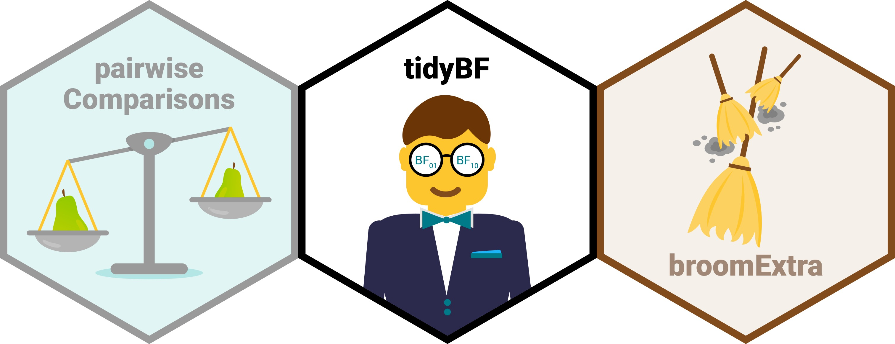

  <!-- README.md is generated from README.Rmd. Please edit that file -->

```{r, echo = FALSE}
# show me all columns
options(
  tibble.width = Inf,
  pillar.bold = TRUE,
  pillar.neg = TRUE,
  pillar.subtle_num = TRUE,
  pillar.min_chars = Inf
)

knitr::opts_chunk$set(
  collapse = TRUE,
  dpi = 300,
  warning = FALSE,
  message = FALSE,
  out.width = "100%",
  comment = "#>",
  fig.path = "man/figures/README-"
)
```

# `ggstatsplot`: `ggplot2` Based Plots with Statistical Details 

Package | Status | Usage | GitHub | Miscellaneous
----------------- | ----------------- | ----------------- | ----------------- | -----------------
[](https://CRAN.R-project.org/package=ggstatsplot) | [](https://travis-ci.org/IndrajeetPatil/ggstatsplot) | [](https://CRAN.R-project.org/package=ggstatsplot) | [](https://github.com/IndrajeetPatil/ggstatsplot/) | [](https://indrajeetpatil.github.io/ggstatsplot/)
[](https://cran.r-project.org/web/checks/check_results_ggstatsplot.html) | [](https://ci.appveyor.com/project/IndrajeetPatil/ggstatsplot) | [](https://CRAN.R-project.org/package=ggstatsplot) | [$forks[[1]]`-blue.svg)](https://github.com/IndrajeetPatil/ggstatsplot/) | [](https://cran.r-project.org/)
[](https://lifecycle.r-lib.org/articles/stages.html) | [](https://github.com/IndrajeetPatil/ggstatsplot) | [](https://CRAN.R-project.org/package=ggstatsplot) | [$open_issues[[1]]`-red.svg)](https://github.com/IndrajeetPatil/ggstatsplot/issues) | [](https://indrajeetpatil.github.io/ggstatsplot/articles/)
[](https://github.com/IndrajeetPatil/ggstatsplot) | [](https://coveralls.io/github/IndrajeetPatil/ggstatsplot?branch=master) | [](https://CRAN.R-project.org/package=ggstatsplot) | [](https://github.com/IndrajeetPatil/ggstatsplot) | [](https://doi.org/10.5281/zenodo.2074621)
[](https://www.gnu.org/licenses/gpl-3.0.en.html) | [](https://codecov.io/gh/IndrajeetPatil/ggstatsplot?branch=master) | [](https://hits.dwyl.com/IndrajeetPatil/ggstatsplot) | [)`-yellowgreen.svg)](https://github.com/IndrajeetPatil/ggstatsplot/commits/master) | [](https://github.com/IndrajeetPatil/ggstatsplot/commits/master)
[](https://CRAN.R-project.org/package=ggstatsplot) | [](https://github.com/IndrajeetPatil/ggstatsplot) | [](https://gitter.im/ggstatsplot/community) | [](https://www.repostatus.org/#active) | [](https://github.com/IndrajeetPatil/ggstatsplot/issues)

# Raison d'être 

> "What is to be sought in designs for the display of information is the clear
portrayal of complexity. Not the complication of the simple; rather ... the
revelation of the complex."   
- Edward R. Tufte

[`ggstatsplot`](https://indrajeetpatil.github.io/ggstatsplot/) is an extension
of [`ggplot2`](https://github.com/tidyverse/ggplot2) package for creating
graphics with details from statistical tests included in the information-rich
plots themselves. In a typical exploratory data analysis workflow, data
visualization and statistical modeling are two different phases: visualization
informs modeling, and modeling in its turn can suggest a different visualization
method, and so on and so forth. The central idea of `ggstatsplot` is simple:
combine these two phases into one in the form of graphics with statistical
details, which makes data exploration simpler and faster.

# Summary of available plots

It, therefore, produces a limited kinds of plots for the supported analyses:

Function | Plot | Description
------- | ---------- | ----------------- 
`ggbetweenstats` | **violin plots** | for comparisons *between* groups/conditions
`ggwithinstats` | **violin plots** | for comparisons *within* groups/conditions
`gghistostats` | **histograms** | for distribution about numeric variable
`ggdotplotstats` | **dot plots/charts** | for distribution about labeled numeric variable
`ggscatterstats` | **scatterplots** | for correlation between two variables
`ggcorrmat` | **correlation matrices** | for correlations between multiple variables
`ggpiestats` | **pie charts** | for categorical data 
`ggbarstats` | **bar charts** | for categorical data 
`ggcoefstats` | **dot-and-whisker plots** | for regression models and meta-analysis

In addition to these basic plots, `ggstatsplot` also provides **`grouped_`**
versions (see below) that makes it easy to repeat the same analysis for
any grouping variable.

# Summary of types of statistical analyses

The table below summarizes all the different types of analyses currently
supported in this package-

Functions | Description | Parametric | Non-parametric | Robust | Bayesian
------- | ------------------ | ---- | ----- | ----| ----- 
`ggbetweenstats` | Between group/condition comparisons | <font color="green">Yes</font> | <font color="green">Yes</font> | <font color="green">Yes</font> | <font color="green">Yes</font>
`ggwithinstats` | Within group/condition comparisons | <font color="green">Yes</font> | <font color="green">Yes</font> | <font color="green">Yes</font> | <font color="green">Yes</font>
`gghistostats`, `ggdotplotstats` | Distribution of a numeric variable | <font color="green">Yes</font> | <font color="green">Yes</font> | <font color="green">Yes</font> | <font color="green">Yes</font>
`ggcorrmat` | Correlation matrix | <font color="green">Yes</font> | <font color="green">Yes</font> | <font color="green">Yes</font> | <font color="green">Yes</font>
`ggscatterstats` | Correlation between two variables | <font color="green">Yes</font> | <font color="green">Yes</font> | <font color="green">Yes</font> | <font color="green">Yes</font>
`ggpiestats`, `ggbarstats` | Association between categorical variables | <font color="green">Yes</font> | `NA` | `NA` | <font color="green">Yes</font>
`ggpiestats`, `ggbarstats` | Equal proportions for categorical variable levels | <font color="green">Yes</font> | `NA` | `NA` | <font color="green">Yes</font>
`ggcoefstats` | Regression model coefficients | <font color="green">Yes</font> | <font color="green">Yes</font> | <font color="green">Yes</font> | <font color="green">Yes</font>
`ggcoefstats` | Random-effects meta-analysis | <font color="green">Yes</font> | `NA` | <font color="green">Yes</font> | <font color="green">Yes</font>

Summary of Bayesian analysis

Analysis | Hypothesis testing | Estimation
------------------ | ---------- | ---------
(one/two-sample) t-test | <font color="green">Yes</font> | <font color="green">Yes</font>
one-way ANOVA | <font color="green">Yes</font> |<font color="green">Yes</font>
correlation | <font color="green">Yes</font> | <font color="green">Yes</font>
(one/two-way) contingency table | <font color="green">Yes</font> | <font color="green">Yes</font>
random-effects meta-analysis | <font color="green">Yes</font> | <font color="green">Yes</font>

# Statistical reporting

For **all** statistical tests reported in the plots, the default template abides
by the [APA](https://my.ilstu.edu/~jhkahn/apastats.html) gold standard for
statistical reporting. For example, here are results from Yuen's test for
trimmed means (robust *t*-test):


# Summary of statistical tests and effect sizes

Here is a summary table of all the statistical tests currently supported across
various functions:
<https://indrajeetpatil.github.io/statsExpressions/articles/stats_details.html>

# Installation

To get the latest, stable `CRAN` release:

```{r installationCRAN, eval = FALSE}
install.packages("ggstatsplot")
```

*Note*:

Linux users may encounter some installation problems, as several R packages
require external libraries on the system, especially for `PMCMRplus` package.
The following `README` file briefly describes the installation procedure:
<https://CRAN.R-project.org/package=PMCMRplus/readme/README.html>

You can get the **development** version of the package from `GitHub`.

If you are in hurry and want to reduce the time of installation,
prefer-

```{r installation1, eval = FALSE}
# needed package to download from GitHub repo
install.packages("remotes")

# downloading the package from GitHub (needs `remotes` package to be installed)
remotes::install_github(
  repo = "IndrajeetPatil/ggstatsplot", # package path on GitHub
  dependencies = FALSE, # assumes you have already installed needed packages
  quick = TRUE # skips docs, demos, and vignettes
)
```

If time is not a constraint-

```{r installation2, eval = FALSE}
remotes::install_github(
  repo = "IndrajeetPatil/ggstatsplot", # package path on GitHub
  dependencies = TRUE, # installs packages which ggstatsplot depends on
  upgrade_dependencies = TRUE # updates any out of date dependencies
)
```

To see what new changes (and bug fixes) have been made to the package since the
last release on `CRAN`, you can check the detailed log of changes here:
<https://indrajeetpatil.github.io/ggstatsplot/news/index.html>

# Citation

If you want to cite this package in a scientific journal or in any other
context, run the following code in your `R` console:

```{r citation}
citation("ggstatsplot")
```

There is currently a publication in preparation corresponding to this package
and the citation will be updated once it's published.

# Documentation and Examples

To see the detailed documentation for each function in the stable **CRAN**
version of the package, see:

  - Website: <https://indrajeetpatil.github.io/ggstatsplot/>

  - README:
    <https://CRAN.R-project.org/package=ggstatsplot/readme/README.html>
    
  - Presentation:
    <https://indrajeetpatil.github.io/ggstatsplot_slides/slides/ggstatsplot_presentation.html#1>
    
  - Vignettes: <https://CRAN.R-project.org/package=ggstatsplot/vignettes/additional.html>

To see the documentation relevant for the **development** version of the package,
see the dedicated website for `ggstatplot`, which is updated after every new
commit: <https://indrajeetpatil.github.io/ggstatsplot/>.

# Primary functions

Here are examples of the main functions currently supported in `ggstatsplot`.

**Note**: If you are reading this on `GitHub` repository, the documentation below
is for the **development** version of the package. So you may see some features
available here that are not currently present in the stable version of this
package on **CRAN**. For documentation relevant for the `CRAN` version, see:
<https://CRAN.R-project.org/package=ggstatsplot/readme/README.html>

## `ggbetweenstats`

This function creates either a violin plot, a box plot, or a mix of two for
**between**-group or **between**-condition comparisons with results from
statistical tests in the subtitle. The simplest function call looks like this-

```{r ggbetweenstats1}
# for reproducibility
set.seed(123)
library(ggstatsplot)

# plot
ggbetweenstats(
  data = iris,
  x = Species,
  y = Sepal.Length,
  title = "Distribution of sepal length across Iris species"
)
```

`r emo::ji("pencil")` **Defaults** return<br>

`r emo::ji("check")` raw data + distributions <br>
`r emo::ji("check")` descriptive statistics <br>
`r emo::ji("check")` inferential statistics <br>
`r emo::ji("check")` effect size + CIs <br>
`r emo::ji("check")` pairwise comparisons <br>
`r emo::ji("check")` Bayesian hypothesis-testing <br>
`r emo::ji("check")` Bayesian estimation <br>

A number of other arguments can be specified to make this plot even more
informative or change some of the default options. 

```{r ggbetweenstats2}
# for reproducibility
set.seed(123)
library(ggplot2)

# plot
ggbetweenstats(
  data = ToothGrowth,
  x = supp,
  y = len,
  type = "r", # robust statistics
  k = 3, # number of decimal places for statistical results
  xlab = "Supplement type", # label for the x-axis variable
  ylab = "Tooth length", # label for the y-axis variable
  title = "The Effect of Vitamin C on Tooth Growth", # title text for the plot
  ggtheme = ggthemes::theme_fivethirtyeight(), # choosing a different theme
  ggstatsplot.layer = FALSE, # turn off `ggstatsplot` theme layer
  package = "wesanderson", # package from which color palette is to be taken
  palette = "Darjeeling1" # choosing a different color palette
)
```

Additionally, there is also a `grouped_` variant of this function that makes it
easy to repeat the same operation across a **single** grouping variable:

```{r ggbetweenstats3, fig.height = 14, fig.width = 12}
# for reproducibility
set.seed(123)

# plot
grouped_ggbetweenstats(
  data = dplyr::filter(
    .data = movies_long,
    genre %in% c("Action", "Action Comedy", "Action Drama", "Comedy")
  ),
  x = mpaa,
  y = length,
  grouping.var = genre, # grouping variable
  outlier.tagging = TRUE, # whether outliers need to be tagged
  outlier.label = title, # variable to be used for tagging outliers
  outlier.coef = 2,
  ggsignif.args = list(textsize = 4, tip_length = 0.01),
  p.adjust.method = "bonferroni", # method for adjusting p-values for multiple comparisons
  # adding new components to `ggstatsplot` default
  ggplot.component = list(ggplot2::scale_y_continuous(sec.axis = ggplot2::dup_axis())),
  caption = substitute(paste(italic("Source"), ": IMDb (Internet Movie Database)")),
  palette = "default_jama",
  package = "ggsci",
  plotgrid.args = list(nrow = 2),
  annotation.args = list(title = "Differences in movie length by mpaa ratings for different genres")
)
```

Note here that the function can be used to tag outliers!

### Summary of tests

The central tendency measure displayed will depend on the statistics:

Type | Measure | Function used
----------- | --------- | ------------------ 
Parametric | mean | `parameters::describe_distribution`
Non-parametric | median | `parameters::describe_distribution`
Robust | trimmed mean | `parameters::describe_distribution`
Bayesian | MAP estimate | `parameters::describe_distribution`

MAP: maximum a posteriori probability

Following (between-subjects) tests are carried out for each type of analyses-

Type | No. of groups | Test | Function used
----------- | --- | ------------------------- | -----
Parametric | > 2 | Fisher's or Welch's one-way ANOVA | `stats::oneway.test`
Non-parametric | > 2 | Kruskal–Wallis one-way ANOVA | `stats::kruskal.test`
Robust | > 2 | Heteroscedastic one-way ANOVA for trimmed means | `WRS2::t1way`
Bayes Factor | > 2 | Fisher's ANOVA | `BayesFactor::anovaBF`
Parametric | 2 | Student's or Welch's *t*-test | `stats::t.test`
Non-parametric | 2 | Mann–Whitney *U* test | `stats::wilcox.test`
Robust | 2 |  Yuen's test for trimmed means | `WRS2::yuen`
Bayesian | 2 | Student's *t*-test | `BayesFactor::ttestBF`

Following effect sizes (and confidence intervals/CI) are available for each type
of test-

Type | No. of groups | Effect size | CI? | Function used
----------- | --- | ------------------------- | --- | -----
Parametric | > 2 | $\eta_{p}^2$, $\omega_{p}^2$ | <font color="green">Yes<font> | `effectsize::omega_squared`, `effectsize::eta_squared`
Non-parametric | > 2 | $\epsilon_{ordinal}^2$ | <font color="green">Yes<font> | `effectsize::rank_epsilon_squared`
Robust | > 2 | $\xi$ (Explanatory measure of effect size) | <font color="green">Yes<font> | `WRS2::t1way`
Bayes Factor | > 2 | $R_{posterior}^2$ | <font color="green">Yes<font> | `performance::r2_bayes`
Parametric | 2 | Cohen's *d*, Hedge's *g* | <font color="green">Yes<font> | `effectsize::cohens_d`, `effectsize::hedges_g`
Non-parametric | 2 | *r* (rank-biserial correlation) | <font color="green">Yes<font> | `effectsize::rank_biserial`
Robust | 2 |  $\xi$ (Explanatory measure of effect size) | <font color="green">Yes<font> | `WRS2::yuen.effect.ci`
Bayesian | 2 | $\delta_{posterior}$ | <font color="green">Yes<font> | `bayestestR::describe_posterior`

Here is a summary of *multiple pairwise comparison* tests supported in
*ggbetweenstats*-

Type | Equal variance? | Test | *p*-value adjustment? | Function used
----------- | --- | ------------------------- | --- | -----
Parametric | No | Games-Howell test | <font color="green">Yes</font> | `stats::pairwise.t.test`
Parametric | Yes | Student's *t*-test | <font color="green">Yes</font> | `PMCMRplus::gamesHowellTest`
Non-parametric | No | Dunn test | <font color="green">Yes</font> | `PMCMRplus::kwAllPairsDunnTest`
Robust | No | Yuen's trimmed means test | <font color="green">Yes</font> | `WRS2::lincon`
Bayes Factor | `NA` | Student's *t*-test | `NA` | `BayesFactor::ttestBF`

For more, see the `ggbetweenstats` vignette:
<https://indrajeetpatil.github.io/ggstatsplot/articles/web_only/ggbetweenstats.html>

## `ggwithinstats`

`ggbetweenstats` function has an identical twin function `ggwithinstats` for
repeated measures designs that behaves in the same fashion with a few minor
tweaks introduced to properly visualize the repeated measures design. As can be
seen from an example below, the only difference between the plot structure is
that now the group means are connected by paths to highlight the fact that these
data are paired with each other.

```{r ggwithinstats1, fig.width = 8, fig.height = 6}
# for reproducibility and data
set.seed(123)
library(WRS2)

# plot
ggwithinstats(
  data = WineTasting,
  x = Wine,
  y = Taste,
  title = "Wine tasting",
  caption = "Data source: `WRS2` R package",
  ggtheme = ggthemes::theme_fivethirtyeight(),
  ggstatsplot.layer = FALSE
)
```

`r emo::ji("pencil")` **Defaults** return<br>

`r emo::ji("check")` raw data + distributions <br>
`r emo::ji("check")` descriptive statistics <br>
`r emo::ji("check")` inferential statistics <br>
`r emo::ji("check")` effect size + CIs <br>
`r emo::ji("check")` pairwise comparisons <br>
`r emo::ji("check")` Bayesian hypothesis-testing <br>
`r emo::ji("check")` Bayesian estimation <br>

The central tendency measure displayed will depend on the statistics:

Type | Measure | Function used
----------- | --------- | ------------------ 
Parametric | mean | `parameters::describe_distribution`
Non-parametric | median | `parameters::describe_distribution`
Robust | trimmed mean | `parameters::describe_distribution`
Bayesian | MAP estimate | `parameters::describe_distribution`

As with the `ggbetweenstats`, this function also has a `grouped_` variant that
makes repeating the same analysis across a single grouping variable quicker. We
will see an example with only repeated measurements-

```{r ggwithinstats2, fig.height = 6, fig.width = 14}
# common setup
set.seed(123)

# plot
grouped_ggwithinstats(
  data = dplyr::filter(
    .data = bugs_long,
    region %in% c("Europe", "North America"),
    condition %in% c("LDLF", "LDHF")
  ),
  x = condition,
  y = desire,
  type = "np", # non-parametric statistics
  xlab = "Condition",
  ylab = "Desire to kill an artrhopod",
  grouping.var = region,
  outlier.tagging = TRUE,
  outlier.label = education
)
```

### Summary of tests

The central tendency measure displayed will depend on the statistics:

Type | Measure | Function used
----------- | --------- | ------------------ 
Parametric | mean | `parameters::describe_distribution`
Non-parametric | median | `parameters::describe_distribution`
Robust | trimmed mean | `parameters::describe_distribution`
Bayesian | MAP estimate | `parameters::describe_distribution`

MAP: maximum a posteriori probability

Following (within-subjects) tests are carried out for each type of analyses-

Type | No. of groups | Test | Function used
----------- | --- | ------------------------- | -----
Parametric | > 2 | One-way repeated measures ANOVA | `afex::aov_ez`
Non-parametric | > 2 | Friedman rank sum test | `stats::friedman.test`
Robust | > 2 | Heteroscedastic one-way repeated measures ANOVA for trimmed means | `WRS2::rmanova`
Bayes Factor | > 2 | One-way repeated measures ANOVA | `BayesFactor::anovaBF`
Parametric | 2 | Student's *t*-test | `stats::t.test`
Non-parametric | 2 | Wilcoxon signed-rank test | `stats::wilcox.test`
Robust | 2 | Yuen's test on trimmed means for dependent samples | `WRS2::yuend`
Bayesian | 2 | Student's *t*-test | `BayesFactor::ttestBF`

Following effect sizes (and confidence intervals/CI) are available for each type
of test-

Type | No. of groups | Effect size | CI? | Function used
----------- | --- | ------------------------- | --- | -----
Parametric | > 2 | $\eta_{p}^2$, $\omega_{p}^2$ | <font color="green">Yes<font> | `effectsize::omega_squared`, `effectsize::eta_squared`
Non-parametric | > 2 | $W_{Kendall}$ (Kendall's coefficient of concordance) | <font color="green">Yes<font> | `effectsize::kendalls_w`
Robust | > 2 | $\delta_{R-avg}^{AKP}$ <font color="green">Yes<font> | Algina-Keselman-Penfield robust standardized difference average | `WRS2::wmcpAKP`
Bayes Factor | > 2 | $R_{posterior}^2$ | <font color="green">Yes<font> | `performance::r2_bayes`
Parametric | 2 | Cohen's *d*, Hedge's *g* | <font color="green">Yes<font> | `effectsize::cohens_d`, `effectsize::hedges_g`
Non-parametric | 2 | *r* (rank-biserial correlation) | <font color="green">Yes<font> | `effectsize::rank_biserial`
Robust | 2 |  $\delta_{R}^{AKP}$ (Algina-Keselman-Penfield robust standardized difference) | <font color="green">Yes<font> | `WRS2::dep.effect`
Bayesian | 2 | $\delta_{posterior}$ | <font color="green">Yes<font> | `bayestestR::describe_posterior`

Here is a summary of *multiple pairwise comparison* tests supported in
*ggwithinstats*-

Type | Test | *p*-value adjustment? | Function used
----------- | ---------------------------- | --- | -----
Parametric | Student's *t*-test | <font color="green">Yes</font> | `stats::pairwise.t.test`
Non-parametric | Durbin-Conover test | <font color="green">Yes</font> | `PMCMRplus::durbinAllPairsTest` 
Robust | Yuen's trimmed means test | <font color="green">Yes</font> | `WRS2::rmmcp`
Bayesian | Student's *t*-test | `NA` | `BayesFactor::ttestBF`

For more, see the `ggwithinstats` vignette:
<https://indrajeetpatil.github.io/ggstatsplot/articles/web_only/ggwithinstats.html>

## `gghistostats`

To visualize the distribution of a single variable and check if its mean is
significantly different from a specified value with a one-sample test,
`gghistostats` can be used.

```{r gghistostats1, fig.width=8}
# for reproducibility
set.seed(123)

# plot
gghistostats(
  data = ggplot2::msleep, # dataframe from which variable is to be taken
  x = awake, # numeric variable whose distribution is of interest
  title = "Amount of time spent awake", # title for the plot
  caption = substitute(paste(italic("Source: "), "Mammalian sleep data set")),
  test.value = 12, # default value is 0
  binwidth = 1, # binwidth value (experiment)
  ggtheme = hrbrthemes::theme_ipsum_tw(), # choosing a different theme
  ggstatsplot.layer = FALSE # turn off ggstatsplot theme layer
)
```

`r emo::ji("pencil")` **Defaults** return<br>

`r emo::ji("check")` counts + proportion for bins<br>
`r emo::ji("check")` descriptive statistics <br>
`r emo::ji("check")` inferential statistics <br>
`r emo::ji("check")` effect size + CIs <br>
`r emo::ji("check")` Bayesian hypothesis-testing <br>
`r emo::ji("check")` Bayesian estimation <br>

There is also a `grouped_` variant of this function that makes it
easy to repeat the same operation across a **single** grouping variable:

```{r gghistostats2, fig.height = 10, fig.width = 10}
# for reproducibility
set.seed(123)

# plot
grouped_gghistostats(
  data = dplyr::filter(
    .data = movies_long,
    genre %in% c("Action", "Action Comedy", "Action Drama", "Comedy")
  ),
  x = budget,
  test.value = 50,
  type = "nonparametric",
  xlab = "Movies budget (in million US$)",
  grouping.var = genre, # grouping variable
  normal.curve = TRUE, # superimpose a normal distribution curve
  normal.curve.args = list(color = "red", size = 1),
  ggtheme = ggthemes::theme_tufte(),
  # modify the defaults from `ggstatsplot` for each plot
  ggplot.component = ggplot2::labs(caption = "Source: IMDB.com"),
  plotgrid.args = list(nrow = 2),
  annotation.args = list(title = "Movies budgets for different genres")
)
```

### Summary of tests

The central tendency measure displayed will depend on the statistics:

Type | Measure | Function used
----------- | --------- | ------------------ 
Parametric | mean | `parameters::describe_distribution`
Non-parametric | median | `parameters::describe_distribution`
Robust | trimmed mean | `parameters::describe_distribution`
Bayesian | MAP estimate | `parameters::describe_distribution`

Following tests are carried out for each type of analyses-

Type | Test | Function used
------------------ | ------------------------- | -----
Parametric | One-sample Student's *t*-test | `stats::t.test`
Non-parametric | One-sample Wilcoxon test | `stats::wilcox.test`
Robust | Bootstrap-*t* method for one-sample test | `trimcibt` (custom)
Bayesian | One-sample Student's *t*-test | `BayesFactor::ttestBF`

Following effect sizes (and confidence intervals/CI) are available for each type
of test-

Type | Effect size | CI? | Function used
------------ | ----------------------- | --- | -----
Parametric | Cohen's *d*, Hedge's *g* | <font color="green">Yes<font> | `effectsize::cohens_d`, `effectsize::hedges_g`
Non-parametric | *r* (rank-biserial correlation) | <font color="green">Yes<font> | `effectsize::rank_biserial`
Robust | trimmed mean | <font color="green">Yes<font> | `trimcibt` (custom)
Bayes Factor | $\delta_{posterior}$ | <font color="green">Yes<font> | `bayestestR::describe_posterior`

For more, including information about the variant of this function
`grouped_gghistostats`, see the `gghistostats` vignette:
<https://indrajeetpatil.github.io/ggstatsplot/articles/web_only/gghistostats.html>

## `ggdotplotstats`

This function is similar to `gghistostats`, but is intended to be used when the
numeric variable also has a label.

```{r ggdotplotstats1, fig.height = 10, fig.width = 8}
# for reproducibility
set.seed(123)

# plot
ggdotplotstats(
  data = dplyr::filter(.data = gapminder::gapminder, continent == "Asia"),
  y = country,
  x = lifeExp,
  test.value = 55,
  type = "robust",
  title = "Distribution of life expectancy in Asian continent",
  xlab = "Life expectancy",
  caption = substitute(
    paste(
      italic("Source"),
      ": Gapminder dataset from https://www.gapminder.org/"
    )
  )
)
```

`r emo::ji("pencil")` **Defaults** return<br>

`r emo::ji("check")` descriptives (mean + sample size) <br>
`r emo::ji("check")` inferential statistics <br>
`r emo::ji("check")` effect size + CIs <br>
`r emo::ji("check")` Bayesian hypothesis-testing <br>
`r emo::ji("check")` Bayesian estimation <br>

As with the rest of the functions in this package, there is also a `grouped_`
variant of this function to facilitate looping the same operation for all levels
of a single grouping variable.

```{r ggdotplotstats2, fig.height = 8, fig.width = 12}
# for reproducibility
set.seed(123)

# plot
grouped_ggdotplotstats(
  data = dplyr::filter(.data = ggplot2::mpg, cyl %in% c("4", "6")),
  x = cty,
  y = manufacturer,
  type = "bayes", # Bayesian test
  xlab = "city miles per gallon",
  ylab = "car manufacturer",
  grouping.var = cyl, # grouping variable
  test.value = 15.5,
  point.args = list(color = "red", size = 5, shape = 13),
  annotation.args = list(title = "Fuel economy data")
)
```

### Summary of tests

This is identical to summary of tests for `gghistostats`.

## `ggscatterstats`

This function creates a scatterplot with marginal distributions overlaid on the
axes (from `ggExtra::ggMarginal`) and results from statistical tests in the
subtitle:

```{r ggscatterstats1}
ggscatterstats(
  data = ggplot2::msleep,
  x = sleep_rem,
  y = awake,
  xlab = "REM sleep (in hours)",
  ylab = "Amount of time spent awake (in hours)",
  title = "Understanding mammalian sleep"
)
```

`r emo::ji("pencil")` **Defaults** return<br>

`r emo::ji("check")` raw data + distributions <br>
`r emo::ji("check")` marginal distributions <br>
`r emo::ji("check")` inferential statistics <br>
`r emo::ji("check")` effect size + CIs <br>
`r emo::ji("check")` Bayesian hypothesis-testing <br>
`r emo::ji("check")` Bayesian estimation <br>

The available marginal distributions are-

  - histograms
  - boxplots
  - density
  - violin
  - densigram (density + histogram)

Number of other arguments can be specified to modify this basic plot-

```{r ggscatterstats2, fig.width=8}
# for reproducibility
set.seed(123)

# plot
ggscatterstats(
  data = dplyr::filter(.data = movies_long, genre == "Action"),
  x = budget,
  y = rating,
  type = "robust", # type of test that needs to be run
  xlab = "Movie budget (in million/ US$)", # label for x axis
  ylab = "IMDB rating", # label for y axis
  label.var = title, # variable for labeling data points
  label.expression = rating < 5 & budget > 100, # expression that decides which points to label
  title = "Movie budget and IMDB rating (action)", # title text for the plot
  caption = expression(paste(italic("Note"), ": IMDB stands for Internet Movie DataBase")),
  ggtheme = hrbrthemes::theme_ipsum_ps(), # choosing a different theme
  ggstatsplot.layer = FALSE, # turn off `ggstatsplot` theme layer
  marginal.type = "boxplot", # type of marginal distribution to be displayed
  xfill = "pink", # color fill for x-axis marginal distribution
  yfill = "#009E73" # color fill for y-axis marginal distribution
)
```

Additionally, there is also a `grouped_` variant of this function that makes it
easy to repeat the same operation across a **single** grouping variable. Also,
note that, as opposed to the other functions, this function does not return a
`ggplot` object and any modification you want to make can be made in advance
using `ggplot.component` argument (available for all functions, but especially
useful here):

```{r ggscatterstats3, fig.height = 12, fig.width = 14}
# for reproducibility
set.seed(123)

# plot
grouped_ggscatterstats(
  data = dplyr::filter(
    .data = movies_long,
    genre %in% c("Action", "Action Comedy", "Action Drama", "Comedy")
  ),
  x = rating,
  y = length,
  grouping.var = genre, # grouping variable
  label.var = title,
  label.expression = length > 200,
  xlab = "IMDB rating",
  ggtheme = ggplot2::theme_grey(),
  ggplot.component = list(
    ggplot2::scale_x_continuous(breaks = seq(2, 9, 1), limits = (c(2, 9)))
  ),
  plotgrid.args = list(nrow = 2),
  annotation.args = list(title = "Relationship between movie length by IMDB ratings for different genres")
)
```

### Summary of tests

Following tests are carried out for each type of analyses. Additionally, the
correlation coefficients (and their confidence intervals) are used as effect
sizes-

Type | Test | CI? | Function used
----------- | ------------------------- | --- | -----
Parametric | Pearson's correlation coefficient | <font color="green">Yes<font> | `correlation::correlation`
Non-parametric | Spearman's rank correlation coefficient | <font color="green">Yes<font> | `correlation::correlation`
Robust | Winsorized Pearson correlation coefficient | <font color="green">Yes<font> | `correlation::correlation`
Bayesian | Pearson's correlation coefficient | <font color="green">Yes</font> | `correlation::correlation`

For more, see the `ggscatterstats` vignette:
<https://indrajeetpatil.github.io/ggstatsplot/articles/web_only/ggscatterstats.html>

## `ggcorrmat`

`ggcorrmat` makes a correlalogram (a matrix of correlation coefficients) with
minimal amount of code. Just sticking to the defaults itself produces
publication-ready correlation matrices. But, for the sake of exploring the
available options, let's change some of the defaults. For example, multiple
aesthetics-related arguments can be modified to change the appearance of the
correlation matrix.

```{r ggcorrmat1}
# for reproducibility
set.seed(123)

# as a default this function outputs a correlation matrix plot
ggcorrmat(
  data = ggplot2::msleep,
  colors = c("#B2182B", "white", "#4D4D4D"),
  title = "Correlalogram for mammals sleep dataset",
  subtitle = "sleep units: hours; weight units: kilograms"
)
```

`r emo::ji("pencil")` **Defaults** return<br>

`r emo::ji("check")` effect size + significance<br>
`r emo::ji("check")` careful handling of `NA`s

If there are `NA`s present in the selected variables, the legend will display
minimum, median, and maximum number of pairs used for correlation tests.

There is also a `grouped_` variant of this function that makes it
easy to repeat the same operation across a **single** grouping variable:

```{r ggcorrmat2, fig.height = 10, fig.width = 10}
# for reproducibility
set.seed(123)

# plot
grouped_ggcorrmat(
  data = dplyr::filter(
    .data = movies_long,
    genre %in% c("Action", "Action Comedy", "Action Drama", "Comedy")
  ),
  type = "robust", # correlation method
  colors = c("#cbac43", "white", "#550000"),
  grouping.var = genre, # grouping variable
  matrix.type = "lower" # type of matrix
)
```

You can also get a dataframe containing all relevant details from the
statistical tests:

```{r ggcorrmat3}
# setup
set.seed(123)

# dataframe in long format
ggcorrmat(
  data = ggplot2::msleep,
  type = "bayes",
  output = "dataframe"
)
```

Additionally, **partial** correlation are also supported:

```{r ggcorrmat4}
# setup
set.seed(123)

# dataframe in long format
ggcorrmat(
  data = ggplot2::msleep,
  type = "bayes",
  partial = TRUE,
  output = "dataframe"
)
```

### Summary of tests

Type | Test | CI? | partial? | Function used
----------- | ----------------------- | -- | -- | ----
Parametric | Pearson's correlation coefficient | <font color="green">Yes<font> | <font color="green">Yes<font> | `correlation::correlation`
Non-parametric | Spearman's rank correlation coefficient | <font color="green">Yes<font> | <font color="green">Yes<font> | `correlation::correlation`
Robust | Winsorized Pearson correlation coefficient | <font color="green">Yes<font> | <font color="green">Yes<font> | `correlation::correlation`
Bayesian | Pearson's correlation coefficient | <font color="green">Yes</font> | <font color="green">Yes<font> | `correlation::correlation`

For examples and more information, see the `ggcorrmat` vignette:
<https://indrajeetpatil.github.io/ggstatsplot/articles/web_only/ggcorrmat.html>

## `ggpiestats`

This function creates a pie chart for categorical or nominal variables with
results from contingency table analysis (Pearson's chi-squared test for
between-subjects design and McNemar's chi-squared test for within-subjects
design) included in the subtitle of the plot. If only one categorical variable
is entered, results from one-sample proportion test (i.e., a chi-squared
goodness of fit test) will be displayed as a subtitle.

To study an interaction between two categorical variables:

```{r ggpiestats1, fig.height=4, fig.width=8}
# for reproducibility
set.seed(123)

# plot
ggpiestats(
  data = mtcars,
  x = am,
  y = cyl,
  title = "Dataset: Motor Trend Car Road Tests", # title for the plot
  legend.title = "Transmission", # title for the legend
  caption = substitute(paste(italic("Source"), ": 1974 Motor Trend US magazine"))
)
```

`r emo::ji("pencil")` **Defaults** return<br>

`r emo::ji("check")` descriptives (frequency + %s) <br>
`r emo::ji("check")` inferential statistics <br>
`r emo::ji("check")` effect size + CIs <br>
`r emo::ji("check")` Goodness-of-fit tests <br>
`r emo::ji("check")` Bayesian hypothesis-testing <br>
`r emo::ji("check")` Bayesian estimation <br>

In case of repeated measures designs, setting `paired = TRUE` will produce
results from McNemar's chi-squared test-

```{r ggpiestats2, fig.height=4}
# for reproducibility
set.seed(123)

# data
df_paired <-
  data.frame(
    "before" = c("Approve", "Approve", "Disapprove", "Disapprove"),
    "after" = c("Approve", "Disapprove", "Approve", "Disapprove"),
    counts = c(794, 150, 86, 570),
    check.names = FALSE
  )

# plot
ggpiestats(
  data = df_paired,
  x = before,
  y = after,
  counts = counts,
  title = "Survey results before and after the intervention",
  label = "both",
  paired = TRUE, # within-subjects design
  package = "wesanderson",
  palette = "Royal1"
)
```

Additionally, there is also a `grouped_` variant of this function that makes it
easy to repeat the same operation across a **single** grouping variable.
Following example is a case where the theoretical question is about proportions
for different levels of a single nominal variable:

```{r ggpiestats3, fig.height = 10, fig.width = 10}
# for reproducibility
set.seed(123)

# plot
grouped_ggpiestats(
  data = movies_long,
  x = genre,
  grouping.var = mpaa, # grouping variable
  label.repel = TRUE, # repel labels (helpful for overlapping labels)
  package = "ggsci", # package from which color palette is to be taken
  palette = "default_ucscgb", # choosing a different color palette
  annotation.args = list(title = "Composition of MPAA ratings for different genres"),
  plotgrid.args = list(nrow = 2)
)
```

### Summary of tests

Following tests are carried out for each type of analyses-

Type of data | Design | Test | Function used
----------- | ------------ | ------------------------- | -----
Unpaired | $n \times p$ contingency table | Pearson's $\chi^2$ test | `stats::chisq.test`
Paired | $n \times p$ contingency table | McNemar's $\chi^2$ test | `stats::mcnemar.test`
Frequency | $n \times 1$ contingency table | Goodness of fit ($\chi^2$ test) | `stats::chisq.test`

Following effect sizes (and confidence intervals/CI) are available for each type
of test-

Test | Effect size | CI? | Function used
--------------- | ------------------------- | --- | -----
Pearson's $\chi^2$ test | Cramer's $V$ | <font color="green">Yes<font> | `effectsize::cramers_v`
McNemar's test | Cohen's $g$ | <font color="green">Yes<font> | `effectsize::cohens_g`
Goodness of fit | Cramer's $V$ | <font color="green">Yes<font> | `effectsize::cramers_v`

For more, see the `ggpiestats` vignette:
<https://indrajeetpatil.github.io/ggstatsplot/articles/web_only/ggpiestats.html>

## `ggbarstats`

In case you are not a fan of pie charts (for very good reasons), you can
alternatively use `ggbarstats` function which has a similar syntax.

N.B. The *p*-values from one-sample proportion test are displayed on top of each
bar.

```{r ggbarstats1, fig.height = 8, fig.width = 10}
# for reproducibility
set.seed(123)
library(ggplot2)

# plot
ggbarstats(
  data = movies_long,
  x = mpaa,
  y = genre,
  title = "MPAA Ratings by Genre",
  xlab = "movie genre",
  legend.title = "MPAA rating",
  ggtheme = hrbrthemes::theme_ipsum_pub(),
  ggplot.component = list(ggplot2::scale_x_discrete(guide = ggplot2::guide_axis(n.dodge = 2))),
  palette = "Set2"
)
```

`r emo::ji("pencil")` **Defaults** return<br>

`r emo::ji("check")` descriptives (frequency + %s) <br>
`r emo::ji("check")` inferential statistics <br>
`r emo::ji("check")` effect size + CIs <br>
`r emo::ji("check")` Goodness-of-fit tests <br>
`r emo::ji("check")` Bayesian hypothesis-testing <br>
`r emo::ji("check")` Bayesian estimation <br>


And, needless to say, there is also a `grouped_` variant of this function-

```{r ggbarstats2, fig.height = 12, fig.width = 10}
# setup
set.seed(123)

# smaller dataset
df <-
  dplyr::filter(
    .data = forcats::gss_cat,
    race %in% c("Black", "White"),
    relig %in% c("Protestant", "Catholic", "None"),
    !partyid %in% c("No answer", "Don't know", "Other party")
  )

# plot
grouped_ggbarstats(
  data = df,
  x = relig,
  y = partyid,
  grouping.var = race,
  label = "both",
  xlab = "Party affiliation",
  package = "wesanderson",
  palette = "Darjeeling2",
  ggtheme = ggthemes::theme_tufte(base_size = 12),
  ggstatsplot.layer = FALSE,
  annotation.args = list(title = "Race, religion, and political affiliation"),
  plotgrid.args = list(nrow = 2)
)
```

### Summary of tests

This is identical to the `ggpiestats` function summary of tests.

## `ggcoefstats`

The function `ggcoefstats` generates **dot-and-whisker plots** for
regression models saved in a tidy data frame. The tidy dataframes are prepared
using `parameters::model_parameters`. Additionally, if available, the model
summary indices are also extracted from `performance::model_performance`.

Although the statistical models displayed in the plot may differ based on the
class of models being investigated, there are few aspects of the plot that will
be invariant across models:

  - The dot-whisker plot contains a dot representing the **estimate** and their
    **confidence intervals** (`95%` is the default). The estimate can either be
    effect sizes (for tests that depend on the `F` statistic) or regression
    coefficients (for tests with `t` and `z` statistic), etc. The function will,
    by default, display a helpful `x`-axis label that should clear up what
    estimates are being displayed. The confidence intervals can sometimes be
    asymmetric if bootstrapping was used.
  
  - The caption will always contain diagnostic information, if available, about
    models that can be useful for model selection: The smaller the Akaike's
    Information Criterion (**AIC**) and the Bayesian Information Criterion
    (**BIC**) values, the "better" the model is.

  - The output of this function will be a `ggplot2` object and, thus, it can be
    further modified (e.g., change themes, etc.) with `ggplot2` functions.

```{r ggcoefstats1, fig.height = 5, fig.width = 6}
# for reproducibility
set.seed(123)

# model
mod <- stats::lm(formula = mpg ~ am * cyl, data = mtcars)

# plot
ggcoefstats(mod)
```

`r emo::ji("pencil")` **Defaults** return<br>

`r emo::ji("check")` inferential statistics <br>
`r emo::ji("check")` estimate + CIs <br>
`r emo::ji("check")` model summary (AIC + BIC) <br>

This default plot can be further modified to one's liking with additional
arguments (also, let's use a different model now):

```{r ggcoefstats2, fig.height = 6, fig.width = 8}
# for reproducibility
set.seed(123)

# model
mod <- MASS::rlm(formula = mpg ~ am * cyl, data = mtcars)

# plot
ggcoefstats(
  x = mod,
  point.args = list(color = "red", size = 3, shape = 15),
  vline.args = list(size = 1, color = "#CC79A7", linetype = "dotdash"),
  title = "Car performance predicted by transmission & cylinder count",
  subtitle = "Source: 1974 Motor Trend US magazine",
  exclude.intercept = TRUE,
  ggtheme = hrbrthemes::theme_ipsum_ps(),
  ggstatsplot.layer = FALSE
) + # note the order in which the labels are entered
  ggplot2::scale_y_discrete(labels = c("transmission", "cylinders", "interaction")) +
  ggplot2::labs(x = "regression coefficient", y = NULL)
```

### Supported models

Most of the regression models that are supported in the underlying packages are
also supported by `ggcoefstats`. For example-

`aareg`, `afex_aov`, `anova`, `anova.mlm`, `anova`, `aov`, `aovlist`, `Arima`,
`bam`, `bayesx`, `bayesGARCH`, `bayesQR`, `BBmm`, `BBreg`, `bcplm`, `betamfx`,
`betaor`, `BFBayesFactor`, `bglmerMod`, `bife`, `bigglm`, `biglm`, `blavaan`,
`bmlm`, `blmerMod`, `blrm`, `bracl`, `brglm`, `brglm2`, `brmsfit`, `brmultinom`,
`btergm`, `cch`, `censReg`, `cgam`, `cgamm`, `cglm`, `clm`, `clm2`, `clmm`,
`clmm2`, `coeftest`, `complmrob`, `confusionMatrix`, `coxme`, `coxph`, `coxr`,
`coxph.penal`, `cpglm`, `cpglmm`, `crch`, `crq`, `crr`, `DirichReg`, `drc`,
`eglm`, `elm`, `emmGrid`, `epi.2by2`, `ergm`, `feis`, `felm`, `fitdistr`,
`fixest`, `flexsurvreg`, `gam`, `Gam`, `gamlss`, `garch`, `geeglm`, `glmc`,
`glmerMod`, `glmmTMB`, `gls`, `glht`, `glm`, `glmm`, `glmmadmb`, `glmmPQL`,
`glmRob`, `glmrob`, `glmx`, `gmm`, `HLfit`, `hurdle`, `ivFixed`, `ivprobit`,
`ivreg`, `iv_robust`, `lavaan`, `lm`, `lm.beta`, `lmerMod`, `lmerModLmerTest`,
`lmodel2`, `lmRob`, `lmrob`, `lm_robust`, `logitmfx`, `logitor`, `logitsf`,
`LORgee`, `lqm`, `lqmm`, `lrm`, `manova`, `maov`, `margins`, `mcmc`,
`mcmc.list`, `MCMCglmm`, `mclogit`, `mice`, `mmclogit`, `mediate`, `metafor`,
`merMod`, `merModList`, `metaplus`, `mhurdle`, `mixor`, `mjoint`, `mle2`, `mlm`,
`multinom`, `negbin`, `negbinmfx`, `negbinirr`, `nlmerMod`, `nlrq`, `nlreg`,
`nls`, `orcutt`, `orm`, `plm`, `poissonmfx`, `poissonirr`, `polr`, `probitmfx`,
`ridgelm`, `riskRegression`, `rjags`, `rlm`, `rlmerMod`, `robmixglm`, `rq`,
`rqs`, `rqss`, `rrvglm`, `scam`, `semLm`, `semLme`, `slm`, `speedglm`,
`speedlm`, `stanfit`, `stanreg`, `summary.lm`, `survreg`, `svyglm`, `svy_vglm`,
`svyolr`, `tobit`, `truncreg`, `varest`, `vgam`, `vglm`, `wbgee`, `wblm`,
`zeroinfl`, etc.

Although not shown here, this function can also be used to carry out parametric,
robust, and Bayesian random-effects meta-analysis.

### Summary of meta-analysis tests

Type | Test | Effect size | 95% CI available? | Function used
----------- | -------------------- | -------- | ---  | -----
Parametric | Meta-analysis via random-effects models | $\beta$ | <font color="green">Yes<font> | `metafor::metafor`
Robust | Meta-analysis via robust random-effects models | $\beta$ | <font color="green">Yes<font> | `metaplus::metaplus`
Bayes | Meta-analysis via Bayesian random-effects models | $\beta$ | <font color="green">Yes<font> | `metaBMA::meta_random`

For a more exhaustive account of this function, see the associated vignette-
<https://indrajeetpatil.github.io/ggstatsplot/articles/web_only/ggcoefstats.html>

## `combine_plots`

The full power of `ggstatsplot` can be leveraged with a functional programming
package like [`purrr`](https://purrr.tidyverse.org/) that replaces `for` loops
with code that is both more succinct and easier to read and, therefore, `purrr`
should be preferrred `r emo::ji("heart_eyes_cat")`.

In such cases, `ggstatsplot` contains a helper function `combine_plots` to
combine multiple plots, which can be useful for combining a list of plots
produced with `purrr`. This is a wrapper around `patchwork::wrap_plots` and lets
you combine multiple plots and add a combination of title, caption, and
annotation texts with suitable defaults.

For examples (both with `plyr` and `purrr`), see the associated vignette-
<https://indrajeetpatil.github.io/ggstatsplot/articles/web_only/combine_plots.html>

## Using `ggstatsplot` statistical details with custom plots

Sometimes you may not like the default plots produced by `ggstatsplot`. In such
cases, you can use other **custom** plots (from `ggplot2` or other plotting
packages) and still use `ggstatsplot` functions to display results from relevant
statistical test.

For example, in the following chunk, we will create plot (*ridgeplot*) using
`ggridges` package and use `ggstatsplot` function for extracting results.

```{r ridgeplot, fig.height = 10, fig.width = 7}
# loading the needed libraries
set.seed(123)
library(ggridges)
library(ggplot2)
library(ggstatsplot)

# using `ggstatsplot` to get call with statistical results
stats_results <-
  ggbetweenstats(
    data = morley,
    x = Expt,
    y = Speed,
    output = "subtitle"
  )

# using `ggridges` to create plot
ggplot(morley, aes(x = Speed, y = as.factor(Expt), fill = as.factor(Expt))) +
  geom_density_ridges(
    jittered_points = TRUE,
    quantile_lines = TRUE,
    scale = 0.9,
    alpha = 0.7,
    vline_size = 1,
    vline_color = "red",
    point_size = 0.4,
    point_alpha = 1,
    position = position_raincloud(adjust_vlines = TRUE)
  ) + # adding annotations
  labs(
    title = "Michelson-Morley experiments",
    subtitle = stats_results,
    x = "Speed of light",
    y = "Experiment number"
  ) + # remove the legend
  theme(legend.position = "none")
```

# Summary of benefits

- No need to use scores of packages for statistical analysis
  (e.g., one to get stats, one to get effect sizes, another to get Bayes
  Factors, and yet another to get pairwise comparisons, etc.).

- Minimal amount of code needed for all functions (typically only `data`, `x`,
  and `y`), which minimizes chances of error and makes for tidy scripts.
  
- Conveniently toggle between statistical approaches.

- Truly makes your figures worth a thousand words.

- No need to copy-paste results to the text editor (MS-Word, e.g.).

- Disembodied figures stand on their own and are easy to evaluate for the reader.

- More breathing room for theoretical discussion and other text.

- No need to worry about updating figures and statistical details separately.

# Syntax simplicity

All functions produce publication-ready plots that require very few arguments if
one finds the aesthetic and statistical defaults satisfying make the syntax much
less cognitively demanding and easy to remember.


# Misconceptions about *ggstatsplot*

This package is... 

`r emo::ji("x")` an alternative to learning `ggplot2`<br>
`r emo::ji("check")` (The better you know `ggplot2`, the more you can modify the defaults to your
liking.)

`r emo::ji("x")` meant to be used in talks/presentations<br>
`r emo::ji("check")` (Default plots can be too complicated for effectively communicating results in
time-constrained presentation settings, e.g. conference talks.)

`r emo::ji("x")` the only game in town<br>
`r emo::ji("check")` (GUI software alternatives: [JASP](https://jasp-stats.org/) and [jamovi](https://www.jamovi.org/)).

# `ggstatsverse`: Components of `ggstatsplot`

To make the maintenance and development of `ggstatsplot` more manageable, it is
being broken into smaller pieces. Currently, the package internally relies on
the following packages that manage different aspects of statistical analyses:



## `statsExpressions`

The `statsExpressions` package forms the statistical backend that processes data
and creates expressions containing results from statistical tests and are by
default displayed in as plot **subtitle** and **caption**.

For more exhaustive documentation for this package, see:
<https://indrajeetpatil.github.io/statsExpressions/>

## `pairwiseComparisons`

The `pairwiseComparisons` package forms the pairwise comparison backend for
creating results that are used to display *post hoc* multiple comparisons
displayed in `ggbetweenstats` and `ggwithinstats` functions. 

For more exhaustive documentation for this package, see:
<https://indrajeetpatil.github.io/pairwiseComparisons/>

## `ipmisc`

The `ipmisc` package contains some of the data wrangling/cleaning functions and
a few other miscellaneous functions.

For more exhaustive documentation for this package, see:
<https://indrajeetpatil.github.io/ipmisc/>

# Extensions

In case you use the GUI software [`jamovi`](https://www.jamovi.org/), you can
install a module called [`jjstatsplot`](https://github.com/sbalci/jjstatsplot),
which is a wrapper around `ggstatsplot`.

# Acknowledgments

I would like to thank all the contributors to `ggstatsplot` who pointed out bugs
or requested features I hadn't considered. I would especially like to thank
other package developers (especially Daniel Lüdecke, Dominique Makowski, Mattan
S. Ben-Shachar, Patrick Mair, Salvatore Mangiafico, etc.) who have patiently and
diligently answered my relentless number of questions and added feature requests
I wanted. I also want to thank Chuck Powell for his initial contributions to the
package.

The hexsticker was generously designed by Sarah Otterstetter (Max Planck
Institute for Human Development, Berlin). This package has also benefited from
the larger `rstats` community on Twitter and StackOverflow.

Thanks are also due to my postdoc advisers (Mina Cikara and Fiery Cushman at
Harvard University; Iyad Rahwan at Max Planck Institute for Human Development)
who patiently supported me spending hundreds of hours working on this package
rather than what I was paid to do. `r emo::ji("smile")`

# Code coverage

As the code stands right now, here is the code coverage for all primary
functions involved:
<https://codecov.io/gh/IndrajeetPatil/ggstatsplot/tree/master/R>

# Contributing

I'm happy to receive bug reports, suggestions, questions, and (most of all)
contributions to fix problems and add features. I personally prefer using the
`GitHub` issues system over trying to reach out to me in other ways (personal
e-mail, Twitter, etc.). Pull Requests for contributions are encouraged.

Here are some simple ways in which you can contribute (in the increasing order
of commitment):

  - Read and correct any inconsistencies in the
    [documentation](https://indrajeetpatil.github.io/ggstatsplot/)

  - Raise issues about bugs or wanted features

  - Review code

  - Add new functionality (in the form of new plotting functions or helpers for
    preparing subtitles)

Please note that this project is released with a 
[Contributor Code of Conduct](https://github.com/IndrajeetPatil/ggstatsplot/blob/master/CODE_OF_CONDUCT.md). By participating in this project you agree to abide by its terms.

# Session Information

For reproducibility purposes, the details about the session information in which
this document was rendered, see-
<https://indrajeetpatil.github.io/ggstatsplot/articles/web_only/session_info.html>
