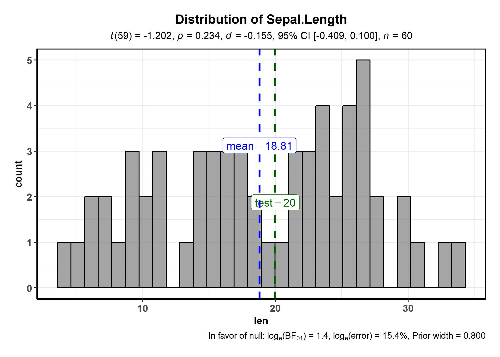
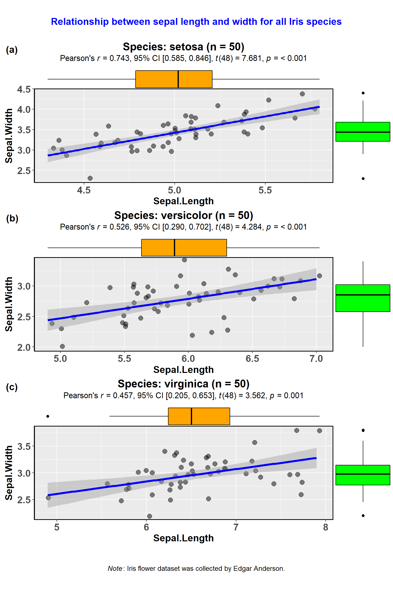
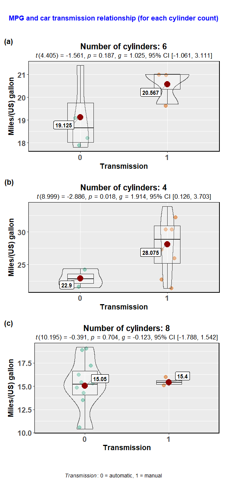
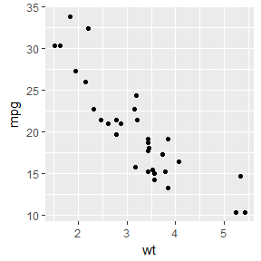
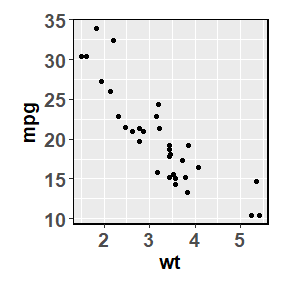

<!-- README.md is generated from README.Rmd. Please edit that file -->

# ggstatsplot: `ggplot2` Based Plots with Statistical Details

[](https://CRAN.R-project.org/package=ggstatsplot)
[](commits/master)
[](https://CRAN.R-project.org/package=ggstatsplot)
[](https://CRAN.R-project.org/package=ggstatsplot)
[](https://CRAN.R-project.org/package=ggstatsplot)
[](https://CRAN.R-project.org/package=ggstatsplot)
[](https://travis-ci.org/IndrajeetPatil/ggstatsplot)
[](https://ci.appveyor.com/project/IndrajeetPatil/ggstatsplot)
[](https://www.gnu.org/licenses/gpl-3.0.en.html)
[](http://www.repostatus.org/#active)
[](/commits/master)
[](https://www.tidyverse.org/lifecycle/#stable)
[](https://cran.r-project.org/)

<!-- 
[](https://CRAN.R-project.org/package=ggstatsplot)
[](https://github.com/IndrajeetPatil/ggstatsplot/issues/)
[](http://depsy.org/package/r/ggstatsplot)
[](https://codecov.io/github/IndrajeetPatil/ggstatsplot?branch=master)
[](https://gemnasium.com/IndrajeetPatil/ggstatsplot) 
-->

## Overview

[`ggstatsplot`](https://indrajeetpatil.github.io/ggstatsplot/) is an
extension of [`ggplot2`](https://github.com/tidyverse/ggplot2) package
for creating graphics with details from statistical tests included in
the plots themselves and targeted primarily at behavioral sciences
community to provide a one-line code to produce information-rich plots.
Currently, it supports only the most common types of statisticla tests
(**parametric**, **nonparametric**, and **robust** versions of
**t-tets/anova**, **correlation**, and **contingency tables** analyses).
Accordingly, it produces limited kinds of plots: **violin plots** (for
comparisons between groups or conditions), **pie charts** (for
categorical data), **scatterplots** (for correlations between
variables), and **histograms** (for hypothesis about distributions).

Future versions will include other types of analyses and plots as well.

## Installation

To get the latest, stable CRAN release:

``` r
utils::install.packages(pkgs = "ggstatsplot")
```

You can get the **development** version from GitHub. If you are in hurry
and want to reduce the time of installation, prefer-

``` r
# needed package to download from GitHub repo
utils::install.packages(pkgs = "devtools")   

# downloading the package from GitHub
devtools::install_github(
  repo = "IndrajeetPatil/ggstatsplot", # package path on GitHub
  quick = TRUE                         # skips docs, demos, and vignettes
)                        
```

If time is not a constraint-

``` r
devtools::install_github(
  repo = "IndrajeetPatil/ggstatsplot", # package path on GitHub
  dependencies = TRUE,                 # installs packages which ggstatsplot depends on
  upgrade_dependencies = TRUE          # updates any out of date dependencies
)
```

If you are not using the [RStudio IDE](https://www.rstudio.com/) and you
get an error related to “pandoc” you will either need to remove the
argument `build_vignettes = TRUE` (to avoid building the vignettes) or
install [pandoc](http://pandoc.org/). If you have the `rmarkdown` R
package installed then you can check if you have pandoc by running the
following in R:

``` r
rmarkdown::pandoc_available()
#> [1] TRUE
```

## Citation

If you want to cite this package in a scientific journal or in any other
context, run the following code in your R console:

``` r
utils::citation(package = "ggstatsplot")
```

## Help

Documentation for any function can be accessed with the standard `help`
command-

``` r
?ggbetweenstats
?ggscatterstats
?gghistostats
?ggpiestats
?ggcorrmat
?combine_plots
?grouped_gghistostats
```

## Usage

`ggstatsplot` relies on [non-standard
evaluation](http://adv-r.had.co.nz/Computing-on-the-language.html),
which means you **can’t** enter arguments in the following manner: `x =
data$x, y = data$y`. This may work well for most of the functions most
of the time, but is highly discouraged. You should always specify `data`
argument for all functions.

Additionally, `ggstatsplot` is a very chatty package and will by default
output information about references for tests, notes on assumptions
about linear models, and warnings. If you don’t want your console to be
cluttered with such messages, they can be turned off by setting
`messages = FALSE`.

Here are examples of the main functions currently supported in
`ggstatsplot`:

  - `ggbetweenstats`

This function creates a violin plot for **between**-group or
**between**-condition comparisons with results from statistical tests in
the subtitle. The simplest function call looks like this-

``` r
ggstatsplot::ggbetweenstats(
  data = datasets::iris, 
  x = Species, 
  y = Sepal.Length,
  messages = FALSE
)
```


Number of other arguments can be specified to make this plot even more
informative and, additionally, this function returns a `ggplot2` object
and thus any of the graphics layers can be further modified:

``` r
library(ggplot2)

ggstatsplot::ggbetweenstats(
  data = datasets::iris,
  x = Species,
  y = Sepal.Length,
  notch = TRUE,                                   # show notched box plot
  mean.plotting = TRUE,                           # whether mean for each group id to be displayed 
  type = "parametric",                            # which type of test is to be run
  outlier.tagging = TRUE,                         # whether outliers need to be tagged
  outlier.label = Sepal.Width,                    # variable to be used for the outlier tag
  xlab = "Type of Species",                       # label for the x-axis variable
  ylab = "Attribute: Sepal Length",               # label for the y-axis variable
  title = "Dataset: Iris flower data set",        # title text for the plot
  caption = expression(                           # caption text for the plot 
    paste(italic("Note"), ": this is a demo")
  ),
  messages = FALSE
) +                                               # further modification outside of ggstatsplot
  ggplot2::coord_cartesian(ylim = c(3, 8)) + 
  ggplot2::scale_y_continuous(breaks = seq(3, 8, by = 1)) 
```


The `type` (of test) argument also accepts the following abbreviations:
“p” (for *parametric*), “np” (for *nonparametric*), “r” (for
*robust*).

For example,

``` r
library(ggplot2)
library(cowplot)

# parametric t-tet 
p1 <- ggstatsplot::ggbetweenstats(
  data = datasets::mtcars,
  x = am,
  y = mpg, 
  type = "p",
  messages = FALSE
)
#> Warning:  aesthetic `x` was not a factor; converting it to factor

# Mann-Whitney U-test
p2 <- ggstatsplot::ggbetweenstats(
  data = mtcars,
  x = am,
  y = mpg, 
  type = "np",
  messages = FALSE
)
#> Warning:  aesthetic `x` was not a factor; converting it to factor

# robust t-test
p3 <- ggstatsplot::ggbetweenstats(
  data = mtcars,
  x = am,
  y = mpg, 
  type = "r",
  messages = FALSE
)
#> Warning:  aesthetic `x` was not a factor; converting it to factor

# combining the individual plots into a single plot
cowplot::plot_grid(
  p1, p2, p3, 
  nrow = 3, 
  ncol = 1, 
  labels = c("(a)", "(b)", "(c)")
)
```


Variant of this function `ggwithinstats` is currently under work. You
*can* still use this function just to prepare the **plot** for
exploratort data analysis, but the statistical details will be
incorrect. You can remove them by adding `ggplot2::labs(subtitle =
NULL)` to your code which will remove the subtitle containing stats.

  - `ggscatterstats`

This function creates a scatterplot with marginal
histograms/boxplots/density/violin plots from  and results from
statistical tests in the subtitle:

``` r
ggstatsplot::ggscatterstats(
  data = datasets::iris, 
  x = Sepal.Length, 
  y = Petal.Length,
  title = "Dataset: Iris flower data set",
  messages = FALSE
)
```


Number of other arguments can be specified to modify this basic plot-

``` r
library(datasets)

ggstatsplot::ggscatterstats(
  data = subset(datasets::iris, iris$Species == "setosa"),
  x = Sepal.Length,
  y = Petal.Length,
  type = "robust",                               # type of test that needs to be run
  xlab = "Attribute: Sepal Length",              # label for x axis
  ylab = "Attribute: Petal Length",              # label for y axis 
  line.color = "black",                         # changing regression line color line
  title = "Dataset: Iris flower data set",       # title text for the plot
  caption = expression(                          # caption text for the plot
    paste(italic("Note"), ": this is a demo")
  ),
  marginal.type = "density",                     # type of marginal distribution to be displayed
  xfill = "blue",                                # color fill for x-axis marginal distribution 
  yfill = "red",                                 # color fill for y-axis marginal distribution
  centrality.para = "median",                    # which type of central tendency lines are to be displayed  
  width.jitter = 0.2,                            # amount of horizontal jitter for data points
  height.jitter = 0.4,                           # amount of vertical jitter for data points
  messages = FALSE                               # turn off messages and notes
) 
```


The `type` (of test) argument also accepts the following abbreviations:
“p” (for *parametric*/pearson’s), “np” (for *nonparametric*/spearman),
“r” (for *robust*).

**Important**: In contrast to all other functions in this package, the
`ggscatterstats` function returns object that is **not** further
modifiable with `ggplot2`. This can be avoided by not plotting the
marginal distributions (`marginal = FALSE`). Currently trying to find a
workaround this problem.

**Using `ggscatterstats()` in R Notebooks or Rmarkdown**

If you try including a `ggscatterstats()` plot inside an R Notebook or
Rmarkdown code chunk, you’ll notice that the plot doesn’t get output. In
order to get a `ggscatterstats()` to show up in an these contexts, you
need to save the ggscatterstats plot as a variable in one code chunk,
and explicitly print it using the `grid` package in another chunk, like
this:

``` r
# include the following code in your code chunk inside R Notebook or Markdown
grid::grid.newpage()
grid::grid.draw(
  ggstatsplot::ggscatterstats(
    data = cars,
    x = speed,
    y = dist,
    marginal = TRUE,
    messages = FALSE
  )
)
```

  - `ggpiestats`

This function creates a pie chart for categorical variables with results
from contingency table analysis included in the subtitle of the plot. If
only one categorical variable is entered, proportion test will be
carried out.

``` r
ggstatsplot::ggpiestats(
  data = datasets::iris,
  main = Species,
  messages = FALSE
)
```


This function can also be used to study an interaction between two
categorical variables. Additionally, as with the other functions in
`ggstatsplot`, this function returns a `ggplot2` object and can further
be modified with `ggplot2` syntax (e.g., we can change the color palette
*after* `ggstatsplot` has produced the plot)-

``` r
library(ggplot2)

ggstatsplot::ggpiestats(
  data = datasets::mtcars,
  main = cyl,
  condition = am,
  title = "Dataset: Motor Trend Car Road Tests",      
  messages = FALSE
) +
  ggplot2::scale_fill_brewer(palette = "Dark2")   # further modification outside of ggstatsplot    
```


As with the other functions, this basic plot can further be modified
with additional arguments:

``` r
library(ggplot2)

ggstatsplot::ggpiestats(
  data = datasets::mtcars,
  main = am,
  condition = cyl,
  title = "Dataset: Motor Trend Car Road Tests",      # title for the plot
  stat.title = "interaction effect",                  # title for the results from Pearson's chi-squared test
  legend.title = "Transmission",                      # title for the legend
  factor.levels = c("0 = automatic", "1 = manual"),   # renaming the factor level names for main variable 
  facet.wrap.name = "No. of cylinders",               # name for the facetting variable
  facet.proptest = FALSE,                             # turning of facetted proportion test results
  caption = expression(                               # text for the caption
    paste(italic("Note"), ": this is a demo")
  ),
  messages = FALSE                                    # turn off messages and notes
) 
```


  - `gghistostats`

In case you would like to see the distribution of one variable and check
if it is significantly different from a specified value with a one
sample test, this function will let you do that.

``` r
library(datasets)

ggstatsplot::gghistostats(
  data = datasets::iris,
  x = Sepal.Length,
  title = "Distribution of Iris sepal length",
  type = "parametric",               # one sample t-test
  test.value = 3,                    # default value is 0
  centrality.para = "mean",          # which measure of central tendency is to be plotted
  centrality.color = "darkred",     # decides color of vertical line representing central tendency
  binwidth = 0.10,                   # binwidth value (needs to be toyed around with until you find the best one)
  messages = FALSE                   # turn off the messages
) 
```


The `type` (of test) argument also accepts the following abbreviations:
“p” (for *parametric*) or “np” (for *nonparametric*) or “bf” (for
*Bayes Factor*).

``` r
ggstatsplot::gghistostats(
  data = NULL,
  title = "Distribution of variable x",
  x = stats::rnorm(n = 1000, mean = 0, sd = 1),
  test.value = 1,
  test.value.line = TRUE,
  test.value.color = "black",
  centrality.para = "mean",
  type = "bf",
  bf.prior = 0.8,
  messages = FALSE,
  caption = expression(                              
    paste(italic("Note"), ": black line - test value; blue line - observed mean")
  )
)
```


As seen here, by default, Bayes Factor quantifies the support for the
alternative hypothesis (H1) over the null hypothesis (H0) (i.e., BF10 is
displayed). In case you run parametric t-test and the effect is not
significant, caption will be displayed containing information about
evidence in favor of the null hypothesis (H0). This is not recommended,
but if you want to turn off this behavior, you can use the argument
`bf.message = FALSE`.

``` r
ggstatsplot::gghistostats(
  data = datasets::ToothGrowth,
  x = len,
  title = "Distribution of tooth length",
  centrality.para = "mean",
  test.value = 20,
  test.value.line = TRUE,
  xlab = "Tooth length",
  caption = expression(                              
    paste(italic("Note"), ": black line - test value; blue line - observed mean")
  ),
  messages = FALSE
)
```



  - `ggcorrmat`

`ggcorrmat` makes correlalograms with minimal amount of code. Just
sticking to the defaults itself produces publication-ready correlation
matrices. (Wrapper around
[`ggcorrplot`](https://github.com/kassambara/ggcorrplot))

``` r
# as a default this function outputs a correlalogram plot
ggstatsplot::ggcorrmat(
  data = datasets::iris,
  corr.method = "spearman",                # correlation method
  sig.level = 0.005,                       # threshold of significance
  cor.vars = Sepal.Length:Petal.Width,     # a range of variables can be selected  
  cor.vars.names = c("Sepal Length", "Sepal Width", "Petal Length", "Petal Width"),
  title = "Correlalogram for length measures for Iris species",
  subtitle = "Iris dataset by Anderson",
  caption = expression(
    paste(
      italic("Note"),
      ": X denotes correlation non-significant at ",
      italic("p "),
      "< 0.005; adjusted alpha"
    )
  )
)
```


Multiple arguments can be modified to change the appearance of the
correlation matrix-

``` r
ggstatsplot::ggcorrmat(
  data = datasets::iris,
  cor.vars = c(Sepal.Length:Petal.Width),
  lab_col = "red",                              # label color
  ggtheme = ggplot2::theme_light,               # selected ggplot2 theme
  ggstatsplot.theme = FALSE,                    # turn off overlaying theme_mprl on selected ggplot2 theme
  type = "lower",                               # type of correlation matrix
  colors = c("green", "white", "yellow")        # selecting color combination
)
```


Alternatively, you can use it just to get the correlation matrices and
their corresponding p-values (in a
[tibble](http://tibble.tidyverse.org/) format).

``` r
# getting correlations 
ggstatsplot::ggcorrmat(
  data = datasets::iris,
  cor.vars = Sepal.Length:Petal.Width,
  output = "correlations"
)
#> # A tibble: 4 x 5
#>   variable     Sepal.Length Sepal.Width Petal.Length Petal.Width
#>   <chr>               <dbl>       <dbl>        <dbl>       <dbl>
#> 1 Sepal.Length         1          -0.12         0.87        0.82
#> 2 Sepal.Width         -0.12        1           -0.43       -0.37
#> 3 Petal.Length         0.87       -0.43         1           0.96
#> 4 Petal.Width          0.82       -0.37         0.96        1

# getting p-values
ggstatsplot::ggcorrmat(
  data = datasets::iris,
  cor.vars = Sepal.Length:Petal.Width,
  output = "p-values"
)
#> # A tibble: 4 x 5
#>   variable     Sepal.Length  Sepal.Width Petal.Length Petal.Width
#>   <chr>               <dbl>        <dbl>        <dbl>       <dbl>
#> 1 Sepal.Length     0.       0.152            1.04e-47    2.33e-37
#> 2 Sepal.Width      1.52e- 1 0                4.51e- 8    4.07e- 6
#> 3 Petal.Length     1.04e-47 0.0000000451     0.          4.68e-86
#> 4 Petal.Width      2.33e-37 0.00000407       4.68e-86    0.
```

  - `combine_plots`

`ggstatsplot` also contains a helper function `combine_plots` to combine
multiple plots. This is a wrapper around  and lets you combine multiple
plots and add combination of title, caption, and annotation texts with
suitable default parameters.

The full power of `ggstatsplot` can be leveraged with a functional
programming package like [`purrr`](http://purrr.tidyverse.org/) that
replaces many for loops with code that is both more succinct and easier
to read and, therefore, `purrr` should be preferrred.

An example is provided below.

``` r

library(glue)
library(tidyverse)

### creating a list column with `ggstatsplot` plots
plots <- datasets::iris %>%
  dplyr::mutate(.data = ., Species2 = Species) %>% # just creates a copy of this variable
  dplyr::group_by(.data = ., Species) %>%                
  tidyr::nest(data = .) %>%                        # creates a nested dataframe with list column called `data`
  dplyr::mutate(                                   # creating a new list column of ggstatsplot outputs
    .data = .,
    plot = data %>%
      purrr::map(
        .x = .,
        .f = ~ ggstatsplot::ggscatterstats(
          data = .,
          x = Sepal.Length,
          y = Sepal.Width,
          messages = FALSE,                        # turns off all the warnings, notes, and reference messages   
          marginal.type = "boxplot",
          title =
            glue::glue("Species: {.$Species2} (n = {length(.$Sepal.Length)})")
        )
      )
  )

### display the new object (notice that the class of the `plot` list column is S3: gg)
plots
#> # A tibble: 3 x 3
#>   Species    data              plot             
#>   <fct>      <list>            <list>           
#> 1 setosa     <tibble [50 x 5]> <S3: ggExtraPlot>
#> 2 versicolor <tibble [50 x 5]> <S3: ggExtraPlot>
#> 3 virginica  <tibble [50 x 5]> <S3: ggExtraPlot>

### creating a grid with cowplot
ggstatsplot::combine_plots(
  plotlist = plots$plot,                           # list column containing all ggstatsplot objects
  labels = c("(a)", "(b)", "(c)"),
  nrow = 3,
  ncol = 1,
  title.text = "Relationship between sepal length and width for all Iris species",
  title.size = 14,
  title.color = "black",
  caption.text = expression(
    paste(
      italic("Note"),
      ": Iris flower dataset was collected by Edgar Anderson."
    ),
    caption.size = 10
  )
)
```



Here is another example with `ggbetweenstats`-

``` r
library(tidyverse)
library(glue)

### creating a list column with `ggstatsplot` plots
plots <- datasets::mtcars %>%
  dplyr::mutate(.data = ., cyl2 = cyl) %>%        # just creates a copy of this variable
  dplyr::group_by(.data = ., cyl) %>%             # 
  tidyr::nest(data = .) %>%                       # creates a nested dataframe with list column called `data`
  dplyr::mutate(                                  # creating a new list column of ggstatsplot outputs
    .data = .,
    plot = data %>%
      purrr::map(
        .x = .,
        .f = ~ ggstatsplot::ggbetweenstats(
          data = .,
          x = am,
          y = mpg,
          messages = FALSE,                       # turns off all the warnings, notes, and reference messages
          xlab = "Transmission",
          ylab = "Miles/(US) gallon",
          title = glue::glue(
            "Number of cylinders: {.$cyl2}"       # this is where the duplicated cyl2 column is useful
            ) 
        )
      )
  )
#> Warning:  aesthetic `x` was not a factor; converting it to factorWarning:  aesthetic `x` was not a factor; converting it to factorWarning:  aesthetic `x` was not a factor; converting it to factor

### display the new object (notice that the class of the `plot` list column is S3: gg)
plots
#> # A tibble: 3 x 3
#>     cyl data               plot    
#>   <dbl> <list>             <list>  
#> 1     6 <tibble [7 x 11]>  <S3: gg>
#> 2     4 <tibble [11 x 11]> <S3: gg>
#> 3     8 <tibble [14 x 11]> <S3: gg>

### creating a grid with cowplot
ggstatsplot::combine_plots(
  plotlist = plots$plot,       # list column containing all ggstatsplot objects
  nrow = 3,
  ncol = 1,
  labels = c("(a)","(b)","(c)"),
  title.text = "MPG and car transmission relationship (for each cylinder count)",
  title.size = 13,
  title.color = "black",
  caption.text = expression(
    paste(
      italic("Transmission"),
      ": 0 = automatic, 1 = manual"
    ),
    caption.size = 10
  )
)
```



  - `theme_mprl`

`ggstatsplot` uses a default theme `theme_mprl()` that can be used with
any `ggplot2` objects.

``` r
library(ggplot2)

# Basic scatter plot
ggplot2::ggplot(
  data = datasets::mtcars, 
  mapping = ggplot2::aes(x = wt, y = mpg)
) + 
  ggplot2::geom_point()
```



``` r

# Basic scatter plot with theme_mprl() added
ggplot2::ggplot(
  data = datasets::mtcars, 
  mapping = ggplot2::aes(x = wt, y = mpg)
) + 
  ggplot2::geom_point() + 
  ggstatsplot::theme_mprl()
```



Please note that this project is released with a [Contributor Code of
Conduct](https://github.com/IndrajeetPatil/ggstatsplot/blob/master/CONDUCT.md).
By participating in this project you agree to abide by its terms.
