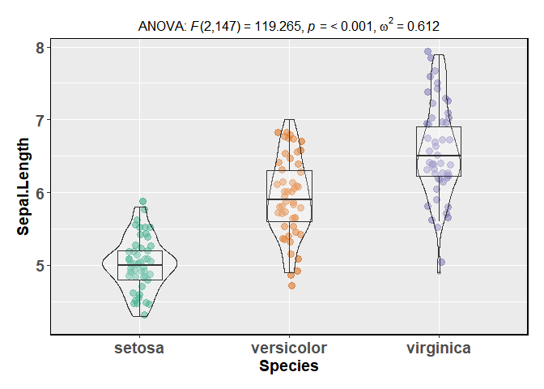
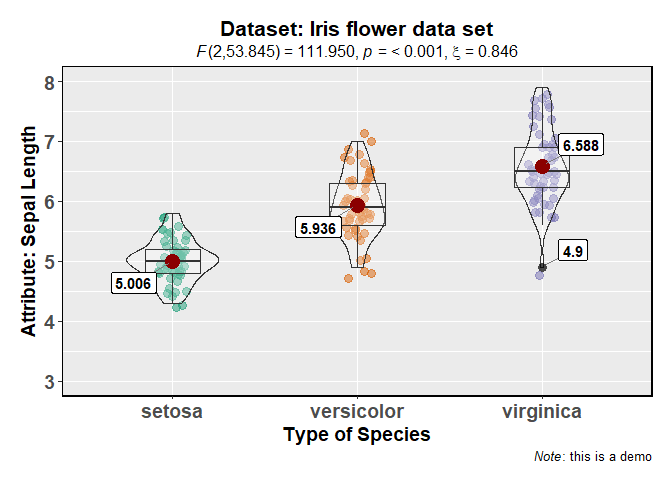
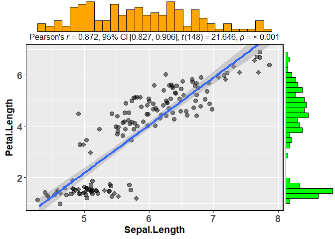
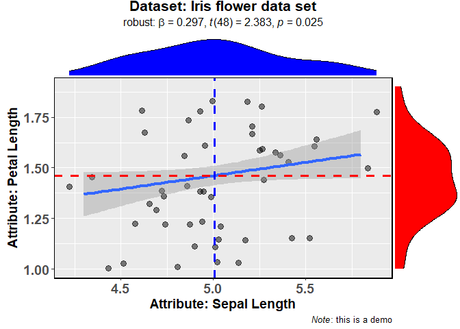
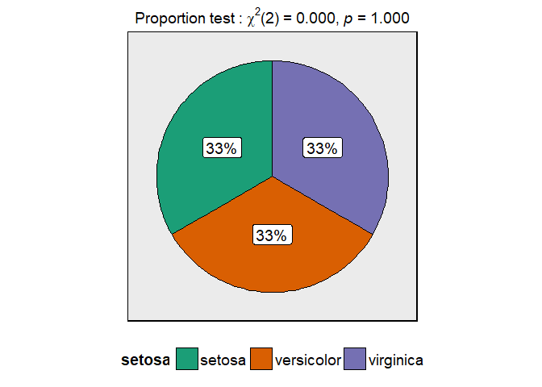
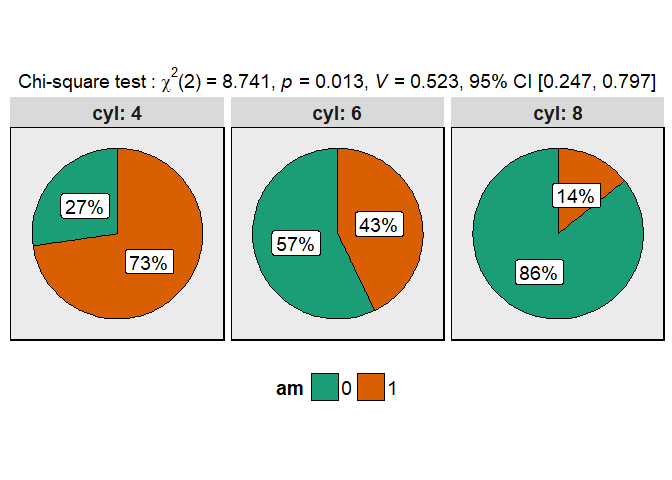
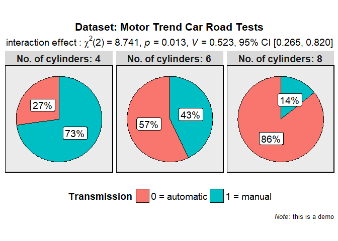

<!-- README.md is generated from README.Rmd. Please edit that file -->

Overview
--------

ggstatsplot is an extension of `ggplot2` package for creating graphics with details from statistical tests included in the plots themselves and targeted primarily at behavioral sciences community to provide a one-line code to produce information-rich figures. Currently, it supports only the most common types of tests used in analysis (**parametric**, **nonparametric**, and **robust** versions of **t-tets**, **anova**, and **contingency tables**). Future versions will include other types of analyses as well.

Installation
------------

``` r
# You can get the development version from GitHub:
# install.packages("devtools")
devtools::install_github("IndrajeetPatil/ggstatsplot")
```

Examples
--------

Here are examples of the three main functions currently supported in `ggstatsplot`:

-   `ggbetweenstats`

This function creates a violin plot for **between**-group or **between**-condition comparisons with results from statistical tests in subtitle:

``` r
ggstatsplot::ggbetweenstats(data = iris, 
                            x = Species, 
                            y = Sepal.Length)
#> Note: Bartlett's test for homogeneity of variances: p-value =  < 0.001
```



Number of other arguments can be specified to make this plot even more informative and, additionally, this function returns a `ggplot2` object and thus any layer of choosing can further be modified:

``` r
library(ggplot2)
ggstatsplot::ggbetweenstats(
  data = iris,
  x = Species,
  y = Sepal.Length,
  mean.plotting = TRUE,
  type = "robust",
  outlier.tagging = TRUE,
  title = "Dataset: iris",
  caption = expression(paste(italic("Note"), "): this is a demo"))
  ) +
  coord_cartesian(ylim = c(3, 8)) + 
  scale_y_continuous(breaks = seq(3, 8, by = 1))
#> Note: Bartlett's test for homogeneity of variances: p-value =  < 0.001
#> Warning: Removed 149 rows containing missing values (geom_label_repel).
```



Variant of this function `ggwithinstats` is currently under work.

-   `ggbetweenstats`

This function creates a scatterplot with marginal histograms/boxplots/density/violin plots from `ggExtra::ggMarginal()` and results from statistical tests in subtitle:

``` r
ggstatsplot::ggscatterstats(data = iris, 
                            x = Sepal.Length, 
                            y = Petal.Length)
```



Number of other arguments can be specified to modify this basic plot-

``` r
ggstatsplot::ggscatterstats(
  data = subset(iris, iris$Species == "setosa"),
  x = Sepal.Length,
  y = Petal.Length,
  marginal.type = "density",
  xfill = "blue",
  yfill = "red",
  intercept = "median",
  width.jitter = 0.2,
  height.jitter = 0.4
  ) 
```



**Important**: In contrast to all other functions in this package, the `ggscatterstats` function returns object that is not further modifiable with `ggplot2`. This can be avoided by not plotting the marginal distributions (`marginal = FALSE`). Currently trying to find a workaround this problem.

-   `ggbetweenstats`

This function creates a pie chart for categorical variables with results from contingency table analysis included in the subtitle of the plot.

``` r
ggstatsplot::ggpiestats(data = iris,
                        main = Species)
```



This function can also be used to study interaction between two categorical variables-

``` r
ggstatsplot::ggpiestats(data = mtcars,
                        main = am,
                        condition = cyl)
```



As with the other functions, this basic plot can further be modified with additional arguments and, additionally, this function returns a `ggplot2` object and thus any layer of choosing can further be modified:

``` r
library(ggplot2)
ggstatsplot::ggpiestats(
data = mtcars,
main = am,
condition = cyl,
title = "dataset: mtcars",
stat.title = "interaction effect",
legend.title = "Transmission",
facet.wrap.name = "cylinder",
caption = expression(paste(italic("Note"), "): this is a demo"))
) +
scale_fill_brewer(palette = "Set1")
```


