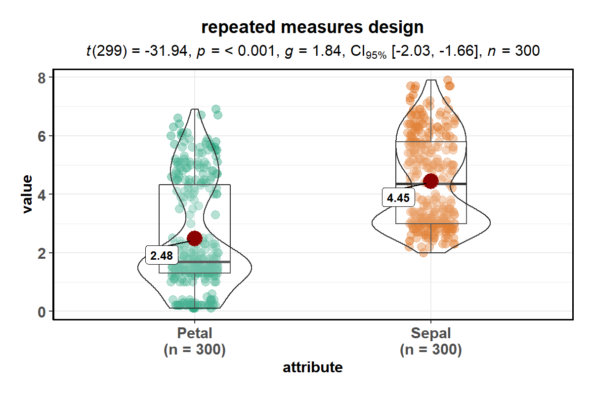
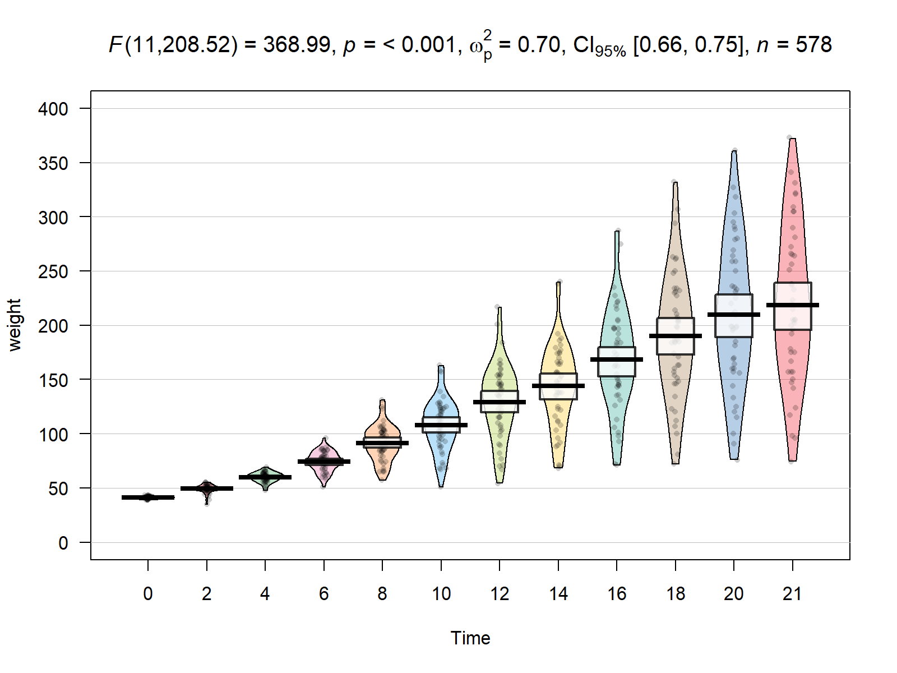

<!-- README.md is generated from README.Rmd. Please edit that file -->

# ggstatsplot: `ggplot2` Based Plots with Statistical Details

| Package                                                                                                                                              | Status                                                                                                                                                                                       | Usage                                                                                                                                             | GitHub                                                                                                                                                          | References                                                                                                                                                      |
| ---------------------------------------------------------------------------------------------------------------------------------------------------- | -------------------------------------------------------------------------------------------------------------------------------------------------------------------------------------------- | ------------------------------------------------------------------------------------------------------------------------------------------------- | --------------------------------------------------------------------------------------------------------------------------------------------------------------- | --------------------------------------------------------------------------------------------------------------------------------------------------------------- |
| [](https://CRAN.R-project.org/package=ggstatsplot)                       | [](https://travis-ci.org/IndrajeetPatil/ggstatsplot)                                               | [](https://CRAN.R-project.org/package=ggstatsplot)     | [](https://github.com/IndrajeetPatil/ggstatsplot/)                | [](https://indrajeetpatil.github.io/ggstatsplot/)                          |
| [](https://cran.r-project.org/web/checks/check_results_ggstatsplot.html)           | [](https://ci.appveyor.com/project/IndrajeetPatil/ggstatsplot) | [](https://CRAN.R-project.org/package=ggstatsplot)   | [](https://github.com/IndrajeetPatil/ggstatsplot/pulls) | [](https://www.rdocumentation.org/packages/ggstatsplot)                                       |
| [](https://cran.r-project.org/)                                           | [](https://www.tidyverse.org/lifecycle/)                                                                               | [](https://CRAN.R-project.org/package=ggstatsplot) | [](https://github.com/IndrajeetPatil/ggstatsplot/issues)               | [](https://cran.r-project.org/web/packages/ggstatsplot/vignettes/)           |
| [](https://www.tidyverse.org/lifecycle/)                                       | [](https://coveralls.io/github/IndrajeetPatil/ggstatsplot?branch=master)             | [](https://CRAN.R-project.org/package=ggstatsplot)  | [](https://github.com/IndrajeetPatil/ggstatsplot)  | [](https://cran.r-project.org/web/packages/ggstatsplot/ggstatsplot.pdf)                       |
| [](https://www.gnu.org/licenses/gpl-3.0.en.html)                                     | [](https://codecov.io/github/IndrajeetPatil/ggstatsplot?branch=master)                      | [](http://hits.dwyl.io/IndrajeetPatil/ggstatsplot)                                 | [](/commits/master)                                                  | [](https://sites.google.com/site/indrajeetspatilmorality/)                      |
| [](https://dependencyci.com/github/IndrajeetPatil/ggstatsplot) | [](https://github.com/IndrajeetPatil/ggstatsplot/blob/master/tests/README.md)                | [](https://saythanks.io/to/IndrajeetPatil)                                    | [](http://www.repostatus.org/#active)                                                      | [](https://github.com/IndrajeetPatil/ggstatsplot/issues) |

# Overview

[`ggstatsplot`](https://indrajeetpatil.github.io/ggstatsplot/) is an
extension of [`ggplot2`](https://github.com/tidyverse/ggplot2) package
for creating graphics with details from statistical tests included in
the plots themselves and targeted primarily at behavioral sciences
community to provide a one-line code to produce information-rich plots.
In a typical exploratory data analysis workflow, data visualization and
statistical modelling are two different phases: visualization informs
modelling, and modelling in its turn can suggest a different
visualization method, and so on and so forth. The central idea of
*ggstatsplot* is simple: combine these two phases into one in the form
of graphics with statistical details, which makes data exploration
simpler and faster.

Currently, it supports only the most common types of statistical tests:
**parametric**, **nonparametric**, **robust**, and **bayesian** versions
of **t-test**/**anova**, **correlation** analyses, **contingency table**
analysis, and **regression** analyses.

It, therefore, produces a limited kinds of plots for the supported
analyses:

  - **violin plots** (for comparisons *between* groups or conditions),
  - **pie charts** (for categorical data),
  - **scatterplots** (for correlations between two variables),
  - **correlation matrices** (for correlations between multiple
    variables),
  - **histograms** (for hypothesis about distributions), and
  - **dot-and-whisker plots** (for regression models).

In addition to these basic plots, `ggstatsplot` also provides
**`grouped_`** versions for most functions that makes it easy to repeat
the same analysis for any grouping variable.

Future versions will include other types of statistical analyses and
plots as well.

# Installation

To get the latest, stable CRAN release (`0.0.6`):

``` r
utils::install.packages(pkgs = "ggstatsplot")
```

You can get the **development** version of the package from GitHub
(`0.0.6.9000`). To see what new changes (and bug fixes) have been made
to the package since the last release on `CRAN`, you can check the
detailed log of changes here:
<https://indrajeetpatil.github.io/ggstatsplot/news/index.html>

If you are in hurry and want to reduce the time of installation, prefer-

``` r
# needed package to download from GitHub repo
utils::install.packages(pkgs = "devtools")   

# downloading the package from GitHub
devtools::install_github(
  repo = "IndrajeetPatil/ggstatsplot", # package path on GitHub
  dependencies = FALSE,                # assumes that you already have all packages installed needed for this package to work
  quick = TRUE                         # skips docs, demos, and vignettes
)                        
```

If time is not a constraint-

``` r
devtools::install_github(
  repo = "IndrajeetPatil/ggstatsplot", # package path on GitHub
  dependencies = TRUE,                 # installs packages which ggstatsplot depends on
  upgrade_dependencies = TRUE          # updates any out of date dependencies
)
```

If you are not using the [RStudio IDE](https://www.rstudio.com/) and you
get an error related to “pandoc” you will either need to remove the
argument `build_vignettes = TRUE` (to avoid building the vignettes) or
install [pandoc](http://pandoc.org/). If you have the `rmarkdown` R
package installed then you can check if you have pandoc by running the
following in R:

``` r
rmarkdown::pandoc_available()
#> [1] TRUE
```

# Citation

If you want to cite this package in a scientific journal or in any other
context, run the following code in your `R` console:

``` r
utils::citation(package = "ggstatsplot")
```

There is currently a publication in preparation corresponding this
package and the citation will be updated once it’s published.

# Documentation and Examples

To see the detailed documentation for each function in the stable
**CRAN** version of the package, see:

  - README:
    <https://cran.r-project.org/web/packages/ggstatsplot/readme/README.html>
  - Vignettes:
    <https://cran.r-project.org/web/packages/ggstatsplot/vignettes/>

To see the documentation relevant for the **development** version of the
package, see the dedicated website for `ggstatplot`, which is updated
after every new commit: <https://indrajeetpatil.github.io/ggstatsplot/>.

## Help

In `R`, documentation for any function can be accessed with the standard
`help` command (e.g., `?ggbetweenstats`).

<!--

```r
# primary functions
?ggbetweenstats
?ggscatterstats
?gghistostats
?ggpiestats
?ggcorrmat
?ggcoefstats

# grouped variants of primary functions
?grouped_ggbetweenstats
?grouped_ggscatterstats
?grouped_gghistostats
?grouped_ggpiestats
?grouped_ggcorrmat

# helper functions
?combine_plots
?theme_ggstatsplot

# helper functions for making text with results from statistical tests
?subtitle_contigency_tab
?subtitle_ggbetween_anova_parametric
?subtitle_ggbetween_kw_nonparametric
?subtitle_ggbetween_mann_nonparametric
?subtitle_ggbetween_rob_anova
?subtitle_ggbetween_t_bayes
?subtitle_ggbetween_t_parametric
?subtitle_ggbetween_t_rob
?subtitle_ggscatterstats
?subtitle_onesample
?subtitle_onesample_proptest
```
-->

Another handy tool to see arguments to any of the functions is `args`.
For example-

``` r
args(name = ggstatsplot::ggscatterstats)
#> function (data, x, y, type = "pearson", bf.prior = 0.707, bf.message = FALSE, 
#>     label.var = NULL, label.expression = NULL, xlab = NULL, ylab = NULL, 
#>     method = "lm", method.args = list(), formula = y ~ x, point.color = "black", 
#>     point.size = 3, point.alpha = 0.4, point.width.jitter = NULL, 
#>     point.height.jitter = NULL, line.size = 1.5, line.color = "blue", 
#>     marginal = TRUE, marginal.type = "histogram", marginal.size = 5, 
#>     margins = c("both", "x", "y"), package = "wesanderson", palette = "Royal1", 
#>     direction = 1, xfill = "#009E73", yfill = "#D55E00", xalpha = 1, 
#>     yalpha = 1, xsize = 0.7, ysize = 0.7, centrality.para = NULL, 
#>     results.subtitle = TRUE, title = NULL, subtitle = NULL, caption = NULL, 
#>     nboot = 100, beta = 0.1, k = 3, axes.range.restrict = FALSE, 
#>     ggtheme = ggplot2::theme_bw(), ggstatsplot.layer = TRUE, 
#>     messages = TRUE) 
#> NULL
```

In case you want to look at the function body for any of the functions,
just type the name of the function without the parentheses:

``` r
ggstatsplot::theme_ggstatsplot
#> function(ggtheme = ggplot2::theme_bw(),
#>                               ggstatsplot.layer = TRUE) {
#>   if (isTRUE(ggstatsplot.layer)) {
#>     ggtheme +
#>       ggplot2::theme(
#>         axis.title.x = ggplot2::element_text(size = 11, face = "bold"),
#>         strip.text.x = ggplot2::element_text(size = 11, face = "bold"),
#>         strip.text.y = ggplot2::element_text(size = 11, face = "bold"),
#>         strip.text = ggplot2::element_text(size = 11, face = "bold"),
#>         axis.title.y = ggplot2::element_text(size = 11, face = "bold"),
#>         axis.text.x = ggplot2::element_text(size = 11, face = "bold"),
#>         axis.text.y = ggplot2::element_text(size = 11, face = "bold"),
#>         axis.line = ggplot2::element_line(),
#>         legend.text = ggplot2::element_text(size = 11),
#>         legend.title = ggplot2::element_text(size = 11, face = "bold"),
#>         legend.title.align = 0.5,
#>         legend.text.align = 0.5,
#>         legend.key.height = grid::unit(x = 1, units = "line"),
#>         legend.key.width = grid::unit(x = 1, units = "line"),
#>         plot.margin = grid::unit(x = c(1, 1, 1, 1), units = "lines"),
#>         panel.border = ggplot2::element_rect(
#>           color = "black",
#>           fill = NA,
#>           size = 1
#>         ),
#>         plot.title = ggplot2::element_text(
#>           color = "black",
#>           size = 13,
#>           face = "bold",
#>           hjust = 0.5
#>         ),
#>         plot.subtitle = ggplot2::element_text(
#>           color = "black",
#>           size = 11,
#>           face = "plain",
#>           hjust = 0.5
#>         )
#>       )
#>   } else {
#>     ggtheme
#>   }
#> }
#> <bytecode: 0x0000000029c627c0>
#> <environment: namespace:ggstatsplot>
```

If you are not familiar either with what the namespace `::` does or how
to use pipe operator `%>%`, something this package and its documentation
relies a lot on, you can check out these links-

  - <http://r-pkgs.had.co.nz/namespace.html>
  - <http://r4ds.had.co.nz/pipes.html>

## Usage

`ggstatsplot` relies on non-standard evaluation (NSE), i.e., rather than
looking at the values of arguments (`x`, `y`), it instead looks at their
expressions. This means that you **shouldn’t** enter arguments with the
`$` operator and setting `data = NULL`: `data = NULL, x = data$x, y =
data$y`. You **must** always specify the `data` argument for all
functions. On the plus side, you can enter arguments either as a string
(`x = "x", y = "y"`) or as a bare expression (`x = x, y = y`) and it
wouldn’t matter. To read more about NSE, see-
<http://adv-r.had.co.nz/Computing-on-the-language.html>

`ggstatsplot` is a very chatty package and will by default print helpful
notes on assumptions about linear models, warnings, etc. If you don’t
want your console to be cluttered with such messages, they can be turned
off by setting argument `messages = FALSE` in the function call.

Here are examples of the main functions currently supported in
`ggstatsplot`.

**Note**: If you are reading this on GitHub repository, the
documentation below is for the **development** version of the package.
So you may see some features available here that are not currently
present in the stable version of this package on **CRAN**. For
documentation relevant for the CRAN version, see:

  - vignettes:
    <https://cran.r-project.org/web/packages/ggstatsplot/vignettes/>
  - README:
    <https://cran.r-project.org/web/packages/ggstatsplot/readme/README.html>

## `ggbetweenstats`

This function creates either a violin plot, a box plot, or a mix of two
for **between**-group or **between**-condition comparisons with results
from statistical tests in the subtitle. The simplest function call looks
like this-

``` r
# loading needed libraries
library(ggstatsplot)

# for reproducibility
set.seed(123)

# plot
ggstatsplot::ggbetweenstats(
  data = datasets::iris, 
  x = Species, 
  y = Sepal.Length,
  messages = FALSE
) +                                               # further modification outside of ggstatsplot
  ggplot2::coord_cartesian(ylim = c(3, 8)) + 
  ggplot2::scale_y_continuous(breaks = seq(3, 8, by = 1)) 
```


Note that this function returns a `ggplot2` object and thus any of the
graphics layers can be further modified.

The `type` (of test) argument also accepts the following abbreviations:
`"p"` (for *parametric*) or `"np"` (for *nonparametric*) or `"r"` (for
*robust*) or `"bf"` (for *Bayes Factor*). Additionally, the type of plot
to be displayed can also be modified (`"box"`, `"violin"`, or
`"boxviolin"`).

A number of other arguments can be specified to make this plot even more
informative or change some of the default options.

``` r
library(ggplot2)

# for reproducibility
set.seed(123)

# let's leave out one of the factor levels and see if instead of anova, a t-test will be run
iris2 <- dplyr::filter(.data = datasets::iris, Species != "setosa")

# let's change the levels of our factors, a common routine in data analysis
# pipeline, to see if this function respects the new factor levels
iris2$Species <-
  base::factor(x = iris2$Species,
               levels = c("virginica" , "versicolor"))

# plot
ggstatsplot::ggbetweenstats(
  data = iris2,                                    
  x = Species,
  y = Sepal.Length,
  notch = TRUE,                                   # show notched box plot
  mean.plotting = TRUE,                           # whether mean for each group is to be displayed 
  mean.ci = TRUE,                                 # whether to display confidence interval for means
  mean.label.size = 2.5,                          # size of the label for mean
  type = "p",                                     # which type of test is to be run
  bf.message = TRUE,                              # add a message with bayes factor favoring null
  k = 2,                                          # number of decimal places for statistical results
  outlier.tagging = TRUE,                         # whether outliers need to be tagged
  outlier.label = Sepal.Width,                    # variable to be used for the outlier tag
  outlier.label.color = "darkgreen",              # changing the color for the text label
  xlab = "Type of Species",                       # label for the x-axis variable
  ylab = "Attribute: Sepal Length",               # label for the y-axis variable
  title = "Dataset: Iris flower data set",        # title text for the plot
  ggtheme = ggthemes::theme_fivethirtyeight(),    # choosing a different theme
  ggstatsplot.layer = FALSE,                      # turn off ggstatsplot theme layer
  package = "wesanderson",                        # package from which color palette is to be taken
  palette = "Darjeeling1",                        # choosing a different color palette
  messages = FALSE
) 
```


In case of a parametric t-test, setting `bf.message = TRUE` will also
attach results from Bayesian Student’s *t*-test. That way, if the null
hypothesis can’t be rejected with the NHST approach, the Bayesian
approach can help index evidence in favor of the null hypothesis (i.e.,
`BF01`).

By default, Bayes Factor quantifies the support for the alternative
hypothesis (H1) over the null hypothesis (H0) (i.e., `BF10` is
displayed). Natural logarithms are shown because BF values can be pretty
large. This also makes it easy to compare evidence in favor alternative
(`BF10`) versus null (`BF01`) hypotheses (since `log(BF10) = -
log(BF01)`).

Additionally, there is also a `grouped_` variant of this function that
makes it easy to repeat the same operation across a **single** grouping
variable:

``` r
# for reproducibility
set.seed(123)

# let's exclude animation and documentary genres since there are not many
# datapoints for these genres

# plot
ggstatsplot::grouped_ggbetweenstats(
  data = dplyr::filter(.data = ggstatsplot::movies_long, 
                       !genre %in% c("Animation", "Documentary")),
  x = mpaa, 
  y = length,
  caption = substitute(paste(italic("Source"), ":IMDb (Internet Movie Database)")), 
  pairwise.comparisons = TRUE,      # display significant pairwise comparisons
  pairwise.annotation = "p.value",  # how do you want to annotate the pairwise comparisons
  p.adjust.method = "bonferroni",   # method for adjusting p-values for multiple comparisons
  bf.message = TRUE,                # display Bayes Factor in favor of the null hypothesis
  grouping.var = genre,             # grouping variable
  k = 2,
  title.prefix = "Movie genre",
  palette = "default_jama",
  package = "ggsci",
  messages = FALSE,
  nrow = 2,
  ncol = 2,
  title.text = "Differences in movie length by mpaa ratings for different genres"
)
```


For more, see the `ggbetweenstats` vignette:
<https://indrajeetpatil.github.io/ggstatsplot/articles/ggbetweenstats.html>

**This function is not appropriate for within-subjects designs.**

Variant of this function `ggwithinstats` is currently under work. You
*can* still use this function just to prepare the **plot** for
exploratory data analysis, but the statistical details displayed in the
subtitle will be incorrect. You can remove them by adding `+
ggplot2::labs(subtitle = NULL)` to your function call.

As a **temporary solution**, you can use the helper function from
`ggstatsplot` to display results from within-subjects version of the
test in question. Here is an example-

``` r
# for reproducibility
set.seed(123)

# getting text results using a helper function
results_subtitle <- 
  ggstatsplot::subtitle_ggbetween_t_parametric(
  data = ggstatsplot::iris_long,
  x = attribute,
  y = value,
  paired = TRUE
)

# displaying the subtitle on the plot
ggstatsplot::ggbetweenstats(
  data = ggstatsplot::iris_long,
  x = attribute,
  y = value,
  messages = FALSE
) +
  ggplot2::labs(subtitle = results_subtitle)
```



## `ggscatterstats`

This function creates a scatterplot with marginal
histograms/boxplots/density/violin/densigram plots from
`ggExtra::ggMarginal` and results from statistical tests in the
subtitle:

``` r
ggstatsplot::ggscatterstats(
  data = ggplot2::msleep, 
  x = sleep_rem, 
  y = awake,
  xlab = "REM sleep (in hours)",
  ylab = "Amount of time spent awake (in hours)",
  title = "Understanding mammalian sleep",
  bf.message = TRUE,
  messages = FALSE
)
```


Number of other arguments can be specified to modify this basic plot-

``` r
library(datasets)

# for reproducibility
set.seed(123)

# plot
ggstatsplot::ggscatterstats(
  data = dplyr::filter(.data = ggstatsplot::movies_long, genre == "Action"),
  x = budget,
  y = rating,
  type = "robust",                                # type of test that needs to be run
  xlab = "Movie budget (in million/ US$)",        # label for x axis
  ylab = "IMDB rating",                           # label for y axis 
  label.var = "title",                            # variable for labeling data points
  label.expression = "rating < 5 & budget > 150", # expression that decides which points to label
  line.color = "yellow",                          # changing regression line color line
  title = "Movie budget and IMDB rating (action)",# title text for the plot
  caption = expression(                           # caption text for the plot
    paste(italic("Note"), ": IMDB stands for Internet Movie DataBase")
  ),
  ggtheme = hrbrthemes::theme_ipsum_ps(),         # choosing a different theme
  ggstatsplot.layer = FALSE,                      # turn off ggstatsplot theme layer
  marginal.type = "density",                      # type of marginal distribution to be displayed
  xfill = "#0072B2",                              # color fill for x-axis marginal distribution 
  yfill = "#009E73",                              # color fill for y-axis marginal distribution
  xalpha = 0.6,                                   # transparency for x-axis marginal distribution
  yalpha = 0.6,                                   # transparency for y-axis marginal distribution
  centrality.para = "median",                     # central tendency lines to be displayed  
  point.width.jitter = 0.2,                       # amount of horizontal jitter for data points
  point.height.jitter = 0.4,                      # amount of vertical jitter for data points
  messages = FALSE                                # turn off messages and notes
) 
```


Additionally, there is also a `grouped_` variant of this function that
makes it easy to repeat the same operation across a **single** grouping
variable:

``` r
# for reproducibility
set.seed(123)

# plot
ggstatsplot::grouped_ggscatterstats(
  data = ggstatsplot::movies_long, 
  x = rating, 
  y = length,
  bf.message = TRUE,               # display bayes factor message
  k = 2,                           # no. of decimal places in the results
  xfill = "#E69F00", 
  yfill = "#8b3058",
  xlab = "IMDB rating",
  grouping.var = genre,            # grouping variable
  title.prefix = "Movie genre",
  ggtheme = ggplot2::theme_grey(),
  messages = FALSE,
  nrow = 2,
  ncol = 2,
  title.text = "Relationship between movie length by IMDB ratings for different genres"
)
```


For more, see the `ggscatterstats` vignette:
<https://indrajeetpatil.github.io/ggstatsplot/articles/ggscatterstats.html>

## `ggpiestats`

This function creates a pie chart for categorical or nominal variables
with results from contingency table analysis (Pearson’s chi-squared test
for between-subjects design and McNemar’s test for within-subjects
design) included in the subtitle of the plot. If only one categorical
variable is entered, results from one-sample **proportion test** will be
displayed as a subtitle.

``` r
# for reproducibility
set.seed(123)

# plot
ggstatsplot::ggpiestats(
  data = ggplot2::msleep,
  main = vore,
  title = "Composition of vore types among mammals",
  messages = FALSE
)
```


This function can also be used to study an interaction between two
categorical variables. Additionally, this basic plot can further be
modified with additional arguments and the function returns a `ggplot2`
object that can further be modified with `ggplot2` syntax:

``` r
# for reproducibility
set.seed(123)

# plot
ggstatsplot::ggpiestats(
  data = datasets::mtcars,
  main = am,
  condition = cyl,
  title = "Dataset: Motor Trend Car Road Tests",      # title for the plot
  stat.title = "interaction: ",                       # title for the results
  bf.message = TRUE,                                  # display bayes factor in favor of null
  legend.title = "Transmission",                      # title for the legend
  factor.levels = c("1 = manual", "0 = automatic"),   # renaming the factor level names (`main`)
  facet.wrap.name = "No. of cylinders",               # name for the facetting variable
  slice.label = "counts",                             # show counts data instead of percentages 
  package = "ggsci",                                  # package from which color palette is to be taken
  palette = "default_jama",                           # choosing a different color palette 
  caption = substitute(                               # text for the caption
    paste(italic("Source"), ": 1974 Motor Trend US magazine")
  ),
  messages = FALSE                                    # turn off messages and notes
) 
```


In case of within-subjects designs, setting `paired = TRUE` will produce
results from McNemar test-

``` r
# for reproducibility
set.seed(123)

# data
survey.data <- data.frame(
  `1st survey` = c('Approve', 'Approve', 'Disapprove', 'Disapprove'),
  `2nd survey` = c('Approve', 'Disapprove', 'Approve', 'Disapprove'),
  `Counts` = c(794, 150, 86, 570),
  check.names = FALSE
)

# plot
ggstatsplot::ggpiestats(
  data = survey.data,
  main = `1st survey`,
  condition = `2nd survey`,
  counts = Counts,
  paired = TRUE,                      # within-subjects design
  stat.title = "McNemar Test: ",
  package = "wesanderson",
  palette = "Royal1"
)
#> Note: Results from faceted one-sample proportion tests:
#> # A tibble: 2 x 7
#>   condition  Approve Disapprove `Chi-squared`    df `p-value` significance
#>   <fct>      <chr>   <chr>              <dbl> <dbl>     <dbl> <chr>       
#> 1 Approve    90.23%  9.77%               570.     1         0 ***         
#> 2 Disapprove 20.83%  79.17%              245      1         0 ***
```


Additionally, there is also a `grouped_` variant of this function that
makes it easy to repeat the same operation across a **single** grouping
variable:

``` r
# for reproducibility
set.seed(123)

# plot
ggstatsplot::grouped_ggpiestats(
  data = ggstatsplot::movies_long, 
  main = mpaa,
  grouping.var = genre,            # grouping variable
  title.prefix = "Movie genre",    # prefix for the facetted title
  slice.label = "both",            # show both counts and percentage data
  perc.k = 1,                      # no. of decimal places for percentages  
  palette = "BrightPastel",
  package = "quickpalette",
  messages = FALSE,
  nrow = 2,
  ncol = 2,
  title.text = "Composition of MPAA ratings for different genres"
)
```


For more, including information about the variant of this function
`grouped_ggpiestats`, see the `ggpiestats` vignette:
<https://indrajeetpatil.github.io/ggstatsplot/articles/ggpiestats.html>

## `gghistostats`

In case you would like to see the distribution of one variable and check
if it is significantly different from a specified value with a one
sample test, this function will let you do that.

The `type` (of test) argument also accepts the following abbreviations:
`"p"` (for *parametric*) or `"np"` (for *nonparametric*) or `"r"` (for
*robust*) or `"bf"` (for *Bayes Factor*).

``` r
ggstatsplot::gghistostats(
  data = datasets::ToothGrowth,             # dataframe from which variable is to be taken
  x = len,                                  # numeric variable whose distribution is of interest
  title = "Distribution of Sepal.Length",   # title for the plot
  fill.gradient = TRUE,                     # use color gradient
  test.value = 10,                          # the comparison value for t-test
  test.value.line = TRUE,                   # display a vertical line at test value
  type = "bf",                              # bayes factor for one sample t-test
  bf.prior = 0.8,                           # prior width for calculating the bayes factor
  messages = FALSE                          # turn off the messages
)
```


The aesthetic defaults can be easily modified-

``` r
# for reproducibility
set.seed(123)

# plot
ggstatsplot::gghistostats(
  data = datasets::iris,                         # dataframe from which variable is to be taken
  x = Sepal.Length,                              # numeric variable whose distribution is of interest
  title = "Distribution of Iris sepal length",   # title for the plot
  caption = substitute(paste(italic("Source:", "Ronald Fisher's Iris data set"))), 
  type = "parametric",                           # one sample t-test
  bar.measure = "mix",                           # what does the bar length denote
  test.value = 5,                                # default value is 0
  test.value.line = TRUE,                        # display a vertical line at test value
  test.value.color = "#0072B2",                  # color for the line for test value
  centrality.para = "mean",                      # which measure of central tendency is to be plotted
  centrality.color = "darkred",                  # decides color for central tendency line
  binwidth = 0.10,                               # binwidth value (experiment)
  bf.message = TRUE,                             # display bayes factor for null over alternative
  bf.prior = 0.8,                                # prior width for computing bayes factor
  messages = FALSE,                              # turn off the messages
  ggtheme = hrbrthemes::theme_ipsum_tw(),        # choosing a different theme
  ggstatsplot.layer = FALSE                      # turn off ggstatsplot theme layer
) 
```


As can be seen from the plot, bayes factor can be attached (`bf.message
= TRUE`) to assess evidence in favor of the null hypothesis.

Additionally, there is also a `grouped_` variant of this function that
makes it easy to repeat the same operation across a **single** grouping
variable:

``` r
# for reproducibility
set.seed(123)

# plot
ggstatsplot::grouped_gghistostats(
  data = ggstatsplot::movies_long, 
  x = budget,
  xlab = "Movies budget (in million US$)",
  grouping.var = genre,            # grouping variable
  title.prefix = "Movie genre",
  ggtheme = ggthemes::theme_tufte(),
  messages = FALSE,
  nrow = 2,
  ncol = 2,
  title.text = "Movies budgets for different genres"
)
```


For more, including information about the variant of this function
`grouped_gghistostats`, see the `gghistostats` vignette:
<https://indrajeetpatil.github.io/ggstatsplot/articles/gghistostats.html>

## `ggcorrmat`

`ggcorrmat` makes a correlalogram (a matrix of correlation coefficients)
with minimal amount of code. Just sticking to the defaults itself
produces publication-ready correlation matrices. But, for the sake of
exploring the available options, let’s change some of the defaults. For
example, multiple aesthetics-related arguments can be modified to change
the appearance of the correlation matrix.

``` r
# for reproducibility
set.seed(123)

# as a default this function outputs a correlalogram plot
ggstatsplot::ggcorrmat(
  data = ggplot2::msleep,
  corr.method = "robust",                    # correlation method
  sig.level = 0.001,                         # threshold of significance
  p.adjust.method = "holm",                  # p-value adjustment method for multiple comparisons
  cor.vars = c(sleep_rem, awake:bodywt),     # a range of variables can be selected  
  cor.vars.names = c("REM sleep",            # variable names
                     "time awake", 
                     "brain weight", 
                     "body weight"), 
  matrix.type = "upper",                     # type of visualization matrix
  colors = c("#B2182B", "white", "#4D4D4D"), 
  title = "Correlalogram for mammals sleep dataset",
  subtitle = "sleep units: hours; weight units: kilograms"
)
#> Note: In the correlation matrix,
#> the upper triangle: p-values adjusted for multiple comparisons
#> the lower triangle: unadjusted p-values.
```


Note that if there are `NA`s present in the selected dataframe, the
legend will display minimum, median, and maximum number of pairs used
for correlation matrices.

Alternatively, you can use it just to get the correlation matrices and
their corresponding *p*-values (in a `tibble` format).

``` r
# for reproducibility
set.seed(123)

# show four digits in a tibble
options(pillar.sigfig = 4)

# getting the correlation coefficient matrix
ggstatsplot::ggcorrmat(
  data = datasets::iris,
  cor.vars = Sepal.Length:Petal.Width,
  corr.method = "robust",
  output = "correlations",             # specifying the needed output ("r" or "corr" will also work)
  digits = 3                           # number of digits to be dispayed for correlation coefficient
)
#> # A tibble: 4 x 5
#>   variable     Sepal.Length Sepal.Width Petal.Length Petal.Width
#>   <chr>               <dbl>       <dbl>        <dbl>       <dbl>
#> 1 Sepal.Length        1          -0.143        0.878       0.837
#> 2 Sepal.Width        -0.143       1           -0.426      -0.373
#> 3 Petal.Length        0.878      -0.426        1           0.966
#> 4 Petal.Width         0.837      -0.373        0.966       1

# getting the p-value matrix
ggstatsplot::ggcorrmat(
  data = ggplot2::msleep,
  cor.vars = sleep_total:bodywt,
  corr.method = "robust",
  output = "p.values",                  # only "p" or "p-values" will also work
  p.adjust.method = "holm"
)
#> Note: In the correlation matrix,
#> the upper triangle: p-values adjusted for multiple comparisons
#> the lower triangle: unadjusted p-values.
#> # A tibble: 6 x 7
#>   variable  sleep_total sleep_rem sleep_cycle     awake   brainwt    bodywt
#>   <chr>           <dbl>     <dbl>       <dbl>     <dbl>     <dbl>     <dbl>
#> 1 sleep_to~   0.        5.291e-12   9.138e- 3 0.        3.170e- 5 2.568e- 6
#> 2 sleep_rem   4.070e-13 0.          1.978e- 2 5.291e-12 9.698e- 3 3.762e- 3
#> 3 sleep_cy~   2.285e- 3 1.978e- 2   0.        9.138e- 3 1.637e- 9 1.696e- 5
#> 4 awake       0.        4.070e-13   2.285e- 3 0.        3.170e- 5 2.568e- 6
#> 5 brainwt     4.528e- 6 4.849e- 3   1.488e-10 4.528e- 6 0.        4.509e-17
#> 6 bodywt      2.568e- 7 7.524e- 4   2.120e- 6 2.568e- 7 3.221e-18 0.

# getting the confidence intervals for correlations
ggstatsplot::ggcorrmat(
  data = ggplot2::msleep,
  cor.vars = sleep_total:bodywt,
  corr.method = "kendall",
  output = "ci",                  
  p.adjust.method = "holm"
)
#> # A tibble: 15 x 7
#>    pair              r      lower      upper         p lower.adj upper.adj
#>    <chr>         <dbl>      <dbl>      <dbl>     <dbl>     <dbl>     <dbl>
#>  1 slp_t-slp_r  0.5922  0.4000     0.7345    4.981e- 7   0.3027    0.7817 
#>  2 slp_t-slp_c -0.3481 -0.6214     0.0006818 5.090e- 2  -0.6789    0.1002 
#>  3 slp_t-awake -1      -1         -1         0.         -1        -1      
#>  4 slp_t-brnwt -0.4293 -0.6220    -0.1875    9.621e- 4  -0.6858   -0.07796
#>  5 slp_t-bdywt -0.3851 -0.5547    -0.1847    3.247e- 4  -0.6050   -0.1106 
#>  6 slp_r-slp_c -0.2066 -0.5180     0.1531    2.566e- 1  -0.5180    0.1531 
#>  7 slp_r-awake -0.5922 -0.7345    -0.4000    4.981e- 7  -0.7832   -0.2990 
#>  8 slp_r-brnwt -0.2636 -0.5096     0.02217   7.022e- 2  -0.5400    0.06404
#>  9 slp_r-bdywt -0.3163 -0.5262    -0.07004   1.302e- 2  -0.5662   -0.01317
#> 10 slp_c-awake  0.3481 -0.0006818  0.6214    5.090e- 2  -0.1145    0.6867 
#> 11 slp_c-brnwt  0.7125  0.4739     0.8536    1.001e- 5   0.3239    0.8954 
#> 12 slp_c-bdywt  0.6545  0.3962     0.8168    4.834e- 5   0.2459    0.8656 
#> 13 awake-brnwt  0.4293  0.1875     0.6220    9.621e- 4   0.08322   0.6829 
#> 14 awake-bdywt  0.3851  0.1847     0.5547    3.247e- 4   0.1049    0.6087 
#> 15 brnwt-bdywt  0.8378  0.7373     0.9020    8.181e-16   0.6716    0.9238

# getting the sample sizes for all pairs
ggstatsplot::ggcorrmat(
  data = ggplot2::msleep,
  cor.vars = sleep_total:bodywt,
  corr.method = "robust",
  output = "n"                           # note that n is different due to NAs
)
#> # A tibble: 6 x 7
#>   variable    sleep_total sleep_rem sleep_cycle awake brainwt bodywt
#>   <chr>             <dbl>     <dbl>       <dbl> <dbl>   <dbl>  <dbl>
#> 1 sleep_total          83        61          32    83      56     83
#> 2 sleep_rem            61        61          32    61      48     61
#> 3 sleep_cycle          32        32          32    32      30     32
#> 4 awake                83        61          32    83      56     83
#> 5 brainwt              56        48          30    56      56     56
#> 6 bodywt               83        61          32    83      56     83
```

Additionally, there is also a `grouped_` variant of this function that
makes it easy to repeat the same operation across a **single** grouping
variable:

``` r
# for reproducibility
set.seed(123)

# plot
# let's use only 50% of the data to speed up the process
ggstatsplot::grouped_ggcorrmat(
  data = dplyr::sample_frac(ggstatsplot::movies_long, size = 0.5),
  cor.vars = length:votes,
  corr.method = "np",
  colors = c("#cbac43", "white", "#550000"),
  grouping.var = genre,                      # grouping variable
  title.prefix = "Movie genre",
  messages = FALSE,
  nrow = 2,
  ncol = 2
)
```


For examples and more information, see the `ggcorrmat` vignette:
<https://indrajeetpatil.github.io/ggstatsplot/articles/ggcorrmat.html>

## `ggcoefstats`

`ggcoefstats` creates a lot with the regression coefficients’ point
estimates as dots with confidence interval whiskers.

``` r
# for reproducibility
set.seed(123)

# plot
ggstatsplot::ggcoefstats(x = stats::lm(formula = mpg ~ am * cyl,
                                       data = datasets::mtcars)) 
```


The basic can be further modified to one’s liking with additional
arguments (also, let’s use a robust linear model instead of a simple
linear model now):

``` r
# for reproducibility
set.seed(123)

# plot
ggstatsplot::ggcoefstats(
  x = MASS::rlm(formula = mpg ~ am * cyl,
                data = datasets::mtcars),
  point.color = "red",                
  point.shape = 15,
  vline.color = "#CC79A7",
  vline.linetype = "dotdash",
  stats.label.size = 3.5,
  stats.label.color = c("#0072B2", "#D55E00", "darkgreen"),
  title = "Car performance predicted by transmission & cylinder count",
  subtitle = "Source: 1974 Motor Trend US magazine",
  ggtheme = ggthemes::theme_stata(),
  ggstatsplot.layer = FALSE
) +                                    
  # further modification with the ggplot2 commands
  # note the order in which the labels are entered
  ggplot2::scale_y_discrete(labels = c("transmission", "cylinders", "interaction")) +
  ggplot2::labs(x = "regression coefficient",
                y = NULL)
```


All the regression model classes that are supported in the `broom`
package with `tidy` and `glance` methods
(<https://broom.tidyverse.org/articles/available-methods.html>) are also
supported by `ggcoefstats`. Additionally, we can make a number of
aesthetic modifications by changing the defaults for theme and palette.

Let’s see a couple more examples:

``` r
# for reproducibility
set.seed(123)
library(lme4)
library(quantreg)

# creating dataframe needed for one of the analyses below
d <- as.data.frame(Titanic)
data(stackloss)

# combining plots together
ggstatsplot::combine_plots(
  # quantile regression
ggstatsplot::ggcoefstats(
  x = quantreg::rq(
    formula = stack.loss ~ stack.x,
    data = stackloss,
    method = "br"
  ),
  se.type = "iid",
  title = "quantile regression"
),
  # linear model
  ggstatsplot::ggcoefstats(
    x = lme4::lmer(
      formula = scale(Reaction) ~ scale(Days) + (Days | Subject),
      data = lme4::sleepstudy
    ),
    point.color = "red",
    stats.label.color = "black",
    ggtheme = hrbrthemes::theme_ipsum_ps(),
    ggstatsplot.layer = FALSE,
    exclude.intercept = FALSE,
    title = "linear mixed-effects model"
  ),
  labels = c("(a)", "(b)"),
  nrow = 2,
  ncol = 1
)
```


This is by no means an exhaustive list of models supported by
`ggcoefstats`. For a more thorough discussion about all regression
models supported, see the associated vignette-
<https://indrajeetpatil.github.io/ggstatsplot/articles/ggcoefstats.html>

## `combine_plots`

The full power of `ggstatsplot` can be leveraged with a functional
programming package like [`purrr`](http://purrr.tidyverse.org/) that
replaces `for` loops with code that is both more succinct and easier to
read and, therefore, `purrr` should be preferrred 😻. (Another old school
option to do this effectively is using the `plyr` package.)

In such cases, `ggstatsplot` contains a helper function `combine_plots`
to combine multiple plots, which can be useful for combining a list of
plots produced with `purrr`. This is a wrapper around
`cowplot::plot_grid` and lets you combine multiple plots and add a
combination of title, caption, and annotation texts with suitable
defaults.

For examples (both with `plyr` and `purrr`), see the associated
vignette-
<https://indrajeetpatil.github.io/ggstatsplot/articles/combine_plots.html>

## `theme_ggstatsplot`

All plots from `ggstatsplot` have a default theme: `theme_ggstatsplot`.
You can change this theme by using the argument `ggtheme` for all
functions.

It is important to note that irrespective of which `ggplot` theme you
choose, `ggstatsplot` in the backdrop adds a new layer with its
idiosyncratic theme settings, chosen to make the graphs more readable or
aesthetically pleasing. Let’s see an example with `gghistostats` and see
how a certain theme from `hrbrthemes` package looks with and without the
`ggstatsplot`
layer.

``` r
# to use hrbrthemes themes, first make sure you have all the necessary fonts
library(hrbrthemes)
# extrafont::ttf_import()
# extrafont::font_import()

# try this yourself
ggstatsplot::combine_plots(
  # with the ggstatsplot layer
  ggstatsplot::gghistostats(
    data = datasets::iris,
    x = Sepal.Width,
    messages = FALSE,
    title = "Distribution of Sepal Width",
    test.value = 5,
    ggtheme = hrbrthemes::theme_ipsum(),
    ggstatsplot.layer = TRUE
  ),
  # without the ggstatsplot layer
  ggstatsplot::gghistostats(
    data = datasets::iris,
    x = Sepal.Width,
    messages = FALSE,
    title = "Distribution of Sepal Width",
    test.value = 5,
    ggtheme = hrbrthemes::theme_ipsum_ps(),
    ggstatsplot.layer = FALSE
  ),
  nrow = 1,
  labels = c("(a)", "(b)"),
  title.text = "Behavior of ggstatsplot theme layer with chosen ggtheme"
)
```


For more on how to modify it, see the associated vignette-
<https://indrajeetpatil.github.io/ggstatsplot/articles/theme_ggstatsplot.html>

## Using `ggstatsplot` helpers to display text results

Sometimes you may not like the default plot produced by `ggstatsplot`.
In such cases, you can use other custom plots (from `ggplot2` or other
plotting packages) and still use `ggstatsplot` (subtitle) helper
functions to display results from relevant statistical test. For
example, in the following chunk, we will use pirateplot from `yarrr`
package and use `ggstatsplot` helper function to display the results.

``` r
# for reproducibility
set.seed(123)

# loading the needed libraries
library(yarrr)
library(ggstatsplot)

# using `ggstatsplot` to prepare text with statistical results
stats_results <-
  ggstatsplot::subtitle_ggbetween_anova_parametric(
    data = ChickWeight,
    x = Time,
    y = weight,
    messages = FALSE
  )

# using `yarrr` to create plot
yarrr::pirateplot(
  formula = weight ~ Time,
  data = ChickWeight,
  theme = 1,
  main = stats_results
)
```



# Code coverage

As the code stands right now, here is the code coverage for all primary
functions involved:
<https://codecov.io/gh/IndrajeetPatil/ggstatsplot/tree/master/R>

# Contributing

I’m happy to receive bug reports, suggestions, questions, and (most of
all) contributions to fix problems and add features. I personally prefer
using the Github issues system over trying to reach out to me in other
ways (personal e-mail, Twitter, etc.). Pull requests for contributions
are encouraged.

Please note that this project is released with a [Contributor Code of
Conduct](CONDUCT.md). By participating in this project you agree to
abide by its terms.
