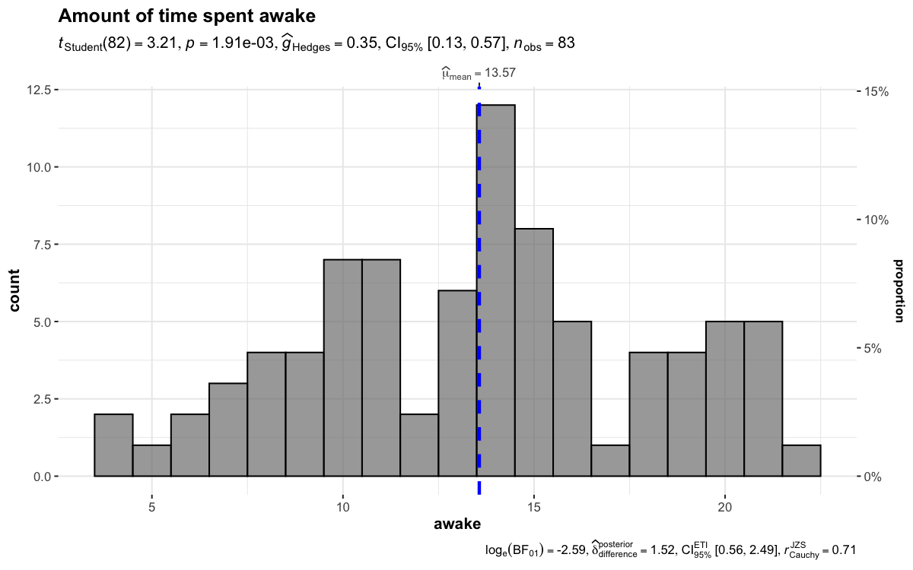
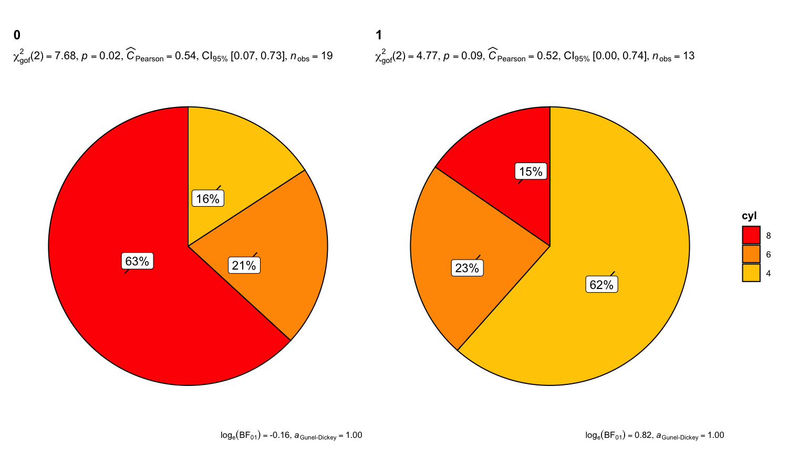

<!-- README.md is generated from README.Rmd. Please edit that file -->

# `ggstatsplot`: `ggplot2` Based Plots with Statistical Details

| Package                                                                                                                                                         | Status                                                                                                                                                                                       | Usage                                                                                                                                                  | GitHub                                                                                                                                                         | Miscellaneous                                                                                                                                                         |
|-----------------------------------------------------------------------------------------------------------------------------------------------------------------|----------------------------------------------------------------------------------------------------------------------------------------------------------------------------------------------|--------------------------------------------------------------------------------------------------------------------------------------------------------|----------------------------------------------------------------------------------------------------------------------------------------------------------------|-----------------------------------------------------------------------------------------------------------------------------------------------------------------------|
| [](https://CRAN.R-project.org/package=ggstatsplot)                                 | [](https://travis-ci.org/IndrajeetPatil/ggstatsplot)                                               | [](https://CRAN.R-project.org/package=ggstatsplot)          | [](https://github.com/IndrajeetPatil/ggstatsplot/)               | [](https://indrajeetpatil.github.io/ggstatsplot/)                                |
| [](https://cran.r-project.org/web/checks/check_results_ggstatsplot.html)                      | [](https://ci.appveyor.com/project/IndrajeetPatil/ggstatsplot) | [](https://CRAN.R-project.org/package=ggstatsplot)        | [](https://hits.dwyl.com/IndrajeetPatil/ggstatsplot)                                          | [](https://cran.r-project.org/)                                                            |
| [](https://lifecycle.r-lib.org/articles/stages.html)                                      | [](https://github.com/IndrajeetPatil/ggstatsplot)                                            | [](https://CRAN.R-project.org/package=ggstatsplot)      | [](https://www.contributor-covenant.org/version/2/0/code_of_conduct.html)                    | [](https://www.codefactor.io/repository/github/indrajeetpatil/ggstatsplot) |
| [](https://github.com/IndrajeetPatil/ggstatsplot) | [](https://coveralls.io/github/IndrajeetPatil/ggstatsplot?branch=master)             | [](https://CRAN.R-project.org/package=ggstatsplot)       | [](https://github.com/IndrajeetPatil/ggstatsplot) | [](https://doi.org/10.5281/zenodo.2074621)                                                             |
| [](https://www.gnu.org/licenses/gpl-3.0.en.html)                                                | [](https://codecov.io/gh/IndrajeetPatil/ggstatsplot?branch=master)                   | [](https://joss.theoj.org/papers/254890248268a43a0365abe1a607939c) | [](https://github.com/IndrajeetPatil/ggstatsplot/commits/master)    | [](https://github.com/IndrajeetPatil/ggstatsplot/commits/master)       |
| [](https://CRAN.R-project.org/package=ggstatsplot)                                                    | [](https://github.com/IndrajeetPatil/ggstatsplot)                                                            | [](https://gitter.im/ggstatsplot/community)                                                | [](https://www.repostatus.org/#active)                                                   | [](https://github.com/IndrajeetPatil/ggstatsplot/issues)       |

# Raison d’être 

> “What is to be sought in designs for the display of information is the
> clear portrayal of complexity. Not the complication of the simple;
> rather … the revelation of the complex.”  
> - Edward R. Tufte

[`ggstatsplot`](https://indrajeetpatil.github.io/ggstatsplot/) is an
extension of [`ggplot2`](https://github.com/tidyverse/ggplot2) package
for creating graphics with details from statistical tests included in
the information-rich plots themselves. In a typical exploratory data
analysis workflow, data visualization and statistical modeling are two
different phases: visualization informs modeling, and modeling in its
turn can suggest a different visualization method, and so on and so
forth. The central idea of `ggstatsplot` is simple: combine these two
phases into one in the form of graphics with statistical details, which
makes data exploration simpler and faster.

# Installation

To get the latest, stable `CRAN` release:

``` r
install.packages("ggstatsplot")
```

You can get the **development** version of the package from `GitHub`.

If you are in hurry and want to reduce the time of installation, prefer-

``` r
# needed package to download from GitHub repo
install.packages("remotes")

# downloading the package from GitHub (needs `remotes` package to be installed)
remotes::install_github(
  repo = "IndrajeetPatil/ggstatsplot", # package path on GitHub
  dependencies = FALSE, # assumes you have already installed needed packages
  quick = TRUE # skips docs, demos, and vignettes
)
```

If time is not a constraint-

``` r
remotes::install_github(
  repo = "IndrajeetPatil/ggstatsplot", # package path on GitHub
  dependencies = TRUE, # installs packages which ggstatsplot depends on
  upgrade_dependencies = TRUE # updates any out of date dependencies
)
```

To see what new changes (and bug fixes) have been made to the package
since the last release on `CRAN`, you can check the detailed log of
changes here:
<https://indrajeetpatil.github.io/ggstatsplot/news/index.html>

# Troubleshooting

Linux users may encounter some installation problems. In particular, the
`ggstatsplot` package depends on the `PMCMRplus` package.

    ERROR: dependencies ‘gmp’, ‘Rmpfr’ are not available for package ‘PMCMRplus’
    ERROR: dependency ‘pairwiseComparisons’ is not available for package ‘ggstatsplot’

This means that your operating system lacks `gmp` and `Rmpfr` libraries.

If you use `Ubuntu`, you can install these dependencies:

    sudo apt-get install libgmp3-dev
    sudo apt-get install libmpfr-dev

The following `README` file briefly describes the installation
procedure:
<https://CRAN.R-project.org/package=PMCMRplus/readme/README.html>

# Citation

If you want to cite this package in a scientific journal or in any other
context, run the following code in your `R` console:

``` r
citation("ggstatsplot")

  Patil, I. (2018). Visualizations with statistical details: The
  'ggstatsplot' approach. PsyArxiv. doi:10.31234/osf.io/p7mku

A BibTeX entry for LaTeX users is

  @Article{,
    title = {Visualizations with statistical details: The 'ggstatsplot' approach},
    author = {Indrajeet Patil},
    year = {2021},
    journal = {PsyArxiv},
    url = {https://psyarxiv.com/p7mku/},
    doi = {10.31234/osf.io/p7mku},
  }
```

There is currently a publication in preparation corresponding to this
package and the citation will be updated once it’s published.

# Documentation and Examples

To see the detailed documentation for each function in the stable
**CRAN** version of the package, see:

-   Website: <https://indrajeetpatil.github.io/ggstatsplot/>

-   Presentation:
    <https://indrajeetpatil.github.io/ggstatsplot_slides/slides/ggstatsplot_presentation.html#1>

-   Vignettes: <https://indrajeetpatil.github.io/ggstatsplot/articles/>

To see the documentation relevant for the **development** version of the
package, see the dedicated website for `ggstatplot`, which is updated
after every new commit: <https://indrajeetpatil.github.io/ggstatsplot/>.

# Summary of available plots

It, therefore, produces a limited kinds of plots for the supported
analyses:

| Function         | Plot                      | Description                                     | Lifecycle                                                                                                                  |
|------------------|---------------------------|-------------------------------------------------|----------------------------------------------------------------------------------------------------------------------------|
| `ggbetweenstats` | **violin plots**          | for comparisons *between* groups/conditions     | [](https://lifecycle.r-lib.org/articles/stages.html) |
| `ggwithinstats`  | **violin plots**          | for comparisons *within* groups/conditions      | [](https://lifecycle.r-lib.org/articles/stages.html) |
| `gghistostats`   | **histograms**            | for distribution about numeric variable         | [](https://lifecycle.r-lib.org/articles/stages.html) |
| `ggdotplotstats` | **dot plots/charts**      | for distribution about labeled numeric variable | [](https://lifecycle.r-lib.org/articles/stages.html) |
| `ggscatterstats` | **scatterplots**          | for correlation between two variables           | [](https://lifecycle.r-lib.org/articles/stages.html) |
| `ggcorrmat`      | **correlation matrices**  | for correlations between multiple variables     | [](https://lifecycle.r-lib.org/articles/stages.html) |
| `ggpiestats`     | **pie charts**            | for categorical data                            | [](https://lifecycle.r-lib.org/articles/stages.html) |
| `ggbarstats`     | **bar charts**            | for categorical data                            | [](https://lifecycle.r-lib.org/articles/stages.html) |
| `ggcoefstats`    | **dot-and-whisker plots** | for regression models and meta-analysis         | [](https://lifecycle.r-lib.org/articles/stages.html) |

In addition to these basic plots, `ggstatsplot` also provides
**`grouped_`** versions (see below) that makes it easy to repeat the
same analysis for any grouping variable.

# Summary of types of statistical analyses

The table below summarizes all the different types of analyses currently
supported in this package-

| Functions                        | Description                                       | Parametric | Non-parametric | Robust | Bayesian |
|----------------------------------|---------------------------------------------------|------------|----------------|--------|----------|
| `ggbetweenstats`                 | Between group/condition comparisons               | ✅          | ✅              | ✅      | ✅        |
| `ggwithinstats`                  | Within group/condition comparisons                | ✅          | ✅              | ✅      | ✅        |
| `gghistostats`, `ggdotplotstats` | Distribution of a numeric variable                | ✅          | ✅              | ✅      | ✅        |
| `ggcorrmat`                      | Correlation matrix                                | ✅          | ✅              | ✅      | ✅        |
| `ggscatterstats`                 | Correlation between two variables                 | ✅          | ✅              | ✅      | ✅        |
| `ggpiestats`, `ggbarstats`       | Association between categorical variables         | ✅          | ✅              | ❌      | ✅        |
| `ggpiestats`, `ggbarstats`       | Equal proportions for categorical variable levels | ✅          | ✅              | ❌      | ✅        |
| `ggcoefstats`                    | Regression model coefficients                     | ✅          | ✅              | ✅      | ✅        |
| `ggcoefstats`                    | Random-effects meta-analysis                      | ✅          | ❌              | ✅      | ✅        |

Summary of Bayesian analysis

| Analysis                        | Hypothesis testing | Estimation |
|---------------------------------|--------------------|------------|
| (one/two-sample) t-test         | ✅                  | ✅          |
| one-way ANOVA                   | ✅                  | ✅          |
| correlation                     | ✅                  | ✅          |
| (one/two-way) contingency table | ✅                  | ✅          |
| random-effects meta-analysis    | ✅                  | ✅          |

# Statistical reporting

For **all** statistical tests reported in the plots, the default
template abides by the [APA](https://my.ilstu.edu/~jhkahn/apastats.html)
gold standard for statistical reporting. For example, here are results
from Yuen’s test for trimmed means (robust *t*-test):


# Summary of statistical tests and effect sizes

Here is a summary table of all the statistical tests currently supported
across various functions:
<https://indrajeetpatil.github.io/statsExpressions/articles/stats_details.html>

# Primary functions

Here are examples of the main functions currently supported in
`ggstatsplot`.

**Note**: If you are reading this on `GitHub` repository, the
documentation below is for the **development** version of the package.
So you may see some features available here that are not currently
present in the stable version of this package on **CRAN**. For
documentation relevant for the `CRAN` version, see:
<https://CRAN.R-project.org/package=ggstatsplot/readme/README.html>

## `ggbetweenstats`

This function creates either a violin plot, a box plot, or a mix of two
for **between**-group or **between**-condition comparisons with results
from statistical tests in the subtitle. The simplest function call looks
like this-

``` r
# for reproducibility
set.seed(123)
library(ggstatsplot)

# plot
ggbetweenstats(
  data = iris,
  x = Species,
  y = Sepal.Length,
  title = "Distribution of sepal length across Iris species"
)
```


📝 **Defaults** return<br>

✅ raw data + distributions <br> ✅ descriptive statistics <br> ✅
inferential statistics <br> ✅ effect size + CIs <br> ✅ pairwise
comparisons <br> ✅ Bayesian hypothesis-testing <br> ✅ Bayesian
estimation <br>

A number of other arguments can be specified to make this plot even more
informative or change some of the default options. Additionally, there
is also a `grouped_` variant of this function that makes it easy to
repeat the same operation across a **single** grouping variable:

``` r
# for reproducibility
set.seed(123)

# plot
grouped_ggbetweenstats(
  data = dplyr::filter(movies_long, genre %in% c("Action", "Comedy")),
  x = mpaa,
  y = length,
  grouping.var = genre, # grouping variable
  outlier.tagging = TRUE, # whether outliers need to be tagged
  outlier.label = title, # variable to be used for tagging outliers
  outlier.coef = 2,
  ggsignif.args = list(textsize = 4, tip_length = 0.01),
  p.adjust.method = "bonferroni", # method for adjusting p-values for multiple comparisons
  # adding new components to `ggstatsplot` default
  ggplot.component = list(ggplot2::scale_y_continuous(sec.axis = ggplot2::dup_axis())),
  caption = substitute(paste(italic("Source"), ": IMDb (Internet Movie Database)")),
  palette = "default_jama",
  package = "ggsci",
  plotgrid.args = list(nrow = 1),
  annotation.args = list(title = "Differences in movie length by mpaa ratings for different genres")
)
```


Note here that the function can be used to tag outliers!

### Summary of graphics

| graphical element        | `geom_` used                | argument for further modification |
|--------------------------|-----------------------------|-----------------------------------|
| raw points               | `ggplot2::geom_point`       | `point.args`                      |
| box plot                 | `ggplot2::geom_boxplot`     | ❌                                 |
| density plot             | `ggplot2::geom_violin`      | `violin.args`                     |
| centrality measure point | `ggplot2::geom_point`       | `centrality.point.args`           |
| centrality measure label | `ggrepel::geom_label_repel` | `centrality.label.args`           |
| outlier point            | `ggplot2::stat_boxplot`     | ❌                                 |
| outlier label            | `ggrepel::geom_label_repel` | `outlier.label.args`              |
| pairwise comparisons     | `ggsignif::geom_ggsignif`   | `ggsignif.args`                   |

### Summary of tests

**Central tendency measure**

| Type           | Measure                                           | Function used                       |
|----------------|---------------------------------------------------|-------------------------------------|
| Parametric     | mean                                              | `parameters::describe_distribution` |
| Non-parametric | median                                            | `parameters::describe_distribution` |
| Robust         | trimmed mean                                      | `parameters::describe_distribution` |
| Bayesian       | MAP (maximum *a posteriori* probability) estimate | `parameters::describe_distribution` |

**Hypothesis testing**

| Type           | No. of groups | Test                                            | Function used          |
|----------------|---------------|-------------------------------------------------|------------------------|
| Parametric     | &gt; 2        | Fisher’s or Welch’s one-way ANOVA               | `stats::oneway.test`   |
| Non-parametric | &gt; 2        | Kruskal–Wallis one-way ANOVA                    | `stats::kruskal.test`  |
| Robust         | &gt; 2        | Heteroscedastic one-way ANOVA for trimmed means | `WRS2::t1way`          |
| Bayes Factor   | &gt; 2        | Fisher’s ANOVA                                  | `BayesFactor::anovaBF` |
| Parametric     | 2             | Student’s or Welch’s *t*-test                   | `stats::t.test`        |
| Non-parametric | 2             | Mann–Whitney *U* test                           | `stats::wilcox.test`   |
| Robust         | 2             | Yuen’s test for trimmed means                   | `WRS2::yuen`           |
| Bayesian       | 2             | Student’s *t*-test                              | `BayesFactor::ttestBF` |

**Effect size estimation**

| Type           | No. of groups | Effect size                                                                                                                                                                                            | CI? | Function used                                          |
|----------------|---------------|--------------------------------------------------------------------------------------------------------------------------------------------------------------------------------------------------------|-----|--------------------------------------------------------|
| Parametric     | &gt; 2        | ,  | ✅   | `effectsize::omega_squared`, `effectsize::eta_squared` |
| Non-parametric | &gt; 2        |                                                                           | ✅   | `effectsize::rank_epsilon_squared`                     |
| Robust         | &gt; 2        |  (Explanatory measure of effect size)                                                                                               | ✅   | `WRS2::t1way`                                          |
| Bayes Factor   | &gt; 2        |                                                                                             | ✅   | `performance::r2_bayes`                                |
| Parametric     | 2             | Cohen’s *d*, Hedge’s *g*                                                                                                                                                                               | ✅   | `effectsize::cohens_d`, `effectsize::hedges_g`         |
| Non-parametric | 2             | *r* (rank-biserial correlation)                                                                                                                                                                        | ✅   | `effectsize::rank_biserial`                            |
| Robust         | 2             |  (Explanatory measure of effect size)                                                                                               | ✅   | `WRS2::yuen.effect.ci`                                 |
| Bayesian       | 2             |                                                                                   | ✅   | `bayestestR::describe_posterior`                       |

**Pairwise comparison tests**

| Type           | Equal variance? | Test                      | *p*-value adjustment? | Function used                   |
|----------------|-----------------|---------------------------|-----------------------|---------------------------------|
| Parametric     | No              | Games-Howell test         | ✅                     | `stats::pairwise.t.test`        |
| Parametric     | Yes             | Student’s *t*-test        | ✅                     | `PMCMRplus::gamesHowellTest`    |
| Non-parametric | No              | Dunn test                 | ✅                     | `PMCMRplus::kwAllPairsDunnTest` |
| Robust         | No              | Yuen’s trimmed means test | ✅                     | `WRS2::lincon`                  |
| Bayes Factor   | ❌               | Student’s *t*-test        | ❌                     | `BayesFactor::ttestBF`          |

For more, see the `ggbetweenstats` vignette:
<https://indrajeetpatil.github.io/ggstatsplot/articles/web_only/ggbetweenstats.html>

## `ggwithinstats`

`ggbetweenstats` function has an identical twin function `ggwithinstats`
for repeated measures designs that behaves in the same fashion with a
few minor tweaks introduced to properly visualize the repeated measures
design. As can be seen from an example below, the only difference
between the plot structure is that now the group means are connected by
paths to highlight the fact that these data are paired with each other.

``` r
# for reproducibility and data
set.seed(123)
library(WRS2) # for data
library(afex) # to run anova

# plot
ggwithinstats(
  data = WineTasting,
  x = Wine,
  y = Taste,
  title = "Wine tasting",
  caption = "Data source: `WRS2` R package",
  ggtheme = ggthemes::theme_fivethirtyeight(),
  ggstatsplot.layer = FALSE
)
```


📝 **Defaults** return<br>

✅ raw data + distributions <br> ✅ descriptive statistics <br> ✅
inferential statistics <br> ✅ effect size + CIs <br> ✅ pairwise
comparisons <br> ✅ Bayesian hypothesis-testing <br> ✅ Bayesian
estimation <br>

The central tendency measure displayed will depend on the statistics:

| Type           | Measure      | Function used                       |
|----------------|--------------|-------------------------------------|
| Parametric     | mean         | `parameters::describe_distribution` |
| Non-parametric | median       | `parameters::describe_distribution` |
| Robust         | trimmed mean | `parameters::describe_distribution` |
| Bayesian       | MAP estimate | `parameters::describe_distribution` |

As with the `ggbetweenstats`, this function also has a `grouped_`
variant that makes repeating the same analysis across a single grouping
variable quicker. We will see an example with only repeated
measurements-

``` r
# common setup
set.seed(123)

# plot
grouped_ggwithinstats(
  data = dplyr::filter(
    .data = bugs_long,
    region %in% c("Europe", "North America"),
    condition %in% c("LDLF", "LDHF")
  ),
  x = condition,
  y = desire,
  type = "np", # non-parametric statistics
  xlab = "Condition",
  ylab = "Desire to kill an artrhopod",
  grouping.var = region,
  outlier.tagging = TRUE,
  outlier.label = education
)
```


### Summary of graphics

| graphical element             | `geom_` used                | argument for further modification |
|-------------------------------|-----------------------------|-----------------------------------|
| raw points                    | `ggplot2::geom_point`       | `point.args`                      |
| point path                    | `ggplot2::geom_path`        | `point.path.args`                 |
| box plot                      | `ggplot2::geom_boxplot`     | ❌                                 |
| density plot                  | `ggplot2::geom_violin`      | `violin.args`                     |
| centrality measure point      | `ggplot2::geom_point`       | `centrality.point.args`           |
| centrality measure point path | `ggplot2::geom_path`        | `centrality.path.args`            |
| centrality measure label      | `ggrepel::geom_label_repel` | `centrality.label.args`           |
| outlier point                 | `ggplot2::stat_boxplot`     | ❌                                 |
| outlier label                 | `ggrepel::geom_label_repel` | `outlier.label.args`              |
| pairwise comparisons          | `ggsignif::geom_ggsignif`   | `ggsignif.args`                   |

### Summary of tests

**Central tendency measure**

| Type           | Measure                                           | Function used                       |
|----------------|---------------------------------------------------|-------------------------------------|
| Parametric     | mean                                              | `parameters::describe_distribution` |
| Non-parametric | median                                            | `parameters::describe_distribution` |
| Robust         | trimmed mean                                      | `parameters::describe_distribution` |
| Bayesian       | MAP (maximum *a posteriori* probability) estimate | `parameters::describe_distribution` |

**Hypothesis testing**

| Type           | No. of groups | Test                                                              | Function used          |
|----------------|---------------|-------------------------------------------------------------------|------------------------|
| Parametric     | &gt; 2        | One-way repeated measures ANOVA                                   | `afex::aov_ez`         |
| Non-parametric | &gt; 2        | Friedman rank sum test                                            | `stats::friedman.test` |
| Robust         | &gt; 2        | Heteroscedastic one-way repeated measures ANOVA for trimmed means | `WRS2::rmanova`        |
| Bayes Factor   | &gt; 2        | One-way repeated measures ANOVA                                   | `BayesFactor::anovaBF` |
| Parametric     | 2             | Student’s *t*-test                                                | `stats::t.test`        |
| Non-parametric | 2             | Wilcoxon signed-rank test                                         | `stats::wilcox.test`   |
| Robust         | 2             | Yuen’s test on trimmed means for dependent samples                | `WRS2::yuend`          |
| Bayesian       | 2             | Student’s *t*-test                                                | `BayesFactor::ttestBF` |

**Effect size estimation**

| Type           | No. of groups | Effect size                                                                                                                                                                                            | CI? | Function used                                          |
|----------------|---------------|--------------------------------------------------------------------------------------------------------------------------------------------------------------------------------------------------------|-----|--------------------------------------------------------|
| Parametric     | &gt; 2        | ,  | ✅   | `effectsize::omega_squared`, `effectsize::eta_squared` |
| Non-parametric | &gt; 2        |  (Kendall’s coefficient of concordance)                                                                   | ✅   | `effectsize::kendalls_w`                               |
| Robust         | &gt; 2        |  (Algina-Keselman-Penfield robust standardized difference average)    | ✅   | `WRS2::wmcpAKP`                                        |
| Bayes Factor   | &gt; 2        |                                                                                                | ✅   | `performance::r2_bayes`                                |
| Parametric     | 2             | Cohen’s *d*, Hedge’s *g*                                                                                                                                                                               | ✅   | `effectsize::cohens_d`, `effectsize::hedges_g`         |
| Non-parametric | 2             | *r* (rank-biserial correlation)                                                                                                                                                                        | ✅   | `effectsize::rank_biserial`                            |
| Robust         | 2             |  (Algina-Keselman-Penfield robust standardized difference)                        | ✅   | `WRS2::wmcpAKP`                                        |
| Bayesian       | 2             |                                                                                   | ✅   | `bayestestR::describe_posterior`                       |

**Pairwise comparison tests**

| Type           | Test                      | *p*-value adjustment? | Function used                   |
|----------------|---------------------------|-----------------------|---------------------------------|
| Parametric     | Student’s *t*-test        | ✅                     | `stats::pairwise.t.test`        |
| Non-parametric | Durbin-Conover test       | ✅                     | `PMCMRplus::durbinAllPairsTest` |
| Robust         | Yuen’s trimmed means test | ✅                     | `WRS2::rmmcp`                   |
| Bayesian       | Student’s *t*-test        | ❌                     | `BayesFactor::ttestBF`          |

For more, see the `ggwithinstats` vignette:
<https://indrajeetpatil.github.io/ggstatsplot/articles/web_only/ggwithinstats.html>

## `gghistostats`

To visualize the distribution of a single variable and check if its mean
is significantly different from a specified value with a one-sample
test, `gghistostats` can be used.

``` r
# for reproducibility
set.seed(123)

# plot
gghistostats(
  data = ggplot2::msleep, # dataframe from which variable is to be taken
  x = awake, # numeric variable whose distribution is of interest
  title = "Amount of time spent awake", # title for the plot
  caption = substitute(paste(italic("Source: "), "Mammalian sleep data set")),
  test.value = 12, # default value is 0
  binwidth = 1, # binwidth value (experiment)
  ggtheme = hrbrthemes::theme_ipsum_tw(), # choosing a different theme
  ggstatsplot.layer = FALSE # turn off ggstatsplot theme layer
)
```



📝 **Defaults** return<br>

✅ counts + proportion for bins<br> ✅ descriptive statistics <br> ✅
inferential statistics <br> ✅ effect size + CIs <br> ✅ Bayesian
hypothesis-testing <br> ✅ Bayesian estimation <br>

There is also a `grouped_` variant of this function that makes it easy
to repeat the same operation across a **single** grouping variable:

``` r
# for reproducibility
set.seed(123)

# plot
grouped_gghistostats(
  data = dplyr::filter(movies_long, genre %in% c("Action", "Comedy")),
  x = budget,
  test.value = 50,
  type = "nonparametric",
  xlab = "Movies budget (in million US$)",
  grouping.var = genre, # grouping variable
  normal.curve = TRUE, # superimpose a normal distribution curve
  normal.curve.args = list(color = "red", size = 1),
  ggtheme = ggthemes::theme_tufte(),
  # modify the defaults from `ggstatsplot` for each plot
  ggplot.component = ggplot2::labs(caption = "Source: IMDB.com"),
  plotgrid.args = list(nrow = 1),
  annotation.args = list(title = "Movies budgets for different genres")
)
```


### Summary of tests

**Central tendency measure**

| Type           | Measure                                           | Function used                       |
|----------------|---------------------------------------------------|-------------------------------------|
| Parametric     | mean                                              | `parameters::describe_distribution` |
| Non-parametric | median                                            | `parameters::describe_distribution` |
| Robust         | trimmed mean                                      | `parameters::describe_distribution` |
| Bayesian       | MAP (maximum *a posteriori* probability) estimate | `parameters::describe_distribution` |

**Hypothesis testing**

| Type           | Test                                     | Function used          |
|----------------|------------------------------------------|------------------------|
| Parametric     | One-sample Student’s *t*-test            | `stats::t.test`        |
| Non-parametric | One-sample Wilcoxon test                 | `stats::wilcox.test`   |
| Robust         | Bootstrap-*t* method for one-sample test | `trimcibt` (custom)    |
| Bayesian       | One-sample Student’s *t*-test            | `BayesFactor::ttestBF` |

**Effect size estimation**

| Type           | Effect size                                                                                                           | CI? | Function used                                  |
|----------------|-----------------------------------------------------------------------------------------------------------------------|-----|------------------------------------------------|
| Parametric     | Cohen’s *d*, Hedge’s *g*                                                                                              | ✅   | `effectsize::cohens_d`, `effectsize::hedges_g` |
| Non-parametric | *r* (rank-biserial correlation)                                                                                       | ✅   | `effectsize::rank_biserial`                    |
| Robust         | trimmed mean                                                                                                          | ✅   | `trimcibt` (custom)                            |
| Bayes Factor   |  | ✅   | `bayestestR::describe_posterior`               |

For more, including information about the variant of this function
`grouped_gghistostats`, see the `gghistostats` vignette:
<https://indrajeetpatil.github.io/ggstatsplot/articles/web_only/gghistostats.html>

## `ggdotplotstats`

This function is similar to `gghistostats`, but is intended to be used
when the numeric variable also has a label.

``` r
# for reproducibility
set.seed(123)

# plot
ggdotplotstats(
  data = dplyr::filter(.data = gapminder::gapminder, continent == "Asia"),
  y = country,
  x = lifeExp,
  test.value = 55,
  type = "robust",
  title = "Distribution of life expectancy in Asian continent",
  xlab = "Life expectancy",
  caption = substitute(
    paste(
      italic("Source"),
      ": Gapminder dataset from https://www.gapminder.org/"
    )
  )
)
```


📝 **Defaults** return<br>

✅ descriptives (mean + sample size) <br> ✅ inferential statistics <br> ✅
effect size + CIs <br> ✅ Bayesian hypothesis-testing <br> ✅ Bayesian
estimation <br>

As with the rest of the functions in this package, there is also a
`grouped_` variant of this function to facilitate looping the same
operation for all levels of a single grouping variable.

``` r
# for reproducibility
set.seed(123)

# plot
grouped_ggdotplotstats(
  data = dplyr::filter(.data = ggplot2::mpg, cyl %in% c("4", "6")),
  x = cty,
  y = manufacturer,
  type = "bayes", # Bayesian test
  xlab = "city miles per gallon",
  ylab = "car manufacturer",
  grouping.var = cyl, # grouping variable
  test.value = 15.5,
  point.args = list(color = "red", size = 5, shape = 13),
  annotation.args = list(title = "Fuel economy data")
)
```


### Summary of tests

**Central tendency measure**

| Type           | Measure                                           | Function used                       |
|----------------|---------------------------------------------------|-------------------------------------|
| Parametric     | mean                                              | `parameters::describe_distribution` |
| Non-parametric | median                                            | `parameters::describe_distribution` |
| Robust         | trimmed mean                                      | `parameters::describe_distribution` |
| Bayesian       | MAP (maximum *a posteriori* probability) estimate | `parameters::describe_distribution` |

**Hypothesis testing**

| Type           | Test                                     | Function used          |
|----------------|------------------------------------------|------------------------|
| Parametric     | One-sample Student’s *t*-test            | `stats::t.test`        |
| Non-parametric | One-sample Wilcoxon test                 | `stats::wilcox.test`   |
| Robust         | Bootstrap-*t* method for one-sample test | `trimcibt` (custom)    |
| Bayesian       | One-sample Student’s *t*-test            | `BayesFactor::ttestBF` |

**Effect size estimation**

| Type           | Effect size                                                                                                           | CI? | Function used                                  |
|----------------|-----------------------------------------------------------------------------------------------------------------------|-----|------------------------------------------------|
| Parametric     | Cohen’s *d*, Hedge’s *g*                                                                                              | ✅   | `effectsize::cohens_d`, `effectsize::hedges_g` |
| Non-parametric | *r* (rank-biserial correlation)                                                                                       | ✅   | `effectsize::rank_biserial`                    |
| Robust         | trimmed mean                                                                                                          | ✅   | `trimcibt` (custom)                            |
| Bayes Factor   |  | ✅   | `bayestestR::describe_posterior`               |

## `ggscatterstats`

This function creates a scatterplot with marginal distributions overlaid
on the axes (from `ggExtra::ggMarginal`) and results from statistical
tests in the subtitle:

``` r
ggscatterstats(
  data = ggplot2::msleep,
  x = sleep_rem,
  y = awake,
  xlab = "REM sleep (in hours)",
  ylab = "Amount of time spent awake (in hours)",
  title = "Understanding mammalian sleep"
)
```


📝 **Defaults** return<br>

✅ raw data + distributions <br> ✅ marginal distributions <br> ✅
inferential statistics <br> ✅ effect size + CIs <br> ✅ Bayesian
hypothesis-testing <br> ✅ Bayesian estimation <br>

The available marginal distributions are-

-   histograms
-   boxplots
-   density
-   violin
-   densigram (density + histogram)

Number of other arguments can be specified to modify this basic plot-

``` r
# for reproducibility
set.seed(123)

# plot
ggscatterstats(
  data = dplyr::filter(movies_long, genre == "Action"),
  x = budget,
  y = rating,
  type = "robust", # type of test that needs to be run
  xlab = "Movie budget (in million/ US$)", # label for x axis
  ylab = "IMDB rating", # label for y axis
  label.var = title, # variable for labeling data points
  label.expression = rating < 5 & budget > 100, # expression that decides which points to label
  title = "Movie budget and IMDB rating (action)", # title text for the plot
  caption = expression(paste(italic("Note"), ": IMDB stands for Internet Movie DataBase")),
  ggtheme = hrbrthemes::theme_ipsum_ps(), # choosing a different theme
  ggstatsplot.layer = FALSE, # turn off `ggstatsplot` theme layer
  marginal.type = "boxplot", # type of marginal distribution to be displayed
  xfill = "pink", # color fill for x-axis marginal distribution
  yfill = "#009E73" # color fill for y-axis marginal distribution
)
```


Additionally, there is also a `grouped_` variant of this function that
makes it easy to repeat the same operation across a **single** grouping
variable. Also, note that, as opposed to the other functions, this
function does not return a `ggplot` object and any modification you want
to make can be made in advance using `ggplot.component` argument
(available for all functions, but especially useful here):

``` r
# for reproducibility
set.seed(123)

# plot
grouped_ggscatterstats(
  data = dplyr::filter(movies_long, genre %in% c("Action", "Comedy")),
  x = rating,
  y = length,
  grouping.var = genre, # grouping variable
  label.var = title,
  label.expression = length > 200,
  xlab = "IMDB rating",
  ggtheme = ggplot2::theme_grey(),
  ggplot.component = list(
    ggplot2::scale_x_continuous(breaks = seq(2, 9, 1), limits = (c(2, 9)))
  ),
  plotgrid.args = list(nrow = 1),
  annotation.args = list(title = "Relationship between movie length and IMDB ratings")
)
```


### Summary of tests

**Hypothesis testing** and **Effect size estimation**

| Type           | Test                                       | CI? | Function used              |
|----------------|--------------------------------------------|-----|----------------------------|
| Parametric     | Pearson’s correlation coefficient          | ✅   | `correlation::correlation` |
| Non-parametric | Spearman’s rank correlation coefficient    | ✅   | `correlation::correlation` |
| Robust         | Winsorized Pearson correlation coefficient | ✅   | `correlation::correlation` |
| Bayesian       | Pearson’s correlation coefficient          | ✅   | `correlation::correlation` |

For more, see the `ggscatterstats` vignette:
<https://indrajeetpatil.github.io/ggstatsplot/articles/web_only/ggscatterstats.html>

## `ggcorrmat`

`ggcorrmat` makes a correlalogram (a matrix of correlation coefficients)
with minimal amount of code. Just sticking to the defaults itself
produces publication-ready correlation matrices. But, for the sake of
exploring the available options, let’s change some of the defaults. For
example, multiple aesthetics-related arguments can be modified to change
the appearance of the correlation matrix.

``` r
# for reproducibility
set.seed(123)

# as a default this function outputs a correlation matrix plot
ggcorrmat(
  data = ggplot2::msleep,
  colors = c("#B2182B", "white", "#4D4D4D"),
  title = "Correlalogram for mammals sleep dataset",
  subtitle = "sleep units: hours; weight units: kilograms"
)
```


📝 **Defaults** return<br>

✅ effect size + significance<br> ✅ careful handling of `NA`s

If there are `NA`s present in the selected variables, the legend will
display minimum, median, and maximum number of pairs used for
correlation tests.

There is also a `grouped_` variant of this function that makes it easy
to repeat the same operation across a **single** grouping variable:

``` r
# for reproducibility
set.seed(123)

# plot
grouped_ggcorrmat(
  data = dplyr::filter(movies_long, genre %in% c("Action", "Comedy")),
  type = "robust", # correlation method
  colors = c("#cbac43", "white", "#550000"),
  grouping.var = genre, # grouping variable
  matrix.type = "lower" # type of matrix
)
```


You can also get a dataframe containing all relevant details from the
statistical tests:

``` r
# setup
set.seed(123)

# dataframe in long format
ggcorrmat(
  data = ggplot2::msleep,
  type = "bayes",
  output = "dataframe"
)
#> # A tibble: 15 x 15
#>    parameter1  parameter2  estimate conf.level conf.low conf.high         mad
#>    <chr>       <chr>          <dbl>      <dbl>    <dbl>     <dbl>       <dbl>
#>  1 sleep_total sleep_rem      0.731       0.95    0.617    0.810  0.0593     
#>  2 sleep_total sleep_cycle   -0.432       0.95   -0.678   -0.223  0.138      
#>  3 sleep_total awake         -1.00        0.95   -1.00    -1.00   0.000000354
#>  4 sleep_total brainwt       -0.339       0.95   -0.523   -0.156  0.116      
#>  5 sleep_total bodywt        -0.300       0.95   -0.458   -0.142  0.0992     
#>  6 sleep_rem   sleep_cycle   -0.306       0.95   -0.535   -0.0555 0.155      
#>  7 sleep_rem   awake         -0.734       0.95   -0.824   -0.638  0.0585     
#>  8 sleep_rem   brainwt       -0.202       0.95   -0.410    0.0130 0.134      
#>  9 sleep_rem   bodywt        -0.315       0.95   -0.481   -0.120  0.116      
#> 10 sleep_cycle awake          0.441       0.95    0.226    0.662  0.141      
#> 11 sleep_cycle brainwt        0.823       0.95    0.720    0.911  0.0581     
#> 12 sleep_cycle bodywt         0.386       0.95    0.145    0.610  0.148      
#> 13 awake       brainwt        0.341       0.95    0.154    0.524  0.111      
#> 14 awake       bodywt         0.299       0.95    0.139    0.454  0.0962     
#> 15 brainwt     bodywt         0.926       0.95    0.896    0.957  0.0191     
#>       pd rope.percentage prior.distribution prior.location prior.scale
#>    <dbl>           <dbl> <chr>                       <dbl>       <dbl>
#>  1 1              0      beta                         1.41        1.41
#>  2 0.995          0.0173 beta                         1.41        1.41
#>  3 1              0      beta                         1.41        1.41
#>  4 0.996          0.028  beta                         1.41        1.41
#>  5 0.997          0.0292 beta                         1.41        1.41
#>  6 0.965          0.091  beta                         1.41        1.41
#>  7 1              0      beta                         1.41        1.41
#>  8 0.927          0.212  beta                         1.41        1.41
#>  9 0.994          0.0362 beta                         1.41        1.41
#> 10 0.995          0.0158 beta                         1.41        1.41
#> 11 1              0      beta                         1.41        1.41
#> 12 0.992          0.0392 beta                         1.41        1.41
#> 13 0.992          0.0253 beta                         1.41        1.41
#> 14 0.998          0.0265 beta                         1.41        1.41
#> 15 1              0      beta                         1.41        1.41
#>    bayes.factor method                       n.obs
#>           <dbl> <chr>                        <int>
#>  1     3.00e+ 9 Bayesian Pearson correlation    61
#>  2     8.85e+ 0 Bayesian Pearson correlation    32
#>  3    NA        Bayesian Pearson correlation    83
#>  4     7.29e+ 0 Bayesian Pearson correlation    56
#>  5     9.28e+ 0 Bayesian Pearson correlation    83
#>  6     1.42e+ 0 Bayesian Pearson correlation    32
#>  7     3.01e+ 9 Bayesian Pearson correlation    61
#>  8     6.54e- 1 Bayesian Pearson correlation    48
#>  9     4.80e+ 0 Bayesian Pearson correlation    61
#> 10     8.85e+ 0 Bayesian Pearson correlation    32
#> 11     3.80e+ 6 Bayesian Pearson correlation    30
#> 12     3.76e+ 0 Bayesian Pearson correlation    32
#> 13     7.29e+ 0 Bayesian Pearson correlation    56
#> 14     9.27e+ 0 Bayesian Pearson correlation    83
#> 15     1.58e+22 Bayesian Pearson correlation    56
```

Additionally, **partial** correlation are also supported:

``` r
# setup
set.seed(123)

# dataframe in long format
ggcorrmat(
  data = ggplot2::msleep,
  type = "bayes",
  partial = TRUE,
  output = "dataframe"
)
#> # A tibble: 15 x 15
#>    parameter1  parameter2  estimate conf.level conf.low conf.high    mad    pd
#>    <chr>       <chr>          <dbl>      <dbl>    <dbl>     <dbl>  <dbl> <dbl>
#>  1 sleep_total sleep_rem    0.279         0.95   0.0202     0.550 0.169  0.940
#>  2 sleep_total sleep_cycle -0.0181        0.95  -0.306      0.254 0.180  0.543
#>  3 sleep_total awake       -1             0.95  -1         -1     0      1    
#>  4 sleep_total brainwt     -0.0818        0.95  -0.352      0.192 0.178  0.678
#>  5 sleep_total bodywt      -0.163         0.95  -0.425      0.121 0.174  0.818
#>  6 sleep_rem   sleep_cycle -0.0666        0.95  -0.335      0.222 0.173  0.643
#>  7 sleep_rem   awake        0.0505        0.95  -0.212      0.328 0.173  0.611
#>  8 sleep_rem   brainwt      0.0811        0.95  -0.235      0.326 0.177  0.668
#>  9 sleep_rem   bodywt      -0.0190        0.95  -0.296      0.265 0.176  0.544
#> 10 sleep_cycle awake       -0.00603       0.95  -0.278      0.279 0.179  0.516
#> 11 sleep_cycle brainwt      0.764         0.95   0.637      0.871 0.0786 1    
#> 12 sleep_cycle bodywt      -0.0865        0.95  -0.351      0.187 0.177  0.691
#> 13 awake       brainwt     -0.0854        0.95  -0.349      0.205 0.172  0.690
#> 14 awake       bodywt      -0.407         0.95  -0.630     -0.146 0.150  0.991
#> 15 brainwt     bodywt       0.229         0.95  -0.0341     0.484 0.167  0.904
#>    rope.percentage prior.distribution prior.location prior.scale bayes.factor
#>              <dbl> <chr>                       <dbl>       <dbl>        <dbl>
#>  1           0.133 beta                         1.41        1.41        1.04 
#>  2           0.418 beta                         1.41        1.41        0.277
#>  3           0     beta                         1.41        1.41       NA    
#>  4           0.390 beta                         1.41        1.41        0.311
#>  5           0.294 beta                         1.41        1.41        0.417
#>  6           0.404 beta                         1.41        1.41        0.297
#>  7           0.411 beta                         1.41        1.41        0.287
#>  8           0.380 beta                         1.41        1.41        0.303
#>  9           0.424 beta                         1.41        1.41        0.280
#> 10           0.422 beta                         1.41        1.41        0.276
#> 11           0     beta                         1.41        1.41   131029.   
#> 12           0.393 beta                         1.41        1.41        0.309
#> 13           0.390 beta                         1.41        1.41        0.310
#> 14           0.033 beta                         1.41        1.41        4.82 
#> 15           0.206 beta                         1.41        1.41        0.637
#>    method                       n.obs
#>    <chr>                        <int>
#>  1 Bayesian Pearson correlation    30
#>  2 Bayesian Pearson correlation    30
#>  3 Bayesian Pearson correlation    30
#>  4 Bayesian Pearson correlation    30
#>  5 Bayesian Pearson correlation    30
#>  6 Bayesian Pearson correlation    30
#>  7 Bayesian Pearson correlation    30
#>  8 Bayesian Pearson correlation    30
#>  9 Bayesian Pearson correlation    30
#> 10 Bayesian Pearson correlation    30
#> 11 Bayesian Pearson correlation    30
#> 12 Bayesian Pearson correlation    30
#> 13 Bayesian Pearson correlation    30
#> 14 Bayesian Pearson correlation    30
#> 15 Bayesian Pearson correlation    30
```

### Summary of tests

**Hypothesis testing** and **Effect size estimation**

| Type           | Test                                       | CI? | Function used              |
|----------------|--------------------------------------------|-----|----------------------------|
| Parametric     | Pearson’s correlation coefficient          | ✅   | `correlation::correlation` |
| Non-parametric | Spearman’s rank correlation coefficient    | ✅   | `correlation::correlation` |
| Robust         | Winsorized Pearson correlation coefficient | ✅   | `correlation::correlation` |
| Bayesian       | Pearson’s correlation coefficient          | ✅   | `correlation::correlation` |

For examples and more information, see the `ggcorrmat` vignette:
<https://indrajeetpatil.github.io/ggstatsplot/articles/web_only/ggcorrmat.html>

## `ggpiestats`

This function creates a pie chart for categorical or nominal variables
with results from contingency table analysis (Pearson’s chi-squared test
for between-subjects design and McNemar’s chi-squared test for
within-subjects design) included in the subtitle of the plot. If only
one categorical variable is entered, results from one-sample proportion
test (i.e., a chi-squared goodness of fit test) will be displayed as a
subtitle.

To study an interaction between two categorical variables:

``` r
# for reproducibility
set.seed(123)

# plot
ggpiestats(
  data = mtcars,
  x = am,
  y = cyl,
  package = "wesanderson",
  palette = "Royal1",
  title = "Dataset: Motor Trend Car Road Tests", # title for the plot
  legend.title = "Transmission", # title for the legend
  caption = substitute(paste(italic("Source"), ": 1974 Motor Trend US magazine"))
)
```


📝 **Defaults** return<br>

✅ descriptives (frequency + %s) <br> ✅ inferential statistics <br> ✅
effect size + CIs <br> ✅ Goodness-of-fit tests <br> ✅ Bayesian
hypothesis-testing <br> ✅ Bayesian estimation <br>

There is also a `grouped_` variant of this function that makes it easy
to repeat the same operation across a **single** grouping variable.
Following example is a case where the theoretical question is about
proportions for different levels of a single nominal variable:

``` r
# for reproducibility
set.seed(123)

# plot
grouped_ggpiestats(
  data = mtcars,
  x = cyl,
  grouping.var = am, # grouping variable
  label.repel = TRUE, # repel labels (helpful for overlapping labels)
  package = "ggsci", # package from which color palette is to be taken
  palette = "default_ucscgb" # choosing a different color palette
)
```



### Summary of tests

**two-way table**

**Hypothesis testing**

| Type                      | Design   | Test                                                                                                   | Function used                     |
|---------------------------|----------|--------------------------------------------------------------------------------------------------------|-----------------------------------|
| Parametric/Non-parametric | Unpaired | Pearson’s  test          | `stats::chisq.test`               |
| Bayesian                  | Unpaired | Bayesian Pearson’s  test | `BayesFactor::contingencyTableBF` |
| Parametric/Non-parametric | Paired   | McNemar’s  test          | `stats::mcnemar.test`             |
| Bayesian                  | Paired   | ❌                                                                                                      | ❌                                 |

**Effect size estimation**

| Type                      | Design   | Effect size                                                         | CI? | Function used           |
|---------------------------|----------|---------------------------------------------------------------------|-----|-------------------------|
| Parametric/Non-parametric | Unpaired | Cramer’s  | ✅   | `effectsize::cramers_v` |
| Bayesian                  | Unpaired | Cramer’s  | ✅   | `effectsize::cramers_v` |
| Parametric/Non-parametric | Paired   | Cohen’s   | ✅   | `effectsize::cohens_g`  |
| Bayesian                  | Paired   | ❌                                                                   | ❌   | ❌                       |

**one-way table**

**Hypothesis testing**

| Type                      | Test                                                                                                         | Function used       |
|---------------------------|--------------------------------------------------------------------------------------------------------------|---------------------|
| Parametric/Non-parametric | Goodness of fit  test          | `stats::chisq.test` |
| Bayesian                  | Bayesian Goodness of fit  test | (custom)            |

**Effect size estimation**

| Type                      | Effect size                                                         | CI? | Function used                    |
|---------------------------|---------------------------------------------------------------------|-----|----------------------------------|
| Parametric/Non-parametric | Cramer’s  | ✅   | `bayestestR::describe_posterior` |
| Bayesian                  | ❌                                                                   | ❌   | ❌                                |

For more, see the `ggpiestats` vignette:
<https://indrajeetpatil.github.io/ggstatsplot/articles/web_only/ggpiestats.html>

## `ggbarstats`

In case you are not a fan of pie charts (for very good reasons), you can
alternatively use `ggbarstats` function which has a similar syntax.

N.B. The *p*-values from one-sample proportion test are displayed on top
of each bar.

``` r
# for reproducibility
set.seed(123)
library(ggplot2)

# plot
ggbarstats(
  data = movies_long,
  x = mpaa,
  y = genre,
  title = "MPAA Ratings by Genre",
  xlab = "movie genre",
  legend.title = "MPAA rating",
  ggtheme = hrbrthemes::theme_ipsum_pub(),
  ggplot.component = list(ggplot2::scale_x_discrete(guide = ggplot2::guide_axis(n.dodge = 2))),
  palette = "Set2"
)
```


📝 **Defaults** return<br>

✅ descriptives (frequency + %s) <br> ✅ inferential statistics <br> ✅
effect size + CIs <br> ✅ Goodness-of-fit tests <br> ✅ Bayesian
hypothesis-testing <br> ✅ Bayesian estimation <br>

And, needless to say, there is also a `grouped_` variant of this
function-

``` r
# setup
set.seed(123)

# plot
grouped_ggbarstats(
  data = mtcars,
  x = am,
  y = cyl,
  grouping.var = vs,
  package = "wesanderson",
  palette = "Darjeeling2",
  ggtheme = ggthemes::theme_tufte(base_size = 12),
  ggstatsplot.layer = FALSE
)
```


### Summary of tests

**two-way table**

**Hypothesis testing**

| Type                      | Design   | Test                                                                                                   | Function used                     |
|---------------------------|----------|--------------------------------------------------------------------------------------------------------|-----------------------------------|
| Parametric/Non-parametric | Unpaired | Pearson’s  test          | `stats::chisq.test`               |
| Bayesian                  | Unpaired | Bayesian Pearson’s  test | `BayesFactor::contingencyTableBF` |
| Parametric/Non-parametric | Paired   | McNemar’s  test          | `stats::mcnemar.test`             |
| Bayesian                  | Paired   | ❌                                                                                                      | ❌                                 |

**Effect size estimation**

| Type                      | Design   | Effect size                                                         | CI? | Function used           |
|---------------------------|----------|---------------------------------------------------------------------|-----|-------------------------|
| Parametric/Non-parametric | Unpaired | Cramer’s  | ✅   | `effectsize::cramers_v` |
| Bayesian                  | Unpaired | Cramer’s  | ✅   | `effectsize::cramers_v` |
| Parametric/Non-parametric | Paired   | Cohen’s   | ✅   | `effectsize::cohens_g`  |
| Bayesian                  | Paired   | ❌                                                                   | ❌   | ❌                       |

**one-way table**

**Hypothesis testing**

| Type                      | Test                                                                                                         | Function used       |
|---------------------------|--------------------------------------------------------------------------------------------------------------|---------------------|
| Parametric/Non-parametric | Goodness of fit  test          | `stats::chisq.test` |
| Bayesian                  | Bayesian Goodness of fit  test | (custom)            |

**Effect size estimation**

| Type                      | Effect size                                                         | CI? | Function used                    |
|---------------------------|---------------------------------------------------------------------|-----|----------------------------------|
| Parametric/Non-parametric | Cramer’s  | ✅   | `bayestestR::describe_posterior` |
| Bayesian                  | ❌                                                                   | ❌   | ❌                                |

## `ggcoefstats`

The function `ggcoefstats` generates **dot-and-whisker plots** for
regression models saved in a tidy data frame. The tidy dataframes are
prepared using `parameters::model_parameters`. Additionally, if
available, the model summary indices are also extracted from
`performance::model_performance`.

Although the statistical models displayed in the plot may differ based
on the class of models being investigated, there are few aspects of the
plot that will be invariant across models:

-   The dot-whisker plot contains a dot representing the **estimate**
    and their **confidence intervals** (`95%` is the default). The
    estimate can either be effect sizes (for tests that depend on the
    `F`-statistic) or regression coefficients (for tests with `t`-,
    -,
    and `z`-statistic), etc. The function will, by default, display a
    helpful `x`-axis label that should clear up what estimates are being
    displayed. The confidence intervals can sometimes be asymmetric if
    bootstrapping was used.

-   The label attached to dot will provide more details from the
    statistical test carried out and it will typically contain estimate,
    statistic, and *p*-value.

-   The caption will contain diagnostic information, if available, about
    models that can be useful for model selection: The smaller the
    Akaike’s Information Criterion (**AIC**) and the Bayesian
    Information Criterion (**BIC**) values, the “better” the model is.

-   The output of this function will be a `ggplot2` object and, thus, it
    can be further modified (e.g., change themes, etc.) with `ggplot2`
    functions.

``` r
# for reproducibility
set.seed(123)

# model
mod <- stats::lm(formula = mpg ~ am * cyl, data = mtcars)

# plot
ggcoefstats(mod)
```


📝 **Defaults** return<br>

✅ inferential statistics <br> ✅ estimate + CIs <br> ✅ model summary (AIC
and BIC) <br>

This default plot can be further modified to one’s liking with
additional arguments (also, let’s use a different model now):

``` r
# for reproducibility
set.seed(123)

# model
mod <- MASS::rlm(formula = mpg ~ am * cyl, data = mtcars)

# plot
ggcoefstats(
  x = mod,
  point.args = list(color = "red", size = 3, shape = 15),
  vline.args = list(size = 1, color = "#CC79A7", linetype = "dotdash"),
  title = "Car performance predicted by transmission & cylinder count",
  subtitle = "Source: 1974 Motor Trend US magazine",
  exclude.intercept = TRUE,
  ggtheme = hrbrthemes::theme_ipsum_ps(),
  ggstatsplot.layer = FALSE
) + # note the order in which the labels are entered
  ggplot2::scale_y_discrete(labels = c("transmission", "cylinders", "interaction")) +
  ggplot2::labs(x = "regression coefficient", y = NULL)
```


### Supported models

Most of the regression models that are supported in the underlying
packages are also supported by `ggcoefstats`. For example-

`aareg`, `afex_aov`, `anova`, `anova.mlm`, `anova`, `aov`, `aovlist`,
`Arima`, `bam`, `bayesx`, `bayesGARCH`, `bayesQR`, `BBmm`, `BBreg`,
`bcplm`, `betamfx`, `betaor`, `BFBayesFactor`, `BGGM`, `bglmerMod`,
`bife`, `bigglm`, `biglm`, `blavaan`, `bmlm`, `blmerMod`, `blrm`,
`bracl`, `brglm`, `brglm2`, `brmsfit`, `brmultinom`, `btergm`, `cch`,
`censReg`, `cgam`, `cgamm`, `cglm`, `clm`, `clm2`, `clmm`, `clmm2`,
`coeftest`, `complmrob`, `confusionMatrix`, `coxme`, `coxph`, `coxr`,
`coxph.penal`, `cpglm`, `cpglmm`, `crch`, `crq`, `crr`, `DirichReg`,
`drc`, `eglm`, `elm`, `emmGrid`, `epi.2by2`, `ergm`, `feis`, `felm`,
`fitdistr`, `fixest`, `flexsurvreg`, `gam`, `Gam`, `gamlss`, `garch`,
`geeglm`, `gjrm`, `glmc`, `glmerMod`, `glmmTMB`, `gls`, `glht`, `glm`,
`glmm`, `glmmadmb`, `glmmPQL`, `glmRob`, `glmrob`, `glmx`, `gmm`,
`HLfit`, `hurdle`, `ivFixed`, `ivprobit`, `ivreg`, `iv_robust`,
`lavaan`, `lm`, `lm.beta`, `lmerMod`, `lmerModLmerTest`, `lmodel2`,
`lmRob`, `lmrob`, `lm_robust`, `logitmfx`, `logitor`, `logitsf`,
`LORgee`, `lqm`, `lqmm`, `lrm`, `manova`, `maov`, `margins`, `mcmc`,
`mcmc.list`, `MCMCglmm`, `mclogit`, `mice`, `mmclogit`, `mediate`,
`metafor`, `merMod`, `merModList`, `metaplus`, `mhurdle`, `mixor`,
`mjoint`, `mle2`, `mlm`, `multinom`, `mvord`, `negbin`, `negbinmfx`,
`negbinirr`, `nlmerMod`, `nlrq`, `nlreg`, `nls`, `orcutt`, `orm`, `plm`,
`poissonmfx`, `poissonirr`, `polr`, `probitmfx`, `ridgelm`,
`riskRegression`, `rjags`, `rlm`, `rlmerMod`, `robmixglm`, `rq`, `rqs`,
`rqss`, `rrvglm`, `scam`, `selection`, `semLm`, `semLme`, `slm`,
`speedglm`, `speedlm`, `stanfit`, `stanreg`, `summary.lm`, `survreg`,
`svyglm`, `svy_vglm`, `svyolr`, `tobit`, `truncreg`, `varest`, `vgam`,
`vglm`, `wbgee`, `wblm`, `zeroinfl`, etc.

Although not shown here, this function can also be used to carry out
parametric, robust, and Bayesian random-effects meta-analysis.

### Summary of meta-analysis tests

**Hypothesis testing** and **Effect size estimation**

| Type       | Test                                             | Effect size                                                               | CI? | Function used          |
|------------|--------------------------------------------------|---------------------------------------------------------------------------|-----|------------------------|
| Parametric | Meta-analysis via random-effects models          |  | ✅   | `metafor::metafor`     |
| Robust     | Meta-analysis via robust random-effects models   |  | ✅   | `metaplus::metaplus`   |
| Bayes      | Meta-analysis via Bayesian random-effects models |  | ✅   | `metaBMA::meta_random` |

For a more exhaustive account of this function, see the associated
vignette-
<https://indrajeetpatil.github.io/ggstatsplot/articles/web_only/ggcoefstats.html>

## `combine_plots`

The full power of `ggstatsplot` can be leveraged with a functional
programming package like [`purrr`](https://purrr.tidyverse.org/) that
replaces `for` loops with code that is both more succinct and easier to
read and, therefore, `purrr` should be preferrred 😻.

In such cases, `ggstatsplot` contains a helper function `combine_plots`
to combine multiple plots, which can be useful for combining a list of
plots produced with `purrr`. This is a wrapper around
`patchwork::wrap_plots` and lets you combine multiple plots and add a
combination of title, caption, and annotation texts with suitable
defaults.

For examples (both with `plyr` and `purrr`), see the associated
vignette-
<https://indrajeetpatil.github.io/ggstatsplot/articles/web_only/combine_plots.html>

## Using `ggstatsplot` statistical details with custom plots

Sometimes you may not like the default plots produced by `ggstatsplot`.
In such cases, you can use other **custom** plots (from `ggplot2` or
other plotting packages) and still use `ggstatsplot` functions to
display results from relevant statistical test.

For example, in the following chunk, we will create plot (*ridgeplot*)
using `ggridges` package and use `ggstatsplot` function for extracting
results.

``` r
# loading the needed libraries
set.seed(123)
library(ggridges)
library(ggplot2)
library(ggstatsplot)

# using `ggstatsplot` to get call with statistical results
stats_results <-
  ggbetweenstats(
    data = morley,
    x = Expt,
    y = Speed,
    output = "subtitle"
  )

# using `ggridges` to create plot
ggplot(morley, aes(x = Speed, y = as.factor(Expt), fill = as.factor(Expt))) +
  geom_density_ridges(
    jittered_points = TRUE,
    quantile_lines = TRUE,
    scale = 0.9,
    alpha = 0.7,
    vline_size = 1,
    vline_color = "red",
    point_size = 0.4,
    point_alpha = 1,
    position = position_raincloud(adjust_vlines = TRUE)
  ) + # adding annotations
  labs(
    title = "Michelson-Morley experiments",
    subtitle = stats_results,
    x = "Speed of light",
    y = "Experiment number"
  ) + # remove the legend
  theme(legend.position = "none")
```


# Summary of benefits

-   No need to use scores of packages for statistical analysis (e.g.,
    one to get stats, one to get effect sizes, another to get Bayes
    Factors, and yet another to get pairwise comparisons, etc.).

-   Minimal amount of code needed for all functions (typically only
    `data`, `x`, and `y`), which minimizes chances of error and makes
    for tidy scripts.

-   Conveniently toggle between statistical approaches.

-   Truly makes your figures worth a thousand words.

-   No need to copy-paste results to the text editor (MS-Word, e.g.).

-   Disembodied figures stand on their own and are easy to evaluate for
    the reader.

-   More breathing room for theoretical discussion and other text.

-   No need to worry about updating figures and statistical details
    separately.

# Syntax simplicity

All functions produce publication-ready plots that require very few
arguments if one finds the aesthetic and statistical defaults satisfying
make the syntax much less cognitively demanding and easy to remember.


# Misconceptions about *ggstatsplot*

This package is…

❌ an alternative to learning `ggplot2`<br> ✅ (The better you know
`ggplot2`, the more you can modify the defaults to your liking.)

❌ meant to be used in talks/presentations<br> ✅ (Default plots can be
too complicated for effectively communicating results in
time-constrained presentation settings, e.g. conference talks.)

❌ the only game in town<br> ✅ (GUI software alternatives:
[JASP](https://jasp-stats.org/) and [jamovi](https://www.jamovi.org/)).

# `ggstatsverse`: Components of `ggstatsplot`

To make the maintenance and development of `ggstatsplot` more
manageable, it is being broken into smaller pieces. Currently, the
package internally relies on the following packages that manage
different aspects of statistical analyses:


## `statsExpressions`

The `statsExpressions` package forms the statistical backend that
processes data and creates expressions containing results from
statistical tests.

For more exhaustive documentation for this package, see:
<https://indrajeetpatil.github.io/statsExpressions/>

## `pairwiseComparisons`

The `pairwiseComparisons` package forms the pairwise comparison backend
for creating results that are used to display *post hoc* multiple
comparisons displayed in `ggbetweenstats` and `ggwithinstats` functions.

For more exhaustive documentation for this package, see:
<https://indrajeetpatil.github.io/pairwiseComparisons/>

## `ipmisc`

The `ipmisc` package contains the data wrangling/cleaning functions and
a few other miscellaneous functions.

For more exhaustive documentation for this package, see:
<https://indrajeetpatil.github.io/ipmisc/>

# Extensions

In case you use the GUI software [`jamovi`](https://www.jamovi.org/),
you can install a module called
[`jjstatsplot`](https://github.com/sbalci/jjstatsplot), which is a
wrapper around `ggstatsplot`.

# Acknowledgments

I would like to thank all the contributors to `ggstatsplot` who pointed
out bugs or requested features I hadn’t considered. I would especially
like to thank other package developers (especially Daniel Lüdecke,
Dominique Makowski, Mattan S. Ben-Shachar, Patrick Mair, Salvatore
Mangiafico, etc.) who have patiently and diligently answered my
relentless number of questions and added feature requests I wanted. I
also want to thank Chuck Powell for his initial contributions to the
package.

The hexsticker was generously designed by Sarah Otterstetter (Max Planck
Institute for Human Development, Berlin). This package has also
benefited from the larger `rstats` community on Twitter and
`StackOverflow`.

Thanks are also due to my postdoc advisers (Mina Cikara and Fiery
Cushman at Harvard University; Iyad Rahwan at Max Planck Institute for
Human Development) who patiently supported me spending hundreds of hours
working on this package rather than what I was paid to do. 😄

# Code coverage

As the code stands right now, here is the code coverage for all primary
functions involved:
<https://codecov.io/gh/IndrajeetPatil/ggstatsplot/tree/master/R>

# Contributing

I’m happy to receive bug reports, suggestions, questions, and (most of
all) contributions to fix problems and add features. I personally prefer
using the `GitHub` issues system over trying to reach out to me in other
ways (personal e-mail, Twitter, etc.). Pull Requests for contributions
are encouraged.

Here are some simple ways in which you can contribute (in the increasing
order of commitment):

-   Read and correct any inconsistencies in the
    [documentation](https://indrajeetpatil.github.io/ggstatsplot/)

-   Raise issues about bugs or wanted features

-   Review code

-   Add new functionality (in the form of new plotting functions or
    helpers for preparing subtitles)

Please note that this project is released with a [Contributor Code of
Conduct](https://github.com/IndrajeetPatil/ggstatsplot/blob/master/CODE_OF_CONDUCT.md).
By participating in this project you agree to abide by its terms.

# Session Information

For reproducibility purposes, the details about the session information
in which this document was rendered, see-
<https://indrajeetpatil.github.io/ggstatsplot/articles/web_only/session_info.html>
