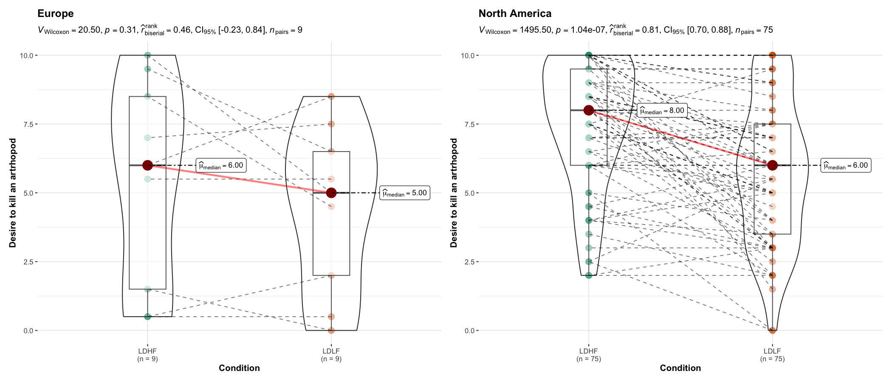
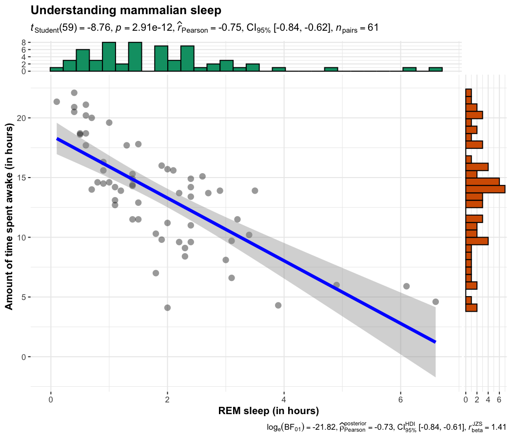
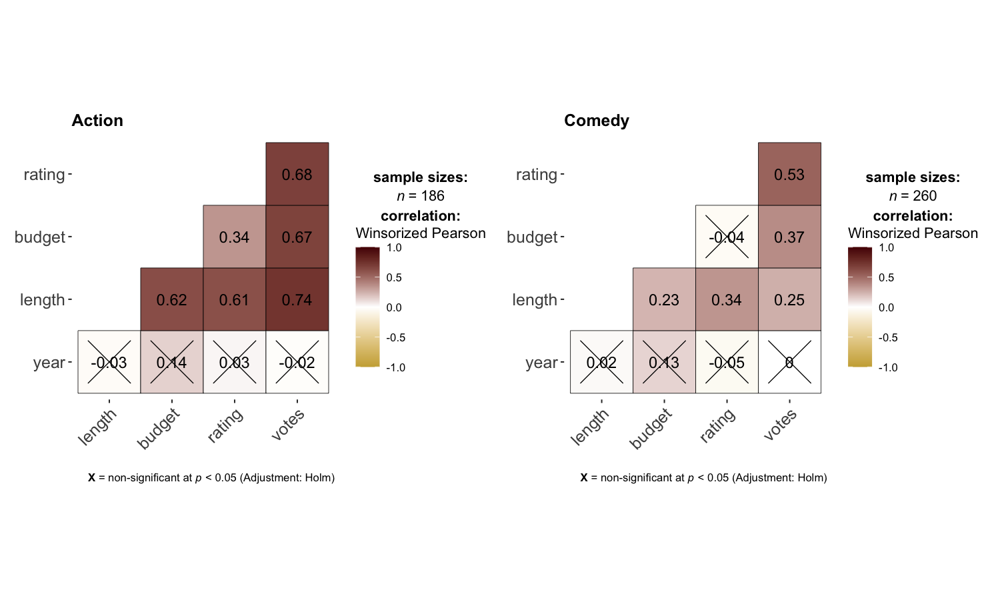
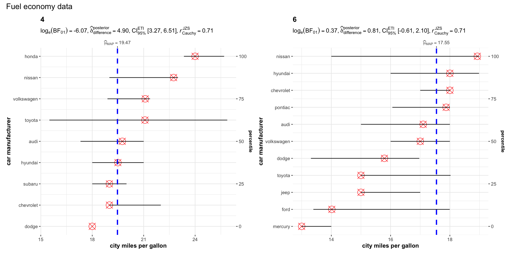

<!-- README.md is generated from README.Rmd. Please edit that file -->

# `ggstatsplot`: `ggplot2` Based Plots with Statistical Details

| Package                                                                                                                                                         | Status                                                                                                                                                                                       | Usage                                                                                                                                             | GitHub                                                                                                                                                         | References                                                                                                                                                      |
|-----------------------------------------------------------------------------------------------------------------------------------------------------------------|----------------------------------------------------------------------------------------------------------------------------------------------------------------------------------------------|---------------------------------------------------------------------------------------------------------------------------------------------------|----------------------------------------------------------------------------------------------------------------------------------------------------------------|-----------------------------------------------------------------------------------------------------------------------------------------------------------------|
| [](https://CRAN.R-project.org/package=ggstatsplot)                                 | [](https://travis-ci.org/IndrajeetPatil/ggstatsplot)                                               | [](https://CRAN.R-project.org/package=ggstatsplot)     | [](https://github.com/IndrajeetPatil/ggstatsplot/)               | [](https://indrajeetpatil.github.io/ggstatsplot/)                          |
| [](https://cran.r-project.org/web/checks/check_results_ggstatsplot.html)                      | [](https://ci.appveyor.com/project/IndrajeetPatil/ggstatsplot) | [](https://CRAN.R-project.org/package=ggstatsplot)   | [](https://github.com/IndrajeetPatil/ggstatsplot/)                                                    | [](https://indrajeetpatil.github.io/ggstatsplot/reference/index.html)    |
| [](https://cran.r-project.org/)                                                      | [](https://www.tidyverse.org/lifecycle/)                                                                               | [](https://CRAN.R-project.org/package=ggstatsplot) | [](https://github.com/IndrajeetPatil/ggstatsplot/issues)                                       | [](https://CRAN.R-project.org/package=ggstatsplot/vignettes/)                |
| [](https://github.com/IndrajeetPatil/ggstatsplot) | [](https://coveralls.io/github/IndrajeetPatil/ggstatsplot?branch=master)             | [](https://CRAN.R-project.org/package=ggstatsplot)  | [](https://github.com/IndrajeetPatil/ggstatsplot) | [](https://doi.org/10.5281/zenodo.2074621)                                                       |
| [](https://www.gnu.org/licenses/gpl-3.0.en.html)                                                | [](https://codecov.io/gh/IndrajeetPatil/ggstatsplot?branch=master)                   | [](https://hits.dwyl.com/IndrajeetPatil/ggstatsplot)                             | [](https://github.com/IndrajeetPatil/ggstatsplot/commits/master)    | [](https://github.com/IndrajeetPatil/ggstatsplot/commits/master) |
| [](https://CRAN.R-project.org/package=ggstatsplot)                                                    | [](https://github.com/IndrajeetPatil/ggstatsplot)                                            | [](https://gitter.im/ggstatsplot/community)                                           | [](https://www.repostatus.org/#active)                                                   | [](https://github.com/IndrajeetPatil/ggstatsplot/issues) |

# Raison d’être 

> “What is to be sought in designs for the display of information is the
> clear portrayal of complexity. Not the complication of the simple;
> rather … the revelation of the complex.”  
> - Edward R. Tufte

[`ggstatsplot`](https://indrajeetpatil.github.io/ggstatsplot/) is an
extension of [`ggplot2`](https://github.com/tidyverse/ggplot2) package
for creating graphics with details from statistical tests included in
the information-rich plots themselves. In a typical exploratory data
analysis workflow, data visualization and statistical modeling are two
different phases: visualization informs modeling, and modeling in its
turn can suggest a different visualization method, and so on and so
forth. The central idea of `ggstatsplot` is simple: combine these two
phases into one in the form of graphics with statistical details, which
makes data exploration simpler and faster.

# Summary of available plots

It, therefore, produces a limited kinds of plots for the supported
analyses:

| Function         | Plot                      | Description                                     |
|------------------|---------------------------|-------------------------------------------------|
| `ggbetweenstats` | **violin plots**          | for comparisons *between* groups/conditions     |
| `ggwithinstats`  | **violin plots**          | for comparisons *within* groups/conditions      |
| `gghistostats`   | **histograms**            | for distribution about numeric variable         |
| `ggdotplotstats` | **dot plots/charts**      | for distribution about labeled numeric variable |
| `ggpiestats`     | **pie charts**            | for categorical data                            |
| `ggbarstats`     | **bar charts**            | for categorical data                            |
| `ggscatterstats` | **scatterplots**          | for correlations between two variables          |
| `ggcorrmat`      | **correlation matrices**  | for correlations between multiple variables     |
| `ggcoefstats`    | **dot-and-whisker plots** | for regression models and meta-analysis         |

In addition to these basic plots, `ggstatsplot` also provides
**`grouped_`** versions (see below) that makes it easy to repeat the
same analysis for any grouping variable.

# Summary of types of statistical analyses

Currently, it supports only the most common types of statistical tests:
**parametric**, **nonparametric**, **robust**, and **bayesian** versions
of **t-test**/**anova**, **correlation** analyses, **contingency table**
analysis, **meta-analysis**, and **regression** analyses.

The table below summarizes all the different types of analyses currently
supported in this package-

| Functions                        | Description                                       | Parametric                     | Non-parametric                 | Robust                         | Bayes Factor                   |
|----------------------------------|---------------------------------------------------|--------------------------------|--------------------------------|--------------------------------|--------------------------------|
| `ggbetweenstats`                 | Between group/condition comparisons               | <font color="green">Yes</font> | <font color="green">Yes</font> | <font color="green">Yes</font> | <font color="green">Yes</font> |
| `ggwithinstats`                  | Within group/condition comparisons                | <font color="green">Yes</font> | <font color="green">Yes</font> | <font color="green">Yes</font> | <font color="green">Yes</font> |
| `gghistostats`, `ggdotplotstats` | Distribution of a numeric variable                | <font color="green">Yes</font> | <font color="green">Yes</font> | <font color="green">Yes</font> | <font color="green">Yes</font> |
| `ggcorrmat`                      | Correlation matrix                                | <font color="green">Yes</font> | <font color="green">Yes</font> | <font color="green">Yes</font> | <font color="green">Yes</font> |
| `ggscatterstats`                 | Correlation between two variables                 | <font color="green">Yes</font> | <font color="green">Yes</font> | <font color="green">Yes</font> | <font color="green">Yes</font> |
| `ggpiestats`, `ggbarstats`       | Association between categorical variables         | <font color="green">Yes</font> | `NA`                           | `NA`                           | <font color="green">Yes</font> |
| `ggpiestats`, `ggbarstats`       | Equal proportions for categorical variable levels | <font color="green">Yes</font> | `NA`                           | `NA`                           | <font color="green">Yes</font> |
| `ggcoefstats`                    | Regression model coefficients                     | <font color="green">Yes</font> | <font color="green">Yes</font> | <font color="green">Yes</font> | <font color="green">Yes</font> |
| `ggcoefstats`                    | Random-effects meta-analysis                      | <font color="green">Yes</font> | `NA`                           | <font color="green">Yes</font> | <font color="green">Yes</font> |

Summary of Bayesian analysis

| Analysis                        | Hypothesis testing             | Estimation                     |
|---------------------------------|--------------------------------|--------------------------------|
| (one/two-sample) t-test         | <font color="green">Yes</font> | <font color="green">Yes</font> |
| one-way ANOVA                   | <font color="green">Yes</font> | <font color="green">Yes</font> |
| correlation                     | <font color="green">Yes</font> | <font color="green">Yes</font> |
| (one/two-way) contingency table | <font color="green">Yes</font> | <font color="green">Yes</font> |
| random-effects meta-analysis    | <font color="green">Yes</font> | <font color="green">Yes</font> |

# Statistical reporting

For **all** statistical tests reported in the plots, the default
template abides by the [APA](https://my.ilstu.edu/~jhkahn/apastats.html)
gold standard for statistical reporting. For example, here are results
from Yuen’s test for trimmed means (robust *t*-test):


# Summary of statistical tests and effect sizes

Here is a summary table of all the statistical tests currently supported
across various functions:
<https://indrajeetpatil.github.io/statsExpressions/articles/stats_details.html>

# Installation

To get the latest, stable `CRAN` release:

``` r
install.packages("ggstatsplot")
```

*Note*:

Linux users may encounter some installation problems, as several R
packages require external libraries on the system, especially for
`PMCMRplus` package. The following `README` file briefly describes the
installation procedure:
<https://CRAN.R-project.org/package=PMCMRplus/readme/README.html>

You can get the **development** version of the package from `GitHub`.

If you are in hurry and want to reduce the time of installation, prefer-

``` r
# needed package to download from GitHub repo
install.packages("remotes")

# downloading the package from GitHub (needs `remotes` package to be installed)
remotes::install_github(
  repo = "IndrajeetPatil/ggstatsplot", # package path on GitHub
  dependencies = FALSE, # assumes you have already installed needed packages
  quick = TRUE # skips docs, demos, and vignettes
)
```

If time is not a constraint-

``` r
remotes::install_github(
  repo = "IndrajeetPatil/ggstatsplot", # package path on GitHub
  dependencies = TRUE, # installs packages which ggstatsplot depends on
  upgrade_dependencies = TRUE # updates any out of date dependencies
)
```

To see what new changes (and bug fixes) have been made to the package
since the last release on `CRAN`, you can check the detailed log of
changes here:
<https://indrajeetpatil.github.io/ggstatsplot/news/index.html>

# Citation

If you want to cite this package in a scientific journal or in any other
context, run the following code in your `R` console:

``` r
citation("ggstatsplot")
#> 
#>   Patil, I. (2018). ggstatsplot: 'ggplot2' Based Plots with Statistical
#>   Details. CRAN. Retrieved from
#>   https://cran.r-project.org/web/packages/ggstatsplot/index.html
#> 
#> A BibTeX entry for LaTeX users is
#> 
#>   @Article{,
#>     title = {{ggstatsplot}: 'ggplot2' Based Plots with Statistical Details},
#>     author = {Indrajeet Patil},
#>     year = {2018},
#>     journal = {CRAN},
#>     url = {https://CRAN.R-project.org/package=ggstatsplot},
#>     doi = {10.5281/zenodo.2074621},
#>   }
```

There is currently a publication in preparation corresponding to this
package and the citation will be updated once it’s published.

# Documentation and Examples

To see the detailed documentation for each function in the stable
**CRAN** version of the package, see:

-   Website: <https://indrajeetpatil.github.io/ggstatsplot/>

-   README:
    <https://CRAN.R-project.org/package=ggstatsplot/readme/README.html>

-   Presentation:
    <https://indrajeetpatil.github.io/ggstatsplot_slides/slides/ggstatsplot_presentation.html#1>

-   Vignettes:
    <https://CRAN.R-project.org/package=ggstatsplot/vignettes/additional.html>

To see the documentation relevant for the **development** version of the
package, see the dedicated website for `ggstatplot`, which is updated
after every new commit: <https://indrajeetpatil.github.io/ggstatsplot/>.

# Primary functions

Here are examples of the main functions currently supported in
`ggstatsplot`.

**Note**: If you are reading this on `GitHub` repository, the
documentation below is for the **development** version of the package.
So you may see some features available here that are not currently
present in the stable version of this package on **CRAN**. For
documentation relevant for the `CRAN` version, see:
<https://CRAN.R-project.org/package=ggstatsplot/readme/README.html>

## `ggbetweenstats`

This function creates either a violin plot, a box plot, or a mix of two
for **between**-group or **between**-condition comparisons with results
from statistical tests in the subtitle. The simplest function call looks
like this-

``` r
# for reproducibility
set.seed(123)
library(ggstatsplot)

# plot
ggstatsplot::ggbetweenstats(
  data = iris,
  x = Species,
  y = Sepal.Length,
  title = "Distribution of sepal length across Iris species"
)
```


Note that this function returns object of class `ggplot` and thus can be
further modified using `ggplot2` functions.

A number of other arguments can be specified to make this plot even more
informative or change some of the default options. Additionally, this
time we will use a grouping variable that has only two levels. The
function will automatically switch from carrying out an ANOVA analysis
to a *t*-test.

The `type` (of test) argument also accepts the following abbreviations:
`"p"` (for *parametric*) or `"np"` (for *nonparametric*) or `"r"` (for
*robust*) or `"bf"` (for *Bayes Factor*). Additionally, the type of plot
to be displayed can also be modified (`"box"`, `"violin"`, or
`"boxviolin"`).

A number of other arguments can be specified to make this plot even more
informative or change some of the default options.

``` r
# for reproducibility
set.seed(123)
library(ggplot2)

# plot
ggstatsplot::ggbetweenstats(
  data = ToothGrowth,
  x = supp,
  y = len,
  mean.ci = TRUE, # whether to display confidence interval for means
  k = 3, # number of decimal places for statistical results
  outlier.tagging = TRUE, # whether outliers need to be tagged
  outlier.label = dose, # variable to be used for tagging outliers
  xlab = "Supplement type", # label for the x-axis variable
  ylab = "Tooth length", # label for the y-axis variable
  title = "The Effect of Vitamin C on Tooth Growth", # title text for the plot
  ggtheme = ggthemes::theme_fivethirtyeight(), # choosing a different theme
  ggstatsplot.layer = FALSE, # turn off `ggstatsplot` theme layer
  package = "wesanderson", # package from which color palette is to be taken
  palette = "Darjeeling1" # choosing a different color palette
)
```


Additionally, there is also a `grouped_` variant of this function that
makes it easy to repeat the same operation across a **single** grouping
variable:

``` r
# for reproducibility
set.seed(123)

# plot
ggstatsplot::grouped_ggbetweenstats(
  data = dplyr::filter(
    .data = ggstatsplot::movies_long,
    genre %in% c("Action", "Action Comedy", "Action Drama", "Comedy")
  ),
  x = mpaa,
  y = length,
  grouping.var = genre, # grouping variable
  ggsignif.args = list(textsize = 4, tip_length = 0.01),
  p.adjust.method = "bonferroni", # method for adjusting p-values for multiple comparisons
  # adding new components to `ggstatsplot` default
  ggplot.component = list(ggplot2::scale_y_continuous(sec.axis = ggplot2::dup_axis())),
  k = 3,
  title.prefix = "Movie genre",
  caption = substitute(paste(italic("Source"), ": IMDb (Internet Movie Database)")),
  palette = "default_jama",
  package = "ggsci",
  plotgrid.args = list(nrow = 2),
  title.text = "Differences in movie length by mpaa ratings for different genres"
)
```


### Summary of tests

Following (between-subjects) tests are carried out for each type of
analyses-

| Type           | No. of groups | Test                                            | Function               |
|----------------|---------------|-------------------------------------------------|------------------------|
| Parametric     | &gt; 2        | Fisher’s or Welch’s one-way ANOVA               | `stats::oneway.test`   |
| Non-parametric | &gt; 2        | Kruskal–Wallis one-way ANOVA                    | `stats::kruskal.test`  |
| Robust         | &gt; 2        | Heteroscedastic one-way ANOVA for trimmed means | `WRS2::t1way`          |
| Bayes Factor   | &gt; 2        | Fisher’s ANOVA                                  | `BayesFactor::anovaBF` |
| Parametric     | 2             | Student’s or Welch’s *t*-test                   | `stats::t.test`        |
| Non-parametric | 2             | Mann–Whitney *U* test                           | `stats::wilcox.test`   |
| Robust         | 2             | Yuen’s test for trimmed means                   | `WRS2::yuen`           |
| Bayes Factor   | 2             | Student’s *t*-test                              | `BayesFactor::ttestBF` |

Following effect sizes (and confidence intervals/CI) are available for
each type of test-

| Type           | No. of groups | Effect size                                                                                                                                                                                            | CI?                           | Function                                               |
|----------------|---------------|--------------------------------------------------------------------------------------------------------------------------------------------------------------------------------------------------------|-------------------------------|--------------------------------------------------------|
| Parametric     | &gt; 2        | ,  | <font color="green">Yes<font> | `effectsize::omega_squared`, `effectsize::eta_squared` |
| Non-parametric | &gt; 2        |  (*H*-statistic based eta-squared)                                                                      | <font color="green">Yes<font> | `rcompanion::epsilonSquared`                           |
| Robust         | &gt; 2        |  (Explanatory measure of effect size)                                                                                               | <font color="green">Yes<font> | `WRS2::t1way`                                          |
| Bayes Factor   | &gt; 2        |                                                                                             | <font color="green">Yes<font> | `performance::r2_bayes`                                |
| Parametric     | 2             | Cohen’s *d*, Hedge’s *g*                                                                                                                                                                               | <font color="green">Yes<font> | `effectsize::cohens_d`, `effectsize::hedges_g`         |
| Non-parametric | 2             | *r* (computed as )                                                                                       | <font color="green">Yes<font> | `rcompanion::wilcoxonR`                                |
| Robust         | 2             |  (Explanatory measure of effect size)                                                                                               | <font color="green">Yes<font> | `WRS2::yuen.effect.ci`                                 |
| Bayes Factor   | 2             |                                                                                   | <font color="green">Yes<font> | `bayestestR::describe_posterior`                       |

Here is a summary of *multiple pairwise comparison* tests supported in
*ggbetweenstats*-

| Type           | Equal variance? | Test                      | *p*-value adjustment?          | Function                        |
|----------------|-----------------|---------------------------|--------------------------------|---------------------------------|
| Parametric     | No              | Games-Howell test         | <font color="green">Yes</font> | `stats::pairwise.t.test`        |
| Parametric     | Yes             | Student’s *t*-test        | <font color="green">Yes</font> | `PMCMRplus::gamesHowellTest`    |
| Non-parametric | No              | Dunn test                 | <font color="green">Yes</font> | `PMCMRplus::kwAllPairsDunnTest` |
| Robust         | No              | Yuen’s trimmed means test | <font color="green">Yes</font> | `WRS2::lincon`                  |
| Bayes Factor   | `NA`            | Student’s *t*-test        | `NA`                           | `BayesFactor::ttestBF`          |

For more, see the `ggbetweenstats` vignette:
<https://indrajeetpatil.github.io/ggstatsplot/articles/web_only/ggbetweenstats.html>

## `ggwithinstats`

`ggbetweenstats` function has an identical twin function `ggwithinstats`
for repeated measures designs that behaves in the same fashion with a
few minor tweaks introduced to properly visualize the repeated measures
design. As can be seen from an example below, the only difference
between the plot structure is that now the group means are connected by
paths to highlight the fact that these data are paired with each other.

``` r
# for reproducibility and data
set.seed(123)
library(WRS2)

# plot
ggstatsplot::ggwithinstats(
  data = WineTasting,
  x = Wine,
  y = Taste,
  title = "Wine tasting",
  caption = "Data source: `WRS2` R package",
  ggtheme = ggthemes::theme_fivethirtyeight(),
  ggstatsplot.layer = FALSE
)
```


As with the `ggbetweenstats`, this function also has a `grouped_`
variant that makes repeating the same analysis across a single grouping
variable quicker. We will see an example with only repeated
measurements-

``` r
# common setup
set.seed(123)

# plot
ggstatsplot::grouped_ggwithinstats(
  data = dplyr::filter(
    .data = ggstatsplot::bugs_long,
    region %in% c("Europe", "North America"),
    condition %in% c("LDLF", "LDHF")
  ),
  x = condition,
  y = desire,
  xlab = "Condition",
  ylab = "Desire to kill an artrhopod",
  grouping.var = region,
  outlier.tagging = TRUE,
  outlier.label = education,
  ggtheme = hrbrthemes::theme_ipsum_tw(),
  ggstatsplot.layer = FALSE
)
```



### Summary of tests

Following (within-subjects) tests are carried out for each type of
analyses-

| Type           | No. of groups | Test                                                              |
|----------------|---------------|-------------------------------------------------------------------|
| Parametric     | &gt; 2        | One-way repeated measures ANOVA                                   |
| Non-parametric | &gt; 2        | Friedman rank sum test                                            |
| Robust         | &gt; 2        | Heteroscedastic one-way repeated measures ANOVA for trimmed means |
| Bayes Factor   | &gt; 2        | One-way repeated measures ANOVA                                   |
| Parametric     | 2             | Student’s *t*-test                                                |
| Non-parametric | 2             | Wilcoxon signed-rank test                                         |
| Robust         | 2             | Yuen’s test on trimmed means for dependent samples                |
| Bayes Factor   | 2             | Student’s *t*-test                                                |

Following effect sizes (and confidence intervals/CI) are available for
each type of test-

| Type           | No. of groups | Effect size                                                                                                                                                                                            | CI?                           | Function                                               |
|----------------|---------------|--------------------------------------------------------------------------------------------------------------------------------------------------------------------------------------------------------|-------------------------------|--------------------------------------------------------|
| Parametric     | &gt; 2        | ,  | <font color="green">Yes<font> | `effectsize::omega_squared`, `effectsize::eta_squared` |
| Non-parametric | &gt; 2        |  (Kendall’s coefficient of concordance)                                                                   | <font color="green">Yes<font> | `rcompanion::kendallW`                                 |
| Robust         | &gt; 2        | <font color="red">No<font>                                                                                                                                                                             | <font color="red">No<font>    | `NA`                                                   |
| Bayes Factor   | &gt; 2        |                                                                                             | <font color="green">Yes<font> | `performance::r2_bayes`                                |
| Parametric     | 2             | Cohen’s *d*, Hedge’s *g*                                                                                                                                                                               | <font color="green">Yes<font> | `effectsize::cohens_d`, `effectsize::hedges_g`         |
| Non-parametric | 2             | *r* (computed as )                                                                                       | <font color="green">Yes<font> | `rcompanion::wilcoxonR`                                |
| Robust         | 2             |  (robust standardized difference)                                                                         | <font color="green">Yes<font> | `WRS2::dep.effect`                                     |
| Bayes Factor   | 2             |                                                                                   | <font color="green">Yes<font> | `bayestestR::describe_posterior`                       |

Here is a summary of *multiple pairwise comparison* tests supported in
*ggwithinstats*-

| Type           | Test                      | *p*-value adjustment?          | Function                        |
|----------------|---------------------------|--------------------------------|---------------------------------|
| Parametric     | Student’s *t*-test        | <font color="green">Yes</font> | `stats::pairwise.t.test`        |
| Non-parametric | Durbin-Conover test       | <font color="green">Yes</font> | `PMCMRplus::durbinAllPairsTest` |
| Robust         | Yuen’s trimmed means test | <font color="green">Yes</font> | `WRS2::rmmcp`                   |
| Bayes Factor   | Student’s *t*-test        | `NA`                           | `BayesFactor::ttestBF`          |

For more, see the `ggwithinstats` vignette:
<https://indrajeetpatil.github.io/ggstatsplot/articles/web_only/ggwithinstats.html>

## `ggscatterstats`

This function creates a scatterplot with marginal distributions overlaid
on the axes (from `ggExtra::ggMarginal`) and results from statistical
tests in the subtitle:

``` r
ggstatsplot::ggscatterstats(
  data = ggplot2::msleep,
  x = sleep_rem,
  y = awake,
  xlab = "REM sleep (in hours)",
  ylab = "Amount of time spent awake (in hours)",
  title = "Understanding mammalian sleep"
)
```



The available marginal distributions are-

-   histograms
-   boxplots
-   density
-   violin
-   densigram (density + histogram)

Number of other arguments can be specified to modify this basic plot-

``` r
# for reproducibility
set.seed(123)

# plot
ggstatsplot::ggscatterstats(
  data = dplyr::filter(.data = ggstatsplot::movies_long, genre == "Action"),
  x = budget,
  y = rating,
  type = "robust", # type of test that needs to be run
  xlab = "Movie budget (in million/ US$)", # label for x axis
  ylab = "IMDB rating", # label for y axis
  label.var = "title", # variable for labeling data points
  label.expression = "rating < 5 & budget > 100", # expression that decides which points to label
  title = "Movie budget and IMDB rating (action)", # title text for the plot
  caption = expression(paste(italic("Note"), ": IMDB stands for Internet Movie DataBase")),
  ggtheme = hrbrthemes::theme_ipsum_ps(), # choosing a different theme
  ggstatsplot.layer = FALSE, # turn off `ggstatsplot` theme layer
  marginal.type = "density", # type of marginal distribution to be displayed
  xfill = "pink", # color fill for x-axis marginal distribution
  yfill = "#009E73" # color fill for y-axis marginal distribution
)
```


Additionally, there is also a `grouped_` variant of this function that
makes it easy to repeat the same operation across a **single** grouping
variable. Also, note that, as opposed to the other functions, this
function does not return a `ggplot` object and any modification you want
to make can be made in advance using `ggplot.component` argument
(available for all functions, but especially useful for this particular
function):

``` r
# for reproducibility
set.seed(123)

# plot
ggstatsplot::grouped_ggscatterstats(
  data = dplyr::filter(
    .data = ggstatsplot::movies_long,
    genre %in% c("Action", "Action Comedy", "Action Drama", "Comedy")
  ),
  x = rating,
  y = length,
  grouping.var = genre, # grouping variable
  label.var = title,
  label.expression = length > 200,
  xlab = "IMDB rating",
  title.prefix = "Movie genre",
  ggtheme = ggplot2::theme_grey(),
  ggplot.component = list(
    ggplot2::scale_x_continuous(breaks = seq(2, 9, 1), limits = (c(2, 9)))
  ),
  plotgrid.args = list(nrow = 2),
  title.text = "Relationship between movie length by IMDB ratings for different genres"
)
```


### Summary of tests

Following tests are carried out for each type of analyses. Additionally,
the correlation coefficients (and their confidence intervals) are used
as effect sizes-

| Type           | Test                                    | CI?                            | Function                   |
|----------------|-----------------------------------------|--------------------------------|----------------------------|
| Parametric     | Pearson’s correlation coefficient       | <font color="green">Yes<font>  | `correlation::correlation` |
| Non-parametric | Spearman’s rank correlation coefficient | <font color="green">Yes<font>  | `correlation::correlation` |
| Robust         | Percentage bend correlation coefficient | <font color="green">Yes<font>  | `correlation::correlation` |
| Bayes Factor   | Pearson’s correlation coefficient       | <font color="green">Yes</font> | `correlation::correlation` |

For more, see the `ggscatterstats` vignette:
<https://indrajeetpatil.github.io/ggstatsplot/articles/web_only/ggscatterstats.html>

## `ggcorrmat`

`ggcorrmat` makes a correlalogram (a matrix of correlation coefficients)
with minimal amount of code. Just sticking to the defaults itself
produces publication-ready correlation matrices. But, for the sake of
exploring the available options, let’s change some of the defaults. For
example, multiple aesthetics-related arguments can be modified to change
the appearance of the correlation matrix.

``` r
# for reproducibility
set.seed(123)

# as a default this function outputs a correlation matrix plot
ggstatsplot::ggcorrmat(
  data = ggplot2::msleep,
  type = "robust", # correlation method
  cor.vars = c(sleep_rem, awake:bodywt), # a range of variables can be selected
  cor.vars.names = c(
    "REM sleep", # variable names
    "time awake",
    "brain weight",
    "body weight"
  ),
  colors = c("#B2182B", "white", "#4D4D4D"),
  title = "Correlalogram for mammals sleep dataset",
  subtitle = "sleep units: hours; weight units: kilograms",
  caption = "Source: `ggplot2` R package"
)
```


Two things to note:

-   If there are `NA`s present in the selected variables, the legend
    will display minimum, median, and maximum number of pairs used for
    correlation tests.

-   If `cor.vars` are not specified, all numeric variables will be used.

There is also a `grouped_` variant of this function that makes it easy
to repeat the same operation across a **single** grouping variable:

``` r
# for reproducibility
set.seed(123)

# plot
ggstatsplot::grouped_ggcorrmat(
  data = dplyr::filter(
    .data = ggstatsplot::movies_long,
    genre %in% c("Action", "Action Comedy", "Action Drama", "Comedy")
  ),
  cor.vars = length:votes,
  colors = c("#cbac43", "white", "#550000"),
  grouping.var = genre, # grouping variable
  matrix.type = "upper", # type of visualization matrix
  k = 3L, # number of digits after decimal point
  title.prefix = "Movie genre",
  plotgrid.args = list(nrow = 2)
)
```



You can also get a dataframe containing all relevant details from the
statistical tests:

``` r
# setup
set.seed(123)

# dataframe in long format
ggcorrmat(
  data = ggplot2::msleep,
  type = "bayes",
  output = "dataframe"
)
#> # A tibble: 15 x 13
#>    parameter1  parameter2     rho ci_low ci_high    pd rope_percentage
#>    <chr>       <chr>        <dbl>  <dbl>   <dbl> <dbl>           <dbl>
#>  1 sleep_total sleep_rem    0.731  0.617  0.810  1              0     
#>  2 sleep_total sleep_cycle -0.432 -0.678 -0.223  0.995          0.0173
#>  3 sleep_total awake       -1.00  -1.00  -1.00   1              0     
#>  4 sleep_total brainwt     -0.339 -0.523 -0.156  0.996          0.028 
#>  5 sleep_total bodywt      -0.300 -0.458 -0.142  0.997          0.0292
#>  6 sleep_rem   sleep_cycle -0.306 -0.535 -0.0555 0.965          0.091 
#>  7 sleep_rem   awake       -0.734 -0.824 -0.638  1              0     
#>  8 sleep_rem   brainwt     -0.202 -0.410  0.0130 0.927          0.212 
#>  9 sleep_rem   bodywt      -0.315 -0.481 -0.120  0.994          0.0362
#> 10 sleep_cycle awake        0.441  0.226  0.662  0.995          0.0158
#> 11 sleep_cycle brainwt      0.823  0.720  0.911  1              0     
#> 12 sleep_cycle bodywt       0.386  0.145  0.610  0.992          0.0392
#> 13 awake       brainwt      0.341  0.154  0.524  0.992          0.0253
#> 14 awake       bodywt       0.299  0.139  0.454  0.998          0.0265
#> 15 brainwt     bodywt       0.926  0.896  0.957  1              0     
#>    prior_distribution prior_location prior_scale        bf method          
#>    <chr>                       <dbl>       <dbl>     <dbl> <chr>           
#>  1 cauchy                          0       0.707  3.00e+ 9 Bayesian Pearson
#>  2 cauchy                          0       0.707  8.85e+ 0 Bayesian Pearson
#>  3 cauchy                          0       0.707 NA        Bayesian Pearson
#>  4 cauchy                          0       0.707  7.29e+ 0 Bayesian Pearson
#>  5 cauchy                          0       0.707  9.28e+ 0 Bayesian Pearson
#>  6 cauchy                          0       0.707  1.42e+ 0 Bayesian Pearson
#>  7 cauchy                          0       0.707  3.01e+ 9 Bayesian Pearson
#>  8 cauchy                          0       0.707  6.54e- 1 Bayesian Pearson
#>  9 cauchy                          0       0.707  4.80e+ 0 Bayesian Pearson
#> 10 cauchy                          0       0.707  8.85e+ 0 Bayesian Pearson
#> 11 cauchy                          0       0.707  3.80e+ 6 Bayesian Pearson
#> 12 cauchy                          0       0.707  3.76e+ 0 Bayesian Pearson
#> 13 cauchy                          0       0.707  7.29e+ 0 Bayesian Pearson
#> 14 cauchy                          0       0.707  9.27e+ 0 Bayesian Pearson
#> 15 cauchy                          0       0.707  1.58e+22 Bayesian Pearson
#>     nobs
#>    <int>
#>  1    61
#>  2    32
#>  3    83
#>  4    56
#>  5    83
#>  6    32
#>  7    61
#>  8    48
#>  9    61
#> 10    32
#> 11    30
#> 12    32
#> 13    56
#> 14    83
#> 15    56
```

### Summary of tests

This is same as `ggscatterstats`.

For examples and more information, see the `ggcorrmat` vignette:
<https://indrajeetpatil.github.io/ggstatsplot/articles/web_only/ggcorrmat.html>

## `ggpiestats`

This function creates a pie chart for categorical or nominal variables
with results from contingency table analysis (Pearson’s chi-squared test
for between-subjects design and McNemar’s chi-squared test for
within-subjects design) included in the subtitle of the plot. If only
one categorical variable is entered, results from one-sample proportion
test (i.e., a chi-squared goodness of fit test) will be displayed as a
subtitle.

To study an interaction between two categorical variables:

``` r
# for reproducibility
set.seed(123)

# plot
ggstatsplot::ggpiestats(
  data = mtcars,
  x = am,
  y = cyl,
  title = "Dataset: Motor Trend Car Road Tests", # title for the plot
  legend.title = "Transmission", # title for the legend
  caption = substitute(paste(italic("Source"), ": 1974 Motor Trend US magazine"))
)
```


In case of repeated measures designs, setting `paired = TRUE` will
produce results from McNemar’s chi-squared test-

``` r
# for reproducibility
set.seed(123)

# plot
ggstatsplot::ggpiestats(
  data = data.frame(
    "before" = c("Approve", "Approve", "Disapprove", "Disapprove"),
    "after" = c("Approve", "Disapprove", "Approve", "Disapprove"),
    counts = c(794, 150, 86, 570),
    check.names = FALSE
  ),
  x = before,
  y = after,
  counts = counts,
  title = "Survey results before and after the intervention",
  label = "both",
  paired = TRUE, # within-subjects design
  package = "wesanderson",
  palette = "Royal1"
)
```


Additionally, there is also a `grouped_` variant of this function that
makes it easy to repeat the same operation across a **single** grouping
variable. Following example is a case where the theoretical question is
about proportions for different levels of a single nominal variable:

``` r
# for reproducibility
set.seed(123)

# plot
ggstatsplot::grouped_ggpiestats(
  data = ggstatsplot::movies_long,
  x = genre,
  grouping.var = mpaa, # grouping variable
  title.prefix = "Movie genre", # prefix for the faceted title
  label.repel = TRUE, # repel labels (helpful for overlapping labels)
  package = "ggsci", # package from which color palette is to be taken
  palette = "default_ucscgb", # choosing a different color palette
  title.text = "Composition of MPAA ratings for different genres"
)
```


### Summary of tests

Following tests are carried out for each type of analyses-

| Type of data | Design                                                                                                         | Test                                                                                                  | Function               |
|--------------|----------------------------------------------------------------------------------------------------------------|-------------------------------------------------------------------------------------------------------|------------------------|
| Unpaired     |  contingency table | Pearson’s  test         | `stats::chisq.test`    |
| Paired       |  contingency table | McNemar’s  test         | `stats::mcnemar.tests` |
| Frequency    |  contingency table | Goodness of fit ( test) | `stats::chisq.test`    |

Following effect sizes (and confidence intervals/CI) are available for
each type of test-

| Test                                                                                          | Effect size                                                         | CI?                           | Function                |
|-----------------------------------------------------------------------------------------------|---------------------------------------------------------------------|-------------------------------|-------------------------|
| Pearson’s  test | Cramer’s  | <font color="green">Yes<font> | `effectsize::cramers_v` |
| McNemar’s test                                                                                | Cohen’s   | <font color="green">Yes<font> | `effectsize::cohens_g`  |
| Goodness of fit                                                                               | Cramer’s  | <font color="green">Yes<font> | `effectsize::cramers_v` |

For more, see the `ggpiestats` vignette:
<https://indrajeetpatil.github.io/ggstatsplot/articles/web_only/ggpiestats.html>

## `ggbarstats`

In case you are not a fan of pie charts (for very good reasons), you can
alternatively use `ggbarstats` function which has a similar syntax-

``` r
# for reproducibility
set.seed(123)
library(ggplot2)

# plot
ggstatsplot::ggbarstats(
  data = ggstatsplot::movies_long,
  x = mpaa,
  y = genre,
  title = "MPAA Ratings by Genre",
  xlab = "movie genre",
  legend.title = "MPAA rating",
  ggtheme = hrbrthemes::theme_ipsum_pub(),
  ggplot.component = list(ggplot2::scale_x_discrete(guide = ggplot2::guide_axis(n.dodge = 2))),
  palette = "Set2"
)
```


And, needless to say, there is also a `grouped_` variant of this
function-

``` r
# setup
set.seed(123)

# smaller dataset
df <-
  dplyr::filter(
    .data = forcats::gss_cat,
    race %in% c("Black", "White"),
    relig %in% c("Protestant", "Catholic", "None"),
    !partyid %in% c("No answer", "Don't know", "Other party")
  )

# plot
ggstatsplot::grouped_ggbarstats(
  data = df,
  x = relig,
  y = partyid,
  grouping.var = race,
  title.prefix = "Race",
  label = "both",
  xlab = "Party affiliation",
  package = "wesanderson",
  palette = "Darjeeling2",
  ggtheme = ggthemes::theme_tufte(base_size = 12),
  ggstatsplot.layer = FALSE,
  title.text = "Race, religion, and political affiliation",
  plotgrid.args = list(nrow = 2)
)
```


### Summary of tests

This is identical to the `ggpiestats` function summary of tests.

## `gghistostats`

To visualize the distribution of a single variable and check if its mean
is significantly different from a specified value with a one-sample
test, `gghistostats` can be used.

``` r
# for reproducibility
set.seed(123)

# plot
ggstatsplot::gghistostats(
  data = iris, # dataframe from which variable is to be taken
  x = Sepal.Length, # numeric variable whose distribution is of interest
  title = "Distribution of Iris sepal length", # title for the plot
  caption = substitute(paste(italic("Source:"), "Ronald Fisher's Iris data set")),
  bar.measure = "both",
  test.value = 5, # default value is 0
  test.value.line = TRUE, # display a vertical line at test value
  centrality.parameter = "mean", # which measure of central tendency is to be plotted
  centrality.line.args = list(color = "darkred"), # aesthetics for central tendency line
  binwidth = 0.10, # binwidth value (experiment)
  ggtheme = hrbrthemes::theme_ipsum_tw(), # choosing a different theme
  ggstatsplot.layer = FALSE # turn off ggstatsplot theme layer
)
```


As can be seen from the plot, Bayes Factor can be attached
(`bf.message = TRUE`) to assess evidence in favor of the null
hypothesis.

Additionally, there is also a `grouped_` variant of this function that
makes it easy to repeat the same operation across a **single** grouping
variable:

``` r
# for reproducibility
set.seed(123)

# plot
ggstatsplot::grouped_gghistostats(
  data = dplyr::filter(
    .data = ggstatsplot::movies_long,
    genre %in% c("Action", "Action Comedy", "Action Drama", "Comedy")
  ),
  x = budget,
  xlab = "Movies budget (in million US$)",
  type = "robust", # use robust location measure
  grouping.var = genre, # grouping variable
  normal.curve = TRUE, # superimpose a normal distribution curve
  normal.curve.args = list(color = "red", size = 1),
  title.prefix = "Movie genre",
  ggtheme = ggthemes::theme_tufte(),
  ggplot.component = list( # modify the defaults from `ggstatsplot` for each plot
    ggplot2::scale_x_continuous(breaks = seq(0, 200, 50), limits = (c(0, 200)))
  ),
  plotgrid.args = list(nrow = 2),
  title.text = "Movies budgets for different genres"
)
```


### Summary of tests

Following tests are carried out for each type of analyses-

| Type           | Test                            | Function               |
|----------------|---------------------------------|------------------------|
| Parametric     | One-sample Student’s *t*-test   | `stats::t.test`        |
| Non-parametric | One-sample Wilcoxon test        | `stats::wilcox.test`   |
| Robust         | One-sample percentile bootstrap | `WRS2::onesampb`       |
| Bayes Factor   | One-sample Student’s *t*-test   | `BayesFactor::ttestBF` |

Following effect sizes (and confidence intervals/CI) are available for
each type of test-

| Type           | Effect size                                                                                                           | CI?                           | Function                                       |
|----------------|-----------------------------------------------------------------------------------------------------------------------|-------------------------------|------------------------------------------------|
| Parametric     | Cohen’s *d*, Hedge’s *g*                                                                                              | <font color="green">Yes<font> | `effectsize::cohens_d`, `effectsize::hedges_g` |
| Non-parametric | *r*                                                                                                                   | <font color="green">Yes<font> | `rcompanion::wilcoxonOneSampleR`               |
| Robust         | robust location measure                                                                                               | <font color="green">Yes<font> | `WRS2::onesampb`                               |
| Bayes Factor   |  | <font color="green">Yes<font> | `bayestestR::describe_posterior`               |

For more, including information about the variant of this function
`grouped_gghistostats`, see the `gghistostats` vignette:
<https://indrajeetpatil.github.io/ggstatsplot/articles/web_only/gghistostats.html>

## `ggdotplotstats`

This function is similar to `gghistostats`, but is intended to be used
when the numeric variable also has a label.

``` r
# for reproducibility
set.seed(123)

# plot
ggdotplotstats(
  data = dplyr::filter(.data = gapminder::gapminder, continent == "Asia"),
  y = country,
  x = lifeExp,
  test.value = 55,
  test.value.line = TRUE,
  centrality.parameter = "median",
  centrality.k = 0,
  title = "Distribution of life expectancy in Asian continent",
  xlab = "Life expectancy",
  caption = substitute(
    paste(
      italic("Source"),
      ": Gapminder dataset from https://www.gapminder.org/"
    )
  )
)
```


As with the rest of the functions in this package, there is also a
`grouped_` variant of this function to facilitate looping the same
operation for all levels of a single grouping variable.

``` r
# for reproducibility
set.seed(123)

# plot
ggstatsplot::grouped_ggdotplotstats(
  data = dplyr::filter(.data = ggplot2::mpg, cyl %in% c("4", "6")),
  x = cty,
  y = manufacturer,
  xlab = "city miles per gallon",
  ylab = "car manufacturer",
  type = "nonparametric", # non-parametric test
  grouping.var = cyl, # grouping variable
  test.value = 15.5,
  test.value.line = TRUE,
  title.prefix = "cylinder count",
  point.args = list(color = "red", size = 5, shape = 13),
  title.text = "Fuel economy data"
)
```



### Summary of tests

This is identical to summary of tests for `gghistostats`.

## `ggcoefstats`

The function `ggstatsplot::ggcoefstats` generates **dot-and-whisker
plots** for regression models saved in a tidy data frame. The tidy
dataframes are prepared using `parameters::model_parameters`.
Additionally, if available, the model summary indices are also extracted
from `performance::model_performance`.

Although the statistical models displayed in the plot may differ based
on the class of models being investigated, there are few aspects of the
plot that will be invariant across models:

-   The dot-whisker plot contains a dot representing the **estimate**
    and their **confidence intervals** (`95%` is the default). The
    estimate can either be effect sizes (for tests that depend on the
    `F` statistic) or regression coefficients (for tests with `t` and
    `z` statistic), etc. The function will, by default, display a
    helpful `x`-axis label that should clear up what estimates are being
    displayed. The confidence intervals can sometimes be asymmetric if
    bootstrapping was used.

-   The caption will always contain diagnostic information, if
    available, about models that can be useful for model selection: The
    smaller the Akaike’s Information Criterion (**AIC**) and the
    Bayesian Information Criterion (**BIC**) values, the “better” the
    model is.

-   The output of this function will be a `ggplot2` object and, thus, it
    can be further modified (e.g., change themes, etc.) with `ggplot2`
    functions.

``` r
# for reproducibility
set.seed(123)

# model
mod <- stats::lm(formula = mpg ~ am * cyl, data = mtcars)

# plot
ggstatsplot::ggcoefstats(mod)
```


This default plot can be further modified to one’s liking with
additional arguments (also, let’s use a different model now):

``` r
# for reproducibility
set.seed(123)

# plot
ggstatsplot::ggcoefstats(
  x = MASS::rlm(formula = mpg ~ am * cyl, data = mtcars),
  point.args = list(color = "red", size = 3, shape = 15),
  vline.args = list(size = 1, color = "#CC79A7", linetype = "dotdash"),
  stats.label.color = c("#0072B2", "#D55E00", "darkgreen"),
  title = "Car performance predicted by transmission & cylinder count",
  subtitle = "Source: 1974 Motor Trend US magazine",
  ggtheme = hrbrthemes::theme_ipsum_ps(),
  ggstatsplot.layer = FALSE
) + # note the order in which the labels are entered
  ggplot2::scale_y_discrete(labels = c("transmission", "cylinders", "interaction")) +
  ggplot2::labs(x = "regression coefficient", y = NULL)
```


### Supported models

Most of the regression models that are supported in the underlying
packages are also supported by `ggcoefstats`. For example-

`aareg`, `anova`, `aov`, `aovlist`, `Arima`, `BFBayesFactor`, `bayesx`,
`bayesGARCH`, `BBmm`, `BBreg`, `bcplm`, `betamfx`, `betaor`,
`bglmerMod`, `bife`, `bigglm`, `biglm`, `blavaan`, `bmlm`, `blmerMod`,
`bracl`, `brglm`, `brglm2`, `brmsfit`, `brmultinom`, `btergm`, `cch`,
`censReg`, `cgam`, `cgamm`, `cglm`, `clm`, `clm2`, `clmm`, `clmm2`,
`coeftest`, `complmrob`, `confusionMatrix`, `coxme`, `coxph`,
`coxph.penal`, `cpglm`, `cpglmm`, `crch`, `crq`, `DirichReg`, `drc`,
`emmGrid`, `epi.2by2`, `ergm`, `feis`, `felm`, `fitdistr`,
`flexsurvreg`, `gam`, `Gam`, `gamlss`, `garch`, `geeglm`, `glmc`,
`glmerMod`, `glmmTMB`, `gls`, `glht`, `glm`, `glmm`, `glmmadmb`,
`glmmPQL`, `glmRob`, `glmrob`, `glmx`, `gmm`, `HLfit`, `hurdle`,
`ivreg`, `iv_robust`, `lavaan`, `lm`, `lm.beta`, `lmerMod`,
`lmerModLmerTest`, `lmodel2`, `lmRob`, `lmrob`, `lm_robust`, `logitmfx`,
`logitor`, `logitsf`, `LORgee`, `lqm`, `lqmm`, `lrm`, `manova`, `maov`,
`margins`, `mcmc`, `mcmc.list`, `MCMCglmm`, `mclogit`, `mmclogit`,
`mediate`, `metafor`, `merMod`, `merModList`, `metaplus`, `mixor`,
`mjoint`, `mle2`, `mlm`, `multinom`, `negbin`, `negbinmfx`, `negbinirr`,
`nlmerMod`, `nlrq`, `nlreg`, `nls`, `orcutt`, `orm`, `plm`,
`poissonmfx`, `poissonirr`, `polr`, `ridgelm`, `rjags`, `rlm`,
`rlmerMod`, `robmixglm`, `rq`, `rqss`, `rrvglm`, `scam`, `semLm`,
`semLme`, `slm`, `speedglm`, `speedlm`, `stanfit`, `stanreg`, `survreg`,
`svyglm`, `svyolr`, `svyglm`, `tobit`, `truncreg`, `vgam`, `vglm`,
`wbgee`, `wblm`, `zeroinfl`, etc.

Although not shown here, this function can also be used to carry out
both frequentist, robust, and Bayesian random-effects meta-analysis.

### Summary of meta-analysis tests

| Type       | Test                                           | Effect size                                                               | 95% CI available?             | Function               |
|------------|------------------------------------------------|---------------------------------------------------------------------------|-------------------------------|------------------------|
| Parametric | Meta-analysis via random-effects models        |  | <font color="green">Yes<font> | `metafor::metafor`     |
| Robust     | Meta-analysis via robust random-effects models |  | <font color="green">Yes<font> | `metaplus::metaplus`   |
| Bayes      | Meta-analysis via robust random-effects models |  | <font color="green">Yes<font> | `metaBMA::meta_random` |

For a more exhaustive account of this function, see the associated
vignette-
<https://indrajeetpatil.github.io/ggstatsplot/articles/web_only/ggcoefstats.html>

## `combine_plots`

The full power of `ggstatsplot` can be leveraged with a functional
programming package like [`purrr`](https://purrr.tidyverse.org/) that
replaces `for` loops with code that is both more succinct and easier to
read and, therefore, `purrr` should be preferrred 😻. (Another old school
option to do this effectively is using the `plyr` package.)

In such cases, `ggstatsplot` contains a helper function `combine_plots`
to combine multiple plots, which can be useful for combining a list of
plots produced with `purrr`. This is a wrapper around
`cowplot::plot_grid` and lets you combine multiple plots and add a
combination of title, caption, and annotation texts with suitable
defaults.

For examples (both with `plyr` and `purrr`), see the associated
vignette-
<https://indrajeetpatil.github.io/ggstatsplot/articles/web_only/combine_plots.html>

## Using `ggstatsplot` statistical details with custom plots

Sometimes you may not like the default plots produced by `ggstatsplot`.
In such cases, you can use other **custom** plots (from `ggplot2` or
other plotting packages) and still use `ggstatsplot` functions to
display results from relevant statistical test.

For example, in the following chunk, we will create plot (*ridgeplot*)
using `ggridges` package and use `ggstatsplot` function for extracting
results.

``` r
# loading the needed libraries
set.seed(123)
library(ggridges)
library(ggplot2)
library(ggstatsplot)

# using `ggstatsplot` to get call with statistical results
stats_results <-
  ggstatsplot::ggbetweenstats(
    data = morley,
    x = Expt,
    y = Speed,
    output = "subtitle"
  )

# using `ggridges` to create plot
ggplot(morley, aes(x = Speed, y = as.factor(Expt), fill = as.factor(Expt))) +
  geom_density_ridges(
    jittered_points = TRUE,
    quantile_lines = TRUE,
    scale = 0.9,
    alpha = 0.7,
    vline_size = 1,
    vline_color = "red",
    point_size = 0.4,
    point_alpha = 1,
    position = position_raincloud(adjust_vlines = TRUE)
  ) + # adding annotations
  labs(
    title = "Michelson-Morley experiments",
    subtitle = stats_results,
    x = "Speed of light",
    y = "Experiment number"
  ) + # remove the legend
  theme(legend.position = "none")
```


# Usage and syntax simplicity

As seen from these examples, `ggstatsplot` relies on non-standard
evaluation (NSE) - implemented via `rlang` - i.e., rather than looking
at the values of arguments (`x`, `y`), it instead looks at their
expressions. Therefore, the syntax is simpler and follows the following
principles-

-   When a given function depends on variables in a dataframe, `data`
    argument must always be specified.

-   The `$` operator cannot be used to specify variables in a dataframe.

-   All functions accept both string (`x = "var1"`) and symbol
    (`x = var1`) arguments.

These set principles combined with the fact that almost all functions
produce publication-ready plots that require very few arguments if one
finds the aesthetic and statistical defaults satisfying make the syntax
much less cognitively demanding and easy to remember/reconstruct.


<br>

Most functions share a `type` (of test) argument that is helpful to
specify the type of statistical analysis:

-   `"p"` (for **parametric**)
-   `"np"` (for **non-parametric**)
-   `"r"` (for **robust**)
-   `"bf"` (for **Bayes Factor**)

All relevant functions in `ggstatsplot` have a `output` argument which
can be used to not only return plots (which is the default), but also to
return a `subtitle` or `caption`, which are objects of type `call` and
can be used to display statistical details in conjunction with a custom
plot and at a custom location in the plot.

Additionally, all functions share the `ggtheme` and `palette` arguments
that can be used to specify your favorite `ggplot` theme and color
palette.

# `ggstatsverse`: Components of `ggstatsplot`

To make the maintenance and development of `ggstatsplot` more
manageable, it is being broken into smaller pieces. Currently, the
package internally relies on the following packages that manage
different aspects of statistical analyses:


## `statsExpressions`

The `statsExpressions` package forms the statistical backend that
processes data and creates expressions containing results from
statistical tests and are by default displayed in as plot **subtitle**.

For more exhaustive documentation for this package, see:
<https://indrajeetpatil.github.io/statsExpressions/>

## `tidyBF`

The `tidyBF` package forms the backend that processes data and creates
expressions containing results from Bayes Factor tests and are by
default displayed in as plot **caption**.

For more exhaustive documentation for this package, see:
<https://indrajeetpatil.github.io/tidyBF/>

## `pairwiseComparisons`

The `pairwiseComparisons` package forms the pairwise comparison backend
for creating results that are used to display *post hoc* multiple
comparisons displayed in `ggbetweenstats` and `ggwithinstats` functions.

For more exhaustive documentation for this package, see:
<https://indrajeetpatil.github.io/pairwiseComparisons/>

## `ipmisc`

The `ipmisc` package contains some of the data wrangling/cleaning
functions and a few other miscellaneous functions.

For more exhaustive documentation for this package, see:
<https://indrajeetpatil.github.io/ipmisc/>

# Extensions

In case you use the GUI software [`jamovi`](https://www.jamovi.org/),
you can install a module called
[`jjstatsplot`](https://github.com/sbalci/jjstatsplot), which is a
wrapper around `ggstatsplot`.

# Acknowledgments

I would like to thank all the contributors to `ggstatsplot` who pointed
out bugs or requested features I hadn’t considered. I would especially
like to thank other package developers (especially Daniel Lüdecke,
Dominique Makowski, Mattan S. Ben-Shachar, Patrick Mair, Salvatore
Mangiafico, etc.) who have patiently and diligently answered my
relentless number of questions and added feature requests I wanted. I
also want to thank Chuck Powell for his initial contributions to the
package.

The hexsticker was generously designed by Sarah Otterstetter (Max Planck
Institute for Human Development, Berlin). This package has also
benefited from the larger `rstats` community on Twitter and
StackOverflow.

Thanks are also due to my postdoc advisers (Mina Cikara and Fiery
Cushman at Harvard University; Iyad Rahwan at Max Planck Institute for
Human Development) who patiently supported me spending hundreds of hours
working on this package rather than what I was paid to do. 😄

# Code coverage

As the code stands right now, here is the code coverage for all primary
functions involved:
<https://codecov.io/gh/IndrajeetPatil/ggstatsplot/tree/master/R>

# Contributing

I’m happy to receive bug reports, suggestions, questions, and (most of
all) contributions to fix problems and add features. I personally prefer
using the `GitHub` issues system over trying to reach out to me in other
ways (personal e-mail, Twitter, etc.). Pull Requests for contributions
are encouraged.

Here are some simple ways in which you can contribute (in the increasing
order of commitment):

-   Read and correct any inconsistencies in the
    [documentation](https://indrajeetpatil.github.io/ggstatsplot/)

-   Raise issues about bugs or wanted features

-   Review code

-   Add new functionality (in the form of new plotting functions or
    helpers for preparing subtitles)

Please note that this project is released with a [Contributor Code of
Conduct](https://github.com/IndrajeetPatil/ggstatsplot/blob/master/CODE_OF_CONDUCT.md).
By participating in this project you agree to abide by its terms.

# Session Information

For reproducibility purposes, the details about the session information
in which this document was rendered, see-
<https://indrajeetpatil.github.io/ggstatsplot/articles/web_only/session_info.html>
