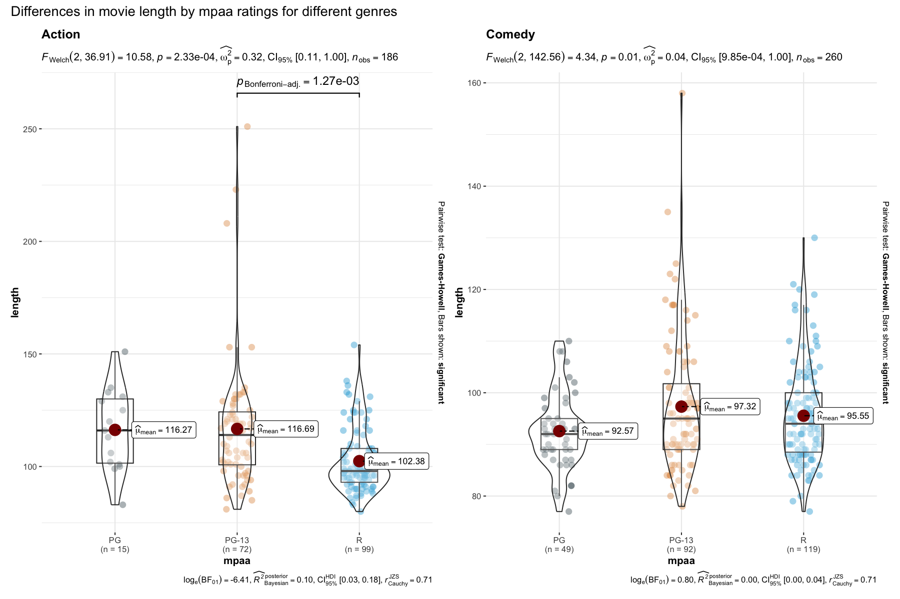
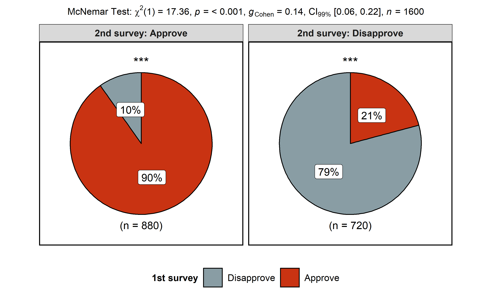

<!-- README.md is generated from README.Rmd. Please edit that file -->

# ggstatsplot: `ggplot2` Based Plots with Statistical Details

[](commits/master)
[](https://travis-ci.org/IndrajeetPatil/ggstatsplot)
[](https://ci.appveyor.com/project/IndrajeetPatil/ggstatsplot)
[](https://codecov.io/github/IndrajeetPatil/ggstatsplot?branch=master)
[](https://www.gnu.org/licenses/gpl-3.0.en.html)
[](http://www.repostatus.org/#active)
[](/commits/master)
[](https://www.tidyverse.org/lifecycle/#experimental)
[](https://cran.r-project.org/)
[](https://github.com/IndrajeetPatil/ggstatsplot/pulls)
[](https://github.com/IndrajeetPatil/ggstatsplot/issues)

## Overview

ggstatsplot is an extension of `ggplot2` package for creating graphics
with details from statistical tests included in the plots themselves and
targeted primarily at behavioral sciences community to provide a
one-line code to produce information-rich figures. Currently, it
supports only the most common types of tests used in analysis
(**parametric**, **nonparametric**, and **robust** versions of
**t-tets/anova**, **correlation**, and **contingency tables** analyses).
Future versions will include other types of analyses as well.

## Installation

``` r
# You can get the development version from GitHub:
# install.packages("devtools")
devtools::install_github("IndrajeetPatil/ggstatsplot")
```

## Usage

Here are examples of the three main functions currently supported in
`ggstatsplot`:

  - `ggbetweenstats`

This function creates a violin plot for **between**-group or
**between**-condition comparisons with results from statistical tests in
the subtitle:

``` r
ggstatsplot::ggbetweenstats(data = iris, 
                            x = Species, 
                            y = Sepal.Length)
#> Reference:  Welch's ANOVA is used as a default. (Delacre, Leys, Mora, & Lakens, PsyArXiv, 2018).Note:  Bartlett's test for homogeneity of variances: p-value =  < 0.001
```

<!-- -->

Number of other arguments can be specified to make this plot even more
informative and, additionally, this function returns a `ggplot2` object
and thus any of the graphics layers can be further modified:

``` r
library(ggplot2)

ggstatsplot::ggbetweenstats(
  data = iris,
  x = Species,
  y = Sepal.Length,
  mean.plotting = TRUE,                           # whether mean for each group id to be displayed 
  type = "robust",                                # which type of test is to be run
  outlier.tagging = TRUE,                         # whether outliers need to be tagged
  outlier.label = Sepal.Width,                    # variable to be used for the outlier tag
  xlab = "Type of Species",                       # label for the x-axis variable
  ylab = "Attribute: Sepal Length",               # label for the y-axis variable
  title = "Dataset: Iris flower data set",        # title text for the plot
  caption = expression(                           # caption text for the plot 
    paste(italic("Note"), ": this is a demo")
    )
  ) +                                             # further modifcation outside of ggstatsplot
  ggplot2::coord_cartesian(ylim = c(3, 8)) + 
  ggplot2::scale_y_continuous(breaks = seq(3, 8, by = 1)) 
#> Note:  Bartlett's test for homogeneity of variances: p-value =  < 0.001
```

<!-- -->

Variant of this function `ggwithinstats` is currently under work.

  - `ggscatterstats`

This function creates a scatterplot with marginal
histograms/boxplots/density/violin plots from `ggExtra::ggMarginal()`
and results from statistical tests in subtitle:

``` r
ggstatsplot::ggscatterstats(data = iris, 
                            x = Sepal.Length, 
                            y = Petal.Length,
                            title = "Dataset: Iris flower data set")
#> Warning: This function doesn't return ggplot2 object. Thus, this plot is not further modifiable with ggplot2 commands.
```

<!-- -->

Number of other arguments can be specified to modify this basic plot-

``` r
library(datasets)

ggstatsplot::ggscatterstats(
  data = subset(iris, iris$Species == "setosa"),
  x = Sepal.Length,
  y = Petal.Length,
  test = "robust",                               # type of test that needs to be run
  xlab = "Attribute: Sepal Length",              # label for x axis
  ylab = "Attribute: Petal Length",              # label for y axis 
  title = "Dataset: Iris flower data set",       # title text for the plot
  caption = expression(                          # caption text for the plot
    paste(italic("Note"), ": this is a demo")
    ),
  marginal.type = "density",                     # type of marginal distribution to be displayed
  xfill = "blue",                                # colour fill for x-axis marginal distribution 
  yfill = "red",                                 # colour fill for y-axis marginal distribution
  intercept = "median",                          # which type of intercept line is to be displayed  
  width.jitter = 0.2,                            # amount of horizontal jitter for data points
  height.jitter = 0.4                            # amount of vertical jitter for data points
  ) 
#> Note: Robust regression using an M estimator: no. of iterations = 1000 In case of non-convergence, increase maxit value.Note: The estimate is standardized.Warning: This function doesn't return ggplot2 object. Thus, this plot is not further modifiable with ggplot2 commands.
```

<!-- -->

**Important**: In contrast to all other functions in this package, the
`ggscatterstats` function returns object that is **not** further
modifiable with `ggplot2`. This can be avoided by not plotting the
marginal distributions (`marginal = FALSE`). Currently trying to find a
workaround this problem.

  - `ggpiestats`

This function creates a pie chart for categorical variables with results
from contingency table analysis included in the subtitle of the plot. If
only one categorical variable is entered, proportion test will be
carried out.

``` r
ggstatsplot::ggpiestats(data = iris,
                        main = Species)
```

<!-- -->

This function can also be used to study an interaction between two
categorical variables. Additionally, as with the other functions in
`ggstatsplot`, this function returns a `ggplot2` object and can further
be modified with `ggplot2` syntax (e.g., we can change the color palette
*after* `ggstatsplot` has produced the plot)-

``` r
library(ggplot2)

ggstatsplot::ggpiestats(data = mtcars,
                        main = am,                
                        condition = cyl) +
  ggplot2::scale_fill_brewer(palette = "Dark2")   # further modifcation outside of ggstatsplot    
```

<!-- -->

As with the other functions, this basic plot can further be modified
with additional arguments:

``` r
library(ggplot2)

ggstatsplot::ggpiestats(
  data = mtcars,
  main = am,
  condition = cyl,
  title = "Dataset: Motor Trend Car Road Tests",      # title for the plot
  stat.title = "interaction effect",                  # title for the results from Pearson's chi-squared test
  legend.title = "Transmission",                      # title for the legend
  factor.levels = c("0 = automatic", "1 = manual"),   # renaming the factor level names for main variable 
  facet.wrap.name = "No. of cylinders",               # name for the facetting variable
  caption = expression(                               # text for the caption
    paste(italic("Note"), ": this is a demo")
    )
) 
```

<!-- -->

  - `gghistostats`

In case you would like to see the distribution of one variable and check
if it is significantly different from a specified value with a one
sample test, this function will let you do that.

``` r
library(datasets)
library(viridis)

ggstatsplot::gghistostats(
data = iris,
x = Sepal.Length,
title = "Distribution of Iris sepal length",
type = "parametric",            # one sample t-test
test.value = 3,                 # default value is 0
centrality.plot = TRUE,         # whether a measure of central tendency is to be plotted
centrality.para = "mean",       # which measure of central tendency is to be plotted
normality.plot = TRUE,          # whether normal distribution is to be overlayed on a histogram
binwidth.adjust = TRUE,         # whether binwidth needs to be adjusted
binwidth = 0.10) +              # binwidth value (needs to be toyed around with until you find the best one)
viridis::scale_fill_viridis()   # further modifcation outside of ggstatsplot
```

<!-- -->

  - `combine_plots`

`ggstatsplot` also contains a helper function `combine_plots` to combine
multiple plots. This is a wrapper function around `cowplot::plot_grid`
and lets you combine multiple plots and add combination of title,
caption, and annotation texts.

``` r
library(ggplot2)
library(plyr) # you can alternatively do this with `purrr`
library(glue)

ggstatsplot::combine_plots(
plotlist = plyr::dlply(
.data = iris,
.variables = .(Species),
.fun = function(data)
ggstatsplot::ggscatterstats(
data = data,
x = Sepal.Length,
y = Sepal.Width,
marginal.type = "boxplot",
title =
glue::glue("Species: {(data$Species)} (n = {length(data$Sepal.Length)})")
)
),
labels = c("(a)", "(b)", "(c)"),
nrow = 3,
ncol = 1,
title.text = "Relationship between sepal length and width for all Iris species",
title.size = 14,
title.colour = "blue",
caption.text = expression(
paste(
italic("Note"),
": Iris flower dataset was collected by Edgar Anderson."
),
caption.size = 10
)
)
#> Warning: This function doesn't return ggplot2 object. Thus, this plot is not further modifiable with ggplot2 commands.Warning: This function doesn't return ggplot2 object. Thus, this plot is not further modifiable with ggplot2 commands.Warning: This function doesn't return ggplot2 object. Thus, this plot is not further modifiable with ggplot2 commands.
```

<!-- -->

  - `theme_mprl`

`ggstatsplot` uses a default theme `theme_mprl()` that can be used with
any `ggplot2` objects.

``` r
library(ggplot2)

# Basic scatter plot
ggplot(mtcars, aes(x = wt, y = mpg)) + 
  geom_point()
```

<!-- -->

``` r
# Basic scatter plot with theme_mprl() added
ggplot(mtcars, aes(x = wt, y = mpg)) + 
  geom_point() + 
  ggstatsplot::theme_mprl()
```

<!-- -->

Please note that this project is released with a [Contributor Code of
Conduct](.github/CODE_OF_CONDUCT.md). By participating in this project
you agree to abide by its terms.
