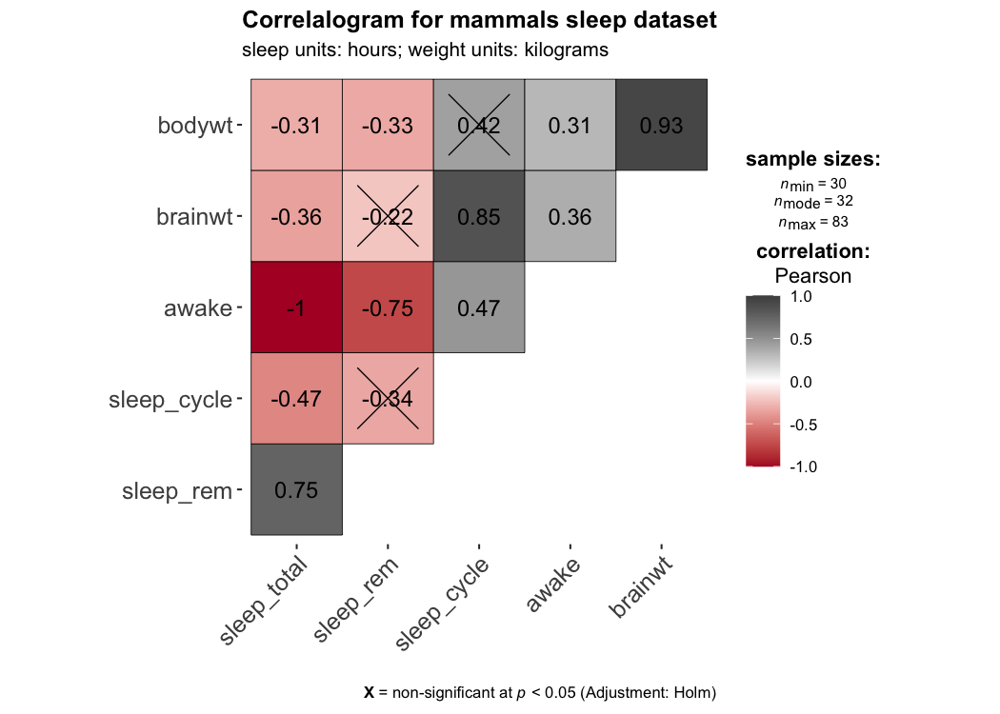
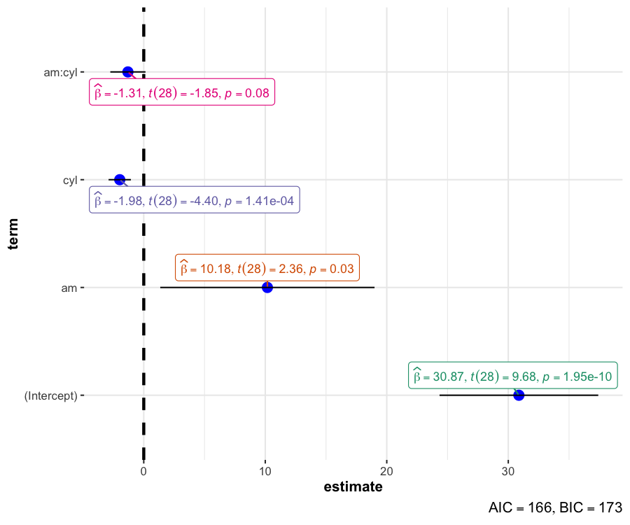

<!-- README.md is generated from README.Rmd. Please edit that file -->

# ggstatsplot: `ggplot2` Based Plots with Statistical Details

[](https://CRAN.R-project.org/package=ggstatsplot)
[](https://cran.r-project.org/web/checks/check_results_ggstatsplot.html)
[](commits/master)
[](https://codecov.io/github/IndrajeetPatil/ggstatsplot?branch=master)
[](https://CRAN.R-project.org/package=ggstatsplot)
[](https://CRAN.R-project.org/package=ggstatsplot)
[](https://CRAN.R-project.org/package=ggstatsplot)
[](https://CRAN.R-project.org/package=ggstatsplot)
[](https://travis-ci.org/IndrajeetPatil/ggstatsplot)
[](https://ci.appveyor.com/project/IndrajeetPatil/ggstatsplot)
[](https://www.gnu.org/licenses/gpl-3.0.en.html)
[](/commits/master)
[](https://www.tidyverse.org/lifecycle/#stable)
[](https://cran.r-project.org/)
[](http://www.repostatus.org/#active)

<!--
[](https://github.com/IndrajeetPatil/ggstatsplot/issues/)
[](https://gemnasium.com/IndrajeetPatil/ggstatsplot) 
-->

## Overview

[`ggstatsplot`](https://indrajeetpatil.github.io/ggstatsplot/) is an
extension of [`ggplot2`](https://github.com/tidyverse/ggplot2) package
for creating graphics with details from statistical tests included in
the plots themselves and targeted primarily at behavioral sciences
community to provide a one-line code to produce information-rich plots.
Currently, it supports only the most common types of statistical tests
(**parametric**, **nonparametric**, and **robust** versions of
**t-tets/anova**, **correlation**, and **contingency tables** analyses).

It, therefore, produces a limited kinds of plots for the supported
analyses:

  - **violin plots** (for comparisons between groups or conditions),
  - **pie charts** (for categorical data),
  - **scatterplots** (for correlations between two variables),
  - **correlation matrices** (for correlations between multiple
    variables),
  - **histograms** (for hypothesis about distributions), and
  - **dot-and-whisker plots** (for regression models).

In addition to these basic plots, `ggstatsplot` also provides `grouped_`
versions of all functions that makes it easy to repeat the same anlysis
for any grouping variable.

Future versions will include other types of statistical analyses and
plots as well.

## Installation

To get the latest, stable CRAN release (`0.0.5`):

``` r
utils::install.packages(pkgs = "ggstatsplot")
```

You can get the **development** version of the package from GitHub
(`0.0.4.9000`). To see what new changes (and bug fixes) have been made
to the package since the last release on `CRAN`, you can check the
detailed log of changes here:
<https://indrajeetpatil.github.io/ggstatsplot/news/index.html>

If you are in hurry and want to reduce the time of installation, prefer-

``` r
# needed package to download from GitHub repo
utils::install.packages(pkgs = "devtools")   

# downloading the package from GitHub
devtools::install_github(
  repo = "IndrajeetPatil/ggstatsplot", # package path on GitHub
  dependencies = FALSE,                # assumes that you already have all packages installed needed for this package to work
  quick = TRUE                         # skips docs, demos, and vignettes
)                        
```

If time is not a constraint-

``` r
devtools::install_github(
  repo = "IndrajeetPatil/ggstatsplot", # package path on GitHub
  dependencies = TRUE,                 # installs packages which ggstatsplot depends on
  upgrade_dependencies = TRUE          # updates any out of date dependencies
)
```

If you are not using the [RStudio IDE](https://www.rstudio.com/) and you
get an error related to “pandoc” you will either need to remove the
argument `build_vignettes = TRUE` (to avoid building the vignettes) or
install [pandoc](http://pandoc.org/). If you have the `rmarkdown` R
package installed then you can check if you have pandoc by running the
following in R:

``` r
rmarkdown::pandoc_available()
#> [1] TRUE
```

## Citation

If you want to cite this package in a scientific journal or in any other
context, run the following code in your `R` console:

``` r
utils::citation(package = "ggstatsplot")
```

There is currently a publication in preparation corresponding this
package and the citation will be updated once it’s published.

## Help

There is a dedicated website to `ggstatplot`, which is updated after
every new commit: <https://indrajeetpatil.github.io/ggstatsplot/>.

In `R`, documentation for any function can be accessed with the standard
`help` command-

``` r
?ggbetweenstats
?ggscatterstats
?gghistostats
?ggpiestats
?ggcorrmat
?ggcoefstats
?combine_plots
?grouped_ggbetweenstats
?grouped_ggscatterstats
?grouped_gghistostats
?grouped_ggpiestats
?grouped_ggcorrmat
```

Another handy tool to see arguments to any of the functions is `args`.
For example-

``` r
args(name = ggstatsplot::ggscatterstats)
#> function (data, x, y, xlab = NULL, ylab = NULL, line.size = 1.5, 
#>     line.color = "blue", marginal = TRUE, marginal.type = "histogram", 
#>     marginal.size = 5, margins = c("both", "x", "y"), width.jitter = NULL, 
#>     height.jitter = NULL, xfill = "#009E73", yfill = "#D55E00", 
#>     xalpha = 1, yalpha = 1, xsize = 0.7, ysize = 0.7, centrality.para = NULL, 
#>     type = "pearson", results.subtitle = NULL, title = NULL, 
#>     caption = NULL, nboot = 100, beta = 0.1, k = 3, axes.range.restrict = FALSE, 
#>     ggtheme = ggplot2::theme_bw(), messages = TRUE) 
#> NULL
```

In case you want to look at the function body for any of the functions,
just type the name of the function without the paranetheses:

``` r
ggstatsplot::theme_mprl
#> function(ggtheme = ggplot2::theme_bw()) {
#>   ggtheme +
#>     ggplot2::theme(
#>       axis.title.x = ggplot2::element_text(size = 12, face = "bold"),
#>       strip.text.x = ggplot2::element_text(size = 12, face = "bold"),
#>       strip.text.y = ggplot2::element_text(size = 12, face = "bold"),
#>       strip.text = ggplot2::element_text(size = 12, face = "bold"),
#>       axis.title.y = ggplot2::element_text(size = 12, face = "bold"),
#>       axis.text.x = ggplot2::element_text(size = 12, face = "bold"),
#>       axis.text.y = ggplot2::element_text(size = 12, face = "bold"),
#>       axis.line = ggplot2::element_line(),
#>       legend.text = ggplot2::element_text(size = 12),
#>       legend.title = ggplot2::element_text(size = 12, face = "bold"),
#>       legend.title.align = 0.5,
#>       legend.text.align = 0.5,
#>       legend.key.height = grid::unit(x = 1, units = "line"),
#>       legend.key.width = grid::unit(x = 1, units = "line"),
#>       plot.margin = grid::unit(x = c(1, 1, 1, 1), units = "lines"),
#>       panel.border = ggplot2::element_rect(
#>         color = "black",
#>         fill = NA,
#>         size = 1
#>       ),
#>       plot.title = ggplot2::element_text(
#>         color = "black",
#>         size = 13,
#>         face = "bold",
#>         hjust = 0.5
#>       ),
#>       plot.subtitle = ggplot2::element_text(
#>         color = "black",
#>         size = 11,
#>         face = "bold",
#>         hjust = 0.5
#>       )
#>     )
#> }
#> <bytecode: 0x000000002b536bc0>
#> <environment: namespace:ggstatsplot>
```

If you are not familiar either with what the namespace `::` does or how
to use pipe operator `%>%`, something this package and its documentation
relies a lot on, you can check out these links-

  - <http://r-pkgs.had.co.nz/namespace.html>
  - <http://r4ds.had.co.nz/pipes.html>

## Usage

`ggstatsplot` relies on [non-standard
evaluation](http://adv-r.had.co.nz/Computing-on-the-language.html),
which means you **shouldn’t** enter arguments in the following manner:
`data = NULL, x = data$x, y = data$y`. You **must** always specify the
`data` argument for all functions.

Additionally, `ggstatsplot` is a very chatty package and will by default
output information about references for tests, notes on assumptions
about linear models, and warnings. If you don’t want your console to be
cluttered with such messages, they can be turned off by setting argument
`messages = FALSE` in the function call.

Here are examples of the main functions currently supported in
`ggstatsplot`. **Note**: The documentation below is for the
**development** version of the package. So you may see some features
available here that are not currently present in the stable version of
this package on **CRAN**:
<https://cran.r-project.org/web/packages/ggstatsplot/index.html>

## `ggbetweenstats`

This function creates either a violin plot, a box plot, or a mix of two
for **between**-group or **between**-condition comparisons with results
from statistical tests in the subtitle. The simplest function call looks
like this-

``` r
# for reproducibility
set.seed(123)

# plot
ggstatsplot::ggbetweenstats(
  data = datasets::iris, 
  x = Species, 
  y = Sepal.Length,
  messages = FALSE
)
```


A number of other arguments can be specified to make this plot even more
informative or change some of the default options. Additionally, this
function returns a `ggplot2` object and thus any of the graphics layers
can be further modified:

``` r
library(ggplot2)

# for reproducibility
set.seed(123)

# let's leave out one of the factor levels and see if instead of anova, a t-test will be run
iris2 <- dplyr::filter(.data = datasets::iris, Species != "setosa")

# let's change the levels of our factors, a common routine in data analysis
# pipeline, to see if this function respects the new factor levels
iris2$Species <-
  base::factor(x = iris2$Species,
               levels = c("virginica" , "versicolor"))

# plot
ggstatsplot::ggbetweenstats(
  data = iris2,                                    
  x = Species,
  y = Sepal.Length,
  notch = TRUE,                                   # show notched box plot
  mean.plotting = TRUE,                           # whether mean for each group is to be displayed 
  mean.ci = TRUE,                                 # whether to display confidence interval for means
  mean.label.size = 2.5,                          # size of the label for mean
  type = "parametric",                            # which type of test is to be run
  k = 2,                                          # number of decimal places for statistical results
  outlier.tagging = TRUE,                         # whether outliers need to be tagged
  outlier.label = Sepal.Width,                    # variable to be used for the outlier tag
  outlier.label.color = "darkgreen",              # changing the color for the text label
  xlab = "Type of Species",                       # label for the x-axis variable
  ylab = "Attribute: Sepal Length",               # label for the y-axis variable
  title = "Dataset: Iris flower data set",        # title text for the plot
  caption = expression(                           # caption text for the plot 
    paste(italic("Note"), ": this is a demo")
  ),
  ggtheme = ggplot2::theme_grey(),                # choosing a different theme
  palette = "Set1",                               # choosing a different color palette
  messages = FALSE
) +                                               # further modification outside of ggstatsplot
  ggplot2::coord_cartesian(ylim = c(3, 8)) + 
  ggplot2::scale_y_continuous(breaks = seq(3, 8, by = 1)) 
```


The `type` (of test) argument also accepts the following abbreviations:
`"p"` (for *parametric*), `"np"` (for *nonparametric*), `"r"` (for
*robust*). Additionally, the type of plot to be displayed can also be
modified (`"box"`, `"violin"`, or `"boxviolin"`).

For more, see the `ggbetweenstats` vignette:
<https://indrajeetpatil.github.io/ggstatsplot/articles/ggbetweenstats.html>

\*\* This function is not appropriate for within-subjects designs.\*\*

Variant of this function `ggwithinstats` is currently under work. You
*can* still use this function just to prepare the **plot** for
exploratory data analysis, but the statistical details displayed in the
subtitle will be incorrect. You can remove them by adding `+
ggplot2::labs(subtitle = NULL)`.

## `ggscatterstats`

This function creates a scatterplot with marginal
histograms/boxplots/density/violin/densigram plots from  and results
from statistical tests in the subtitle:

``` r
ggstatsplot::ggscatterstats(
  data = datasets::iris, 
  x = Sepal.Length, 
  y = Petal.Length,
  title = "Dataset: Iris flower data set",
  messages = FALSE
)
```


Number of other arguments can be specified to modify this basic plot-

``` r
library(datasets)

# for reproducibility
set.seed(123)

# plot
ggstatsplot::ggscatterstats(
  data = subset(datasets::iris, iris$Species == "setosa"),
  x = Sepal.Length,
  y = Petal.Length,
  type = "robust",                               # type of test that needs to be run
  xlab = "Attribute: Sepal Length",              # label for x axis
  ylab = "Attribute: Petal Length",              # label for y axis 
  line.color = "black",                          # changing regression line color line
  title = "Dataset: Iris flower data set",       # title text for the plot
  caption = expression(                          # caption text for the plot
    paste(italic("Note"), ": this is a demo")
  ),
  marginal.type = "density",                     # type of marginal distribution to be displayed
  xfill = "blue",                                # color fill for x-axis marginal distribution 
  yfill = "red",                                 # color fill for y-axis marginal distribution
  xalpha = 0.5,                                  # transparency for x-axis marginal distribution
  yalpha = 0.5,                                  # transparency for y-axis marginal distribution
  centrality.para = "median",                    # which type of central tendency lines are to be displayed  
  width.jitter = 0.2,                            # amount of horizontal jitter for data points
  height.jitter = 0.4,                           # amount of vertical jitter for data points
  messages = FALSE                               # turn off messages and notes
) 
```


For more, see the `ggscatterstats` vignette:
<https://indrajeetpatil.github.io/ggstatsplot/articles/ggscatterstats.html>

## `ggpiestats`

This function creates a pie chart for categorical variables with results
from contingency table analysis included in the subtitle of the plot. If
only one categorical variable is entered, results from one-sample
**proportion test** will be displayed as a subtitle.

``` r
# for reproducibility
set.seed(123)

# plot
ggstatsplot::ggpiestats(
  data = datasets::iris,
  main = Species,
  messages = FALSE
)
```


This function can also be used to study an interaction between two
categorical variables. Additionally, as with the other functions in
`ggstatsplot`, this function returns a `ggplot2` object and can further
be modified with `ggplot2` syntax (e.g., we can change the color palette
\*after\#\# `ggstatsplot` has produced the plot)-

``` r
library(ggplot2)

# for reproducibility
set.seed(123)

# plot
ggstatsplot::ggpiestats(
  data = datasets::mtcars,
  main = cyl,
  condition = am,
  title = "Dataset: Motor Trend Car Road Tests",      
  messages = FALSE
) + # further modification outside of ggstatsplot to change the default palette as an example 
  ggplot2::scale_fill_brewer(palette = "Set1")     
```


As with the other functions, this basic plot can further be modified
with additional arguments:

``` r
# for reproducibility
set.seed(123)

# plot
ggstatsplot::ggpiestats(
  data = datasets::mtcars,
  main = am,
  condition = cyl,
  title = "Dataset: Motor Trend Car Road Tests",      # title for the plot
  stat.title = "interaction: ",                       # title for the results from Pearson's chi-squared test
  legend.title = "Transmission",                      # title for the legend
  factor.levels = c("1 = manual", "0 = automatic"),   # renaming the factor level names for 'main' variable 
  facet.wrap.name = "No. of cylinders",               # name for the facetting variable
  facet.proptest = FALSE,                             # turning of facetted proportion test results
  caption = expression(                               # text for the caption
    paste(italic("Note"), ": this is a demo")
  ),
  messages = FALSE                                    # turn off messages and notes
) 
```


In case of within-subjects designs, setting `paired = TRUE` will produce
results from McNemar test-

``` r
# for reproducibility
set.seed(123)

# data
survey.data <- data.frame(
  `1st survey` = c('Approve', 'Approve', 'Disapprove', 'Disapprove'),
  `2nd survey` = c('Approve', 'Disapprove', 'Approve', 'Disapprove'),
  `Counts` = c(794, 150, 86, 570),
  check.names = FALSE
)

# plot
ggstatsplot::ggpiestats(
  data = survey.data,
  main = `1st survey`,
  condition = `2nd survey`,
  counts = Counts,
  paired = TRUE,                      # within-subjects design
  stat.title = "McNemar Test: ",
  palette = "Set1"
)
```


For more, including information about the variant of this function
`grouped_ggpiestats`, see the `ggpiestats` vignette:
<https://indrajeetpatil.github.io/ggstatsplot/articles/ggpiestats.html>

## `gghistostats`

In case you would like to see the distribution of one variable and check
if it is significantly different from a specified value with a one
sample test, this function will let you do that.

``` r
library(datasets)

ggstatsplot::gghistostats(
  data = datasets::iris,                         # dataframe from which variable is to be taken
  x = Sepal.Length,                              # numeric variable whose distribution is of interest
  title = "Distribution of Iris sepal length",   # title for the plot
  type = "parametric",                           # one sample t-test
  test.value = 3,                                # default value is 0
  centrality.para = "mean",                      # which measure of central tendency is to be plotted
  centrality.color = "darkred",                  # decides color of vertical line representing central tendency
  binwidth = 0.10,                               # binwidth value (experiment until you find the best one)
  messages = FALSE                               # turn off the messages
) 
```


The `type` (of test) argument also accepts the following abbreviations:
`"p"` (for *parametric*) or `"np"` (for *nonparametric*) or `"bf"` (for
*Bayes Factor*).

``` r
ggstatsplot::gghistostats(
  data = datasets::ToothGrowth,
  title = "Distribution of Sepal.Length",
  x = len,
  fill.gradient = TRUE,                          # use color gradient
  test.value = 10,
  test.value.line = TRUE,
  test.value.color = "black",
  centrality.para = "mean",
  type = "bf",
  bf.prior = 0.8,
  messages = FALSE,
  caption = expression(                              
    paste(italic("Note"), ": black line - test value; blue line - observed mean", sep = "")
  )
)
```


As seen here, by default, Bayes Factor quantifies the support for the
alternative hypothesis (H1) over the null hypothesis (H0) (i.e., BF10 is
displayed).

For more, including information about the variant of this function
`grouped_gghistostats`, see the `gghistostats` vignette:
<https://indrajeetpatil.github.io/ggstatsplot/articles/gghistostats.html>

## `ggcorrmat`

`ggcorrmat` makes correlalograms with minimal amount of code. Just
sticking to the defaults itself produces publication-ready correlation
matrices. (Wrapper around
[`ggcorrplot`](https://github.com/kassambara/ggcorrplot))

``` r
# as a default this function outputs a correlalogram plot
ggstatsplot::ggcorrmat(
  data = datasets::iris,
  corr.method = "spearman",                # correlation method
  sig.level = 0.005,                       # threshold of significance
  cor.vars = Sepal.Length:Petal.Width,     # a range of variables can be selected  
  cor.vars.names = c("Sepal Length", "Sepal Width", "Petal Length", "Petal Width"),
  title = "Correlalogram for length measures for Iris species",
  subtitle = "Iris dataset by Anderson",
  caption = expression(
    paste(
      italic("Note"),
      ": X denotes correlation non-significant at ",
      italic("p "),
      "< 0.005; adjusted alpha"
    )
  )
)
```



Multiple arguments can be modified to change the appearance of the
correlation matrix.

Alternatively, you can use it just to get the correlation matrices and
their corresponding *p*-values (in a
[tibble](http://tibble.tidyverse.org/) format). This is especially
useful for robust correlation coefficient, which is not currently
supported in `ggcorrmat` plot.

``` r
# getting the correlation coefficient matrix
ggstatsplot::ggcorrmat(
  data = datasets::iris,
  cor.vars = Sepal.Length:Petal.Width,
  corr.method = "robust",
  output = "correlations",             # specifying the needed output
  digits = 3                           # number of digits to be dispayed for correlation coefficient
)
#> # A tibble: 4 x 5
#>   variable     Sepal.Length Sepal.Width Petal.Length Petal.Width
#>   <chr>               <dbl>       <dbl>        <dbl>       <dbl>
#> 1 Sepal.Length        1          -0.143        0.878       0.837
#> 2 Sepal.Width        -0.143       1           -0.426      -0.373
#> 3 Petal.Length        0.878      -0.426        1           0.966
#> 4 Petal.Width         0.837      -0.373        0.966       1

# getting the p-value matrix
ggstatsplot::ggcorrmat(
  data = datasets::iris,
  cor.vars = Sepal.Length:Petal.Width,
  corr.method = "robust",
  output = "p-values"
)
#> # A tibble: 4 x 5
#>   variable     Sepal.Length  Sepal.Width Petal.Length Petal.Width
#>   <chr>               <dbl>        <dbl>        <dbl>       <dbl>
#> 1 Sepal.Length       0      0.0818       0             0         
#> 2 Sepal.Width        0.0818 0            0.0000000529  0.00000252
#> 3 Petal.Length       0      0.0000000529 0             0         
#> 4 Petal.Width        0      0.00000252   0             0
```

For examples and more information, see the `ggcorrmat` vignette:
<https://indrajeetpatil.github.io/ggstatsplot/articles/ggcorrmat.html>

## `ggcoefstats`

`ggcoefstats` creates a lot with the regression coefficients’ point
estimates as dots with confidence interval whiskers. This is a wrapper
function around `GGally::ggcoef`.

``` r
ggstatsplot::ggcoefstats(x = stats::lm(formula = mpg ~ am * cyl,
                                       data = datasets::mtcars)) 
```



The basic can be further modified to one’s liking with additional
arguments:

``` r
ggstatsplot::ggcoefstats(
  x = stats::lm(formula = mpg ~ am * cyl,
                data = datasets::mtcars),
  point.color = "red",
  vline.color = "#CC79A7",
  vline.linetype = "dotdash",
  stats.label.size = 3.5,
  stats.label.color = c("#0072B2", "#D55E00", "darkgreen"),
  title = "Car performance predicted by transmission and cylinder count",
  subtitle = "Source: 1974 Motor Trend US magazine"
) +                                    
  # further modification with the ggplot2 commands
  # note the order in which the labels are entered
  ggplot2::scale_y_discrete(labels = c("transmission", "cylinders", "interaction")) +
  ggplot2::labs(x = "regression coefficient",
                y = NULL)
```


All the regression model classes that are supported in the `broom`
package with `tidy` and `glance` methods
(<https://broom.tidyverse.org/articles/available-methods.html>) are also
supported by `ggcoefstats`. Let’s see few examples:

``` r
library(dplyr)
library(lme4)

# for reproducibility
set.seed(200)

# creating dataframe needed for one of the analyses below
d <- as.data.frame(Titanic)

# combining plots together
ggstatsplot::combine_plots(
  # generalized linear model
  ggstatsplot::ggcoefstats(
    x = stats::glm(
      formula = Survived ~ Sex + Age,
      data = d,
      weights = d$Freq,
      family = "binomial"
    ),
    exponentiate = TRUE,
    exclude.intercept = FALSE,
    title = "generalized linear model"
  ),
  # nonlinear least squares
  ggstatsplot::ggcoefstats(
    x = stats::nls(
      formula = mpg ~ k / wt + b,
      data = datasets::mtcars,
      start = list(k = 1, b = 0)
    ),
    point.color = "darkgreen",
    title = "non-linear least squares"
  ),
  # linear mmodel
  ggstatsplot::ggcoefstats(
    x = lme4::lmer(
      formula = Reaction ~ Days + (Days | Subject),
      data = lme4::sleepstudy
    ),
    point.color = "red",
    exclude.intercept = TRUE,
    title = "linear mixed-effects model"
  ),
  # generalized linear mixed-effects model
  ggstatsplot::ggcoefstats(
    x = lme4::glmer(
      formula = cbind(incidence, size - incidence) ~ period + (1 | herd),
      data = lme4::cbpp,
      family = binomial
    ),
    exclude.intercept = FALSE,
    title = "generalized linear mixed-effects model"
  ),
  labels = c("(a)", "(b)", "(c)", "(d)"),
  nrow = 2,
  ncol = 2
)
```


This is by no means an exhaustive list of models supported by
`ggcoefstats`. For more, see the associated vignette-
<https://indrajeetpatil.github.io/ggstatsplot/articles/ggcoefstats.html>

## `combine_plots`

`ggstatsplot` also contains a helper function `combine_plots` to combine
multiple plots. This is a wrapper around  and lets you combine multiple
plots and add combination of title, caption, and annotation texts with
suitable default parameters.

The full power of `ggstatsplot` can be leveraged with a functional
programming package like [`purrr`](http://purrr.tidyverse.org/) that
replaces many for loops with code that is both more succinct and easier
to read and, therefore, `purrr` should be preferrred.

For more, see the associated vignette-
<https://indrajeetpatil.github.io/ggstatsplot/articles/combine_plots.html>

## `theme_ggstatsplot`

All plots from `ggstatsplot` have a default theme: `theme_ggstatsplot`,
which is also called as `theme_mprl` (both of which are identical
functions with different names). For more on how to modify it, see the
associated vignette-
<https://indrajeetpatil.github.io/ggstatsplot/articles/theme_ggstatsplot.html>

## Plot design

In the following vignette, I have outlined what thought went into
designing plots in a certain way:
<https://indrajeetpatil.github.io/ggstatsplot/articles/graphics_design.html>

## Contributing

I’m happy to receive bug reports, suggestions, questions, and (most of
all) contributions to fix problems and add features. I personally prefer
using the Github issues system over trying to reach out to me in other
ways (personal e-mail, Twitter, etc.). Pull requests for contributions
are encouraged.

Please note that this project is released with a [Contributor Code of
Conduct](CONDUCT.md). By participating in this project you agree to
abide by its terms.
