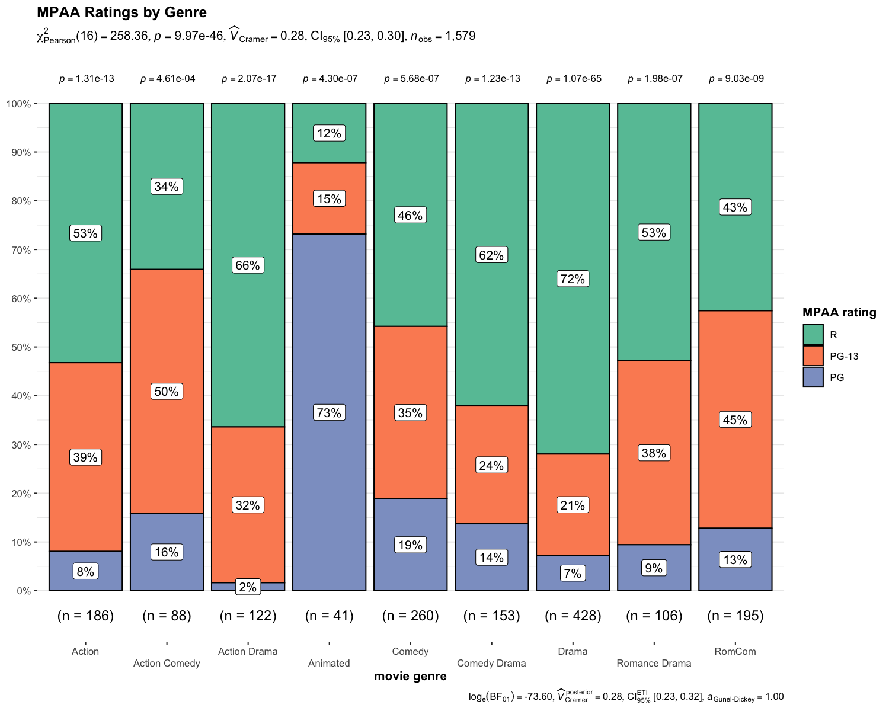
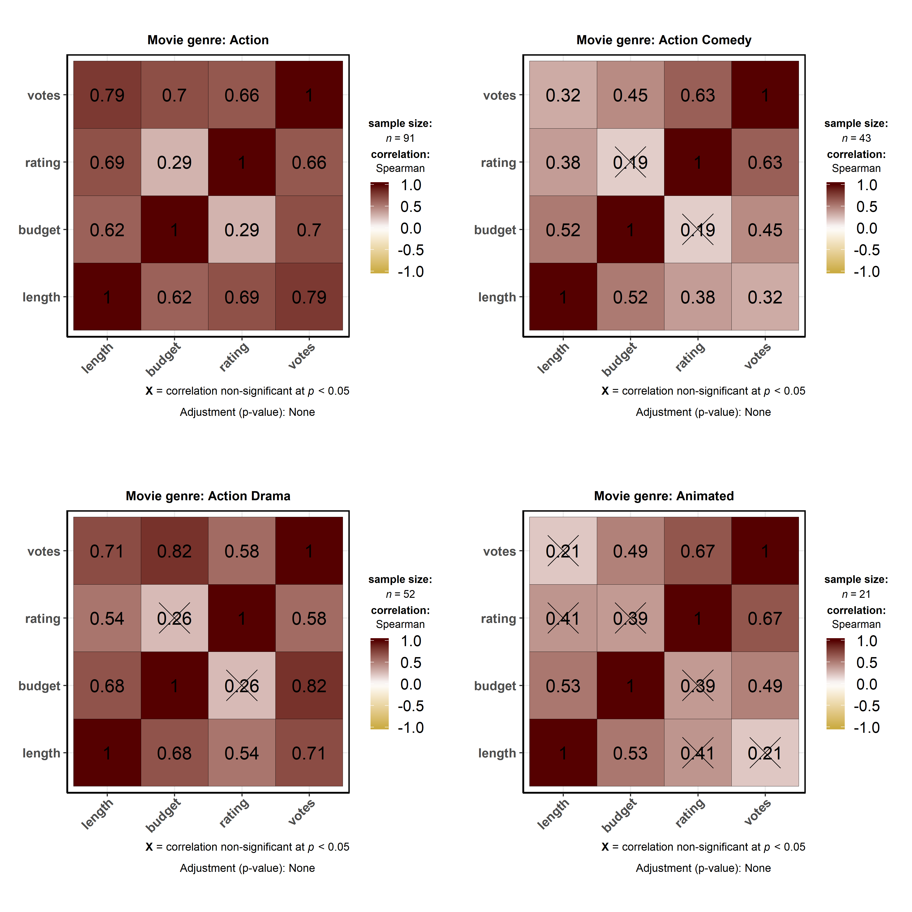

<!-- README.md is generated from README.Rmd. Please edit that file -->

# `ggstatsplot`: `ggplot2` Based Plots with Statistical Details

| Package                                                                                                                                                         | Status                                                                                                                                                                                       | Usage                                                                                                                                             | GitHub                                                                                                                                                         | References                                                                                                                                                      |
| --------------------------------------------------------------------------------------------------------------------------------------------------------------- | -------------------------------------------------------------------------------------------------------------------------------------------------------------------------------------------- | ------------------------------------------------------------------------------------------------------------------------------------------------- | -------------------------------------------------------------------------------------------------------------------------------------------------------------- | --------------------------------------------------------------------------------------------------------------------------------------------------------------- |
| [](https://CRAN.R-project.org/package=ggstatsplot)                                  | [](https://travis-ci.org/IndrajeetPatil/ggstatsplot)                                               | [](https://CRAN.R-project.org/package=ggstatsplot)     | [](https://github.com/IndrajeetPatil/ggstatsplot/)              | [](https://indrajeetpatil.github.io/ggstatsplot/)                          |
| [](https://cran.r-project.org/web/checks/check_results_ggstatsplot.html)                      | [](https://ci.appveyor.com/project/IndrajeetPatil/ggstatsplot) | [](https://CRAN.R-project.org/package=ggstatsplot)   | [](https://github.com/IndrajeetPatil/ggstatsplot/)                                                     | [](https://www.rdocumentation.org/packages/ggstatsplot)                                       |
| [](https://cran.r-project.org/)                                                      | [](https://www.tidyverse.org/lifecycle/)                                                                               | [](https://CRAN.R-project.org/package=ggstatsplot) | [](https://github.com/IndrajeetPatil/ggstatsplot/issues)                                       | [](https://CRAN.R-project.org/package=ggstatsplot/vignettes/)               |
| [](https://github.com/IndrajeetPatil/ggstatsplot) | [](https://coveralls.io/github/IndrajeetPatil/ggstatsplot?branch=master)             | [](https://CRAN.R-project.org/package=ggstatsplot)  | [](https://github.com/IndrajeetPatil/ggstatsplot) | [](https://doi.org/10.5281/zenodo.2074621)                                                       |
| [](https://www.gnu.org/licenses/gpl-3.0.en.html)                                                | [](https://codecov.io/gh/IndrajeetPatil/ggstatsplot?branch=master)                   | [](http://hits.dwyl.io/IndrajeetPatil/ggstatsplot)                                 | [](https://github.com/IndrajeetPatil/ggstatsplot/commits/master)    | [](https://github.com/IndrajeetPatil/ggstatsplot/commits/master) |
| [](https://CRAN.R-project.org/package=ggstatsplot)                                                    | [](https://github.com/IndrajeetPatil/ggstatsplot/blob/master/tests/README.md)                | [](https://saythanks.io/to/IndrajeetPatil)                                    | [](http://www.repostatus.org/#active)                                                     | [](https://github.com/IndrajeetPatil/ggstatsplot/issues) |
| [](https://gitter.im/ggstatsplot/community)                                                         |                                                                                                                                                                                              |                                                                                                                                                   |                                                                                                                                                                |                                                                                                                                                                 |

# Raison d’être

> “What is to be sought in designs for the display of information is the
> clear portrayal of complexity. Not the complication of the simple;
> rather … the revelation of the complex.”  
> \- Edward R. Tufte

[`ggstatsplot`](https://indrajeetpatil.github.io/ggstatsplot/) is an
extension of [`ggplot2`](https://github.com/tidyverse/ggplot2) package
for creating graphics with details from statistical tests included in
the plots themselves and targeted primarily at behavioral sciences
community to provide a one-line code to produce information-rich plots.
In a typical exploratory data analysis workflow, data visualization and
statistical modeling are two different phases: visualization informs
modeling, and modeling in its turn can suggest a different visualization
method, and so on and so forth. The central idea of `ggstatsplot` is
simple: combine these two phases into one in the form of graphics with
statistical details, which makes data exploration simpler and faster.

# Summary of available plots

It, therefore, produces a limited kinds of plots for the supported
analyses:

| Function         | Plot                      | Description                                     |
| ---------------- | ------------------------- | ----------------------------------------------- |
| `ggbetweenstats` | **violin plots**          | for comparisons *between* groups/conditions     |
| `ggwithinstats`  | **violin plots**          | for comparisons *within* groups/conditions      |
| `gghistostats`   | **histograms**            | for distribution about numeric variable         |
| `ggdotplotstats` | **dot plots/charts**      | for distribution about labeled numeric variable |
| `ggpiestats`     | **pie charts**            | for categorical data                            |
| `ggbarstats`     | **bar charts**            | for categorical data                            |
| `ggscatterstats` | **scatterplots**          | for correlations between two variables          |
| `ggcorrmat`      | **correlation matrices**  | for correlations between multiple variables     |
| `ggcoefstats`    | **dot-and-whisker plots** | for regression models                           |

In addition to these basic plots, `ggstatsplot` also provides
**`grouped_`** versions (see below) that makes it easy to repeat the
same analysis for any grouping variable.

# Summary of types of statistical analyses

Currently, it supports only the most common types of statistical tests:
**parametric**, **nonparametric**, **robust**, and **bayesian** versions
of **t-test**/**anova**, **correlation** analyses, **contingency table**
analysis, and **regression** analyses.

The table below summarizes all the different types of analyses currently
supported in this package-

| Functions                        | Description                                       | Parametric                     | Non-parametric                 | Robust                         | Bayes Factor                   |
| -------------------------------- | ------------------------------------------------- | ------------------------------ | ------------------------------ | ------------------------------ | ------------------------------ |
| `ggbetweenstats`                 | Between group/condition comparisons               | <font color="green">Yes</font> | <font color="green">Yes</font> | <font color="green">Yes</font> | <font color="green">Yes</font> |
| `ggwithinstats`                  | Within group/condition comparisons                | <font color="green">Yes</font> | <font color="green">Yes</font> | <font color="green">Yes</font> | <font color="green">Yes</font> |
| `gghistostats`, `ggdotplotstats` | Distribution of a numeric variable                | <font color="green">Yes</font> | <font color="green">Yes</font> | <font color="green">Yes</font> | <font color="green">Yes</font> |
| `ggcorrmat`                      | Correlation matrix                                | <font color="green">Yes</font> | <font color="green">Yes</font> | <font color="green">Yes</font> | <font color="red">No</font>    |
| `ggscatterstats`                 | Correlation between two variables                 | <font color="green">Yes</font> | <font color="green">Yes</font> | <font color="green">Yes</font> | <font color="green">Yes</font> |
| `ggpiestats`, `ggbarstats`       | Association between categorical variables         | <font color="green">Yes</font> | `NA`                           | `NA`                           | <font color="green">Yes</font> |
| `ggpiestats`, `ggbarstats`       | Equal proportions for categorical variable levels | <font color="green">Yes</font> | `NA`                           | `NA`                           | <font color="green">Yes</font> |
| `ggcoefstats`                    | Regression model coefficients                     | <font color="green">Yes</font> | <font color="red">No</font>    | <font color="green">Yes</font> | <font color="red">No</font>    |

# Statistical reporting

For **all** statistical tests reported in the plots, the default
template abides by the [APA](https://my.ilstu.edu/~jhkahn/apastats.html)
gold standard for statistical reporting. For example, here are results
from Yuen’s test for trimmed means (robust *t*-test):


# Summary of statistical tests and effect sizes

Here is a summary table of all the statistical tests currently supported
across various functions:

| Functions                                | Type           | Test                                                                                                                                                                                       | Effect size                                                                                                                                                                                           | 95% CI available?                                                                                          |
| ---------------------------------------- | -------------- | ------------------------------------------------------------------------------------------------------------------------------------------------------------------------------------------ | ----------------------------------------------------------------------------------------------------------------------------------------------------------------------------------------------------- | ---------------------------------------------------------------------------------------------------------- |
| `ggbetweenstats` (2 groups)              | Parametric     | Student’s and Welch’s *t*-test                                                                                                                                                             | Cohen’s *d*, Hedge’s *g*                                                                                                                                                                              | <font color="green"></font> |
| `ggbetweenstats` (\> 2 groups)           | Parametric     | Fisher’s and Welch’s one-way ANOVA                                                                                                                                                         |  | <font color="green"></font> |
| `ggbetweenstats` (2 groups)              | Non-parametric | Mann-Whitney *U*-test                                                                                                                                                                      | *r*                                                                                                                                                                                                   | <font color="green"></font> |
| `ggbetweenstats` (\> 2 groups)           | Non-parametric | Kruskal-Wallis Rank Sum Test                                                                                                                                                               |                                                                                                                      | <font color="green"></font> |
| `ggbetweenstats` (2 groups)              | Robust         | Yuen’s test for trimmed means                                                                                                                                                              |                                                                                                                                             | <font color="green"></font> |
| `ggbetweenstats` (\> 2 groups)           | Robust         | Heteroscedastic one-way ANOVA for trimmed means                                                                                                                                            |                                                                                                                                             | <font color="green"></font> |
| `ggwithinstats` (2 groups)               | Parametric     | Student’s *t*-test                                                                                                                                                                         | Cohen’s *d*, Hedge’s *g*                                                                                                                                                                              | <font color="green"></font> |
| `ggwithinstats` (\> 2 groups)            | Parametric     | Fisher’s one-way repeated measures ANOVA                                                                                                                                                   |                                                                                   | <font color="green"></font> |
| `ggwithinstats` (2 groups)               | Non-parametric | Wilcoxon signed-rank test                                                                                                                                                                  | *r*                                                                                                                                                                                                   | <font color="green"></font> |
| `ggwithinstats` (\> 2 groups)            | Non-parametric | Friedman rank sum test                                                                                                                                                                     |                                                                                                                    | <font color="green"></font> |
| `ggwithinstats` (2 groups)               | Robust         | Yuen’s test on trimmed means for dependent samples                                                                                                                                         |                                                                                                                                             | <font color="green"></font> |
| `ggwithinstats` (\> 2 groups)            | Robust         | Heteroscedastic one-way repeated measures ANOVA for trimmed means                                                                                                                          | <font color="red"></font>                                                                                                          | <font color="red"></font>               |
| `ggpiestats` and `ggbarstats` (unpaired) | Parametric     |  | Cramér’s *V*                                                                                                                                                                                          | <font color="green"></font> |
| `ggpiestats` and `ggbarstats` (paired)   | Parametric     | McNemar’s test                                                                                                                                                                             | Cohen’s *g*                                                                                                                                                                                           | <font color="green"></font> |
| `ggpiestats`                             | Parametric     | One-sample proportion test                                                                                                                                                                 | Cramér’s *V*                                                                                                                                                                                          | <font color="green"></font> |
| `ggscatterstats` and `ggcorrmat`         | Parametric     | Pearson’s *r*                                                                                                                                                                              | *r*                                                                                                                                                                                                   | <font color="green"></font> |
| `ggscatterstats` and `ggcorrmat`         | Non-parametric |                                                         |                                                                                                                                          | <font color="green"></font> |
| `ggscatterstats`and `ggcorrmat`          | Robust         | Percentage bend correlation                                                                                                                                                                | *r*                                                                                                                                                                                                   | <font color="green"></font> |
| `gghistostats` and `ggdotplotstats`      | Parametric     | One-sample *t*-test                                                                                                                                                                        | Cohen’s *d*, Hedge’s *g*                                                                                                                                                                              | <font color="green"></font> |
| `gghistostats`                           | Non-parametric | One-sample Wilcoxon signed rank test                                                                                                                                                       | *r*                                                                                                                                                                                                   | <font color="green"></font> |
| `gghistostats` and `ggdotplotstats`      | Robust         | One-sample percentile bootstrap                                                                                                                                                            | robust estimator                                                                                                                                                                                      | <font color="green"></font> |
| `ggcoefstats`                            | Parametric     | Regression models                                                                                                                                                                          |                                                                                                                                       | <font color="green"></font> |

# Installation

To get the latest, stable `CRAN` release (`0.0.12`):

``` r
utils::install.packages(pkgs = "ggstatsplot")
```

*Note*: If you are on a linux machine, you will need to have OpenGL
libraries installed (specifically, `libx11`, `mesa` and Mesa OpenGL
Utility library - `glu`) for the dependency package `rgl` to work.

You can get the **development** version of the package from GitHub
(`0.0.12.9000`). To see what new changes (and bug fixes) have been made
to the package since the last release on `CRAN`, you can check the
detailed log of changes here:
<https://indrajeetpatil.github.io/ggstatsplot/news/index.html>

If you are in hurry and want to reduce the time of installation, prefer-

``` r
# needed package to download from GitHub repo
utils::install.packages(pkgs = "remotes")

# downloading the package from GitHub
remotes::install_github(
  repo = "IndrajeetPatil/ggstatsplot", # package path on GitHub
  dependencies = FALSE, # assumes you have already installed needed packages
  quick = TRUE # skips docs, demos, and vignettes
)
```

If time is not a constraint-

``` r
remotes::install_github(
  repo = "IndrajeetPatil/ggstatsplot", # package path on GitHub
  dependencies = TRUE, # installs packages which ggstatsplot depends on
  upgrade_dependencies = TRUE # updates any out of date dependencies
)
```

If you are not using the [RStudio IDE](https://www.rstudio.com/) and you
get an error related to “pandoc” you will either need to remove the
argument `build_vignettes = TRUE` (to avoid building the vignettes) or
install [pandoc](http://pandoc.org/). If you have the `rmarkdown` R
package installed then you can check if you have pandoc by running the
following in R:

``` r
rmarkdown::pandoc_available()
#> [1] TRUE
```

# Citation

If you want to cite this package in a scientific journal or in any other
context, run the following code in your `R` console:

``` r
citation("ggstatsplot")
```

There is currently a publication in preparation corresponding to this
package and the citation will be updated once it’s published.

# Documentation and Examples

To see the detailed documentation for each function in the stable
**CRAN** version of the package, see:

  - README:
    <https://CRAN.R-project.org/package=ggstatsplot/readme/README.html>
  - Presentation:
    <https://indrajeetpatil.github.io/ggstatsplot_slides/slides/ggstatsplot_presentation.html#1>
  - Vignettes:
    <https://CRAN.R-project.org/package=ggstatsplot/vignettes/additional.html>

To see the documentation relevant for the **development** version of the
package, see the dedicated website for `ggstatplot`, which is updated
after every new commit: <https://indrajeetpatil.github.io/ggstatsplot/>.

## Help

In `R`, documentation for any function can be accessed with the standard
`help` command (e.g., `?ggbetweenstats`).

Another handy tool to see arguments to any of the functions is `args`.
For example-

``` r
args(name = ggstatsplot::specify_decimal_p)
#> function (x, k = 3, p.value = FALSE) 
#> NULL
```

In case you want to look at the function body for any of the functions,
just type the name of the function without the parentheses:

``` r
# function to convert class of any object to `ggplot` class
ggstatsplot::ggplot_converter
#> function(plot) {
#>   cowplot::ggdraw() + cowplot::draw_grob(grid::grobTree(plot))
#> }
#> <bytecode: 0x000000002d5f5348>
#> <environment: namespace:ggstatsplot>
```

If you are not familiar either with what the namespace `::` does or how
to use pipe operator `%>%`, something this package and its documentation
relies a lot on, you can check out these links-

  - <http://r-pkgs.had.co.nz/namespace.html>
  - <http://r4ds.had.co.nz/pipes.html>

# Primary functions

Here are examples of the main functions currently supported in
`ggstatsplot`.

**Note**: If you are reading this on `GitHub` repository, the
documentation below is for the **development** version of the package.
So you may see some features available here that are not currently
present in the stable version of this package on **CRAN**. For
documentation relevant for the `CRAN` version, see:
<https://CRAN.R-project.org/package=ggstatsplot/readme/README.html>

## `ggbetweenstats`

This function creates either a violin plot, a box plot, or a mix of two
for **between**-group or **between**-condition comparisons with results
from statistical tests in the subtitle. The simplest function call looks
like this-

``` r
# loading needed libraries
library(ggstatsplot)

# for reproducibility
set.seed(123)

# plot
ggstatsplot::ggbetweenstats(
  data = iris,
  x = Species,
  y = Sepal.Length,
  messages = FALSE
) + # further modification outside of ggstatsplot
  ggplot2::coord_cartesian(ylim = c(3, 8)) +
  ggplot2::scale_y_continuous(breaks = seq(3, 8, by = 1))
```


Note that this function returns object of class `ggplot` and thus can be
further modified using `ggplot2` functions.

A number of other arguments can be specified to make this plot even more
informative or change some of the default options. Additionally, this
time we will use a grouping variable that has only two levels. The
function will automatically switch from carrying out an ANOVA analysis
to a *t*-test.

The `type` (of test) argument also accepts the following abbreviations:
`"p"` (for *parametric*) or `"np"` (for *nonparametric*) or `"r"` (for
*robust*) or `"bf"` (for *Bayes Factor*). Additionally, the type of plot
to be displayed can also be modified (`"box"`, `"violin"`, or
`"boxviolin"`).

A number of other arguments can be specified to make this plot even more
informative or change some of the default options.

``` r
library(ggplot2)

# for reproducibility
set.seed(123)

# let's leave out one of the factor levels and see if instead of anova, a t-test will be run
iris2 <- dplyr::filter(.data = iris, Species != "setosa")

# let's change the levels of our factors, a common routine in data analysis
# pipeline, to see if this function respects the new factor levels
iris2$Species <- factor(x = iris2$Species, levels = c("virginica", "versicolor"))

# plot
ggstatsplot::ggbetweenstats(
  data = iris2,
  x = Species,
  y = Sepal.Length,
  notch = TRUE, # show notched box plot
  mean.plotting = TRUE, # whether mean for each group is to be displayed
  mean.ci = TRUE, # whether to display confidence interval for means
  mean.label.size = 2.5, # size of the label for mean
  type = "parametric", # which type of test is to be run
  k = 3, # number of decimal places for statistical results
  outlier.tagging = TRUE, # whether outliers need to be tagged
  outlier.label = Sepal.Width, # variable to be used for the outlier tag
  outlier.label.color = "darkgreen", # changing the color for the text label
  xlab = "Type of Species", # label for the x-axis variable
  ylab = "Attribute: Sepal Length", # label for the y-axis variable
  title = "Dataset: Iris flower data set", # title text for the plot
  ggtheme = ggthemes::theme_fivethirtyeight(), # choosing a different theme
  ggstatsplot.layer = FALSE, # turn off ggstatsplot theme layer
  package = "wesanderson", # package from which color palette is to be taken
  palette = "Darjeeling1", # choosing a different color palette
  messages = FALSE
)
```


As can be seen from the plot, the function by default returns Bayes
Factor for the test (here, Student’s *t*-test). If the null hypothesis
can’t be rejected with the null hypothesis significance testing (NHST)
approach, the Bayesian approach can help index evidence in favor of the
null hypothesis (i.e.,
).

By default, natural logarithms are shown because Bayes Factor values can
sometimes be pretty large. Having values on logarithmic scale also makes
it easy to compare evidence in favor alternative
() versus null
() hypotheses (since  = - log_{e}(BF_{01})")).

Additionally, there is also a `grouped_` variant of this function that
makes it easy to repeat the same operation across a **single** grouping
variable:

``` r
# for reproducibility
set.seed(123)

# plot
ggstatsplot::grouped_ggbetweenstats(
  data = dplyr::filter(
    .data = ggstatsplot::movies_long,
    genre %in% c("Action", "Action Comedy", "Action Drama", "Comedy")
  ),
  x = mpaa,
  y = length,
  grouping.var = genre, # grouping variable
  pairwise.comparisons = TRUE, # display significant pairwise comparisons
  pairwise.annotation = "p.value", # how do you want to annotate the pairwise comparisons
  p.adjust.method = "bonferroni", # method for adjusting p-values for multiple comparisons
  conf.level = 0.99, # changing confidence level to 99%
  ggplot.component = list( # adding new components to `ggstatsplot` default
    ggplot2::scale_y_continuous(sec.axis = ggplot2::dup_axis())
  ),
  k = 3,
  title.prefix = "Movie genre",
  caption = substitute(paste(
    italic("Source"),
    ":IMDb (Internet Movie Database)"
  )),
  palette = "default_jama",
  package = "ggsci",
  messages = FALSE,
  nrow = 2,
  title.text = "Differences in movie length by mpaa ratings for different genres"
)
```


### Summary of tests

Following (between-subjects) tests are carried out for each type of
analyses-

| Type           | No. of groups | Test                                            |
| -------------- | ------------- | ----------------------------------------------- |
| Parametric     | \> 2          | Fisher’s or Welch’s one-way ANOVA               |
| Non-parametric | \> 2          | Kruskal–Wallis one-way ANOVA                    |
| Robust         | \> 2          | Heteroscedastic one-way ANOVA for trimmed means |
| Bayes Factor   | \> 2          | Fisher’s ANOVA                                  |
| Parametric     | 2             | Student’s or Welch’s *t*-test                   |
| Non-parametric | 2             | Mann–Whitney *U* test                           |
| Robust         | 2             | Yuen’s test for trimmed means                   |
| Bayes Factor   | 2             | Student’s *t*-test                              |

The omnibus effect in one-way ANOVA design can also be followed up with
more focal pairwise comparison tests. Here is a summary of *multiple
pairwise comparison* tests supported in *ggbetweenstats*-

| Type           | Equal variance? | Test                               | *p*-value adjustment?          |
| -------------- | --------------- | ---------------------------------- | ------------------------------ |
| Parametric     | No              | Games-Howell test                  | <font color="green">Yes</font> |
| Parametric     | Yes             | Student’s *t*-test                 | <font color="green">Yes</font> |
| Non-parametric | No              | Dwass-Steel-Crichtlow-Fligner test | <font color="green">Yes</font> |
| Robust         | No              | Yuen’s trimmed means test          | <font color="green">Yes</font> |
| Bayes Factor   | No              | <font color="red">No</font>        | <font color="red">No</font>    |
| Bayes Factor   | Yes             | <font color="red">No</font>        | <font color="red">No</font>    |

For more, see the `ggbetweenstats` vignette:
<https://indrajeetpatil.github.io/ggstatsplot/articles/web_only/ggbetweenstats.html>

## `ggwithinstats`

`ggbetweenstats` function has an identical twin function `ggwithinstats`
for repeated measures designs that behaves in the same fashion with a
few minor tweaks introduced to properly visualize the repeated measures
design. As can be seen from an example below, the only difference
between the plot structure is that now the group means are connected by
paths to highlight the fact that these data are paired with each other.

``` r
# for reproducibility and data
set.seed(123)
library(WRS2)

# plot
ggstatsplot::ggwithinstats(
  data = WRS2::WineTasting,
  x = Wine,
  y = Taste,
  sort = "descending", # ordering groups along the x-axis based on
  sort.fun = median, # values of `y` variable
  pairwise.comparisons = TRUE,
  pairwise.display = "s",
  pairwise.annotation = "p",
  title = "Wine tasting",
  caption = "Data from: `WRS2` R package",
  ggtheme = ggthemes::theme_fivethirtyeight(),
  ggstatsplot.layer = FALSE,
  messages = FALSE
)
```


As with the `ggbetweenstats`, this function also has a `grouped_`
variant that makes repeating the same analysis across a single grouping
variable quicker. We will see an example with only repeated
measurements-

``` r
# common setup
set.seed(123)

# getting data in tidy format
data_bugs <- ggstatsplot::bugs_long %>%
  dplyr::filter(.data = ., region %in% c("Europe", "North America"))

# plot
ggstatsplot::grouped_ggwithinstats(
  data = dplyr::filter(data_bugs, condition %in% c("LDLF", "LDHF")),
  x = condition,
  y = desire,
  xlab = "Condition",
  ylab = "Desire to kill an artrhopod",
  grouping.var = region,
  outlier.tagging = TRUE,
  outlier.label = education,
  ggtheme = hrbrthemes::theme_ipsum_tw(),
  ggstatsplot.layer = FALSE,
  messages = FALSE
)
```


### Summary of tests

Following (within-subjects) tests are carried out for each type of
analyses-

| Type           | No. of groups | Test                                                              |
| -------------- | ------------- | ----------------------------------------------------------------- |
| Parametric     | \> 2          | One-way repeated measures ANOVA                                   |
| Non-parametric | \> 2          | Friedman test                                                     |
| Robust         | \> 2          | Heteroscedastic one-way repeated measures ANOVA for trimmed means |
| Bayes Factor   | \> 2          | One-way repeated measures ANOVA                                   |
| Parametric     | 2             | Student’s *t*-test                                                |
| Non-parametric | 2             | Wilcoxon signed-rank test                                         |
| Robust         | 2             | Yuen’s test on trimmed means for dependent samples                |
| Bayes Factor   | 2             | Student’s *t*-test                                                |

The omnibus effect in one-way ANOVA design can also be followed up with
more focal pairwise comparison tests. Here is a summary of *multiple
pairwise comparison* tests supported in *ggwithinstats*-

| Type           | Test                        | *p*-value adjustment?          |
| -------------- | --------------------------- | ------------------------------ |
| Parametric     | Student’s *t*-test          | <font color="green">Yes</font> |
| Non-parametric | Durbin-Conover test         | <font color="green">Yes</font> |
| Robust         | Yuen’s trimmed means test   | <font color="green">Yes</font> |
| Bayes Factor   | <font color="red">No</font> | <font color="red">No</font>    |

For more, see the `ggwithinstats` vignette:
<https://indrajeetpatil.github.io/ggstatsplot/articles/web_only/ggwithinstats.html>

## `ggscatterstats`

This function creates a scatterplot with marginal distributions overlaid
on the axes (from `ggExtra::ggMarginal`) and results from statistical
tests in the subtitle:

``` r
ggstatsplot::ggscatterstats(
  data = ggplot2::msleep,
  x = sleep_rem,
  y = awake,
  xlab = "REM sleep (in hours)",
  ylab = "Amount of time spent awake (in hours)",
  title = "Understanding mammalian sleep",
  messages = FALSE
)
```


The available marginal distributions are-

  - histograms
  - boxplots
  - density
  - violin
  - densigram (density + histogram)

Number of other arguments can be specified to modify this basic plot-

``` r
# for reproducibility
set.seed(123)

# plot
ggstatsplot::ggscatterstats(
  data = dplyr::filter(.data = ggstatsplot::movies_long, genre == "Action"),
  x = budget,
  y = rating,
  type = "robust", # type of test that needs to be run
  conf.level = 0.99, # confidence level
  xlab = "Movie budget (in million/ US$)", # label for x axis
  ylab = "IMDB rating", # label for y axis
  label.var = "title", # variable for labeling data points
  label.expression = "rating < 5 & budget > 100", # expression that decides which points to label
  line.color = "yellow", # changing regression line color line
  title = "Movie budget and IMDB rating (action)", # title text for the plot
  caption = expression( # caption text for the plot
    paste(italic("Note"), ": IMDB stands for Internet Movie DataBase")
  ),
  ggtheme = hrbrthemes::theme_ipsum_ps(), # choosing a different theme
  ggstatsplot.layer = FALSE, # turn off ggstatsplot theme layer
  marginal.type = "density", # type of marginal distribution to be displayed
  xfill = "#0072B2", # color fill for x-axis marginal distribution
  yfill = "#009E73", # color fill for y-axis marginal distribution
  xalpha = 0.6, # transparency for x-axis marginal distribution
  yalpha = 0.6, # transparency for y-axis marginal distribution
  centrality.para = "median", # central tendency lines to be displayed
  messages = FALSE # turn off messages and notes
)
```


Additionally, there is also a `grouped_` variant of this function that
makes it easy to repeat the same operation across a **single** grouping
variable. Also, note that, as opposed to the other functions, this
function does not return a `ggplot` object and any modification you want
to make can be made in advance using `ggplot.component` argument
(available for all functions, but especially useful for this particular
function):

``` r
# for reproducibility
set.seed(123)

# plot
ggstatsplot::grouped_ggscatterstats(
  data = dplyr::filter(
    .data = ggstatsplot::movies_long,
    genre %in% c("Action", "Action Comedy", "Action Drama", "Comedy")
  ),
  x = rating,
  y = length,
  label.var = title,
  label.expression = length > 200,
  conf.level = 0.99,
  k = 3, # no. of decimal places in the results
  xfill = "#E69F00",
  yfill = "#8b3058",
  xlab = "IMDB rating",
  grouping.var = genre, # grouping variable
  title.prefix = "Movie genre",
  ggtheme = ggplot2::theme_grey(),
  ggplot.component = list(
    ggplot2::scale_x_continuous(breaks = seq(2, 9, 1), limits = (c(2, 9)))
  ),
  messages = FALSE,
  nrow = 2,
  title.text = "Relationship between movie length by IMDB ratings for different genres"
)
```


**Using `ggscatterstats()` in R Notebooks or R Markdown**

If you try including a `ggscatterstats()` plot inside an `R Notebook` or
`R Markdown` code chunk, you will notice that the plot is not returned
in the output. In order to get a `ggscatterstats()` to show up in these
contexts, you need to save the `ggscatterstats` plot as a variable in
one code chunk, and explicitly print it using the `grid` package in
another chunk, like this:

``` r
# include the following code in your code chunk inside R Notebook or Markdown
grid::grid.newpage()
grid::grid.draw(
  ggstatsplot::ggscatterstats(
    data = ggstatsplot::movies_wide,
    x = budget,
    y = rating,
    marginal = TRUE,
    messages = FALSE
  )
)
```

Another option - or rather a compromise - is not to include marginal
distribution at all by setting `marginal = FALSE`.

### Summary of tests

Following tests are carried out for each type of analyses. Additionally,
the correlation coefficients (and their confidence intervals) are used
as effect sizes-

| Type           | Test                                    | CI?                           |
| -------------- | --------------------------------------- | ----------------------------- |
| Parametric     | Pearson’s correlation coefficient       | <font color="green">Yes<font> |
| Non-parametric | Spearman’s rank correlation coefficient | <font color="green">Yes<font> |
| Robust         | Percentage bend correlation coefficient | <font color="green">Yes<font> |
| Bayes Factor   | Pearson’s correlation coefficient       | <font color="red">No<font>    |

For more, see the `ggscatterstats` vignette:
<https://indrajeetpatil.github.io/ggstatsplot/articles/web_only/ggscatterstats.html>

## `ggpiestats`

This function creates a pie chart for categorical or nominal variables
with results from contingency table analysis (Pearson’s

test for between-subjects design and McNemar’s

test for within-subjects design) included in the subtitle of the plot.
If only one categorical variable is entered, results from one-sample
proportion test (i.e., a

goodness of fit test) will be displayed as a subtitle.

Here is an example of a case where the theoretical question is about
proportions for different levels of a single nominal variable:

``` r
# for reproducibility
set.seed(123)

# plot
ggstatsplot::ggpiestats(
  data = ggplot2::msleep,
  x = vore,
  title = "Composition of vore types among mammals",
  messages = FALSE
)
```


This function can also be used to study an interaction between two
categorical variables:

``` r
# for reproducibility
set.seed(123)

# plot
ggstatsplot::ggpiestats(
  data = mtcars,
  x = am,
  y = cyl,
  conf.level = 0.99, # confidence interval for effect size measure
  title = "Dataset: Motor Trend Car Road Tests", # title for the plot
  stat.title = "interaction: ", # title for the results
  legend.title = "Transmission", # title for the legend
  factor.levels = c("1 = manual", "0 = automatic"), # renaming the factor level names (`x`)
  facet.wrap.name = "No. of cylinders", # name for the facetting variable
  slice.label = "counts", # show counts data instead of percentages
  package = "ggsci", # package from which color palette is to be taken
  palette = "default_jama", # choosing a different color palette
  caption = substitute( # text for the caption
    paste(italic("Source"), ": 1974 Motor Trend US magazine")
  ),
  messages = FALSE # turn off messages and notes
)
```


In case of repeated measures designs, setting `paired = TRUE` will
produce results from McNemar’s

test-

``` r
# for reproducibility
set.seed(123)

# data
survey.data <- data.frame(
  `1st survey` = c("Approve", "Approve", "Disapprove", "Disapprove"),
  `2nd survey` = c("Approve", "Disapprove", "Approve", "Disapprove"),
  `Counts` = c(794, 150, 86, 570),
  check.names = FALSE
)

# plot
ggstatsplot::ggpiestats(
  data = survey.data,
  x = `1st survey`,
  y = `2nd survey`,
  counts = Counts,
  paired = TRUE, # within-subjects design
  conf.level = 0.99, # confidence interval for effect size measure
  package = "wesanderson",
  palette = "Royal1"
)
#> Note: 99% CI for effect size estimate was computed with 100 bootstrap samples.
#> # A tibble: 2 x 11
#>   `2nd survey` counts  perc N         Approve Disapprove `Chi-squared`
#>   <fct>         <int> <dbl> <chr>     <chr>   <chr>              <dbl>
#> 1 Disapprove      720   45  (n = 720) 20.83%  79.17%              245 
#> 2 Approve         880   55. (n = 880) 90.23%  9.77%               570.
#>     p.value    df method                                   significance
#>       <dbl> <dbl> <chr>                                    <chr>       
#> 1 3.20e- 55     1 Chi-squared test for given probabilities ***         
#> 2 6.80e-126     1 Chi-squared test for given probabilities ***
```


Additionally, there is also a `grouped_` variant of this function that
makes it easy to repeat the same operation across a **single** grouping
variable:

``` r
# for reproducibility
set.seed(123)

# plot
ggstatsplot::grouped_ggpiestats(
  dplyr::filter(
    .data = ggstatsplot::movies_long,
    genre %in% c("Action", "Action Comedy", "Action Drama", "Comedy")
  ),
  x = mpaa,
  grouping.var = genre, # grouping variable
  title.prefix = "Movie genre", # prefix for the facetted title
  label.text.size = 3, # text size for slice labels
  slice.label = "both", # show both counts and percentage data
  perc.k = 1, # no. of decimal places for percentages
  palette = "brightPastel",
  package = "quickpalette",
  messages = FALSE,
  nrow = 2,
  title.text = "Composition of MPAA ratings for different genres"
)
```


### Summary of tests

Following tests are carried out for each type of analyses-

| Type of data | Design                                                                                                | Test                                                                                              |
| ------------ | ----------------------------------------------------------------------------------------------------- | ------------------------------------------------------------------------------------------------- |
| Unpaired     |  contingency table | Pearson’s  test    |
| Paired       |  contingency table | McNemar’s  test    |
| Frequency    |  contingency table | Goodness of fit () |

Following effect sizes (and confidence intervals/CI) are available for
each type of test-

| Type                       | Effect size  | CI?                           |
| -------------------------- | ------------ | ----------------------------- |
| Pearson’s chi-squared test | Cramér’s *V* | <font color="green">Yes<font> |
| McNemar’s test             | Cohen’s *g*  | <font color="green">Yes<font> |
| Goodness of fit            | Cramér’s *V* | <font color="green">Yes<font> |

For more, see the `ggpiestats` vignette:
<https://indrajeetpatil.github.io/ggstatsplot/articles/web_only/ggpiestats.html>

## `ggbarstats`

In case you are not a fan of pie charts (for very good reasons), you can
alternatively use `ggbarstats` function which has a similar syntax-

``` r
# for reproducibility
set.seed(123)

# plot
ggstatsplot::ggbarstats(
  data = ggstatsplot::movies_long,
  x = mpaa,
  y = genre,
  sampling.plan = "jointMulti",
  title = "MPAA Ratings by Genre",
  xlab = "movie genre",
  perc.k = 1,
  x.axis.orientation = "slant",
  ggtheme = hrbrthemes::theme_modern_rc(),
  ggstatsplot.layer = FALSE,
  ggplot.component = ggplot2::theme(axis.text.x = ggplot2::element_text(face = "italic")),
  palette = "Set2",
  messages = FALSE
)
```



Note that *p*-values for results from one-sample proportion tests are
displayed for each bar in the form of asterisks with the following
convention: <br>

  - : 
  - : 
  - : 
  - : 

And, needless to say, there is also a `grouped_` variant of this
function-

``` r
# setup
set.seed(123)

# smaller dataset
df <- dplyr::filter(
  .data = forcats::gss_cat,
  race %in% c("Black", "White"),
  relig %in% c("Protestant", "Catholic", "None"),
  !partyid %in% c("No answer", "Don't know", "Other party")
)

# plot
ggstatsplot::grouped_ggbarstats(
  data = df,
  x = relig,
  y = partyid,
  grouping.var = race,
  title.prefix = "Race",
  xlab = "Party affiliation",
  ggtheme = ggthemes::theme_tufte(base_size = 12),
  ggstatsplot.layer = FALSE,
  messages = FALSE,
  title.text = "Race, religion, and political affiliation",
  nrow = 2
)
```


### Summary of tests

This is identical to the `ggpiestats` function summary of tests.

## `gghistostats`

To visualize the distribution of a single variable and check if its mean
is significantly different from a specified value with a one-sample
test, `gghistostats` can be used.

``` r
ggstatsplot::gghistostats(
  data = ToothGrowth, # dataframe from which variable is to be taken
  x = len, # numeric variable whose distribution is of interest
  xlab = "Tooth length", # `x`-axis label
  title = "Distribution of Tooth Length", # title for the plot
  fill.gradient = TRUE, # use color gradient
  test.value = 10, # the comparison value for one-sample test
  test.value.line = TRUE, # display a vertical line at test value
  type = "bayes", # bayes factor for one sample t-test
  bf.prior = 0.8, # prior width for calculating the bayes factor
  messages = FALSE # turn off the messages
)
```


The aesthetic defaults can be easily modified-

``` r
# for reproducibility
set.seed(123)

# plot
ggstatsplot::gghistostats(
  data = iris, # dataframe from which variable is to be taken
  x = Sepal.Length, # numeric variable whose distribution is of interest
  title = "Distribution of Iris sepal length", # title for the plot
  caption = substitute(paste(italic("Source:"), "Ronald Fisher's Iris data set")),
  type = "parametric", # one sample t-test
  conf.level = 0.99, # changing confidence level for effect size
  bar.measure = "mix", # what does the bar length denote
  test.value = 5, # default value is 0
  test.value.line = TRUE, # display a vertical line at test value
  test.value.color = "#0072B2", # color for the line for test value
  centrality.para = "mean", # which measure of central tendency is to be plotted
  centrality.color = "darkred", # decides color for central tendency line
  binwidth = 0.10, # binwidth value (experiment)
  bf.prior = 0.8, # prior width for computing bayes factor
  messages = FALSE, # turn off the messages
  ggtheme = hrbrthemes::theme_ipsum_tw(), # choosing a different theme
  ggstatsplot.layer = FALSE # turn off ggstatsplot theme layer
)
```


As can be seen from the plot, bayes factor can be attached (`bf.message
= TRUE`) to assess evidence in favor of the null hypothesis.

Additionally, there is also a `grouped_` variant of this function that
makes it easy to repeat the same operation across a **single** grouping
variable:

``` r
# for reproducibility
set.seed(123)

# plot
ggstatsplot::grouped_gghistostats(
  data = dplyr::filter(
    .data = ggstatsplot::movies_long,
    genre %in% c("Action", "Action Comedy", "Action Drama", "Comedy")
  ),
  x = budget,
  xlab = "Movies budget (in million US$)",
  type = "robust", # use robust location measure
  grouping.var = genre, # grouping variable
  normal.curve = TRUE, # superimpose a normal distribution curve
  normal.curve.color = "red",
  title.prefix = "Movie genre",
  ggtheme = ggthemes::theme_tufte(),
  ggplot.component = list( # modify the defaults from `ggstatsplot` for each plot
    ggplot2::scale_x_continuous(breaks = seq(0, 200, 50), limits = (c(0, 200)))
  ),
  messages = FALSE,
  nrow = 2,
  title.text = "Movies budgets for different genres"
)
```


### Summary of tests

Following tests are carried out for each type of analyses-

| Type           | Test                            |
| -------------- | ------------------------------- |
| Parametric     | One-sample Student’s *t*-test   |
| Non-parametric | One-sample Wilcoxon test        |
| Robust         | One-sample percentile bootstrap |
| Bayes Factor   | One-sample Student’s *t*-test   |

Following effect sizes (and confidence intervals/CI) are available for
each type of test-

| Type           | Effect size                                                                                                                    | CI?                           |
| -------------- | ------------------------------------------------------------------------------------------------------------------------------ | ----------------------------- |
| Parametric     | Cohen’s *d*, Hedge’s *g* (central-and noncentral-*t* distribution based)                                                       | <font color="green">Yes<font> |
| Non-parametric | *r* (computed as ) | <font color="green">Yes<font> |
| Robust         |  (Robust location measure)                     | <font color="green">Yes<font> |
| Bayes Factor   | <font color="red">No<font>                                                                                                     | <font color="red">No<font>    |

For more, including information about the variant of this function
`grouped_gghistostats`, see the `gghistostats` vignette:
<https://indrajeetpatil.github.io/ggstatsplot/articles/web_only/gghistostats.html>

## `ggdotplotstats`

This function is similar to `gghistostats`, but is intended to be used
when the numeric variable also has a label.

``` r
# for reproducibility
set.seed(123)

# plot
ggdotplotstats(
  data = dplyr::filter(.data = gapminder::gapminder, continent == "Asia"),
  y = country,
  x = lifeExp,
  test.value = 55,
  test.value.line = TRUE,
  test.line.labeller = TRUE,
  test.value.color = "red",
  centrality.para = "median",
  centrality.k = 0,
  title = "Distribution of life expectancy in Asian continent",
  xlab = "Life expectancy",
  messages = FALSE,
  caption = substitute(
    paste(
      italic("Source"),
      ": Gapminder dataset from https://www.gapminder.org/"
    )
  )
)
```


As with the rest of the functions in this package, there is also a
`grouped_` variant of this function to facilitate looping the same
operation for all levels of a single grouping variable.

``` r
# for reproducibility
set.seed(123)

# removing factor level with very few no. of observations
df <- dplyr::filter(.data = ggplot2::mpg, cyl %in% c("4", "6"))

# plot
ggstatsplot::grouped_ggdotplotstats(
  data = df,
  x = cty,
  y = manufacturer,
  xlab = "city miles per gallon",
  ylab = "car manufacturer",
  type = "nonparametric", # non-parametric test
  grouping.var = cyl, # grouping variable
  test.value = 15.5,
  title.prefix = "cylinder count",
  point.color = "red",
  point.size = 5,
  point.shape = 13,
  test.value.line = TRUE,
  ggtheme = ggthemes::theme_par(),
  messages = FALSE,
  title.text = "Fuel economy data"
)
```


### Summary of tests

This is identical to summary of tests for `gghistostats`.

## `ggcorrmat`

`ggcorrmat` makes a correlalogram (a matrix of correlation coefficients)
with minimal amount of code. Just sticking to the defaults itself
produces publication-ready correlation matrices. But, for the sake of
exploring the available options, let’s change some of the defaults. For
example, multiple aesthetics-related arguments can be modified to change
the appearance of the correlation matrix.

``` r
# for reproducibility
set.seed(123)

# as a default this function outputs a correlalogram plot
ggstatsplot::ggcorrmat(
  data = ggplot2::msleep,
  corr.method = "robust", # correlation method
  sig.level = 0.001, # threshold of significance
  p.adjust.method = "holm", # p-value adjustment method for multiple comparisons
  cor.vars = c(sleep_rem, awake:bodywt), # a range of variables can be selected
  cor.vars.names = c(
    "REM sleep", # variable names
    "time awake",
    "brain weight",
    "body weight"
  ),
  matrix.type = "upper", # type of visualization matrix
  colors = c("#B2182B", "white", "#4D4D4D"),
  title = "Correlalogram for mammals sleep dataset",
  subtitle = "sleep units: hours; weight units: kilograms"
)
```


Note that if there are `NA`s present in the selected variables, the
legend will display minimum, median, and maximum number of pairs used
for correlation tests.

Alternatively, you can use it just to get the correlation matrices and
their corresponding *p*-values (in a `tibble` format).

``` r
# for reproducibility
set.seed(123)

# show four digits in a tibble
options(pillar.sigfig = 4)

# getting the correlation coefficient matrix
ggstatsplot::ggcorrmat(
  data = iris, # all numeric variables from data will be used
  corr.method = "robust",
  output = "correlations", # specifying the needed output ("r" or "corr" will also work)
  digits = 3 # number of digits to be dispayed for correlation coefficient
)
#> # A tibble: 4 x 5
#>   variable     Sepal.Length Sepal.Width Petal.Length Petal.Width
#>   <chr>               <dbl>       <dbl>        <dbl>       <dbl>
#> 1 Sepal.Length        1          -0.143        0.878       0.837
#> 2 Sepal.Width        -0.143       1           -0.426      -0.373
#> 3 Petal.Length        0.878      -0.426        1           0.966
#> 4 Petal.Width         0.837      -0.373        0.966       1

# getting the p-value matrix
ggstatsplot::ggcorrmat(
  data = ggplot2::msleep,
  cor.vars = sleep_total:bodywt,
  corr.method = "robust",
  output = "p.values", # only "p" or "p-values" will also work
  p.adjust.method = "holm"
)
#> # A tibble: 6 x 7
#>   variable    sleep_total sleep_rem sleep_cycle     awake   brainwt
#>   <chr>             <dbl>     <dbl>       <dbl>     <dbl>     <dbl>
#> 1 sleep_total   0.        5.291e-12   9.138e- 3 0.        3.170e- 5
#> 2 sleep_rem     4.070e-13 0.          1.978e- 2 5.291e-12 9.698e- 3
#> 3 sleep_cycle   2.285e- 3 1.978e- 2   0.        9.138e- 3 1.637e- 9
#> 4 awake         0.        4.070e-13   2.285e- 3 0.        3.170e- 5
#> 5 brainwt       4.528e- 6 4.849e- 3   1.488e-10 4.528e- 6 0.       
#> 6 bodywt        2.568e- 7 7.524e- 4   2.120e- 6 2.568e- 7 3.221e-18
#>      bodywt
#>       <dbl>
#> 1 2.568e- 6
#> 2 3.762e- 3
#> 3 1.696e- 5
#> 4 2.568e- 6
#> 5 4.509e-17
#> 6 0.

# getting the confidence intervals for correlations
ggstatsplot::ggcorrmat(
  data = ggplot2::msleep,
  cor.vars = sleep_total:bodywt,
  corr.method = "spearman",
  output = "ci",
  p.adjust.method = "holm"
)
#> Note: In the correlation matrix,
#> the upper triangle: p-values adjusted for multiple comparisons
#> the lower triangle: unadjusted p-values.
#> # A tibble: 15 x 7
#>    pair                          r   lower    upper         p lower.adj
#>    <chr>                     <dbl>   <dbl>    <dbl>     <dbl>     <dbl>
#>  1 sleep_total-sleep_rem    0.7641  0.6344  0.8520  7.806e-13   0.5632 
#>  2 sleep_total-sleep_cycle -0.4888 -0.7155 -0.1689  4.530e- 3  -0.7609 
#>  3 sleep_total-awake       -1      -1      -1       0.         -1      
#>  4 sleep_total-brainwt     -0.5935 -0.7408 -0.3918  1.426e- 6  -0.7852 
#>  5 sleep_total-bodywt      -0.5346 -0.6727 -0.3605  1.931e- 7  -0.7121 
#>  6 sleep_rem-sleep_cycle   -0.3344 -0.6118  0.01617 6.139e- 2  -0.6118 
#>  7 sleep_rem-awake         -0.7641 -0.8520 -0.6344  7.806e-13  -0.8807 
#>  8 sleep_rem-brainwt       -0.4139 -0.6246 -0.1471  3.451e- 3  -0.6495 
#>  9 sleep_rem-bodywt        -0.4517 -0.6317 -0.2255  2.580e- 4  -0.6647 
#> 10 sleep_cycle-awake        0.4888  0.1689  0.7155  4.530e- 3   0.05610
#> 11 sleep_cycle-brainwt      0.8727  0.7474  0.9380  3.250e-10   0.6573 
#> 12 sleep_cycle-bodywt       0.8464  0.7061  0.9228  1.040e- 9   0.6115 
#> 13 awake-brainwt            0.5935  0.3918  0.7408  1.426e- 6   0.2934 
#> 14 awake-bodywt             0.5346  0.3605  0.6727  1.931e- 7   0.2875 
#> 15 brainwt-bodywt           0.9572  0.9277  0.9748  9.694e-31   0.9071 
#>    upper.adj
#>        <dbl>
#>  1   0.8798 
#>  2  -0.07055
#>  3  -1      
#>  4  -0.2982 
#>  5  -0.2928 
#>  6   0.01617
#>  7  -0.5605 
#>  8  -0.1058 
#>  9  -0.1708 
#> 10   0.7669 
#> 11   0.9563 
#> 12   0.9442 
#> 13   0.7872 
#> 14   0.7150 
#> 15   0.9805

# getting the sample sizes for all pairs
ggstatsplot::ggcorrmat(
  data = ggplot2::msleep,
  cor.vars = sleep_total:bodywt,
  corr.method = "robust",
  output = "n" # note that n is different due to NAs
)
#> # A tibble: 6 x 7
#>   variable    sleep_total sleep_rem sleep_cycle awake brainwt bodywt
#>   <chr>             <dbl>     <dbl>       <dbl> <dbl>   <dbl>  <dbl>
#> 1 sleep_total          83        61          32    83      56     83
#> 2 sleep_rem            61        61          32    61      48     61
#> 3 sleep_cycle          32        32          32    32      30     32
#> 4 awake                83        61          32    83      56     83
#> 5 brainwt              56        48          30    56      56     56
#> 6 bodywt               83        61          32    83      56     83
```

Note that if `cor.vars` are not specified, all numeric variables will be
used.

There is a `grouped_` variant of this function that makes it easy to
repeat the same operation across a **single** grouping variable:

``` r
# for reproducibility
set.seed(123)

# plot
# let's use only 50% of the data to speed up the process
ggstatsplot::grouped_ggcorrmat(
  data = dplyr::filter(
    .data = ggstatsplot::movies_long,
    genre %in% c("Action", "Action Comedy", "Action Drama", "Comedy")
  ),
  cor.vars = length:votes,
  corr.method = "np",
  colors = c("#cbac43", "white", "#550000"),
  grouping.var = genre, # grouping variable
  digits = 3, # number of digits after decimal point
  title.prefix = "Movie genre",
  messages = FALSE,
  nrow = 2
)
```



### Summary of tests

Following tests are carried out for each type of analyses. Additionally,
the correlation coefficients (and their confidence intervals) are used
as effect sizes-

| Type           | Test                                    | CI?                           |
| -------------- | --------------------------------------- | ----------------------------- |
| Parametric     | Pearson’s correlation coefficient       | <font color="green">Yes<font> |
| Non-parametric | Spearman’s rank correlation coefficient | <font color="green">Yes<font> |
| Robust         | Percentage bend correlation coefficient | <font color="red">No<font>    |
| Bayes Factor   | Pearson’s correlation coefficient       | <font color="red">No<font>    |

For examples and more information, see the `ggcorrmat` vignette:
<https://indrajeetpatil.github.io/ggstatsplot/articles/web_only/ggcorrmat.html>

## `ggcoefstats`

`ggcoefstats` creates a dot-and-whisker plot for regression models.
Although the statistical models displayed in the plot may differ based
on the class of models being investigated, there are few aspects of the
plot that will be invariant across models:

  - The dot-whisker plot contains a dot representing the **estimate**
    and their **confidence intervals** (`95%` is the default). The
    estimate can either be effect sizes (for tests that depend on the
    `F` statistic) or regression coefficients (for tests with `t` and
    `z` statistic), etc. The function will, by default, display a
    helpful `x`-axis label that should clear up what estimates are being
    displayed. The confidence intervals can sometimes be asymmetric if
    bootstrapping was used.

  - The caption will always contain diagnostic information, if
    available, about models that can be useful for model selection: The
    smaller the Akaike’s Information Criterion (**AIC**) and the
    Bayesian Information Criterion (**BIC**) values, the “better” the
    model is. Additionally, the higher the **log-likelihood** value the
    “better” is the model fit.

  - The output of this function will be a `ggplot2` object and, thus, it
    can be further modified (e.g., change themes, etc.) with `ggplot2`
    functions.

<!-- end list -->

``` r
# for reproducibility
set.seed(123)

# model
mod <- stats::lm(
  formula = mpg ~ am * cyl,
  data = mtcars
)

# plot
ggstatsplot::ggcoefstats(x = mod)
```


This default plot can be further modified to one’s liking with
additional arguments (also, let’s use a robust linear model instead of a
simple linear model now):

``` r
# for reproducibility
set.seed(123)

# model
mod <- MASS::rlm(
  formula = mpg ~ am * cyl,
  data = mtcars
)

# plot
ggstatsplot::ggcoefstats(
  x = mod,
  point.color = "red",
  point.shape = 15,
  vline.color = "#CC79A7",
  vline.linetype = "dotdash",
  stats.label.size = 3.5,
  stats.label.color = c("#0072B2", "#D55E00", "darkgreen"),
  title = "Car performance predicted by transmission & cylinder count",
  subtitle = "Source: 1974 Motor Trend US magazine",
  ggtheme = hrbrthemes::theme_ipsum_ps(),
  ggstatsplot.layer = FALSE
) + # further modification with the ggplot2 commands
  # note the order in which the labels are entered
  ggplot2::scale_y_discrete(labels = c("transmission", "cylinders", "interaction")) +
  ggplot2::labs(x = "regression coefficient", y = NULL)
```


Most of the regression models that are supported in the `broom` and
`broom.mixed` packages with `tidy` and `glance` methods are also
supported by `ggcoefstats`. For example-

`aareg`, `anova`, `aov`, `aovlist`, `Arima`, `bigglm`, `biglm`,
`brmsfit`, `btergm`, `cch`, `clm`, `clmm`, `confusionMatrix`, `coxph`,
`drc`, `emmGrid`, `epi.2by2`, `ergm`, `felm`, `fitdistr`, `glmerMod`,
`glmmTMB`, `gls`, `gam`, `Gam`, `gamlss`, `garch`, `glm`, `glmmadmb`,
`glmmPQL`, `glmmTMB`, `glmRob`, `glmrob`, `gmm`, `ivreg`, `lm`,
`lm.beta`, `lmerMod`, `lmodel2`, `lmRob`, `lmrob`, `mcmc`, `MCMCglmm`,
`mclogit`, `mmclogit`, `mediate`, `mjoint`, `mle2`, `mlm`, `multinom`,
`negbin`, `nlmerMod`, `nlrq`, `nls`, `orcutt`, `plm`, `polr`, `ridgelm`,
`rjags`, `rlm`, `rlmerMod`, `rq`, `speedglm`, `speedlm`, `stanreg`,
`survreg`, `svyglm`, `svyolr`, `svyglm`, etc.

Although not shown here, this function can also be used to carry out
both frequentist and Bayesian random-effects meta-analysis.

For a more exhaustive account of this function, see the associated
vignette-
<https://indrajeetpatil.github.io/ggstatsplot/articles/web_only/ggcoefstats.html>

## `combine_plots`

The full power of `ggstatsplot` can be leveraged with a functional
programming package like [`purrr`](http://purrr.tidyverse.org/) that
replaces `for` loops with code that is both more succinct and easier to
read and, therefore, `purrr` should be preferrred 😻. (Another old school
option to do this effectively is using the `plyr` package.)

In such cases, `ggstatsplot` contains a helper function `combine_plots`
to combine multiple plots, which can be useful for combining a list of
plots produced with `purrr`. This is a wrapper around
`cowplot::plot_grid` and lets you combine multiple plots and add a
combination of title, caption, and annotation texts with suitable
defaults.

For examples (both with `plyr` and `purrr`), see the associated
vignette-
<https://indrajeetpatil.github.io/ggstatsplot/articles/web_only/combine_plots.html>

## `theme_ggstatsplot`

All plots from `ggstatsplot` have a default theme: `theme_ggstatsplot`.
You can change this theme by using the `ggtheme` argument. It is
important to note that irrespective of which `ggplot` theme you choose,
`ggstatsplot` in the backdrop adds a new layer with its idiosyncratic
theme settings, chosen to make the graphs more readable or aesthetically
pleasing.

Let’s see an example with `gghistostats` and see how a certain theme
from `hrbrthemes` package looks like with and without the `ggstatsplot`
layer.

``` r
# to use hrbrthemes themes, first make sure you have all the necessary fonts
library(hrbrthemes)
# extrafont::ttf_import()
# extrafont::font_import()

# try this yourself
ggstatsplot::combine_plots(
  # with the ggstatsplot layer
  ggstatsplot::gghistostats(
    data = iris,
    x = Sepal.Width,
    messages = FALSE,
    title = "Distribution of Sepal Width",
    test.value = 5,
    ggtheme = hrbrthemes::theme_ipsum(),
    ggstatsplot.layer = TRUE
  ),
  # without the ggstatsplot layer
  ggstatsplot::gghistostats(
    data = iris,
    x = Sepal.Width,
    messages = FALSE,
    title = "Distribution of Sepal Width",
    test.value = 5,
    ggtheme = hrbrthemes::theme_ipsum_ps(),
    ggstatsplot.layer = FALSE
  ),
  nrow = 1,
  labels = c("(a)", "(b)"),
  title.text = "Behavior of ggstatsplot theme layer with and without chosen ggtheme"
)
```


For more on how to modify it, see the associated vignette-
<https://indrajeetpatil.github.io/ggstatsplot/articles/web_only/theme_ggstatsplot.html>

## Using `ggstatsplot` statistical details with custom plots

Sometimes you may not like the default plots produced by `ggstatsplot`.
In such cases, you can use other **custom** plots (from `ggplot2` or
other plotting packages) and still use `ggstatsplot` functions to
display results from relevant statistical test.

For example, in the following chunk, we will create plot (*ridgeplot*)
using `ggridges` package and use `ggstatsplot` function for extracting
results.

``` r
set.seed(123)

# loading the needed libraries
library(ggridges)
library(ggplot2)
library(ggstatsplot)

# using `ggstatsplot` to get call with statistical results
stats_results <-
  ggstatsplot::ggbetweenstats(
    data = morley,
    x = Expt,
    y = Speed,
    return = "subtitle",
    messages = FALSE
  )

# using `ggridges` to create plot
ggplot(morley, aes(x = Speed, y = as.factor(Expt), fill = as.factor(Expt))) +
  geom_density_ridges(
    jittered_points = TRUE,
    quantile_lines = TRUE,
    scale = 0.9,
    alpha = 0.7,
    vline_size = 1,
    vline_color = "red",
    point_size = 0.4,
    point_alpha = 1,
    position = position_raincloud(adjust_vlines = TRUE)
  ) + # adding annotations
  labs(
    title = "Michelson-Morley experiments",
    subtitle = stats_results,
    x = "Speed of light",
    y = "Experiment number"
  ) + # remove the legend
  theme(legend.position = "none")
```


# Usage and syntax simplicity

As seen from these examples, `ggstatsplot` relies on non-standard
evaluation (NSE) - implemented via `rlang` - i.e., rather than looking
at the values of arguments (`x`, `y`), it instead looks at their
expressions. Therefore, the syntax is simpler and follows the following
principles-

  - When a given function depends on variables in a dataframe, `data`
    argument must always be specified.
  - The `$` operator cannot be used to specify variables in a dataframe.
  - All functions accept both quoted (`x = "var1"`) and unquoted (`x =
    var1`) arguments.

These set principles combined with the fact that almost all functions
produce publication-ready plots that require very few arguments if one
finds the aesthetic and statistical defaults satisfying make the syntax
much less cognitively demanding and easy to remember/reconstruct.


<br> `ggstatsplot` is a very chatty package and will by default print
helpful notes on assumptions about statistical tests, warnings, etc. If
you don’t want your console to be cluttered with such messages, they can
be turned off by setting argument `messages = FALSE` in the function
call.

Most functions share a `type` (of test) argument that is helpful to
specify the type of statistical analysis:

  - `"p"` (for **parametric**)
  - `"np"` (for **non-parametric**)
  - `"r"` (for **robust**)
  - `"bf"` (for **Bayes Factor**)

All relevant functions in `ggstatsplot` have a `return` argument which
can be used to not only return plots (which is the default), but also to
return a `subtitle` or `caption`, which are objects of type `call` and
can be used to display statistical details in conjunction with a custom
plot and at a custom location in the plot.

Additionally, all functions share the `ggtheme` and `palette` arguments
that can be used to specify your favorite `ggplot` theme and color
palette.

# Code coverage

As the code stands right now, here is the code coverage for all primary
functions involved:
<https://codecov.io/gh/IndrajeetPatil/ggstatsplot/tree/master/R>

# Contributing

I’m happy to receive bug reports, suggestions, questions, and (most of
all) contributions to fix problems and add features. I personally prefer
using the `GitHub` issues system over trying to reach out to me in other
ways (personal e-mail, Twitter, etc.). Pull Requests for contributions
are encouraged.

Here are some simple ways in which you can contribute (in the increasing
order of commitment):

  - Read and correct any inconsistencies in the
    [documentation](https://indrajeetpatil.github.io/ggstatsplot/)

  - Raise issues about bugs or wanted features

  - Review code

  - Add new functionality (in the form of new plotting functions or
    helpers for preparing subtitles)

Please note that this project is released with a [Contributor Code of
Conduct](https://github.com/IndrajeetPatil/ggstatsplot/blob/master/CODE_OF_CONDUCT.md).
By participating in this project you agree to abide by its terms.

# Session Information

For reproducibility purposes, the details about the session information
in which this document was rendered, see-
<https://indrajeetpatil.github.io/ggstatsplot/articles/web_only/session_info.html>
