# Frequently Asked Questions (FAQ)

------------------------------------------------------------------------

You can cite this package/vignette as:

    To cite package 'ggstatsplot' in publications use:

      Patil, I. (2021). Visualizations with statistical details: The
      'ggstatsplot' approach. Journal of Open Source Software, 6(61), 3167,
      doi:10.21105/joss.03167

    A BibTeX entry for LaTeX users is

      @Article{,
        doi = {10.21105/joss.03167},
        url = {https://doi.org/10.21105/joss.03167},
        year = {2021},
        publisher = {{The Open Journal}},
        volume = {6},
        number = {61},
        pages = {3167},
        author = {Indrajeet Patil},
        title = {{Visualizations with statistical details: The {'ggstatsplot'} approach}},
        journal = {{Journal of Open Source Software}},
      }

------------------------------------------------------------------------

Following are a few of the common questions asked in GitHub issues and
on social media platforms.

## 1. I just want the plot, not the statistical details. How can I turn them off?

All functions in [ggstatsplot](https://www.indrapatil.com/ggstatsplot/)
that display results from statistical analysis in a subtitle have
argument `results.subtitle`. Setting it to `FALSE` will return only the
plot.

## 2. How can I customize the details contained in the subtitle?

Sometimes you may not wish include so many details in the subtitle. In
that case, you can extract the expression and copy-paste only the part
you wish to include. For example, here only statistic and *p*-values are
included:

[`library`](https://rdrr.io/r/base/library.html)`(`[`ggplot2`](https://ggplot2.tidyverse.org)`)`` `[`library`](https://rdrr.io/r/base/library.html)`(`[`statsExpressions`](https://www.indrapatil.com/statsExpressions/)`)`` `` ``# extracting detailed expression`` ``data_results`` ``<-`` `[`oneway_anova`](https://www.indrapatil.com/statsExpressions/reference/oneway_anova.html)`(``iris``, ``Species``, ``Sepal.Length``)`` ``data_results``$``expression``[[``1``]``]`` ``#> list(italic("F")["Welch"](2, 92.21) == "138.91", italic(p) == `` ``#> "1.51e-28", widehat(omega["p"]^2) == "0.74", CI["95%"] ~ `` ``#> "[" * "0.67", "1.00" * "]", italic("n")["obs"] == "150")`` `` ``# adapting the details to your liking`` `[`ggplot`](https://ggplot2.tidyverse.org/reference/ggplot.html)`(``iris``, `[`aes`](https://ggplot2.tidyverse.org/reference/aes.html)`(``x ``=`` ``Species``, y ``=`` ``Sepal.Length``)``)`` ``+`` `` `[`geom_boxplot`](https://ggplot2.tidyverse.org/reference/geom_boxplot.html)`(``)`` ``+`` `` `[`labs`](https://ggplot2.tidyverse.org/reference/labs.html)`(``subtitle ``=`` ``ggplot2``::`[`expr`](https://rlang.r-lib.org/reference/expr.html)`(`[`paste`](https://rdrr.io/r/base/paste.html)`(`` `` ``italic``(``"F"``)``, ``"("``, ``"2"``, ``","``, ``"147"``, ``")="``, ``"119.26"``, ``", "``,`` `` ``italic``(``"p"``)``, ``"<"``, ``"0.001"`` `` ``)``)``)`

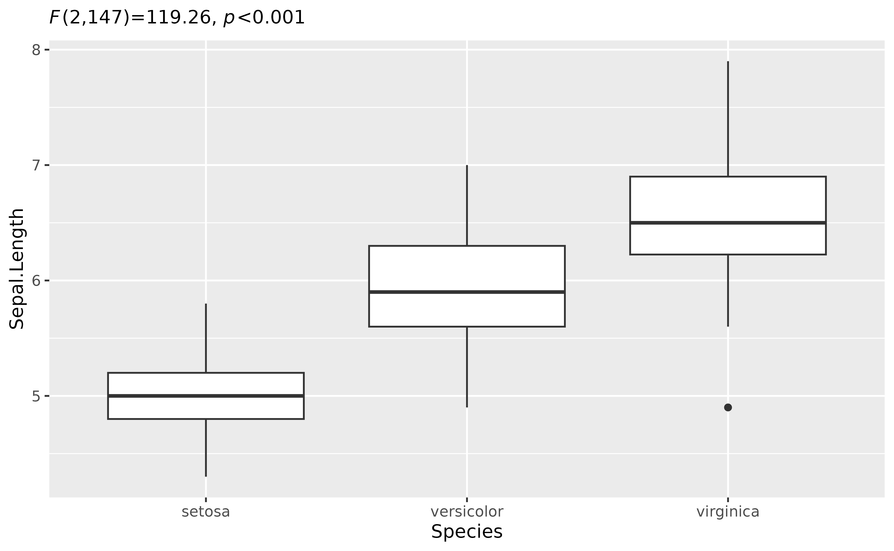

## 3. I am getting `Error in grid.Call` error

Sometimes, if you are working in `RStudio`, you might see the following
error-

``` r
Error in grid.Call(C_textBounds, as.graphicsAnnot(x$label), x$x, x$y, :
polygon edge not found
```

This can possibly be solved by increasing the size of RStudio viewer
pane.

## 4. Why do I get only plot in return but not the subtitle/caption?

In order to prevent the entire plotting function from failing when
statistical analysis fails, functions in
[ggstatsplot](https://www.indrapatil.com/ggstatsplot/) default to first
attempting to run the analysis and if they fail, then return empty
(`NULL`) subtitle/caption. In such cases, if you wish to diagnose why
the analysis is failing, you will have to do so using the underlying
function used to carry out statistical analysis.

For example, the following returns only the plot but not the statistical
details in a subtitle.

`df`` ``<-`` `[`data.frame`](https://rdrr.io/r/base/data.frame.html)`(``x ``=`` ``1``, y ``=`` ``2``)`` `[`ggscatterstats`](https://www.indrapatil.com/ggstatsplot/reference/ggscatterstats.md)`(``df``, ``x``, ``y``, type ``=`` ``"robust"``)`

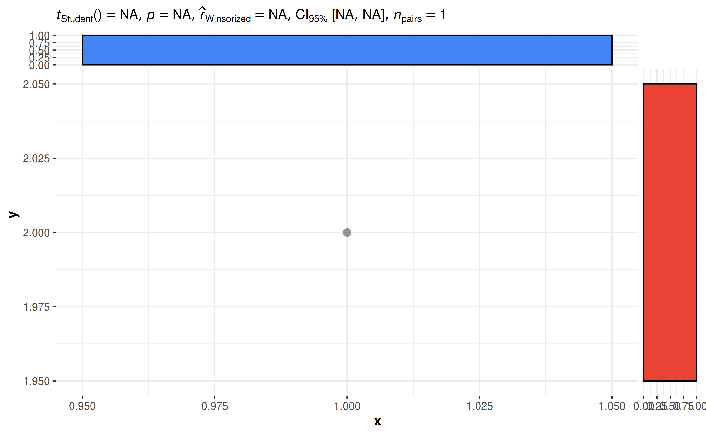

To see why the statistical analysis failed, you can look at the error
from the underlying function:

[`library`](https://rdrr.io/r/base/library.html)`(`[`statsExpressions`](https://www.indrapatil.com/statsExpressions/)`)`` ``df`` ``<-`` `[`data.frame`](https://rdrr.io/r/base/data.frame.html)`(``x ``=`` ``1``, y ``=`` ``2``)`` `[`corr_test`](https://www.indrapatil.com/statsExpressions/reference/corr_test.html)`(``df``, ``x``, ``y``, type ``=`` ``"robust"``)`` ``#> ``# A tibble: 1 × 14`` ``#> ``parameter1`` ``parameter2`` ``effectsize`` ``estimate`` ``conf.level`` ``conf.low`` ``#> ``<chr>`` ``<chr>`` ``<chr>`` ``<lgl>`` ``<dbl>`` ``<lgl>`` `` ``#> ``1`` x y Winsorized NA correlation ``NA`` ``0.``95 ``NA`` `` ``#> ``conf.high`` ``statistic`` ``df.error`` ``p.value`` ``method`` ``n.obs`` ``#> ``<lgl>`` ``<lgl>`` ``<lgl>`` ``<dbl>`` ``<chr>`` ``<int>`` ``#> ``1`` ``NA`` ``NA`` ``NA`` ``NA`` Winsorized NA correlation 1`` ``#> ``conf.method`` ``expression`` ``#> ``<chr>`` ``<list>`` `` ``#> ``1`` normal ``<language>`

## 5. What statistical test was carried out?

In case you are not sure what was the statistical test that produced the
results shown in the subtitle of the plot, the best way to get that
information is to either look at the documentation for the function used
or check out the associated vignette.

Summary of all analysis is handily available in `README`:
<https://github.com/IndrajeetPatil/ggstatsplot/blob/master/README.md>

## 6. How can I use `{ggstatsplot}` functions in a `for` loop?

Given that all functions in
[ggstatsplot](https://www.indrapatil.com/ggstatsplot/) use tidy
evaluation, running these functions in a `for` loop requires minor
adjustment to how inputs are entered:

`col.name`` ``<-`` `[`colnames`](https://rdrr.io/r/base/colnames.html)`(``mtcars``)`` `` ``` # executing the function in a `for` loop ``` ``for`` ``(``i`` ``in`` ``3``:`[`length`](https://rdrr.io/r/base/length.html)`(``col.name``)``)`` ``{`` `` `[`ggbetweenstats`](https://www.indrapatil.com/ggstatsplot/reference/ggbetweenstats.md)`(`` `` data ``=`` ``mtcars``,`` `` x ``=`` ``cyl``,`` `` y ``=`` ``!``!``col.name``[``i``]`` `` ``)`` ``}`

That said, if repeating function execution across multiple columns in a
data frame in what you want to do, I will recommend
[purrr](https://purrr.tidyverse.org/)-based solution:

<https://www.indrapatil.com/ggstatsplot/articles/web_only/purrr_examples.html#repeating-function-execution-across-multiple-columns-in-a-data-frame>

This solution would work for `x` and `y` arguments, but not for
`grouping.var` argument, which first needs to be converted to a symbol:

`df`` ``<-`` ``dplyr``::`[`filter`](https://dplyr.tidyverse.org/reference/filter.html)`(``movies_long``, ``genre`` ``==`` ``"Comedy"`` ``|`` ``genre`` ``==`` ``"Drama"``)`` `` `[`grouped_ggscatterstats`](https://www.indrapatil.com/ggstatsplot/reference/grouped_ggscatterstats.md)`(`` `` data ``=`` ``df``,`` `` x ``=`` ``!``!`[`colnames`](https://rdrr.io/r/base/colnames.html)`(``df``)``[``3``]``,`` `` y ``=`` ``!``!`[`colnames`](https://rdrr.io/r/base/colnames.html)`(``df``)``[``5``]``,`` `` grouping.var ``=`` ``!``!``rlang``::`[`sym`](https://rlang.r-lib.org/reference/sym.html)`(`[`colnames`](https://rdrr.io/r/base/colnames.html)`(``df``)``[``8``]``)``,`` `` results.subtitle ``=`` ``FALSE`` ``)`

## 7. How can I have uniform Y-axes ranges in `grouped_` functions?

Across different facets of a `grouped_` plot, the axes ranges might
sometimes differ. You can use the `ggplot.component` parameter (present
in all functions) to have the same scale across the individual plots:

`` # provide a list of further `{ggplot2}` modifications using `ggplot.component` ``` `[`grouped_ggscatterstats`](https://www.indrapatil.com/ggstatsplot/reference/grouped_ggscatterstats.md)`(`` `` ``mtcars``,`` `` ``disp``,`` `` ``hp``,`` `` grouping.var ``=`` ``am``,`` `` results.subtitle ``=`` ``FALSE``,`` `` ggplot.component ``=`` `[`list`](https://rdrr.io/r/base/list.html)`(``ggplot2``::`[`scale_y_continuous`](https://ggplot2.tidyverse.org/reference/scale_continuous.html)`(`` `` breaks ``=`` `[`seq`](https://rdrr.io/r/base/seq.html)`(``50``, ``350``, ``50``)``,`` `` limits ``=`` ``(`[`c`](https://rdrr.io/r/base/c.html)`(``50``, ``350``)``)`` `` ``)``)`` ``)`

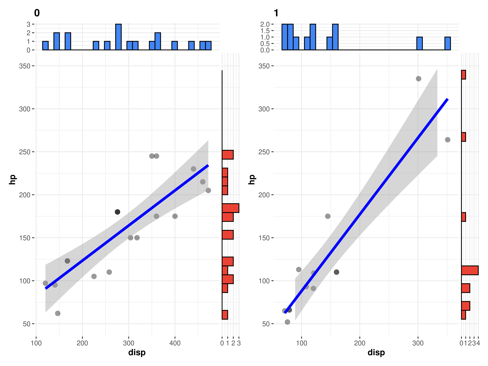

## 8. Does `{ggstatsplot}` work with `plotly`?

The `plotly` R graphing library makes it easy to produce interactive web
graphics via `plotly.js`.

The [ggstatsplot](https://www.indrapatil.com/ggstatsplot/) functions are
compatible with `plotly`.

[`library`](https://rdrr.io/r/base/library.html)`(`[`plotly`](https://plotly-r.com)`)`` `` ``` # creating ggplot object with `{ggstatsplot}` ``` ``p`` ``<-`` `[`ggbetweenstats`](https://www.indrapatil.com/ggstatsplot/reference/ggbetweenstats.md)`(``mtcars``, ``cyl``, ``mpg``)`` `` ``# converting to plotly object`` ``plotly``::``ggplotly``(``p``, width ``=`` ``480``, height ``=`` ``480``)`

## 9. How can I use `grouped_` functions with more than one group?

Currently, the `grouped_` variants of functions only support repeating
the analysis across a *single* grouping variable. Often, you have to run
the same analysis across a combination of more than two grouping
variables. This can be easily achieved using
[purrr](https://purrr.tidyverse.org/) package.

Here is an example-

` ``# creating a list by splitting data frame by combination of two different`` ``# grouping variables`` ``df_list`` ``<-`` ``mpg`` ``|>`` `` ``dplyr``::`[`filter`](https://dplyr.tidyverse.org/reference/filter.html)`(``drv`` `[`%in%`](https://rdrr.io/r/base/match.html)` `[`c`](https://rdrr.io/r/base/c.html)`(``"4"``, ``"f"``)``, ``fl`` `[`%in%`](https://rdrr.io/r/base/match.html)` `[`c`](https://rdrr.io/r/base/c.html)`(``"p"``, ``"r"``)``)`` ``|>`` `` ``(``\``(``d``)`` `[`split`](https://rdrr.io/r/base/split.html)`(``d``, f ``=`` `[`list`](https://rdrr.io/r/base/list.html)`(``d``$``drv``, ``d``$``fl``)``, drop ``=`` ``TRUE``)``)``(``)`` `` ``# checking if the length of the list is 4`` `[`length`](https://rdrr.io/r/base/length.html)`(``df_list``)`` ``#> [1] 4`` `` ``# running correlation analyses between; this will return a *list* of plots`` ``plot_list`` ``<-`` ``purrr``::`[`pmap`](https://purrr.tidyverse.org/reference/pmap.html)`(`` `` .l ``=`` `[`list`](https://rdrr.io/r/base/list.html)`(`` `` data ``=`` ``df_list``,`` `` x ``=`` ``"displ"``,`` `` y ``=`` ``"hwy"``,`` `` results.subtitle ``=`` ``FALSE`` `` ``)``,`` `` .f ``=`` ``ggscatterstats`` ``)`` `` ``# arrange the list in a single plot grid`` `[`combine_plots`](https://www.indrapatil.com/ggstatsplot/reference/combine_plots.md)`(`` `` plotlist ``=`` ``plot_list``,`` `` plotgrid.args ``=`` `[`list`](https://rdrr.io/r/base/list.html)`(``nrow ``=`` ``2L``)``,`` `` annotation.args ``=`` `[`list`](https://rdrr.io/r/base/list.html)`(``tag_levels ``=`` ``"i"``)`` ``)`

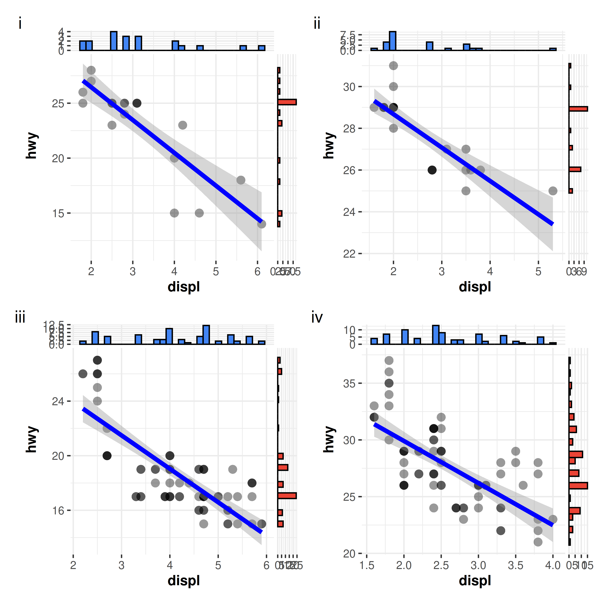

## 10. How can I include statistical expressions in facet labels?

[`library`](https://rdrr.io/r/base/library.html)`(`[`ggplot2`](https://ggplot2.tidyverse.org)`)`` `` ``# data`` ``mtcars1`` ``<-`` ``mtcars`` `` ``p`` ``<-`` `[`grouped_ggbetweenstats`](https://www.indrapatil.com/ggstatsplot/reference/grouped_ggbetweenstats.md)`(`` `` data ``=`` ``mtcars1``,`` `` x ``=`` ``cyl``,`` `` y ``=`` ``mpg``,`` `` grouping.var ``=`` ``am`` ``)`` `` ``expr1`` ``<-`` `[`extract_subtitle`](https://www.indrapatil.com/ggstatsplot/reference/extract_stats.md)`(``p``[[``1L``]``]``)`` ``expr2`` ``<-`` `[`extract_subtitle`](https://www.indrapatil.com/ggstatsplot/reference/extract_stats.md)`(``p``[[``2L``]``]``)`` `` ``mtcars1``$``am`` ``<-`` `[`factor`](https://rdrr.io/r/base/factor.html)`(``mtcars1``$``am``, levels ``=`` `[`c`](https://rdrr.io/r/base/c.html)`(``0``, ``1``)``, labels ``=`` `[`c`](https://rdrr.io/r/base/c.html)`(``expr1``, ``expr2``)``)`` `` ``mtcars1`` ``|>`` `` `[`ggplot`](https://ggplot2.tidyverse.org/reference/ggplot.html)`(`[`aes`](https://ggplot2.tidyverse.org/reference/aes.html)`(``x ``=`` ``cyl``, y ``=`` ``mpg``)``)`` ``+`` `` `[`geom_jitter`](https://ggplot2.tidyverse.org/reference/geom_jitter.html)`(``)`` ``+`` `` `[`facet_wrap`](https://ggplot2.tidyverse.org/reference/facet_wrap.html)`(`` `` `[`vars`](https://ggplot2.tidyverse.org/reference/vars.html)`(``am``)``,`` `` ncol ``=`` ``1``,`` `` strip.position ``=`` ``"top"``,`` `` labeller ``=`` ``ggplot2``::`[`label_parsed`](https://ggplot2.tidyverse.org/reference/labellers.html)` `` ``)`

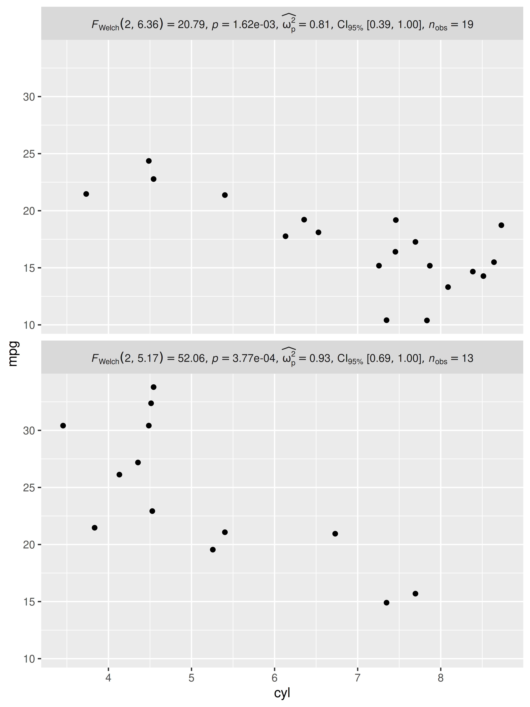

## 11. How to customize which pairs are shown in pairwise comparisons?

Currently, for `ggbetweenstats` and `ggwithinstats`, you can either
display all **significant** comparisons, all **non-significant**
comparisons, or **all** comparisons. But what if I am only interested in
just one particular comparison?

Here is a workaround using
[ggsignif](https://const-ae.github.io/ggsignif/):

[`library`](https://rdrr.io/r/base/library.html)`(`[`ggsignif`](https://const-ae.github.io/ggsignif/)`)`` `` `[`ggbetweenstats`](https://www.indrapatil.com/ggstatsplot/reference/ggbetweenstats.md)`(``mtcars``, ``cyl``, ``wt``, pairwise.display ``=`` ``"none"``)`` ``+`` `` `[`geom_signif`](https://const-ae.github.io/ggsignif/reference/stat_signif.html)`(``comparisons ``=`` `[`list`](https://rdrr.io/r/base/list.html)`(`[`c`](https://rdrr.io/r/base/c.html)`(``"4"``, ``"6"``)``)``, test.args ``=`` `[`list`](https://rdrr.io/r/base/list.html)`(``exact ``=`` ``FALSE``)``)`

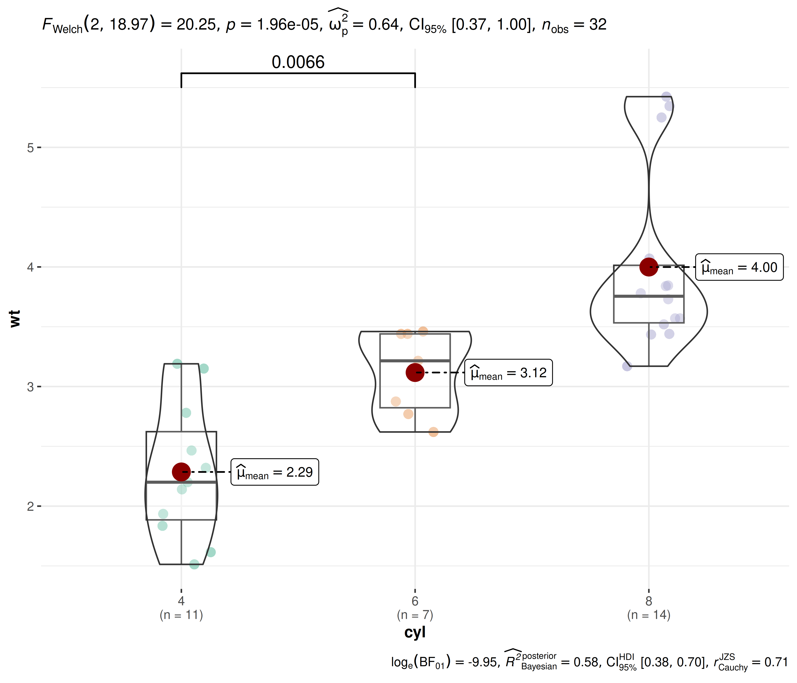

## 12. How to access data frame with results from pairwise comparisons?

Behind the scenes,
[ggstatsplot](https://www.indrapatil.com/ggstatsplot/) uses
`statsExpressions::statsExpressions::pairwise_comparisons()` function.

You can use it to extract actual data frames used in
[ggstatsplot](https://www.indrapatil.com/ggstatsplot/) functions.

[`library`](https://rdrr.io/r/base/library.html)`(`[`ggplot2`](https://ggplot2.tidyverse.org)`)`` `` ``statsExpressions``::`[`pairwise_comparisons`](https://www.indrapatil.com/statsExpressions/reference/pairwise_comparisons.html)`(``mtcars``, ``cyl``, ``wt``)`` ``#> ``# A tibble: 3 × 9`` ``#> ``group1`` ``group2`` ``statistic`` ``p.value`` ``alternative`` ``distribution`` ``p.adjust.method`` ``#> ``<chr>`` ``<chr>`` ``<dbl>`` ``<dbl>`` ``<chr>`` ``<chr>`` ``<chr>`` `` ``#> ``1`` 4 6 5.39 ``0.00``8``31`` two.sided q Holm `` ``#> ``2`` 4 8 9.11 ``0.000``0``12``4 two.sided q Holm `` ``#> ``3`` 6 8 5.12 ``0.00``8``31`` two.sided q Holm `` ``#> ``test`` ``expression`` ``#> ``<chr>`` ``<list>`` `` ``#> ``1`` Games-Howell ``<language>`` ``#> ``2`` Games-Howell ``<language>`` ``#> ``3`` Games-Howell ``<language>`

## 13. How can I change annotation in pairwise comparisons?

[ggstatsplot](https://www.indrapatil.com/ggstatsplot/) defaults to
displaying exact p-values or logged Bayes Factor values for pairwise
comparisons. But what if you wish to adopt a different annotation
labels?

You will have to customize them yourself:

[`library`](https://rdrr.io/r/base/library.html)`(`[`ggplot2`](https://ggplot2.tidyverse.org)`)`` `[`library`](https://rdrr.io/r/base/library.html)`(`[`ggsignif`](https://const-ae.github.io/ggsignif/)`)`` `` ``# converting to factor`` ``mtcars``$``cyl`` ``<-`` `[`as.factor`](https://rdrr.io/r/base/factor.html)`(``mtcars``$``cyl``)`` `` ``# creating the base plot`` ``p`` ``<-`` `[`ggbetweenstats`](https://www.indrapatil.com/ggstatsplot/reference/ggbetweenstats.md)`(``mtcars``, ``cyl``, ``wt``, pairwise.display ``=`` ``"none"``)`` `` ``` # using `statsExpressions::pairwise_comparisons()` function to create a data frame with results ``` ``df`` ``<-`` ``statsExpressions``::`[`pairwise_comparisons`](https://www.indrapatil.com/statsExpressions/reference/pairwise_comparisons.html)`(``mtcars``, ``cyl``, ``wt``)`` ``|>`` `` ``dplyr``::`[`mutate`](https://dplyr.tidyverse.org/reference/mutate.html)`(``groups ``=`` ``purrr``::`[`pmap`](https://purrr.tidyverse.org/reference/pmap.html)`(``.l ``=`` `[`list`](https://rdrr.io/r/base/list.html)`(``group1``, ``group2``)``, .f ``=`` ``c``)``)`` ``|>`` `` ``dplyr``::`[`arrange`](https://dplyr.tidyverse.org/reference/arrange.html)`(``group1``)`` ``|>`` `` ``dplyr``::`[`mutate`](https://dplyr.tidyverse.org/reference/mutate.html)`(``asterisk_label ``=`` `[`c`](https://rdrr.io/r/base/c.html)`(``"**"``, ``"***"``, ``"**"``)``)`` `` ``df`` ``#> ``# A tibble: 3 × 11`` ``#> ``group1`` ``group2`` ``statistic`` ``p.value`` ``alternative`` ``distribution`` ``p.adjust.method`` ``#> ``<chr>`` ``<chr>`` ``<dbl>`` ``<dbl>`` ``<chr>`` ``<chr>`` ``<chr>`` `` ``#> ``1`` 4 6 5.39 ``0.00``8``31`` two.sided q Holm `` ``#> ``2`` 4 8 9.11 ``0.000``0``12``4 two.sided q Holm `` ``#> ``3`` 6 8 5.12 ``0.00``8``31`` two.sided q Holm `` ``#> ``test`` ``expression`` ``groups`` ``asterisk_label`` ``#> ``<chr>`` ``<list>`` ``<list>`` ``<chr>`` `` ``#> ``1`` Games-Howell ``<language>`` ``<chr [2]>`` ** `` ``#> ``2`` Games-Howell ``<language>`` ``<chr [2]>`` *** `` ``#> ``3`` Games-Howell ``<language>`` ``<chr [2]>`` **`` `` ``` # adding pairwise comparisons using `{ggsignif}` package ``` ``p`` ``+`` `` ``ggsignif``::`[`geom_signif`](https://const-ae.github.io/ggsignif/reference/stat_signif.html)`(`` `` comparisons ``=`` ``df``$``groups``,`` `` map_signif_level ``=`` ``TRUE``,`` `` annotations ``=`` ``df``$``asterisk_label``,`` `` y_position ``=`` `[`c`](https://rdrr.io/r/base/c.html)`(``5.5``, ``5.75``, ``6.0``)``,`` `` test ``=`` ``NULL``,`` `` na.rm ``=`` ``TRUE`` `` ``)`

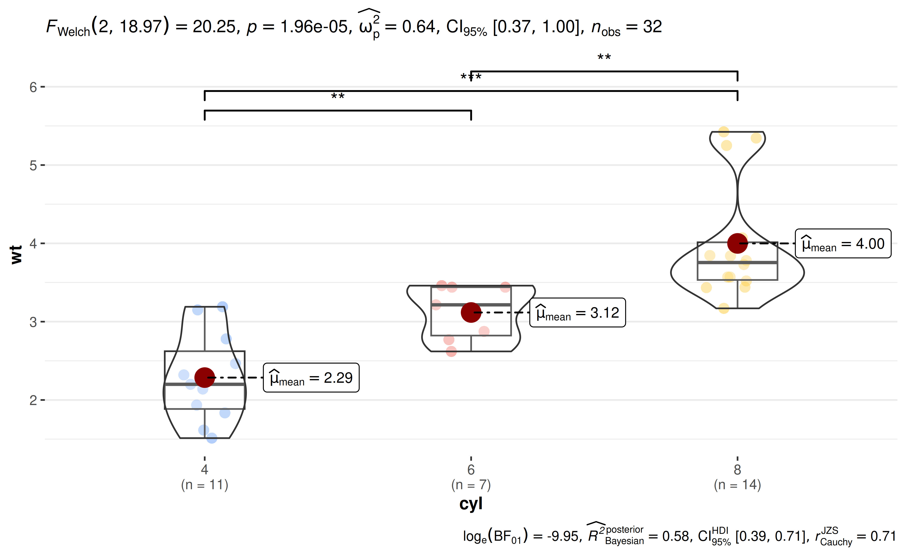

## 14. How to access data frame containing statistical analyses?

You can use the
[`extract_stats()`](https://www.indrapatil.com/ggstatsplot/reference/extract_stats.md)
helper function for this.

[`library`](https://rdrr.io/r/base/library.html)`(`[`ggplot2`](https://ggplot2.tidyverse.org)`)`` `` ``p`` ``<-`` `[`ggpiestats`](https://www.indrapatil.com/ggstatsplot/reference/ggpiestats.md)`(``mtcars``, ``am``, ``cyl``)`` `` ``# data frame with results`` `[`extract_stats`](https://www.indrapatil.com/ggstatsplot/reference/extract_stats.md)`(``p``)`` ``#> $subtitle_data`` ``#> ``# A tibble: 1 × 13`` ``#> ``statistic`` ``df`` ``p.value`` ``method`` ``effectsize`` ``estimate`` ``#> ``<dbl>`` ``<int>`` ``<dbl>`` ``<chr>`` ``<chr>`` ``<dbl>`` ``#> ``1`` 8.74 2 ``0.0``12``6`` Pearson's Chi-squared test Cramer's V (adj.) ``0.``464`` ``#> ``conf.level`` ``conf.low`` ``conf.high`` ``conf.method`` ``conf.distribution`` ``n.obs`` ``expression`` ``#> ``<dbl>`` ``<dbl>`` ``<dbl>`` ``<chr>`` ``<chr>`` ``<int>`` ``<list>`` `` ``#> ``1`` ``0.``95 ``0`` ``0.``820 ncp chisq 32 ``<language>`` ``#> `` ``#> $caption_data`` ``#> ``# A tibble: 1 × 15`` ``#> ``term`` ``conf.level`` ``effectsize`` ``estimate`` ``conf.low`` ``conf.high`` ``#> ``<chr>`` ``<dbl>`` ``<chr>`` ``<dbl>`` ``<dbl>`` ``<dbl>`` ``#> ``1`` Ratio ``0.``95 Cramers_v ``0.``415 ``0`` ``0.``669`` ``#> ``prior.distribution`` ``prior.location`` ``prior.scale`` ``bf10`` ``#> ``<chr>`` ``<dbl>`` ``<dbl>`` ``<dbl>`` ``#> ``1`` independent multinomial ``0`` 1 16.8`` ``#> ``method`` ``conf.method`` ``log_e_bf10`` ``n.obs`` ``expression`` ``#> ``<chr>`` ``<chr>`` ``<dbl>`` ``<int>`` ``<list>`` `` ``#> ``1`` Bayesian contingency table analysis ETI 2.82 32 ``<language>`` ``#> `` ``#> $pairwise_comparisons_data`` ``#> NULL`` ``#> `` ``#> $descriptive_data`` ``#> ``# A tibble: 6 × 5`` ``#> ``cyl`` ``am`` ``counts`` ``perc`` ``.label`` ``#> ``<fct>`` ``<fct>`` ``<int>`` ``<dbl>`` ``<chr>`` `` ``#> ``1`` 4 0 3 27.3 27% `` ``#> ``2`` 4 1 8 72.7 73% `` ``#> ``3`` 6 0 4 57.1 57% `` ``#> ``4`` 6 1 3 42.9 43% `` ``#> ``5`` 8 0 12 85.7 86% `` ``#> ``6`` 8 1 2 14.3 14% `` ``#> `` ``#> $one_sample_data`` ``#> ``# A tibble: 3 × 19`` ``#> ``cyl`` ``counts`` ``perc`` ``N`` ``statistic`` ``df`` ``p.value`` ``#> ``<fct>`` ``<int>`` ``<dbl>`` ``<chr>`` ``<dbl>`` ``<dbl>`` ``<dbl>`` ``#> ``1`` 8 14 43.8 (n = 14) 7.14 1 ``0.00``7``53`` ``#> ``2`` 6 7 21.9 (n = 7) ``0.``143 1 ``0.``705 `` ``#> ``3`` 4 11 34.4 (n = 11) 2.27 1 ``0.``132 `` ``#> ``method`` ``effectsize`` ``estimate`` ``conf.level`` ``#> ``<chr>`` ``<chr>`` ``<dbl>`` ``<dbl>`` ``#> ``1`` Chi-squared test for given probabilities Pearson's C ``0.``581 ``0.``95`` ``#> ``2`` Chi-squared test for given probabilities Pearson's C ``0.``141 ``0.``95`` ``#> ``3`` Chi-squared test for given probabilities Pearson's C ``0.``414 ``0.``95`` ``#> ``conf.low`` ``conf.high`` ``conf.method`` ``conf.distribution`` ``n.obs`` ``expression`` ``#> ``<dbl>`` ``<dbl>`` ``<chr>`` ``<chr>`` ``<int>`` ``<list>`` `` ``#> ``1`` ``0.``186 ``0.``778 ncp chisq 14 ``<language>`` ``#> ``2`` ``0`` ``0.``652 ncp chisq 7 ``<language>`` ``#> ``3`` ``0`` ``0.``723 ncp chisq 11 ``<language>`` ``#> ``.label`` `` ``#> ``<glue>`` `` ``#> ``1`` list(~chi['gof']^2~(1)==7.14, ~italic(p)=='7.53e-03', ~italic(n)=='14')`` ``#> ``2`` list(~chi['gof']^2~(1)==0.14, ~italic(p)=='0.71', ~italic(n)=='7') `` ``#> ``3`` list(~chi['gof']^2~(1)==2.27, ~italic(p)=='0.13', ~italic(n)=='11') `` ``#> ``.p.label`` `` ``#> ``<glue>`` `` ``#> ``1`` list(~italic(p)=='7.53e-03')`` ``#> ``2`` list(~italic(p)=='0.71') `` ``#> ``3`` list(~italic(p)=='0.13') `` ``#> `` ``#> $tidy_data`` ``#> NULL`` ``#> `` ``#> $glance_data`` ``#> NULL`` ``#> `` ``#> attr(,"class")`` ``#> [1] "ggstatsplot_stats" "list"`

## 15. How can I remove a particular `geom` layer from the plot?

Sometimes you may not want a particular `geom` layer to be displayed.
You can remove them by setting transparency (`alpha`) for that layer to
0.

For example, let’s say I want to remove the points from
`ggwithintstats()` plot:

` ``# before`` `[`ggwithinstats`](https://www.indrapatil.com/ggstatsplot/reference/ggwithinstats.md)`(`` `` data ``=`` ``bugs_long``,`` `` x ``=`` ``condition``,`` `` y ``=`` ``desire``,`` `` results.subtitle ``=`` ``FALSE``,`` `` pairwise.display ``=`` ``"none"`` ``)`

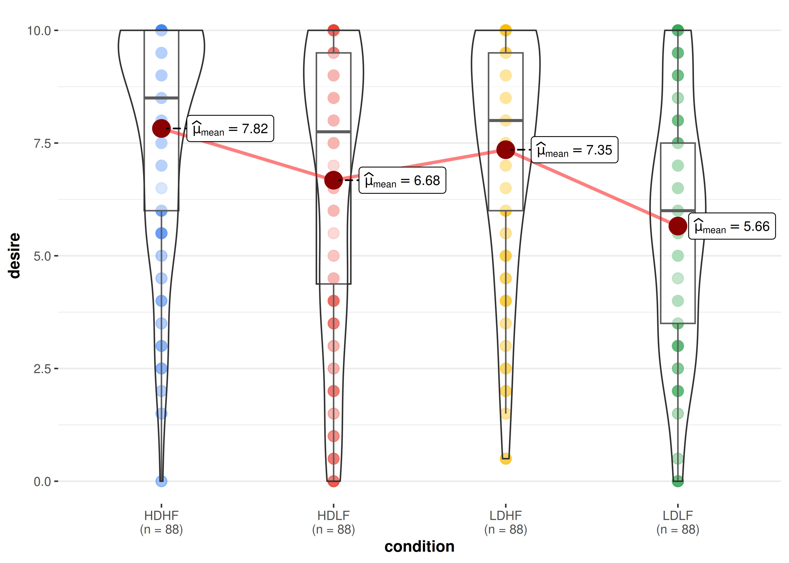

` ``# after`` `[`ggwithinstats`](https://www.indrapatil.com/ggstatsplot/reference/ggwithinstats.md)`(`` `` data ``=`` ``bugs_long``,`` `` x ``=`` ``condition``,`` `` y ``=`` ``desire``,`` `` point.args ``=`` `[`list`](https://rdrr.io/r/base/list.html)`(``alpha ``=`` ``0``)``,`` `` results.subtitle ``=`` ``FALSE``,`` `` pairwise.display ``=`` ``"none"`` ``)`

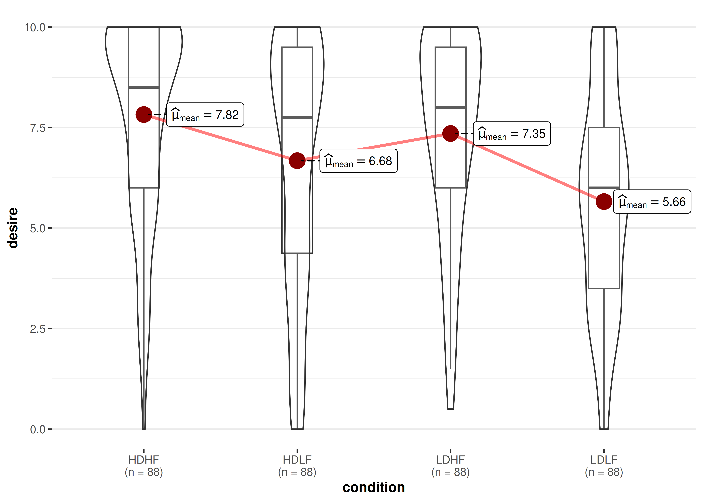

## 16. How can I modify the fill colors with custom values?

Sometimes you may not be satisfied with the available color palette
values. In this case, you can also change the colors by manually
specifying these values.

[`library`](https://rdrr.io/r/base/library.html)`(`[`ggplot2`](https://ggplot2.tidyverse.org)`)`` `` `[`ggbarstats`](https://www.indrapatil.com/ggstatsplot/reference/ggbarstats.md)`(``mtcars``, ``am``, ``cyl``, results.subtitle ``=`` ``FALSE``)`` ``+`` `` `[`scale_fill_manual`](https://ggplot2.tidyverse.org/reference/scale_manual.html)`(``values ``=`` `[`c`](https://rdrr.io/r/base/c.html)`(``"#E7298A"``, ``"#66A61E"``)``)`

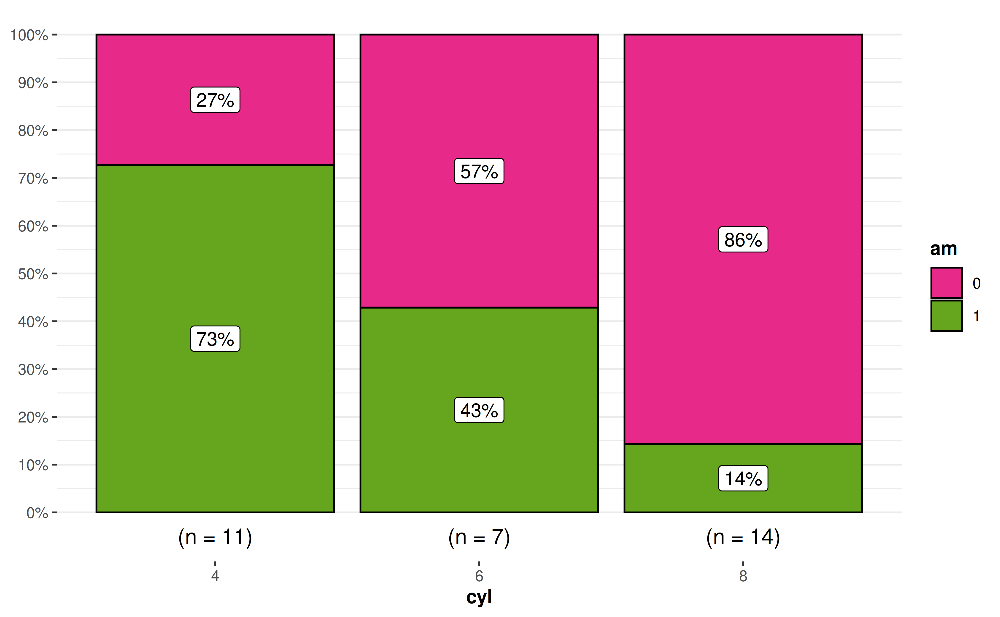

The same can also be done for `grouped_` functions:

[`grouped_ggpiestats`](https://www.indrapatil.com/ggstatsplot/reference/grouped_ggpiestats.md)`(`` `` data ``=`` ``mtcars``,`` `` grouping.var ``=`` ``am``,`` `` x ``=`` ``cyl``,`` `` ggplot.component ``=`` ``ggplot2``::`[`scale_fill_grey`](https://ggplot2.tidyverse.org/reference/scale_grey.html)`(``)`` ``)`

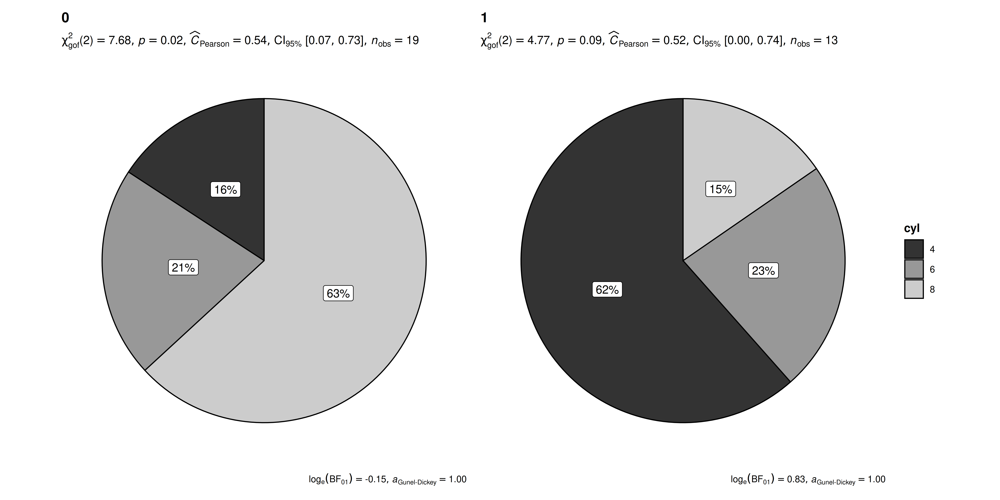

## 17. How can I modify `grouped_` outputs using `{ggplot2}` functions?

All [ggstatsplot](https://www.indrapatil.com/ggstatsplot/) are `ggplot`
objects, which can be further modified, just like any other `ggplot`
object. But exception to these are all plots returned by `grouped_`
functions, but there is a way to tackle this.

[`library`](https://rdrr.io/r/base/library.html)`(`[`paletteer`](https://emilhvitfeldt.github.io/paletteer/)`)`` `[`library`](https://rdrr.io/r/base/library.html)`(`[`ggplot2`](https://ggplot2.tidyverse.org)`)`` `` `[`grouped_ggbetweenstats`](https://www.indrapatil.com/ggstatsplot/reference/grouped_ggbetweenstats.md)`(`` `` ``mtcars``,`` `` ``cyl``,`` `` ``wt``,`` `` grouping.var ``=`` ``am``,`` `` results.subtitle ``=`` ``FALSE``,`` `` pairwise.display ``=`` ``"none"``,`` `` ``` # modify further with `{ggplot2}` functions ``` `` ggplot.component ``=`` `[`list`](https://rdrr.io/r/base/list.html)`(`` `` `[`scale_color_manual`](https://ggplot2.tidyverse.org/reference/scale_manual.html)`(``values ``=`` ``paletteer``::`[`paletteer_c`](https://emilhvitfeldt.github.io/paletteer/reference/paletteer_c.html)`(``"viridis::viridis"``, ``3``)``)``,`` `` `[`theme`](https://ggplot2.tidyverse.org/reference/theme.html)`(``axis.text.x ``=`` `[`element_text`](https://ggplot2.tidyverse.org/reference/element.html)`(``angle ``=`` ``90``)``)`` `` ``)`` ``)`

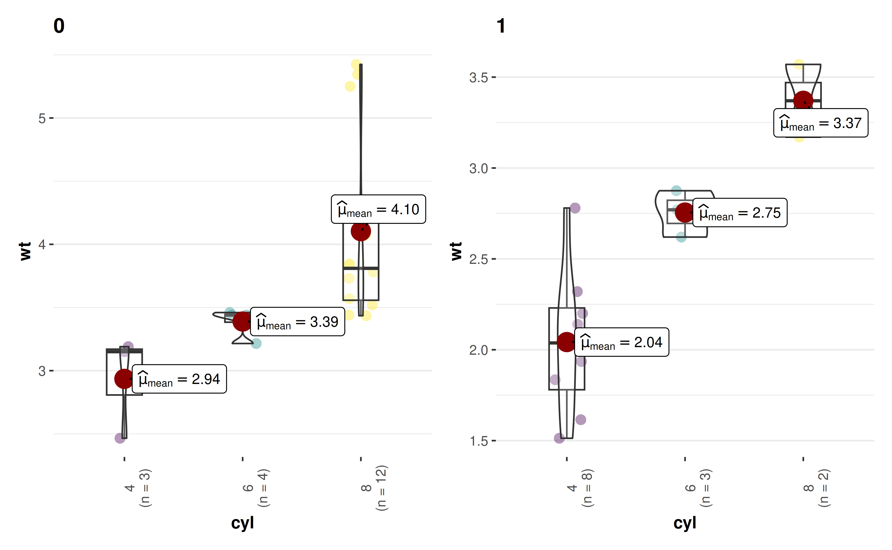

## 18. How can I extract data frame containing results from `{ggstatsplot}`?

[ggstatsplot](https://www.indrapatil.com/ggstatsplot/) can return
expressions in the subtitle and caption, but what if you want to
actually get back data frame containing the results?

You have two options:

- Use
  [`ggstatsplot::extract_stats()`](https://www.indrapatil.com/ggstatsplot/reference/extract_stats.md)
  function
- Or go to the source package
  [statsExpressions](https://www.indrapatil.com/statsExpressions/) (see
  [examples](https://www.indrapatil.com/statsExpressions/articles/dataframe_outputs.html))

## 19. How can I remove sample size labels for `ggbarstats`?

    library(gginnards)

    ## create a plot
    p <- ggbarstats(mtcars, am, cyl)

    ## remove layer corresponding to sample size
    delete_layers(p, "GeomText")

## 20. Statistical analysis I want to carry out is not available. What can I do?

By default, since [ggstatsplot](https://www.indrapatil.com/ggstatsplot/)
always allows just **one** type of test per statistical approach,
sometimes your favorite test might not be available. For example,
[ggstatsplot](https://www.indrapatil.com/ggstatsplot/) provides only
Spearman’s $`\rho`$, but not Kendall’s $`\tau`$ as a non-parametric
correlation test.

In such cases, you can override the defaults and use
[statsExpressions](https://www.indrapatil.com/statsExpressions/) to
create custom expressions to display in the plot. But be forewarned that
the expression building function in
[statsExpressions](https://www.indrapatil.com/statsExpressions/) is not
stable yet.

[`library`](https://rdrr.io/r/base/library.html)`(`[`correlation`](https://easystats.github.io/correlation/)`)`` `[`library`](https://rdrr.io/r/base/library.html)`(`[`statsExpressions`](https://www.indrapatil.com/statsExpressions/)`)`` `[`library`](https://rdrr.io/r/base/library.html)`(`[`ggplot2`](https://ggplot2.tidyverse.org)`)`` `` ``# data with two variables of interest`` ``df`` ``<-`` ``dplyr``::`[`select`](https://dplyr.tidyverse.org/reference/select.html)`(``mtcars``, ``wt``, ``mpg``)`` `` ``# correlation results`` ``results`` ``<-`` `[`correlation`](https://easystats.github.io/correlation/reference/correlation.html)`(``df``, method ``=`` ``"kendall"``)`` ``|>`` `` ``insight``::`[`standardize_names`](https://easystats.github.io/insight/reference/standardize_names.html)`(``style ``=`` ``"broom"``)`` `` ``# creating expression out of these results`` ``df_results`` ``<-`` ``statsExpressions``::`[`add_expression_col`](https://www.indrapatil.com/statsExpressions/reference/add_expression_col.html)`(`` `` data ``=`` ``results``,`` `` no.parameters ``=`` ``0L``,`` `` statistic.text ``=`` `[`list`](https://rdrr.io/r/base/list.html)`(`[`quote`](https://rdrr.io/r/base/substitute.html)`(``italic``(``"T"``)``)``)``,`` `` effsize.text ``=`` `[`list`](https://rdrr.io/r/base/list.html)`(`[`quote`](https://rdrr.io/r/base/substitute.html)`(``widehat``(``italic``(``tau``)``)``[``"Kendall"``]``)``)``,`` `` n ``=`` ``results``$``n.obs``[[``1``]``]`` ``)`` `` ``# using custom expression in plot`` `[`ggscatterstats`](https://www.indrapatil.com/ggstatsplot/reference/ggscatterstats.md)`(``df``, ``wt``, ``mpg``, results.subtitle ``=`` ``FALSE``)`` ``+`` `` `[`labs`](https://ggplot2.tidyverse.org/reference/labs.html)`(``subtitle ``=`` ``df_results``$``expression``[[``1``]``]``)`

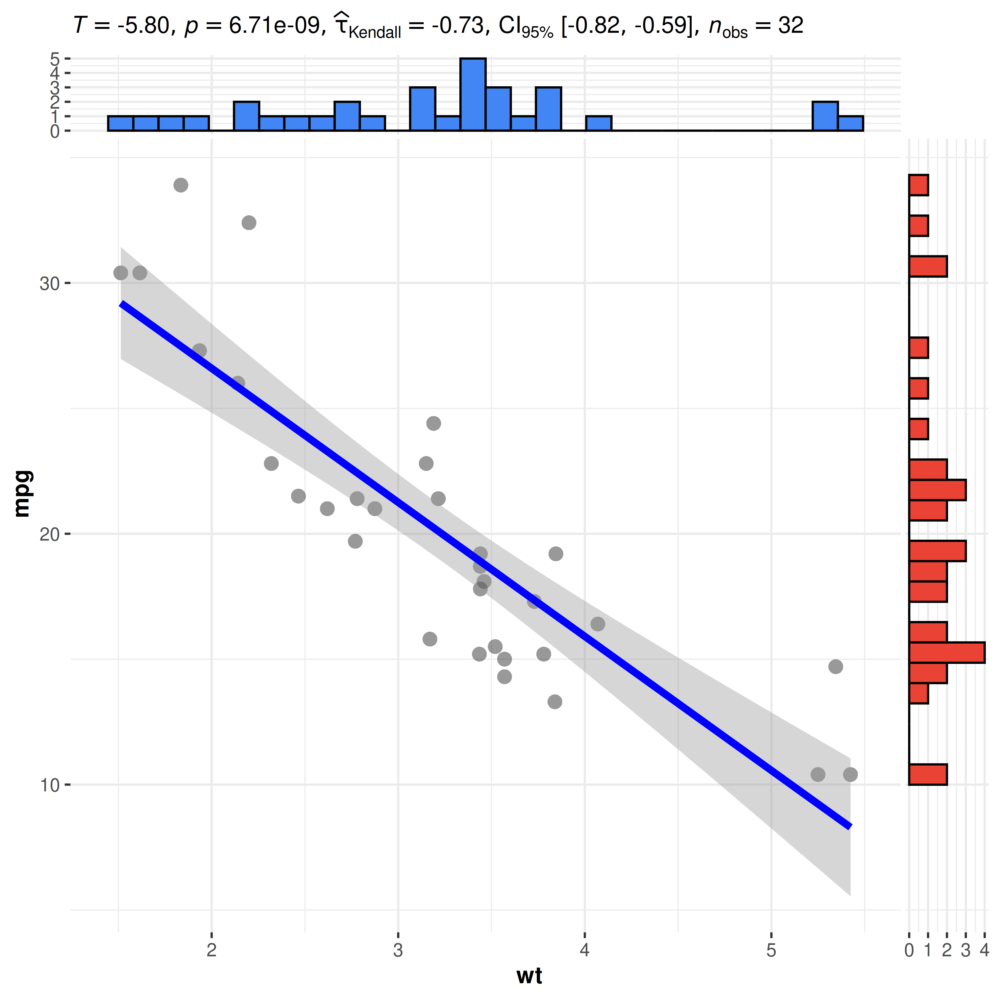

## 21. Is there way to adjust my alpha level?

No, there is no way to adjust alpha if you use `grouped_` functions
(e.g., `grouped_ggwithinstats`). You will have to just report in the
paper/article/report, what your adjusted alpha is.

So, for example, iif 2 tests are being carried out, the alpha is going
to be `0.05/2 = 0.025`. So, when you describe the *Methods* section, you
can mention that only those tests should be considered significant where
`p < 0.025`. Or you can even mention this in the caption.

## 22. How can I build a `Shiny` app using `{ggstatsplot}` functions?

Below is an example using `ggbetweenstats` function.

[`library`](https://rdrr.io/r/base/library.html)`(`[`shiny`](https://shiny.posit.co/)`)`` `[`library`](https://rdrr.io/r/base/library.html)`(`[`rlang`](https://rlang.r-lib.org)`)`` `` ``ui`` ``<-`` ``fluidPage``(`` `` ``headerPanel``(``"Example - ggbetweenstats"``)``,`` `` ``sidebarPanel``(`` `` ``selectInput``(``"x"``, ``"xcol"``, ``"X Variable"``, choices ``=`` `[`names`](https://rdrr.io/r/base/names.html)`(``iris``)``[``5``]``)``,`` `` ``selectInput``(``"y"``, ``"ycol"``, ``"Y Variable"``, choices ``=`` `[`names`](https://rdrr.io/r/base/names.html)`(``iris``)``[``1``:``4``]``)`` `` ``)``,`` `` ``mainPanel``(``plotOutput``(``"plot"``)``)`` ``)`` `` ``server`` ``<-`` ``function``(``input``, ``output``)`` ``{`` `` ``output``$``plot`` ``<-`` ``renderPlot``(``{`` `` `[`ggbetweenstats`](https://www.indrapatil.com/ggstatsplot/reference/ggbetweenstats.md)`(``iris``, ``!``!``input``$``x``, ``!``!``input``$``y``)`` `` ``}``)`` ``}`` `` ``shinyApp``(``ui``, ``server``)`

## 23. How to change size of annotations for combined plot in `grouped_*` functions?

[`library`](https://rdrr.io/r/base/library.html)`(`[`ggplot2`](https://ggplot2.tidyverse.org)`)`` `` `[`grouped_ggbetweenstats`](https://www.indrapatil.com/ggstatsplot/reference/grouped_ggbetweenstats.md)`(`` `` data ``=`` ``dplyr``::`[`filter`](https://dplyr.tidyverse.org/reference/filter.html)`(``ggplot2``::`[`mpg`](https://ggplot2.tidyverse.org/reference/mpg.html)`, ``drv`` ``!=`` ``"4"``)``,`` `` x ``=`` ``year``,`` `` y ``=`` ``hwy``,`` `` grouping.var ``=`` ``drv``,`` `` results.subtitle ``=`` ``FALSE``,`` `` ``` ## arguments given to `{patchwork}` for combining plots ``` `` annotation.args ``=`` `[`list`](https://rdrr.io/r/base/list.html)`(`` `` title ``=`` ``"this is my title"``,`` `` subtitle ``=`` ``"this is my subtitle"``,`` `` theme ``=`` ``ggplot2``::`[`theme`](https://ggplot2.tidyverse.org/reference/theme.html)`(`` `` plot.subtitle ``=`` `[`element_text`](https://ggplot2.tidyverse.org/reference/element.html)`(``size ``=`` ``20``)``,`` `` plot.title ``=`` `[`element_text`](https://ggplot2.tidyverse.org/reference/element.html)`(``size ``=`` ``30``)`` `` ``)`` `` ``)`` ``)`

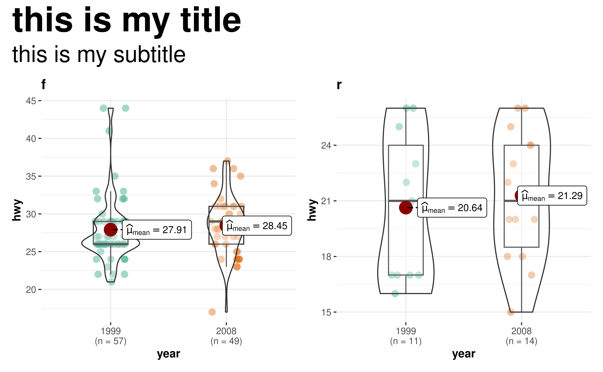

## 24. How to change size of text in the subtitle?

[`ggbetweenstats`](https://www.indrapatil.com/ggstatsplot/reference/ggbetweenstats.md)`(`` `` data ``=`` ``iris``,`` `` x ``=`` ``Species``,`` `` y ``=`` ``Sepal.Length``,`` `` ggplot.component ``=`` `[`list`](https://rdrr.io/r/base/list.html)`(`[`theme`](https://ggplot2.tidyverse.org/reference/theme.html)`(``plot.subtitle ``=`` `[`element_text`](https://ggplot2.tidyverse.org/reference/element.html)`(``size ``=`` ``20``, face ``=`` ``"bold"``)``)``)`` ``)`

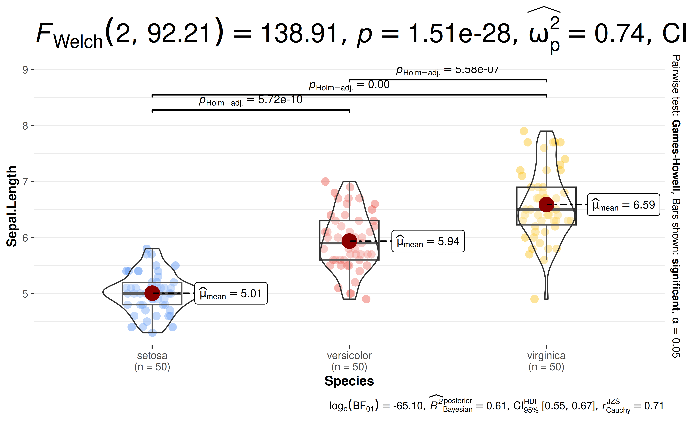

## 25. How to display pairwise comparison letter in a plot?

This is not possible out of the box, but see
[this](https://github.com/IndrajeetPatil/ggstatsplot/issues/654#issuecomment-948862514)
comment.

## 26. Does `{ggstatsplot}` carry out assumption checks?

No, [ggstatsplot](https://www.indrapatil.com/ggstatsplot/) does not
carry out any analysis of whether assumptions are met or not. It will
just carry out whatever test you ask it to carry out.

To check these assumptions, you can use a different package called
[performance](https://easystats.github.io/performance/):

<https://easystats.github.io/performance/reference/index.html#check-model-assumptions-or-data-properties>

## 27. I am on Ubuntu and have trouble installing `{PMCMRplus}`?

Linux users may encounter some installation problems. In particular, the
[ggstatsplot](https://www.indrapatil.com/ggstatsplot/) package depends
on the `{PMCMRplus}` package.

``` r
ERROR: dependencies ‘gmp’, ‘Rmpfr’ are not available for package ‘PMCMRplus’
```

This means that your operating system lacks `gmp` and `Rmpfr` libraries.

If you use `Ubuntu`, you can install these dependencies:

    sudo apt-get install libgmp3-dev
    sudo apt-get install libmpfr-dev

The following `README` file briefly describes the installation
procedure:
<https://CRAN.R-project.org/package=PMCMRplus/readme/README.html>

For MacOS, have a look at this
[post](https://stackoverflow.com/questions/35360885/installing-finding-gmp-under-osx).

## 28. How to modify the secondary Y-axis title?

[`ggbetweenstats`](https://www.indrapatil.com/ggstatsplot/reference/ggbetweenstats.md)`(`` `` ``mtcars``, ``cyl``, ``wt``,`` `` ggplot.component ``=`` `[`list`](https://rdrr.io/r/base/list.html)`(`` `` ``ggplot2``::`[`scale_y_continuous`](https://ggplot2.tidyverse.org/reference/scale_continuous.html)`(``sec.axis ``=`` ``ggplot2``::`[`dup_axis`](https://ggplot2.tidyverse.org/reference/sec_axis.html)`(``name ``=`` ``"My custom test"``)``)`` `` ``)`` ``)`

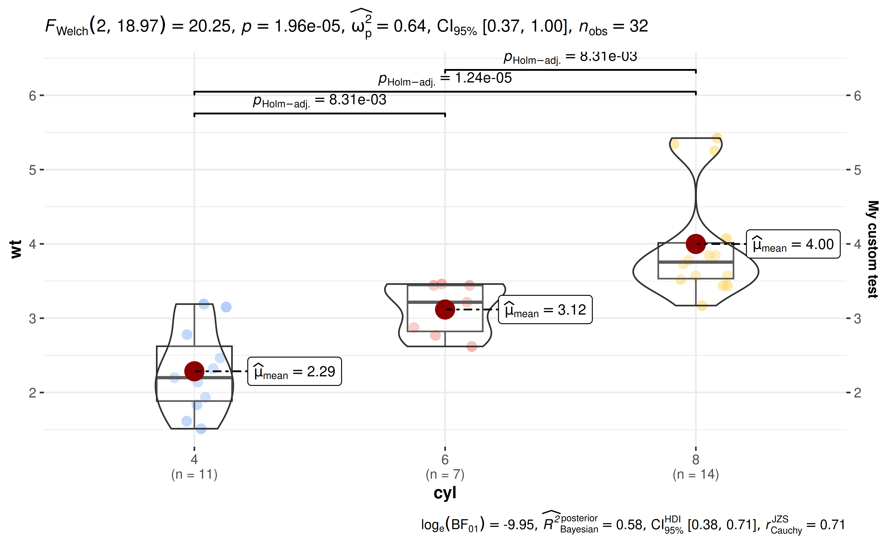

## 29. How to turn off scientific notation in expressions?

[`set.seed`](https://rdrr.io/r/base/Random.html)`(``123``)`` `[`library`](https://rdrr.io/r/base/library.html)`(`[`ggstatsplot`](https://www.indrapatil.com/ggstatsplot/)`)`` `[`library`](https://rdrr.io/r/base/library.html)`(`[`WRS2`](https://r-forge.r-project.org/projects/psychor/)`)`` `` `[`ggwithinstats`](https://www.indrapatil.com/ggstatsplot/reference/ggwithinstats.md)`(`` `` ``WineTasting``,`` `` ``Wine``,`` `` ``Taste``,`` `` subject.id ``=`` ``Taster`` ``)`

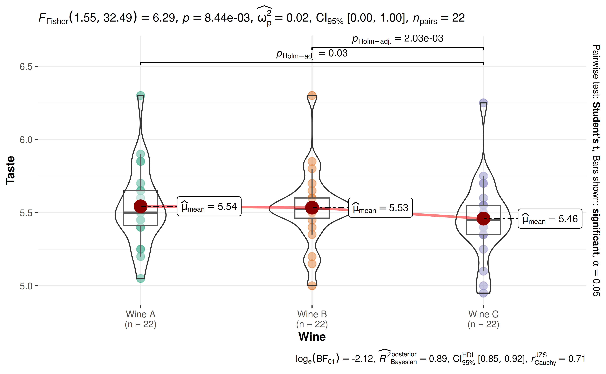

` `[`ggwithinstats`](https://www.indrapatil.com/ggstatsplot/reference/ggwithinstats.md)`(`` `` ``WineTasting``,`` `` ``Wine``,`` `` ``Taste``,`` `` subject.id ``=`` ``Taster``,`` `` digits ``=`` ``4L`` ``)`

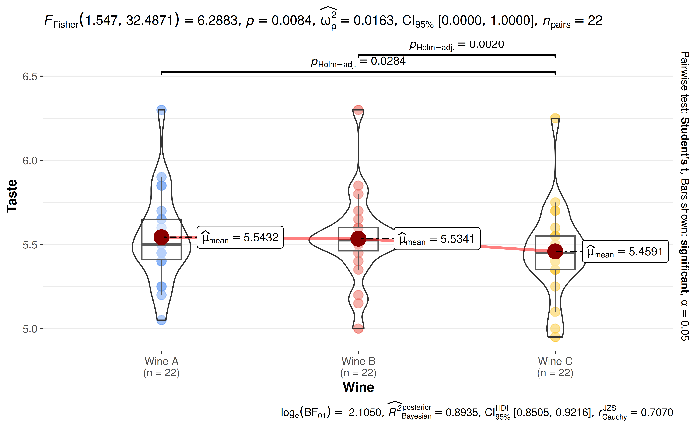

## 30. How to modify the whiskers in box plots from ggbetweenstats?

By default, the whiskers in
[`ggbetweenstats()`](https://www.indrapatil.com/ggstatsplot/reference/ggbetweenstats.md)
box plots extend to 1.5 times the interquartile range (IQR) from the
box, following the Tukey method. You can customize this using the `coef`
parameter in `boxplot.args`:

`# Default whiskers (1.5 * IQR)`` `[`ggbetweenstats`](https://www.indrapatil.com/ggstatsplot/reference/ggbetweenstats.md)`(`` `` data ``=`` ``mtcars``,`` `` x ``=`` ``am``,`` `` y ``=`` ``wt``,`` `` results.subtitle ``=`` ``FALSE`` ``)`

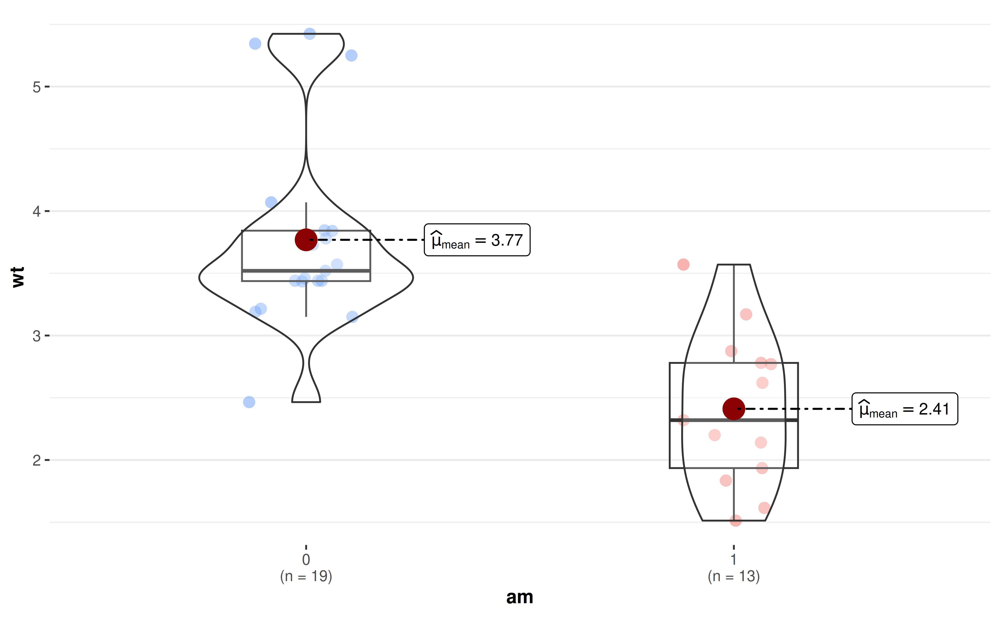

` ``# Longer whiskers (3 * IQR)`` `[`ggbetweenstats`](https://www.indrapatil.com/ggstatsplot/reference/ggbetweenstats.md)`(`` `` data ``=`` ``mtcars``,`` `` x ``=`` ``am``,`` `` y ``=`` ``wt``,`` `` boxplot.args ``=`` `[`list`](https://rdrr.io/r/base/list.html)`(``coef ``=`` ``3``)``,`` `` results.subtitle ``=`` ``FALSE`` ``)`

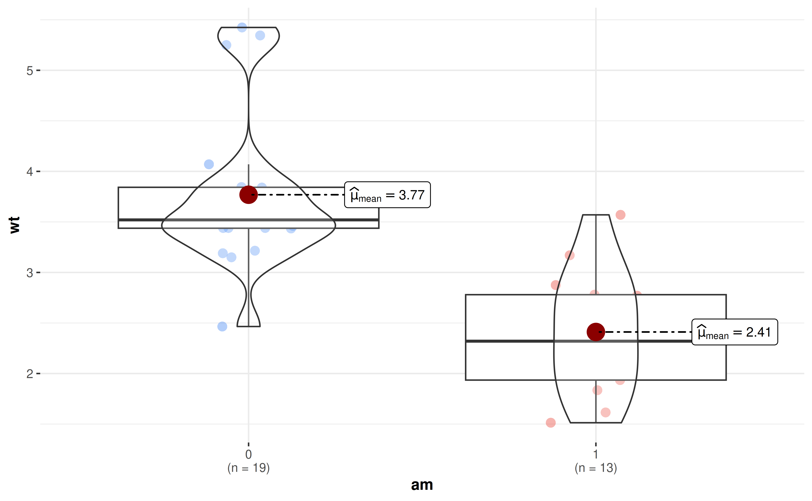

` ``# Whiskers only to data range (no multiplier)`` `[`ggbetweenstats`](https://www.indrapatil.com/ggstatsplot/reference/ggbetweenstats.md)`(`` `` data ``=`` ``mtcars``,`` `` x ``=`` ``am``,`` `` y ``=`` ``wt``,`` `` boxplot.args ``=`` `[`list`](https://rdrr.io/r/base/list.html)`(``coef ``=`` ``0``)``,`` `` results.subtitle ``=`` ``FALSE`` ``)`

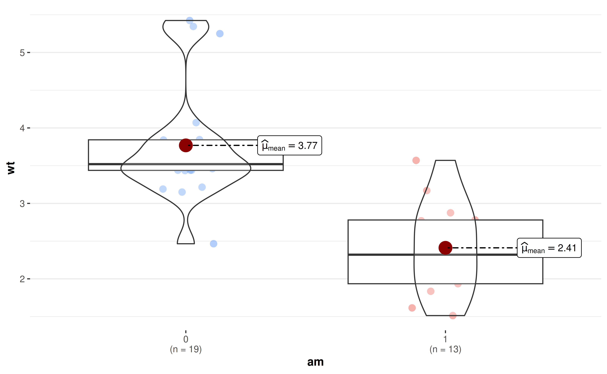

## 31. Why do pairwise comparison brackets disappear when I restrict the Y-axis?

This is a common [ggplot2](https://ggplot2.tidyverse.org) footgun. There
are two ways to restrict the visible y-range, and they behave very
differently:

- `scale_y_continuous(limits = c(a, b))` — **modifies the data**,
  setting any values outside `[a, b]` to `NA` before rendering. Because
  pairwise comparison brackets from
  [ggsignif](https://const-ae.github.io/ggsignif/) are positioned
  *above* the maximum observed value, they often fall outside a tight
  limit and are silently dropped.
- `coord_cartesian(ylim = c(a, b))` — **zooms the viewport** without
  touching the underlying data. The brackets are still computed from the
  full data range and remain fully intact.

The fix is to replace `scale_y_continuous(limits = ...)` with
`coord_cartesian(ylim = ...)`:

[`library`](https://rdrr.io/r/base/library.html)`(`[`ggplot2`](https://ggplot2.tidyverse.org)`)`` `` ``# BAD: pairwise brackets disappear because values above 4 are set to NA`` `[`ggbetweenstats`](https://www.indrapatil.com/ggstatsplot/reference/ggbetweenstats.md)`(``mtcars``, ``cyl``, ``wt``)`` ``+`` `` `[`scale_y_continuous`](https://ggplot2.tidyverse.org/reference/scale_continuous.html)`(``limits ``=`` `[`c`](https://rdrr.io/r/base/c.html)`(``1``, ``4``)``)`

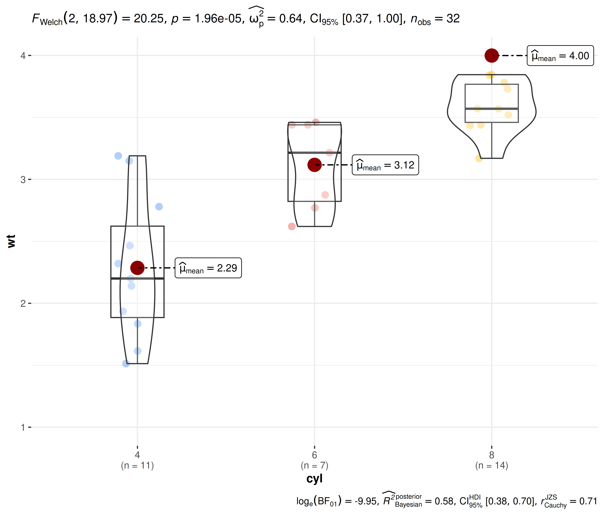

` ``# GOOD: brackets survive because coord_cartesian only zooms the viewport`` `[`ggbetweenstats`](https://www.indrapatil.com/ggstatsplot/reference/ggbetweenstats.md)`(``mtcars``, ``cyl``, ``wt``)`` ``+`` `` `[`coord_cartesian`](https://ggplot2.tidyverse.org/reference/coord_cartesian.html)`(``ylim ``=`` `[`c`](https://rdrr.io/r/base/c.html)`(``1``, ``4``)``)`

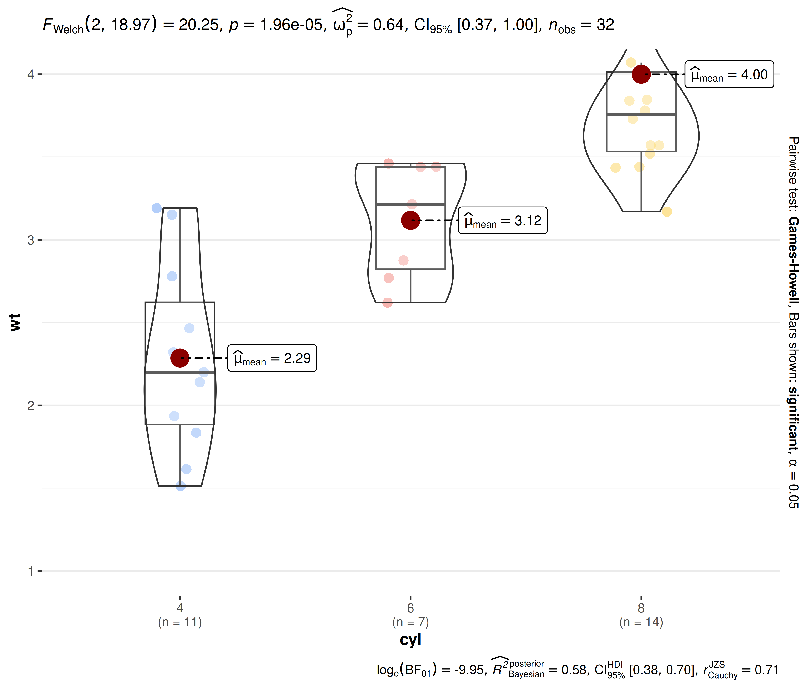

## 32. How can I create group-specific titles or subtitles in grouped plots?

Not directly with the current grouped helper APIs.

Functions like
[`grouped_ggbetweenstats()`](https://www.indrapatil.com/ggstatsplot/reference/grouped_ggbetweenstats.md)
internally split the data by the grouping variable and use those split
names while constructing the individual plots. This means the grouping
labels are not exposed as a placeholder you can interpolate inside
`title = ...`, `subtitle = ...`, or `ggplot.component = ...`.

So if you need panel-specific text such as custom titles, subtitles, or
captions derived from the grouping level, the current workaround is to
split the data yourself, map over the groups, build the annotation from
the group name, and then combine the plots:

[`library`](https://rdrr.io/r/base/library.html)`(`[`dplyr`](https://dplyr.tidyverse.org)`)`` `[`library`](https://rdrr.io/r/base/library.html)`(`[`purrr`](https://purrr.tidyverse.org/)`)`` `` `[`filter`](https://dplyr.tidyverse.org/reference/filter.html)`(``ggplot2``::`[`mpg`](https://ggplot2.tidyverse.org/reference/mpg.html)`, ``drv`` ``!=`` ``"4"``)`` ``|>`` `` ``(``\``(``d``)`` `[`split`](https://rdrr.io/r/base/split.html)`(``d``, ``d``$``drv``)``)``(``)`` ``|>`` `` `[`imap`](https://purrr.tidyverse.org/reference/imap.html)`(``~`` `[`ggbetweenstats`](https://www.indrapatil.com/ggstatsplot/reference/ggbetweenstats.md)`(`` `` data ``=`` ``.x``,`` `` x ``=`` ``year``,`` `` y ``=`` ``hwy``,`` `` title ``=`` `[`paste0`](https://rdrr.io/r/base/paste.html)`(``"Drive type: "``, ``.y``)``,`` `` subtitle ``=`` `[`paste0`](https://rdrr.io/r/base/paste.html)`(``"Subset size: n = "``, `[`nrow`](https://rdrr.io/r/base/nrow.html)`(``.x``)``)`` `` ``)``)`` ``|>`` `` `[`combine_plots`](https://www.indrapatil.com/ggstatsplot/reference/combine_plots.md)`(``)`

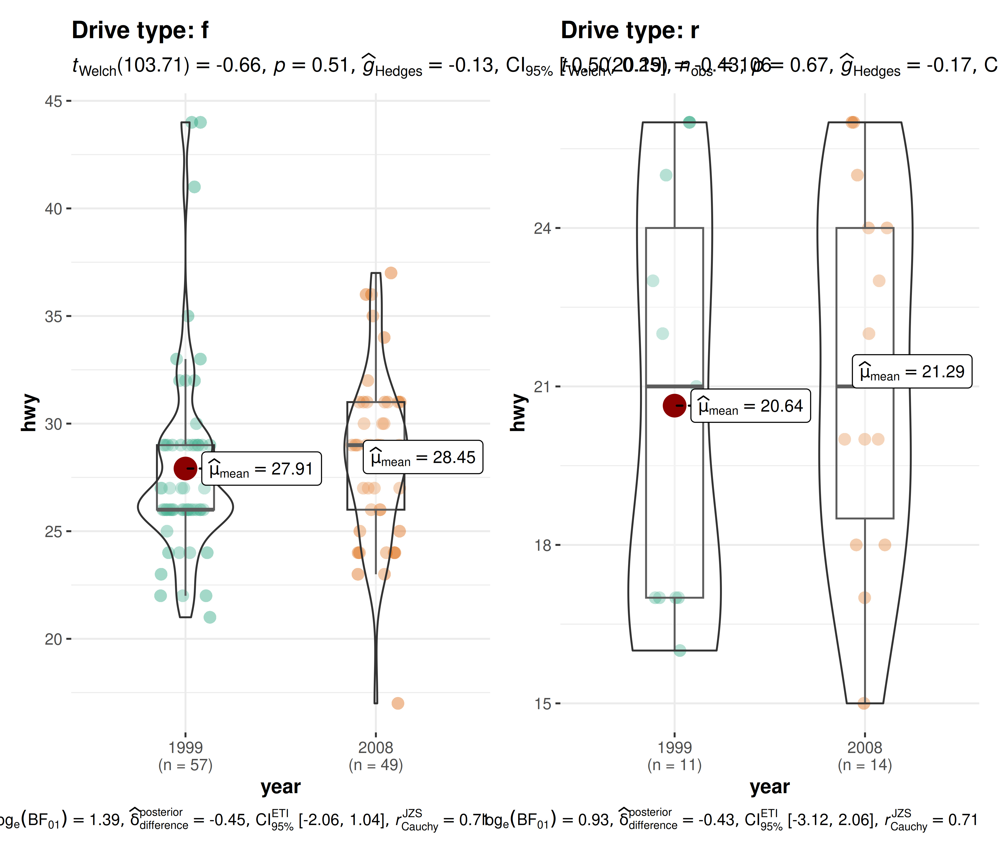

If this ever needs to be supported directly in grouped helpers, that
would require a dedicated feature addition rather than a small bug fix.

## 33. How can I adjust the position of the statistical annotation to prevent overlap?

The statistical results appear as a standard
[ggplot2](https://ggplot2.tidyverse.org) subtitle (and, when Bayes
Factor is shown, as a caption). You can reposition them using
[`theme()`](https://ggplot2.tidyverse.org/reference/theme.html) via the
`ggplot.component` argument:

[`library`](https://rdrr.io/r/base/library.html)`(`[`ggplot2`](https://ggplot2.tidyverse.org)`)`` `` ``# default position`` `[`ggbetweenstats`](https://www.indrapatil.com/ggstatsplot/reference/ggbetweenstats.md)`(``mtcars``, ``am``, ``mpg``)`

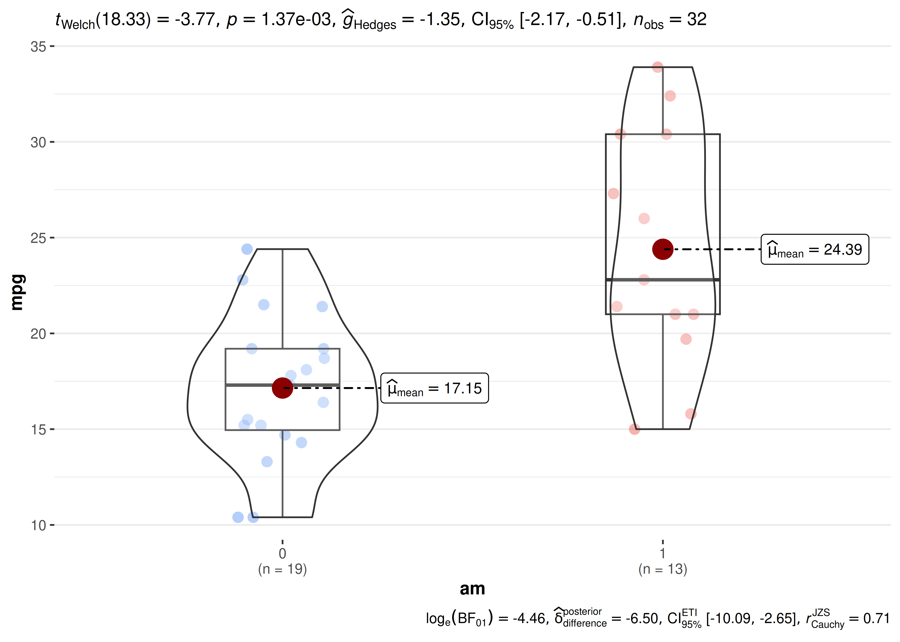

` ``# move the subtitle to avoid overlapping with data points`` `[`ggbetweenstats`](https://www.indrapatil.com/ggstatsplot/reference/ggbetweenstats.md)`(`` `` ``mtcars``, ``am``, ``mpg``,`` `` ggplot.component ``=`` `[`list`](https://rdrr.io/r/base/list.html)`(`` `` `[`theme`](https://ggplot2.tidyverse.org/reference/theme.html)`(`` `` plot.subtitle ``=`` `[`element_text`](https://ggplot2.tidyverse.org/reference/element.html)`(``size ``=`` ``10``, hjust ``=`` ``0``)``,`` `` plot.caption ``=`` `[`element_text`](https://ggplot2.tidyverse.org/reference/element.html)`(``size ``=`` ``8``, hjust ``=`` ``0``)`` `` ``)`` `` ``)`` ``)`

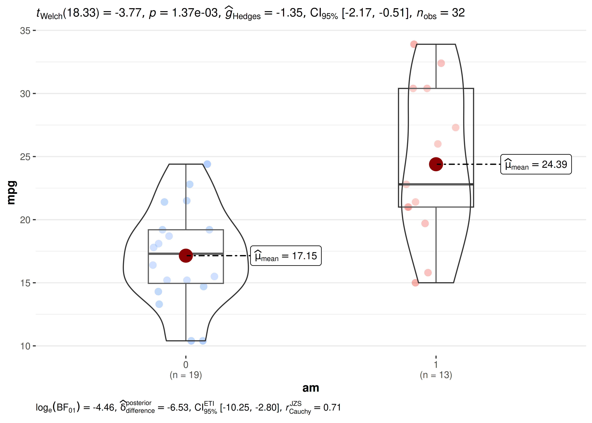

If you need the statistical expression on a *different* plot entirely,
extract it with
[`extract_subtitle()`](https://www.indrapatil.com/ggstatsplot/reference/extract_stats.md)
and pass it to
[`labs()`](https://ggplot2.tidyverse.org/reference/labs.html):

`# extract subtitle expression`` ``expr`` ``<-`` `[`extract_subtitle`](https://www.indrapatil.com/ggstatsplot/reference/extract_stats.md)`(`[`ggbetweenstats`](https://www.indrapatil.com/ggstatsplot/reference/ggbetweenstats.md)`(``mtcars``, ``am``, ``mpg``)``)`` `` ``# use it on a completely custom plot`` `[`ggplot`](https://ggplot2.tidyverse.org/reference/ggplot.html)`(``mtcars``, `[`aes`](https://ggplot2.tidyverse.org/reference/aes.html)`(`[`factor`](https://rdrr.io/r/base/factor.html)`(``am``)``, ``mpg``)``)`` ``+`` `` `[`geom_boxplot`](https://ggplot2.tidyverse.org/reference/geom_boxplot.html)`(``)`` ``+`` `` `[`labs`](https://ggplot2.tidyverse.org/reference/labs.html)`(``subtitle ``=`` ``expr``)`

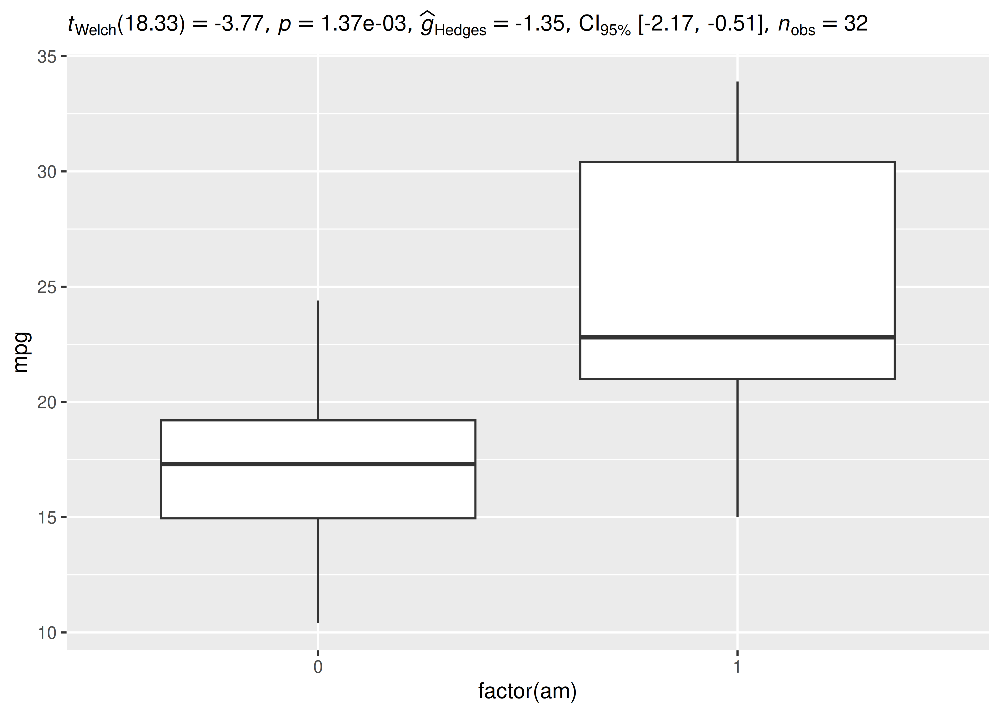

## Suggestions

If you find any bugs or have any suggestions/remarks, please file an
issue on `GitHub`:
<https://github.com/IndrajeetPatil/ggstatsplot/issues>
