# Frequently Asked Questions (FAQ)

------------------------------------------------------------------------

You can cite this package/vignette as:

    To cite package 'ggstatsplot' in publications use:

      Patil, I. (2021). Visualizations with statistical details: The
      'ggstatsplot' approach. Journal of Open Source Software, 6(61), 3167,
      doi:10.21105/joss.03167

    A BibTeX entry for LaTeX users is

      @Article{,
        doi = {10.21105/joss.03167},
        url = {https://doi.org/10.21105/joss.03167},
        year = {2021},
        publisher = {{The Open Journal}},
        volume = {6},
        number = {61},
        pages = {3167},
        author = {Indrajeet Patil},
        title = {{Visualizations with statistical details: The {'ggstatsplot'} approach}},
        journal = {{Journal of Open Source Software}},
      }

------------------------------------------------------------------------

Following are a few of the common questions asked in GitHub issues and
on social media platforms.

## Statistical details

### I just want the plot, not the statistical details. How can I turn them off?

All functions in [ggstatsplot](https://www.indrapatil.com/ggstatsplot/)
that display results from statistical analysis in a subtitle have
argument `results.subtitle`. Setting it to `FALSE` will return only the
plot.

For parametric tests, the Bayes Factor shown in the caption is
controlled separately by the `bf.message` argument. Set it to `FALSE` to
drop the caption:

\
[`ggbetweenstats`](https://www.indrapatil.com/ggstatsplot/reference/ggbetweenstats.md)`(``mtcars``, ``am``, ``mpg``, bf.message ``=`` ``FALSE``)`

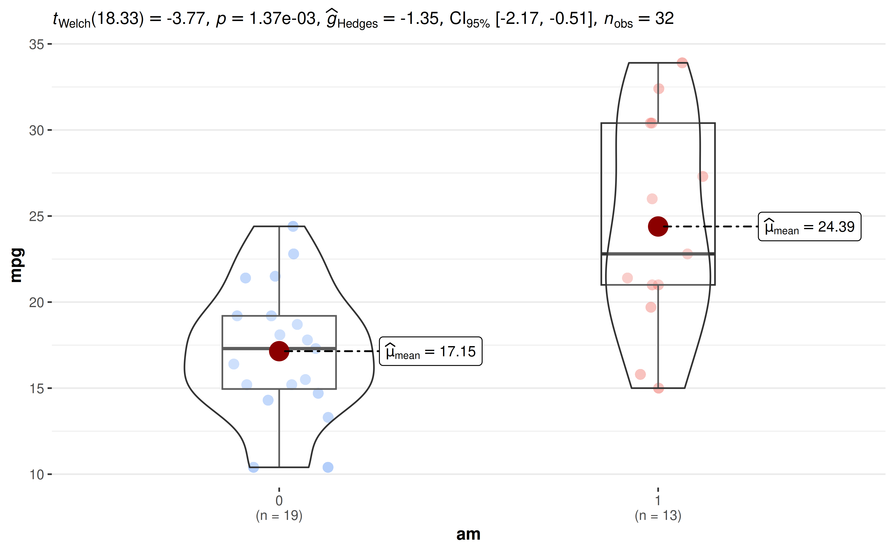

Your own `subtitle` text is used only when `results.subtitle = FALSE`.

### Why do I get only the plot but not the subtitle/caption?

In order to prevent the entire plotting function from failing when
statistical analysis fails, functions in
[ggstatsplot](https://www.indrapatil.com/ggstatsplot/) default to first
attempting to run the analysis and if they fail, then return empty
(`NULL`) subtitle/caption. In such cases, if you wish to diagnose why
the analysis is failing, you will have to do so using the underlying
function used to carry out statistical analysis.

For example, the following returns only the plot but not the statistical
details in a subtitle or caption, because the outcome is constant within
each group.

\
`df`` ``<-`` `[`data.frame`](https://rdrr.io/r/base/data.frame.html)`(``x ``=`` `[`c`](https://rdrr.io/r/base/c.html)`(``"a"``, ``"a"``, ``"b"``, ``"b"``)``, y ``=`` `[`c`](https://rdrr.io/r/base/c.html)`(``1``, ``1``, ``2``, ``2``)``)`\
[`ggbetweenstats`](https://www.indrapatil.com/ggstatsplot/reference/ggbetweenstats.md)`(``df``, ``x``, ``y``)`

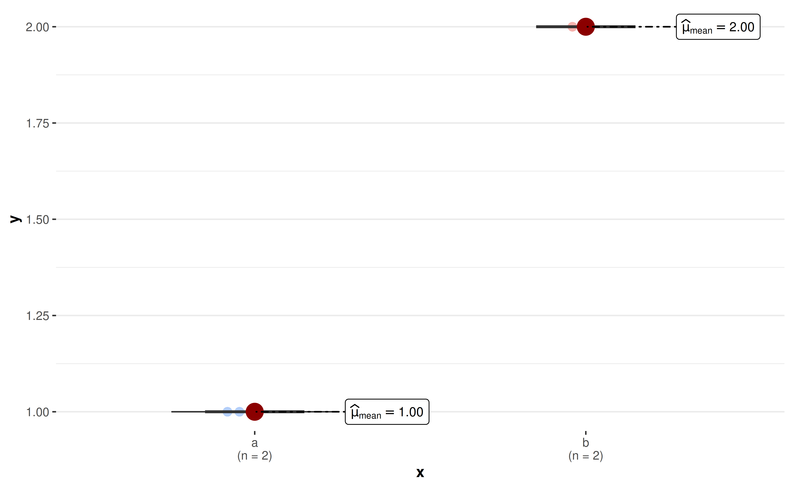

To see why the statistical analysis failed, you can look at the error
from the underlying function:

\
[`library`](https://rdrr.io/r/base/library.html)`(`[`statsExpressions`](https://www.indrapatil.com/statsExpressions/)`)`\
[`two_sample_test`](https://www.indrapatil.com/statsExpressions/reference/two_sample_test.html)`(``df``, ``x``, ``y``)`\
`#> ``Error```  in `t.test.default()`: ``\
`#> ``!`` data are essentially constant`

### What statistical test was carried out?

In case you are not sure what was the statistical test that produced the
results shown in the subtitle of the plot, the best way to get that
information is to either look at the documentation for the function used
or check out the associated vignette.

All statistical analyses are carried out by
[statsExpressions](https://www.indrapatil.com/statsExpressions/), and a
summary of every supported test and effect size is available in its
[documentation](https://www.indrapatil.com/statsExpressions/articles/stats_details.html).

You can also check the `method` column of the data frames returned by
[`extract_stats()`](https://www.indrapatil.com/ggstatsplot/reference/extract_stats.md)
(see [below](#extract-stats)).

### How can I access the data frames with the statistical results?

[ggstatsplot](https://www.indrapatil.com/ggstatsplot/) displays
expressions in the subtitle and caption, but you can get back the
underlying data frames with the
[`extract_stats()`](https://www.indrapatil.com/ggstatsplot/reference/extract_stats.md)
helper function. It returns a list with the following components (`NULL`
when not relevant for a given plot): `subtitle_data`, `caption_data`,
`pairwise_comparisons_data`, `descriptive_data`, `one_sample_data`,
`tidy_data`, and `glance_data`.

\
`p`` ``<-`` `[`ggbetweenstats`](https://www.indrapatil.com/ggstatsplot/reference/ggbetweenstats.md)`(``mtcars``, ``cyl``, ``wt``)`\
\
`# data frame with results from pairwise comparisons`\
[`extract_stats`](https://www.indrapatil.com/ggstatsplot/reference/extract_stats.md)`(``p``)``$``pairwise_comparisons_data`\
`#> ``# A tibble: 3 × 9`\
`#>   ``group1`` ``group2`` ``statistic``   ``p.value`` ``alternative`` ``distribution`` ``p.adjust.method`\
`#>   ``<chr>``  ``<chr>``      ``<dbl>``     ``<dbl>`` ``<chr>``       ``<chr>``        ``<chr>``          `\
`#> ``1`` 4      6           5.39 ``0.00``8``31``   two.sided   q            Holm           `\
`#> ``2`` 4      8           9.11 ``0.000``0``12``4 two.sided   q            Holm           `\
`#> ``3`` 6      8           5.12 ``0.00``8``31``   two.sided   q            Holm           `\
`#>   ``test``         ``expression`\
`#>   ``<chr>``        ``<list>``    `\
`#> ``1`` Games-Howell ``<language>`\
`#> ``2`` Games-Howell ``<language>`\
`#> ``3`` Games-Howell ``<language>`

For `grouped_` plots,
[`extract_stats()`](https://www.indrapatil.com/ggstatsplot/reference/extract_stats.md)
returns one such list per group.
[`extract_subtitle()`](https://www.indrapatil.com/ggstatsplot/reference/extract_stats.md)
and
[`extract_caption()`](https://www.indrapatil.com/ggstatsplot/reference/extract_stats.md)
return just the expressions.

If you only need the results and not the plot, you can call the
functions from the source package
[statsExpressions](https://www.indrapatil.com/statsExpressions/)
directly (see
[examples](https://www.indrapatil.com/statsExpressions/articles/web_only/dataframe_outputs.html)).

### Does `{ggstatsplot}` carry out assumption checks?

No, [ggstatsplot](https://www.indrapatil.com/ggstatsplot/) does not
carry out any analysis of whether assumptions are met or not. It will
just carry out whatever test you ask it to carry out.

To check these assumptions, you can use a different package called
[`{performance}`](https://easystats.github.io/performance/reference/index.html#check-model-assumptions-or-data-properties).

### How are missing values handled?

Rows with missing values (`NA`) in the variables of interest are removed
before the analysis, and the subtitle reports the sample size that was
actually used. Other columns in the data are ignored.

- In
  [`ggwithinstats()`](https://www.indrapatil.com/ggstatsplot/reference/ggwithinstats.md),
  specify `subject.id`: any subject with a missing value in *any*
  condition is then excluded from the statistical analysis, so that only
  complete pairs are analyzed (the subtitle reports *n*_(pairs)). The
  subject’s non-missing observations are still shown in the plot.
- In
  [`ggcorrmat()`](https://www.indrapatil.com/ggstatsplot/reference/ggcorrmat.md),
  missing values are removed separately for each pair of variables, and
  the legend shows the minimum, mode, and maximum sample sizes across
  pairs.
- In `grouped_` functions, rows with missing values in `grouping.var`
  are dropped.

\
`` # 5 of the 93 subjects in `bugs_long` have a missing value, so n_pairs = 88 ``\
[`ggwithinstats`](https://www.indrapatil.com/ggstatsplot/reference/ggwithinstats.md)`(``bugs_long``, ``condition``, ``desire``, subject.id ``=`` ``subject``)`

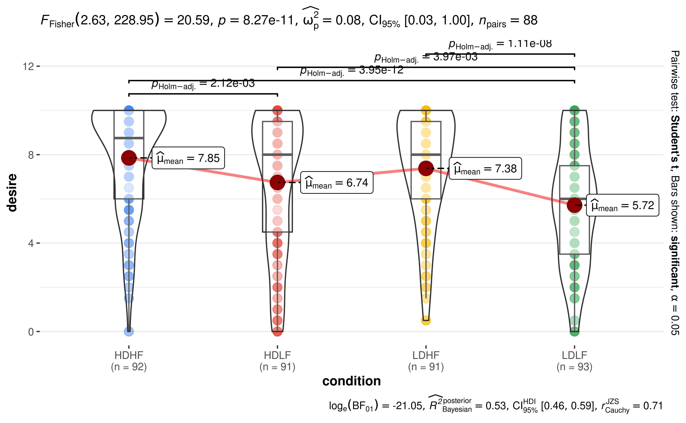

### Is there a way to adjust my alpha level?

Within a single plot, some functions let you choose the cutoff used to
decide what is displayed as significant:

- `pairwise.alpha` in
  [`ggbetweenstats()`](https://www.indrapatil.com/ggstatsplot/reference/ggbetweenstats.md)
  and
  [`ggwithinstats()`](https://www.indrapatil.com/ggstatsplot/reference/ggwithinstats.md)
  (together with `p.adjust.method` for multiple comparisons correction).
- `sig.level` in
  [`ggcorrmat()`](https://www.indrapatil.com/ggstatsplot/reference/ggcorrmat.md).
- `conf.level` (in all functions) sets the width of the confidence
  intervals.

But there is no way to adjust alpha *across* the plots produced by
`grouped_` functions, since each group is analyzed independently. You
will have to report the adjusted alpha yourself (e.g., with 2 tests,
only consider `p < 0.025` as significant).

### The statistical analysis I want to carry out is not available. What can I do?

Since [ggstatsplot](https://www.indrapatil.com/ggstatsplot/) always
allows just **one** type of test per statistical approach, sometimes
your favorite test might not be available. For example,
[ggstatsplot](https://www.indrapatil.com/ggstatsplot/) provides only
Spearman’s $`\rho`$, but not Kendall’s $`\tau`$ as a non-parametric
correlation test.

In such cases, you can override the defaults and use
[statsExpressions](https://www.indrapatil.com/statsExpressions/) to
create custom expressions to display in the plot. But be forewarned that
the expression building function in
[statsExpressions](https://www.indrapatil.com/statsExpressions/) is not
stable yet.

\
[`library`](https://rdrr.io/r/base/library.html)`(`[`correlation`](https://easystats.github.io/correlation/)`)`\
[`library`](https://rdrr.io/r/base/library.html)`(`[`statsExpressions`](https://www.indrapatil.com/statsExpressions/)`)`\
[`library`](https://rdrr.io/r/base/library.html)`(`[`ggplot2`](https://ggplot2.tidyverse.org)`)`\
\
`# data with two variables of interest`\
`df`` ``<-`` ``dplyr``::`[`select`](https://dplyr.tidyverse.org/reference/select.html)`(``mtcars``, ``wt``, ``mpg``)`\
\
`# correlation results`\
`results`` ``<-`` `[`correlation`](https://easystats.github.io/correlation/reference/correlation.html)`(``df``, method ``=`` ``"kendall"``)`` ``|>`\
`  ``insight``::`[`standardize_names`](https://easystats.github.io/insight/reference/standardize_names.html)`(``style ``=`` ``"broom"``)`\
\
`# creating expression out of these results`\
`df_results`` ``<-`` ``statsExpressions``::`[`add_expression_col`](https://www.indrapatil.com/statsExpressions/reference/add_expression_col.html)`(`\
`  data           ``=`` ``results``,`\
`  no.parameters  ``=`` ``0L``,`\
`  statistic.text ``=`` `[`list`](https://rdrr.io/r/base/list.html)`(`[`quote`](https://rdrr.io/r/base/substitute.html)`(``italic``(``"T"``)``)``)``,`\
`  effsize.text   ``=`` `[`list`](https://rdrr.io/r/base/list.html)`(`[`quote`](https://rdrr.io/r/base/substitute.html)`(``widehat``(``italic``(``tau``)``)``[``"Kendall"``]``)``)``,`\
`  n              ``=`` ``results``$``n.obs``[[``1``]``]`\
`)`\
\
`# using custom expression in plot`\
[`ggscatterstats`](https://www.indrapatil.com/ggstatsplot/reference/ggscatterstats.md)`(``df``, ``wt``, ``mpg``, results.subtitle ``=`` ``FALSE``)`` ``+`\
`  `[`labs`](https://ggplot2.tidyverse.org/reference/labs.html)`(``subtitle ``=`` ``df_results``$``expression``[[``1``]``]``)`

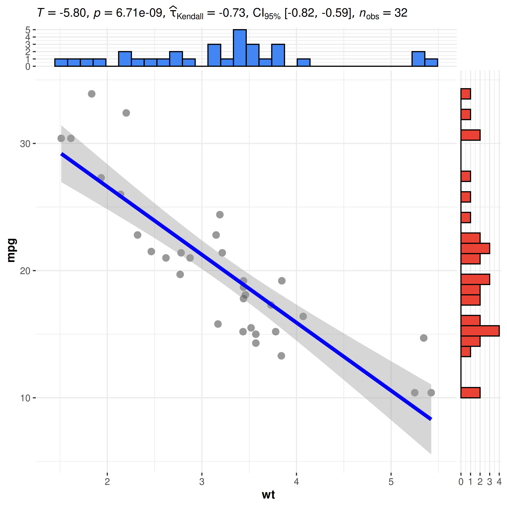

### How should I cite and report the results?

You can cite the package with `citation("ggstatsplot")` (see top of this
article). For reporting, the expressions shown in the plots follow a
standard template (see the [principles
article](https://www.indrapatil.com/ggstatsplot/articles/web_only/principles.html#statistical-reporting)),
and all numbers can be retrieved as data frames with
[`extract_stats()`](#extract-stats). For interpreting logged Bayes
Factors, see [this
article](https://www.indrapatil.com/ggstatsplot/articles/web_only/interpretation.html).

## Subtitle and caption

### How can I customize the details contained in the subtitle?

Sometimes you may not wish to include so many details in the subtitle.
In that case, you can extract the expression and copy-paste only the
part you wish to include. For example, here only statistic and
*p*-values are included:

\
[`library`](https://rdrr.io/r/base/library.html)`(`[`ggplot2`](https://ggplot2.tidyverse.org)`)`\
[`library`](https://rdrr.io/r/base/library.html)`(`[`statsExpressions`](https://www.indrapatil.com/statsExpressions/)`)`\
\
`# extracting detailed expression`\
`data_results`` ``<-`` `[`oneway_anova`](https://www.indrapatil.com/statsExpressions/reference/oneway_anova.html)`(``iris``, ``Species``, ``Sepal.Length``)`\
`data_results``$``expression``[[``1``]``]`\
`#> list(italic("F")["Welch"](2, 92.21) == "138.91", italic(p) == `\
`#>     "1.51e-28", widehat(omega["p"]^2) == "0.74", CI["95%"] ~ `\
`#>     "[" * "0.67", "1.00" * "]", italic("n")["obs"] == "150")`\
\
`# adapting the details to your liking`\
[`ggplot`](https://ggplot2.tidyverse.org/reference/ggplot.html)`(``iris``, `[`aes`](https://ggplot2.tidyverse.org/reference/aes.html)`(``x ``=`` ``Species``, y ``=`` ``Sepal.Length``)``)`` ``+`\
`  `[`geom_boxplot`](https://ggplot2.tidyverse.org/reference/geom_boxplot.html)`(``)`` ``+`\
`  `[`labs`](https://ggplot2.tidyverse.org/reference/labs.html)`(``subtitle ``=`` ``ggplot2``::`[`expr`](https://rlang.r-lib.org/reference/expr.html)`(`[`paste`](https://rdrr.io/r/base/paste.html)`(`\
`    ``italic``(``"F"``)``, ``"("``, ``"2"``, ``","``, ``"147"``, ``")="``, ``"119.26"``, ``", "``,`\
`    ``italic``(``"p"``)``, ``"<"``, ``"0.001"`\
`  ``)``)``)`

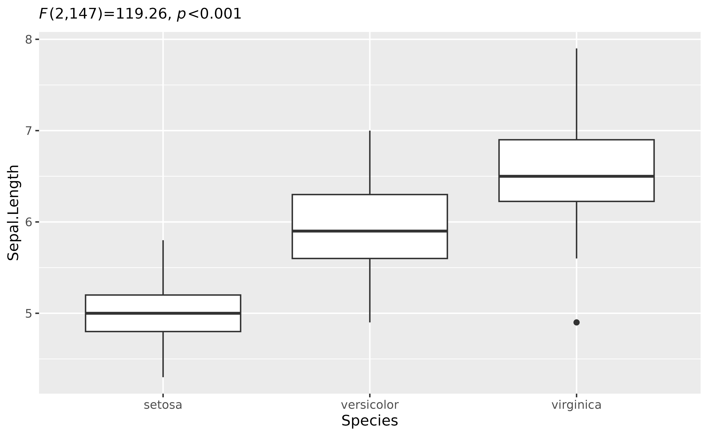

The extracted expression can also be put on any other plot with
`labs(subtitle = extract_subtitle(p))`.

### How can I change the size or position of the subtitle?

The statistical results appear as a standard
[ggplot2](https://ggplot2.tidyverse.org) subtitle (and, when Bayes
Factor is shown, as a caption). You can restyle and reposition them
using [`theme()`](https://ggplot2.tidyverse.org/reference/theme.html)
via the `ggplot.component` argument:

\
[`library`](https://rdrr.io/r/base/library.html)`(`[`ggplot2`](https://ggplot2.tidyverse.org)`)`\
\
[`ggbetweenstats`](https://www.indrapatil.com/ggstatsplot/reference/ggbetweenstats.md)`(`\
`  ``mtcars``, ``am``, ``mpg``,`\
`  ggplot.component ``=`` `[`list`](https://rdrr.io/r/base/list.html)`(`\
`    `[`theme`](https://ggplot2.tidyverse.org/reference/theme.html)`(`\
`      plot.subtitle ``=`` `[`element_text`](https://ggplot2.tidyverse.org/reference/element.html)`(``size ``=`` ``10``, face ``=`` ``"bold"``, hjust ``=`` ``0``)``,`\
`      plot.caption ``=`` `[`element_text`](https://ggplot2.tidyverse.org/reference/element.html)`(``size ``=`` ``8``, hjust ``=`` ``0``)`\
`    ``)`\
`  ``)`\
`)`

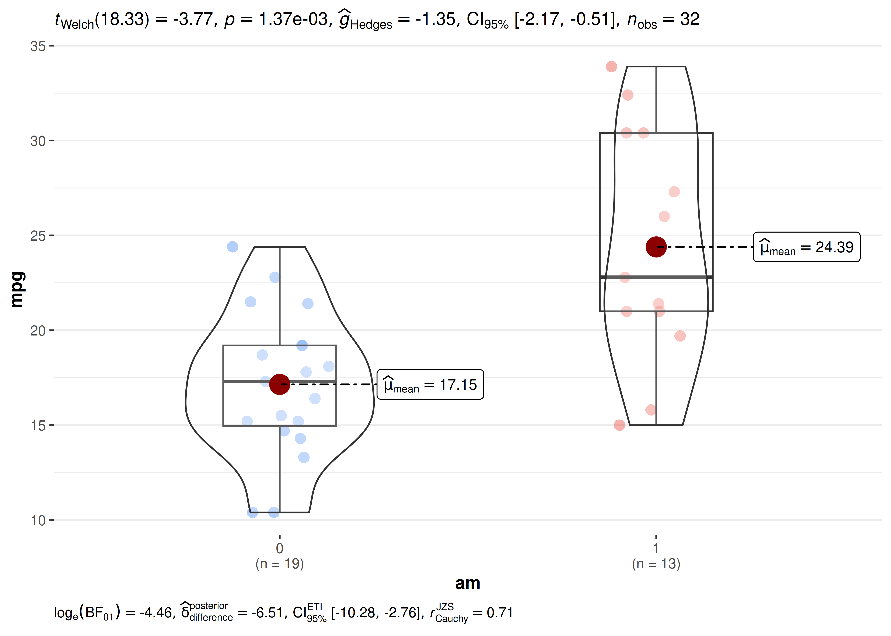

### How can I turn off scientific notation in expressions?

Increase the number of digits with the `digits` argument. Note that very
small *p*-values can still be shown in scientific notation if they would
otherwise be rounded to zero.

\
[`library`](https://rdrr.io/r/base/library.html)`(`[`WRS2`](https://r-forge.r-project.org/projects/psychor/)`)`\
\
[`ggwithinstats`](https://www.indrapatil.com/ggstatsplot/reference/ggwithinstats.md)`(`\
`  ``WineTasting``,`\
`  ``Wine``,`\
`  ``Taste``,`\
`  subject.id ``=`` ``Taster``,`\
`  digits ``=`` ``4L`\
`)`

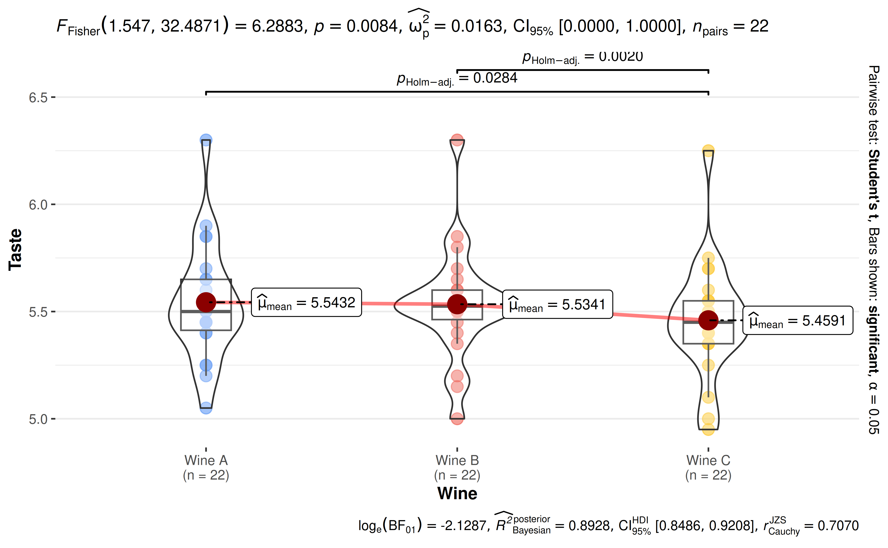

## Pairwise comparisons

### How can I show only some of the pairwise comparisons?

Currently, for `ggbetweenstats` and `ggwithinstats`, you can either
display all **significant** comparisons, all **non-significant**
comparisons, or **all** comparisons. But what if I am only interested in
just one particular comparison?

Here is a workaround using
[ggsignif](https://const-ae.github.io/ggsignif/):

\
[`library`](https://rdrr.io/r/base/library.html)`(`[`ggsignif`](https://const-ae.github.io/ggsignif/)`)`\
\
[`ggbetweenstats`](https://www.indrapatil.com/ggstatsplot/reference/ggbetweenstats.md)`(``mtcars``, ``cyl``, ``wt``, pairwise.display ``=`` ``"none"``)`` ``+`\
`  `[`geom_signif`](https://const-ae.github.io/ggsignif/reference/stat_signif.html)`(``comparisons ``=`` `[`list`](https://rdrr.io/r/base/list.html)`(`[`c`](https://rdrr.io/r/base/c.html)`(``"4"``, ``"6"``)``)``, test.args ``=`` `[`list`](https://rdrr.io/r/base/list.html)`(``exact ``=`` ``FALSE``)``)`

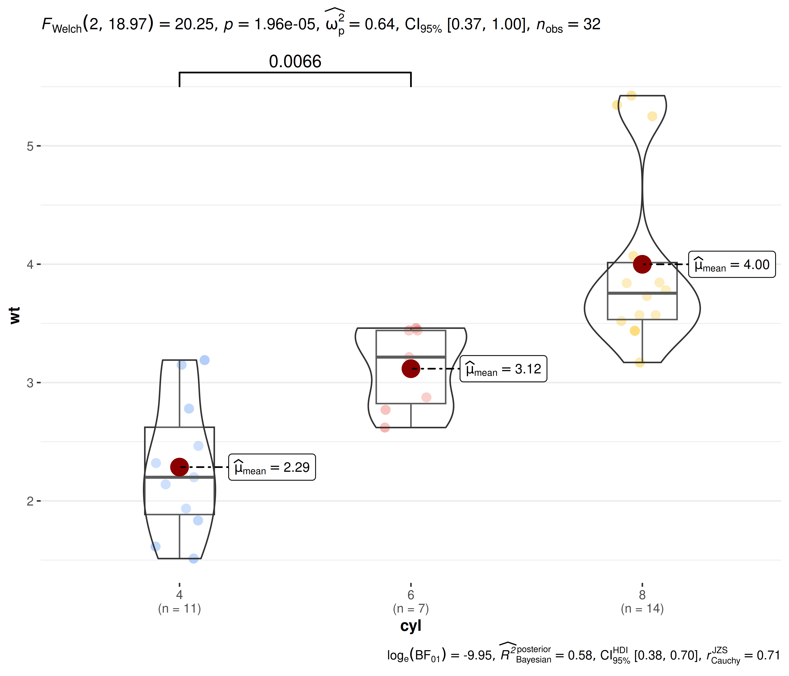

### How can I change the annotation in pairwise comparisons?

[ggstatsplot](https://www.indrapatil.com/ggstatsplot/) defaults to
displaying exact *p*-values or logged Bayes Factor values for pairwise
comparisons. But what if you wish to adopt different annotation labels,
such as asterisks? You will have to customize them yourself:

\
[`library`](https://rdrr.io/r/base/library.html)`(`[`ggplot2`](https://ggplot2.tidyverse.org)`)`\
[`library`](https://rdrr.io/r/base/library.html)`(`[`ggsignif`](https://const-ae.github.io/ggsignif/)`)`\
\
`# converting to factor`\
`mtcars``$``cyl`` ``<-`` `[`as.factor`](https://rdrr.io/r/base/factor.html)`(``mtcars``$``cyl``)`\
\
`# creating the base plot`\
`p`` ``<-`` `[`ggbetweenstats`](https://www.indrapatil.com/ggstatsplot/reference/ggbetweenstats.md)`(``mtcars``, ``cyl``, ``wt``, pairwise.display ``=`` ``"none"``)`\
\
`` # using `statsExpressions::pairwise_comparisons()` function to create a data frame with results ``\
`df`` ``<-`` ``statsExpressions``::`[`pairwise_comparisons`](https://www.indrapatil.com/statsExpressions/reference/pairwise_comparisons.html)`(``mtcars``, ``cyl``, ``wt``)`` ``|>`\
`  ``dplyr``::`[`mutate`](https://dplyr.tidyverse.org/reference/mutate.html)`(``groups ``=`` ``purrr``::`[`pmap`](https://purrr.tidyverse.org/reference/pmap.html)`(``.l ``=`` `[`list`](https://rdrr.io/r/base/list.html)`(``group1``, ``group2``)``, .f ``=`` ``c``)``)`` ``|>`\
`  ``dplyr``::`[`arrange`](https://dplyr.tidyverse.org/reference/arrange.html)`(``group1``)`` ``|>`\
`  ``dplyr``::`[`mutate`](https://dplyr.tidyverse.org/reference/mutate.html)`(``asterisk_label ``=`` ``dplyr``::`[`case_when`](https://dplyr.tidyverse.org/reference/case-and-replace-when.html)`(`\
`    ``p.value`` ``<`` ``0.001`` ``~`` ``"***"``,`\
`    ``p.value`` ``<`` ``0.01`` ``~`` ``"**"``,`\
`    ``p.value`` ``<`` ``0.05`` ``~`` ``"*"``,`\
`    .default ``=`` ``"ns"`\
`  ``)``)`\
\
`df`\
`#> ``# A tibble: 3 × 11`\
`#>   ``group1`` ``group2`` ``statistic``   ``p.value`` ``alternative`` ``distribution`` ``p.adjust.method`\
`#>   ``<chr>``  ``<chr>``      ``<dbl>``     ``<dbl>`` ``<chr>``       ``<chr>``        ``<chr>``          `\
`#> ``1`` 4      6           5.39 ``0.00``8``31``   two.sided   q            Holm           `\
`#> ``2`` 4      8           9.11 ``0.000``0``12``4 two.sided   q            Holm           `\
`#> ``3`` 6      8           5.12 ``0.00``8``31``   two.sided   q            Holm           `\
`#>   ``test``         ``expression`` ``groups``    ``asterisk_label`\
`#>   ``<chr>``        ``<list>``     ``<list>``    ``<chr>``         `\
`#> ``1`` Games-Howell ``<language>`` ``<chr [2]>`` **            `\
`#> ``2`` Games-Howell ``<language>`` ``<chr [2]>`` ***           `\
`#> ``3`` Games-Howell ``<language>`` ``<chr [2]>`` **`\
\
`` # adding pairwise comparisons using `{ggsignif}` package ``\
`p`` ``+`\
`  ``ggsignif``::`[`geom_signif`](https://const-ae.github.io/ggsignif/reference/stat_signif.html)`(`\
`    comparisons ``=`` ``df``$``groups``,`\
`    map_signif_level ``=`` ``TRUE``,`\
`    annotations ``=`` ``df``$``asterisk_label``,`\
`    y_position ``=`` `[`c`](https://rdrr.io/r/base/c.html)`(``5.5``, ``5.75``, ``6.0``)``,`\
`    test ``=`` ``NULL``,`\
`    na.rm ``=`` ``TRUE`\
`  ``)`

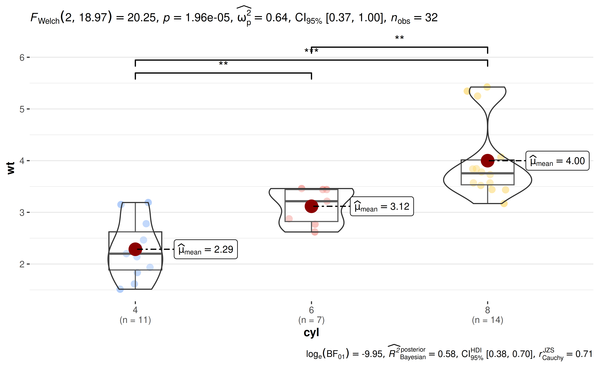

### Why do pairwise comparison brackets disappear when I restrict the Y-axis?

This is a common [ggplot2](https://ggplot2.tidyverse.org) footgun. There
are two ways to restrict the visible y-range, and they behave very
differently:

- `scale_y_continuous(limits = c(a, b))` — **modifies the data**,
  setting any values outside `[a, b]` to `NA` before rendering. Because
  pairwise comparison brackets from
  [ggsignif](https://const-ae.github.io/ggsignif/) are positioned
  *above* the maximum observed value, they often fall outside a tight
  limit and are silently dropped.
- `coord_cartesian(ylim = c(a, b))` — **zooms the viewport** without
  touching the underlying data. The brackets are still computed from the
  full data range and remain fully intact.

The fix is to replace `scale_y_continuous(limits = ...)` with
`coord_cartesian(ylim = ...)`:

\
[`library`](https://rdrr.io/r/base/library.html)`(`[`ggplot2`](https://ggplot2.tidyverse.org)`)`\
\
[`ggbetweenstats`](https://www.indrapatil.com/ggstatsplot/reference/ggbetweenstats.md)`(``mtcars``, ``cyl``, ``wt``)`` ``+`\
`  `[`coord_cartesian`](https://ggplot2.tidyverse.org/reference/coord_cartesian.html)`(``ylim ``=`` `[`c`](https://rdrr.io/r/base/c.html)`(``1``, ``4``)``)`

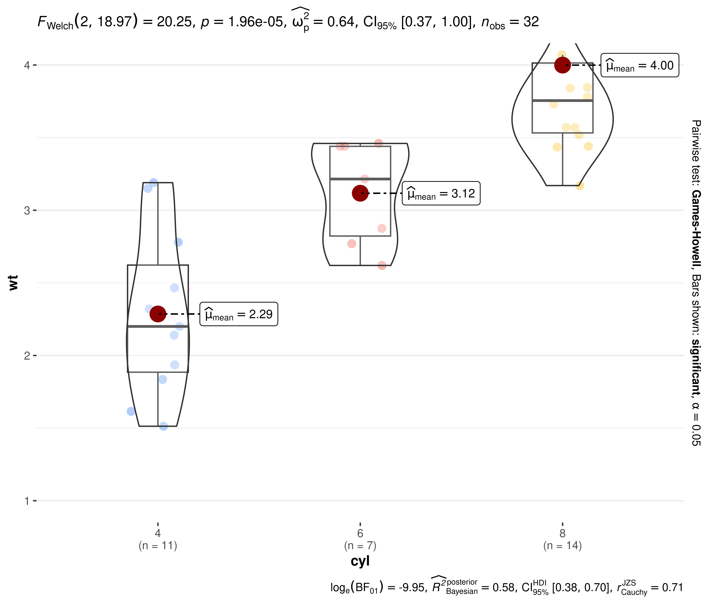

## Plot appearance

### How can I change the theme, color palette, or colors?

Use the `ggtheme` argument to supply any
[ggplot2](https://ggplot2.tidyverse.org) theme (the default is
[`theme_ggstatsplot()`](https://www.indrapatil.com/ggstatsplot/reference/theme_ggstatsplot.md)),
and the `palette` argument to choose any discrete palette from
[paletteer](https://emilhvitfeldt.github.io/paletteer/) in the
`"package::palette"` format. Run `View(paletteer::palettes_d_names)` to
see all available palettes.

\
[`ggbetweenstats`](https://www.indrapatil.com/ggstatsplot/reference/ggbetweenstats.md)`(`\
`  ``mtcars``,`\
`  ``cyl``,`\
`  ``wt``,`\
`  ggtheme ``=`` ``ggplot2``::`[`theme_classic`](https://ggplot2.tidyverse.org/reference/ggtheme.html)`(``)``,`\
`  palette ``=`` ``"ggsci::nrc_npg"`\
`)`

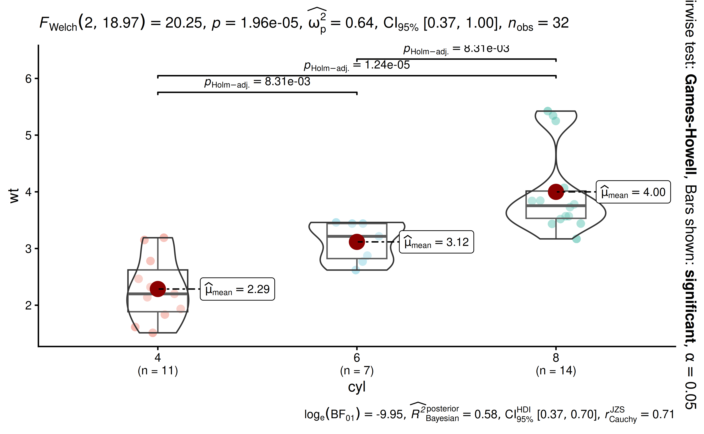

The palette must have at least as many colors as there are levels in the
grouping variable; otherwise an error is thrown.
[`ggscatterstats()`](https://www.indrapatil.com/ggstatsplot/reference/ggscatterstats.md),
[`gghistostats()`](https://www.indrapatil.com/ggstatsplot/reference/gghistostats.md),
[`ggdotplotstats()`](https://www.indrapatil.com/ggstatsplot/reference/ggdotplotstats.md),
and
[`ggcorrmat()`](https://www.indrapatil.com/ggstatsplot/reference/ggcorrmat.md)
don’t have a `palette` argument; use the relevant `*.args` arguments (or
`colors` in
[`ggcorrmat()`](https://www.indrapatil.com/ggstatsplot/reference/ggcorrmat.md))
instead.

If none of the palettes suit you, specify the colors manually with the
usual [ggplot2](https://ggplot2.tidyverse.org) scales:

\
[`library`](https://rdrr.io/r/base/library.html)`(`[`ggplot2`](https://ggplot2.tidyverse.org)`)`\
\
[`ggbarstats`](https://www.indrapatil.com/ggstatsplot/reference/ggbarstats.md)`(``mtcars``, ``am``, ``cyl``, results.subtitle ``=`` ``FALSE``)`` ``+`\
`  `[`scale_fill_manual`](https://ggplot2.tidyverse.org/reference/scale_manual.html)`(``values ``=`` `[`c`](https://rdrr.io/r/base/c.html)`(``"#E7298A"``, ``"#66A61E"``)``)`

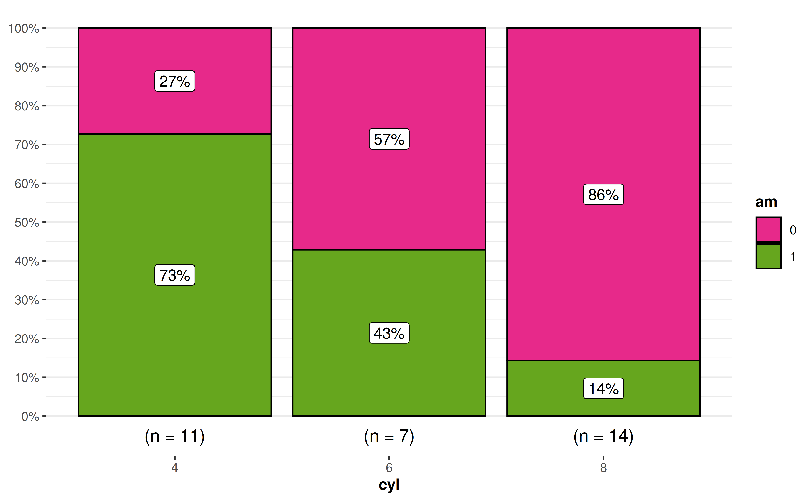

### How can I remove a particular `geom` layer from the plot?

Sometimes you may not want a particular `geom` layer to be displayed.
You can remove it by setting transparency (`alpha`) for that layer to 0
via the corresponding `*.args` argument. For example, to remove the
points from a
[`ggwithinstats()`](https://www.indrapatil.com/ggstatsplot/reference/ggwithinstats.md)
plot:

\
[`ggwithinstats`](https://www.indrapatil.com/ggstatsplot/reference/ggwithinstats.md)`(`\
`  data ``=`` ``bugs_long``,`\
`  x ``=`` ``condition``,`\
`  y ``=`` ``desire``,`\
`  subject.id ``=`` ``subject``,`\
`  point.args ``=`` `[`list`](https://rdrr.io/r/base/list.html)`(``alpha ``=`` ``0``)``,`\
`  results.subtitle ``=`` ``FALSE``,`\
`  pairwise.display ``=`` ``"none"`\
`)`

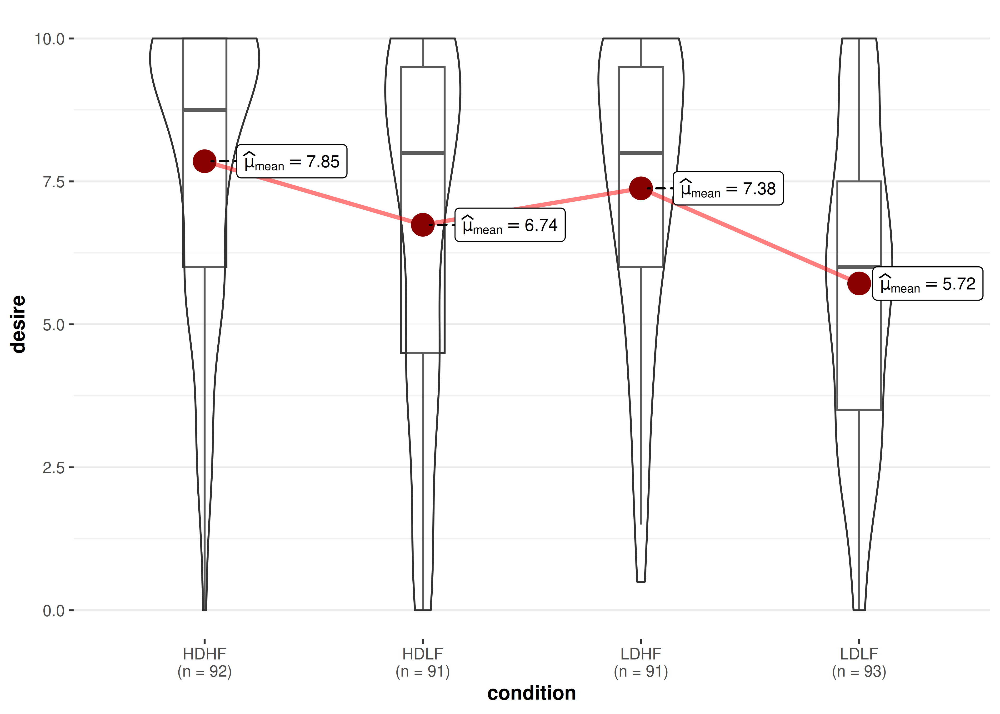

The same works for other layers,
e.g. `sample.size.label.args = list(alpha = 0)` removes the sample size
labels in
[`ggbarstats()`](https://www.indrapatil.com/ggstatsplot/reference/ggbarstats.md).

## `grouped_` functions and programmatic use

### How can I modify `grouped_` outputs using `{ggplot2}` functions?

All [ggstatsplot](https://www.indrapatil.com/ggstatsplot/) plots are
`ggplot` objects, which can be further modified, just like any other
`ggplot` object. The exception is plots returned by `grouped_`
functions, which are [patchwork](https://patchwork.data-imaginist.com)
objects combining several plots. To modify each of the individual plots,
use the `ggplot.component` argument (present in all functions except
[`ggcoefstats()`](https://www.indrapatil.com/ggstatsplot/reference/ggcoefstats.md)).
For example, this gives all plots the same color scale and Y-axis range:

\
[`library`](https://rdrr.io/r/base/library.html)`(`[`ggplot2`](https://ggplot2.tidyverse.org)`)`\
\
[`grouped_ggbetweenstats`](https://www.indrapatil.com/ggstatsplot/reference/grouped_ggbetweenstats.md)`(`\
`  ``mtcars``,`\
`  ``cyl``,`\
`  ``wt``,`\
`  grouping.var ``=`` ``am``,`\
`  results.subtitle ``=`` ``FALSE``,`\
`  pairwise.display ``=`` ``"none"``,`\
`  ggplot.component ``=`` `[`list`](https://rdrr.io/r/base/list.html)`(`\
`    `[`scale_color_manual`](https://ggplot2.tidyverse.org/reference/scale_manual.html)`(``values ``=`` ``paletteer``::`[`paletteer_c`](https://emilhvitfeldt.github.io/paletteer/reference/paletteer_c.html)`(``"viridis::viridis"``, ``3``)``)``,`\
`    `[`scale_y_continuous`](https://ggplot2.tidyverse.org/reference/scale_continuous.html)`(``limits ``=`` `[`c`](https://rdrr.io/r/base/c.html)`(``1``, ``6``)``)`\
`  ``)``,`\
`  ``` # arguments given to `{patchwork}` for annotating the combined plot ``\
`  annotation.args ``=`` `[`list`](https://rdrr.io/r/base/list.html)`(`\
`    title ``=`` ``"Weight by number of cylinders"``,`\
`    theme ``=`` `[`theme`](https://ggplot2.tidyverse.org/reference/theme.html)`(``plot.title ``=`` `[`element_text`](https://ggplot2.tidyverse.org/reference/element.html)`(``size ``=`` ``20``)``)`\
`  ``)`\
`)`

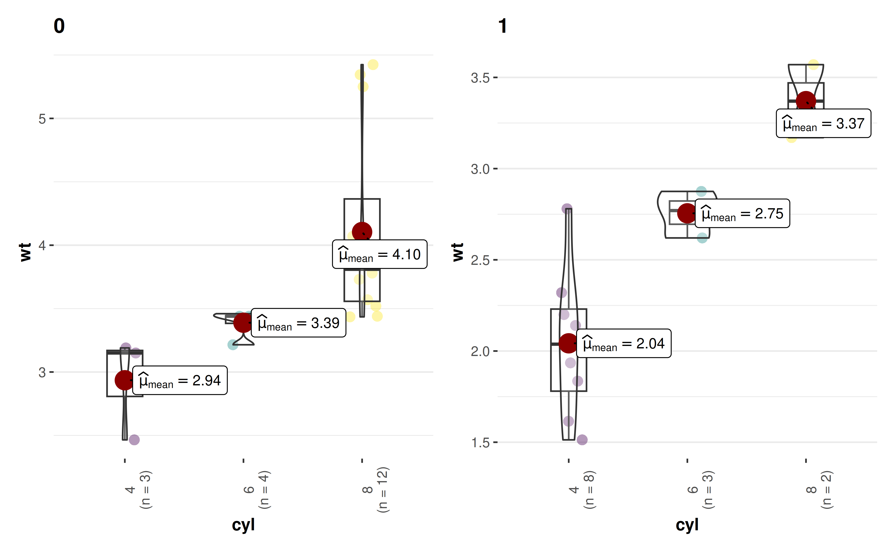

Alternatively, [patchwork](https://patchwork.data-imaginist.com)’s `&`
operator applies a [ggplot2](https://ggplot2.tidyverse.org) component to
all plots in a `grouped_` output:

\
[`grouped_ggbetweenstats`](https://www.indrapatil.com/ggstatsplot/reference/grouped_ggbetweenstats.md)`(``mtcars``, ``cyl``, ``wt``, grouping.var ``=`` ``am``)`` ``&`\
`  `[`theme`](https://ggplot2.tidyverse.org/reference/theme.html)`(``axis.text.x ``=`` `[`element_text`](https://ggplot2.tidyverse.org/reference/element.html)`(``angle ``=`` ``90``)``)`

### How can I go beyond what `grouped_` functions support?

The `grouped_` functions only repeat the analysis across a *single*
grouping variable, and they don’t let you create group-specific titles
or subtitles. For anything else, split the data yourself, create one
plot per group with [purrr](https://purrr.tidyverse.org/), and combine
them with
[`combine_plots()`](https://www.indrapatil.com/ggstatsplot/reference/combine_plots.md)
(see also [this
article](https://www.indrapatil.com/ggstatsplot/articles/web_only/purrr_examples.html)).
For example, to repeat the analysis across two grouping variables with a
title for each group:

\
`ggplot2``::`[`mpg`](https://ggplot2.tidyverse.org/reference/mpg.html)` ``|>`\
`  ``dplyr``::`[`filter`](https://dplyr.tidyverse.org/reference/filter.html)`(``drv`` `[`%in%`](https://rdrr.io/r/base/match.html)` `[`c`](https://rdrr.io/r/base/c.html)`(``"4"``, ``"f"``)``, ``fl`` `[`%in%`](https://rdrr.io/r/base/match.html)` `[`c`](https://rdrr.io/r/base/c.html)`(``"p"``, ``"r"``)``)`` ``|>`\
`  ``(``\``(``d``)`` `[`split`](https://rdrr.io/r/base/split.html)`(``d``, f ``=`` `[`list`](https://rdrr.io/r/base/list.html)`(``d``$``drv``, ``d``$``fl``)``, drop ``=`` ``TRUE``)``)``(``)`` ``|>`\
`  ``purrr``::`[`imap`](https://purrr.tidyverse.org/reference/imap.html)`(``\``(``data``, ``group``)`` ``{`\
`    `[`ggscatterstats`](https://www.indrapatil.com/ggstatsplot/reference/ggscatterstats.md)`(`\
`      data ``=`` ``data``,`\
`      x ``=`` ``displ``,`\
`      y ``=`` ``hwy``,`\
`      title ``=`` `[`paste0`](https://rdrr.io/r/base/paste.html)`(``"Drive and fuel type: "``, ``group``)``,`\
`      results.subtitle ``=`` ``FALSE`\
`    ``)`\
`  ``}``)`` ``|>`\
`  `[`combine_plots`](https://www.indrapatil.com/ggstatsplot/reference/combine_plots.md)`(``plotgrid.args ``=`` `[`list`](https://rdrr.io/r/base/list.html)`(``nrow ``=`` ``2L``)``)`

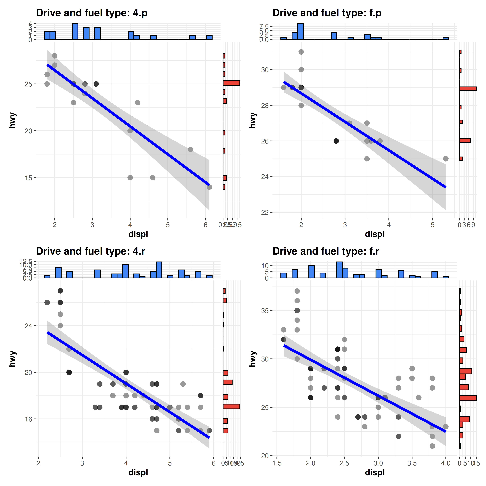

### How can I use `{ggstatsplot}` functions in a `for` loop?

Given that all functions in
[ggstatsplot](https://www.indrapatil.com/ggstatsplot/) use tidy
evaluation, running these functions in a `for` loop requires minor
adjustment to how inputs are entered:

\
`col.name`` ``<-`` `[`colnames`](https://rdrr.io/r/base/colnames.html)`(``mtcars``)`\
`plot_list`` ``<-`` `[`list`](https://rdrr.io/r/base/list.html)`(``)`\
\
`` # executing the function in a `for` loop ``\
`for`` ``(``i`` ``in`` ``3``:`[`length`](https://rdrr.io/r/base/length.html)`(``col.name``)``)`` ``{`\
`  ``plot_list``[[``col.name``[``i``]``]``]`` ``<-`` `[`ggbetweenstats`](https://www.indrapatil.com/ggstatsplot/reference/ggbetweenstats.md)`(`\
`    data ``=`` ``mtcars``,`\
`    x ``=`` ``cyl``,`\
`    y ``=`` ``!``!``col.name``[``i``]`\
`  ``)`\
`}`

Note that plots created inside a `for` loop are not printed
automatically; either store them (as above) or wrap the call in
[`print()`](https://rdrr.io/r/base/print.html).

That said, if repeating function execution across multiple columns in a
data frame is what you want to do, I will recommend a [`{purrr}`-based
solution](https://www.indrapatil.com/ggstatsplot/articles/web_only/purrr_examples.html#repeating-function-execution-across-multiple-columns-in-a-data-frame).

This solution would work for `x` and `y` arguments, but not for the
`grouping.var` argument, which first needs to be converted to a symbol:

\
`df`` ``<-`` ``dplyr``::`[`filter`](https://dplyr.tidyverse.org/reference/filter.html)`(``movies_long``, ``genre`` ``==`` ``"Comedy"`` ``|`` ``genre`` ``==`` ``"Drama"``)`\
\
[`grouped_ggscatterstats`](https://www.indrapatil.com/ggstatsplot/reference/grouped_ggscatterstats.md)`(`\
`  data ``=`` ``df``,`\
`  x ``=`` ``!``!`[`colnames`](https://rdrr.io/r/base/colnames.html)`(``df``)``[``3``]``,`\
`  y ``=`` ``!``!`[`colnames`](https://rdrr.io/r/base/colnames.html)`(``df``)``[``5``]``,`\
`  grouping.var ``=`` ``!``!``rlang``::`[`sym`](https://rlang.r-lib.org/reference/sym.html)`(`[`colnames`](https://rdrr.io/r/base/colnames.html)`(``df``)``[``8``]``)``,`\
`  results.subtitle ``=`` ``FALSE`\
`)`

## Suggestions

If you find any bugs or have any suggestions/remarks, please file an
issue on `GitHub`:
<https://github.com/IndrajeetPatil/ggstatsplot/issues>
