# Frequently Asked Questions (FAQ)

------------------------------------------------------------------------

You can cite this package/vignette as:

    To cite package 'ggstatsplot' in publications use:

      Patil, I. (2021). Visualizations with statistical details: The
      'ggstatsplot' approach. Journal of Open Source Software, 6(61), 3167,
      doi:10.21105/joss.03167

    A BibTeX entry for LaTeX users is

      @Article{,
        doi = {10.21105/joss.03167},
        url = {https://doi.org/10.21105/joss.03167},
        year = {2021},
        publisher = {{The Open Journal}},
        volume = {6},
        number = {61},
        pages = {3167},
        author = {Indrajeet Patil},
        title = {{Visualizations with statistical details: The {'ggstatsplot'} approach}},
        journal = {{Journal of Open Source Software}},
      }

------------------------------------------------------------------------

Following are a few of the common questions asked in GitHub issues and
on social media platforms.

## 1. I just want the plot, not the statistical details. How can I turn them off?

All functions in
[ggstatsplot](https://indrajeetpatil.github.io/ggstatsplot/) that
display results from statistical analysis in a subtitle have argument
`results.subtitle`. Setting it to `FALSE` will return only the plot.

## 2. How can I customize the details contained in the subtitle?

Sometimes you may not wish include so many details in the subtitle. In
that case, you can extract the expression and copy-paste only the part
you wish to include. For example, here only statistic and *p*-values are
included:

``` r

library(ggplot2)
library(statsExpressions)

# extracting detailed expression
data_results <- oneway_anova(iris, Species, Sepal.Length, var.equal = TRUE)
data_results$expression[[1]]
#> list(italic("F")["Fisher"](2, 147) == "119.26", italic(p) == 
#>     "1.67e-31", widehat(omega["p"]^2) == "0.61", CI["95%"] ~ 
#>     "[" * "0.53", "1.00" * "]", italic("n")["obs"] == "150")

# adapting the details to your liking
ggplot(iris, aes(x = Species, y = Sepal.Length)) +
  geom_boxplot() +
  labs(subtitle = ggplot2::expr(paste(
    italic("F"), "(", "2", ",", "147", ")=", "119.26", ", ",
    italic("p"), "<", "0.001"
  )))
```


## 3. I am getting `Error in grid.Call` error

Sometimes, if you are working in `RStudio`, you might see the following
error-

``` r
Error in grid.Call(C_textBounds, as.graphicsAnnot(x$label), x$x, x$y, :
polygon edge not found
```

This can possibly be solved by increasing the size of RStudio viewer
pane.

## 4. Why do I get only plot in return but not the subtitle/caption?

In order to prevent the entire plotting function from failing when
statistical analysis fails, functions in
[ggstatsplot](https://indrajeetpatil.github.io/ggstatsplot/) default to
first attempting to run the analysis and if they fail, then return empty
(`NULL`) subtitle/caption. In such cases, if you wish to diagnose why
the analysis is failing, you will have to do so using the underlying
function used to carry out statistical analysis.

For example, the following returns only the plot but not the statistical
details in a subtitle.

``` r

df <- data.frame(x = 1, y = 2)
ggscatterstats(df, x, y, type = "robust")
```

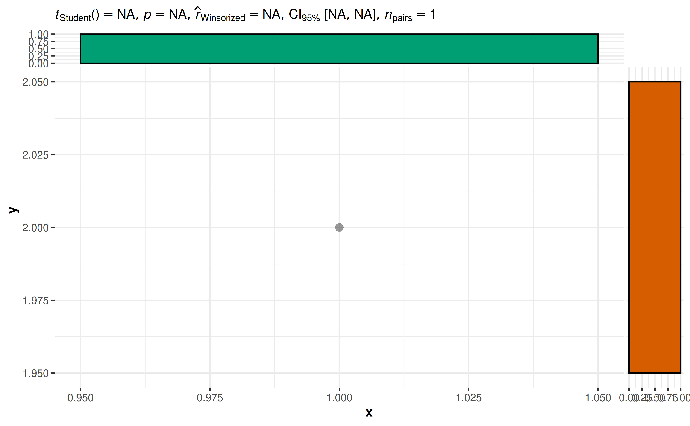

To see why the statistical analysis failed, you can look at the error
from the underlying function:

``` r

library(statsExpressions)
df <- data.frame(x = 1, y = 2)
corr_test(df, x, y, type = "robust")
#> # A tibble: 1 × 14
#>   parameter1 parameter2 effectsize                estimate conf.level conf.low
#>   <chr>      <chr>      <chr>                     <lgl>         <dbl> <lgl>   
#> 1 x          y          Winsorized NA correlation NA             0.95 NA      
#>   conf.high statistic df.error p.value method                    n.obs
#>   <lgl>     <lgl>     <lgl>      <dbl> <chr>                     <int>
#> 1 NA        NA        NA            NA Winsorized NA correlation     1
#>   conf.method expression
#>   <chr>       <list>    
#> 1 normal      <language>
```

## 5. What statistical test was carried out?

In case you are not sure what was the statistical test that produced the
results shown in the subtitle of the plot, the best way to get that
information is to either look at the documentation for the function used
or check out the associated vignette.

Summary of all analysis is handily available in `README`:
<https://github.com/IndrajeetPatil/ggstatsplot/blob/master/README.md>

## 6. How can I use `{ggstatsplot}` functions in a `for` loop?

Given that all functions in
[ggstatsplot](https://indrajeetpatil.github.io/ggstatsplot/) use tidy
evaluation, running these functions in a `for` loop requires minor
adjustment to how inputs are entered:

``` r

col.name <- colnames(mtcars)

# executing the function in a `for` loop
for (i in 3:length(col.name)) {
  ggbetweenstats(
    data = mtcars,
    x = cyl,
    y = !!col.name[i]
  )
}
```

That said, if repeating function execution across multiple columns in a
data frame in what you want to do, I will recommend
[purrr](https://purrr.tidyverse.org/)-based solution:

\<<https://indrajeetpatil.github.io/ggstatsplot/articles/web_only/purrr_examples.html#repeating-function-execution-across-multiple-columns-in-a-data>
frame-1\>

This solution would work for `x` and `y` arguments, but not for
`grouping.var` argument, which first needs to be converted to a symbol:

``` r

df <- dplyr::filter(movies_long, genre == "Comedy" | genre == "Drama")

grouped_ggscatterstats(
  data = df,
  x = !!colnames(df)[3],
  y = !!colnames(df)[5],
  grouping.var = !!rlang::sym(colnames(df)[8]),
  results.subtitle = FALSE
)
```

## 7. How can I have uniform Y-axes ranges in `grouped_` functions?

Across different facets of a `grouped_` plot, the axes ranges might
sometimes differ. You can use the `ggplot.component` parameter (present
in all functions) to have the same scale across the individual plots:

``` r

# provide a list of further `{ggplot2}` modifications using `ggplot.component`
grouped_ggscatterstats(
  mtcars,
  disp,
  hp,
  grouping.var = am,
  results.subtitle = FALSE,
  ggplot.component = list(ggplot2::scale_y_continuous(
    breaks = seq(50, 350, 50),
    limits = (c(50, 350))
  ))
)
```


## 8. Does `{ggstatsplot}` work with `plotly`?

The `plotly` R graphing library makes it easy to produce interactive web
graphics via `plotly.js`.

The [ggstatsplot](https://indrajeetpatil.github.io/ggstatsplot/)
functions are compatible with `plotly`.

``` r

library(plotly)

# creating ggplot object with `{ggstatsplot}`
p <- ggbetweenstats(mtcars, cyl, mpg)

# converting to plotly object
plotly::ggplotly(p, width = 480, height = 480)
```

## 9. How can I use `grouped_` functions with more than one group?

Currently, the `grouped_` variants of functions only support repeating
the analysis across a *single* grouping variable. Often, you have to run
the same analysis across a combination of more than two grouping
variables. This can be easily achieved using
[purrr](https://purrr.tidyverse.org/) package.

Here is an example-

``` r


# creating a list by splitting data frame by combination of two different
# grouping variables
df_list <- mpg %>%
  dplyr::filter(drv %in% c("4", "f"), fl %in% c("p", "r")) %>%
  split(f = list(.$drv, .$fl), drop = TRUE)

# checking if the length of the list is 4
length(df_list)
#> [1] 4

# running correlation analyses between; this will return a *list* of plots
plot_list <- purrr::pmap(
  .l = list(
    data = df_list,
    x = "displ",
    y = "hwy",
    results.subtitle = FALSE
  ),
  .f = ggscatterstats
)

# arrange the list in a single plot grid
combine_plots(
  plotlist = plot_list,
  plotgrid.args = list(nrow = 2L),
  annotation.args = list(tag_levels = "i")
)
```


## 10. How can I include statistical expressions in facet labels?

``` r

library(ggplot2)

# data
mtcars1 <- mtcars

p <- grouped_ggbetweenstats(
  data = mtcars1,
  x = cyl,
  y = mpg,
  grouping.var = am
)

expr1 <- extract_subtitle(p[[1L]])
expr2 <- extract_subtitle(p[[2L]])

mtcars1$am <- factor(mtcars1$am, levels = c(0, 1), labels = c(expr1, expr2))

mtcars1 %>%
  ggplot(aes(x = cyl, y = mpg)) +
  geom_jitter() +
  facet_wrap(
    vars(am),
    ncol = 1,
    strip.position = "top",
    labeller = ggplot2::label_parsed
  )
```

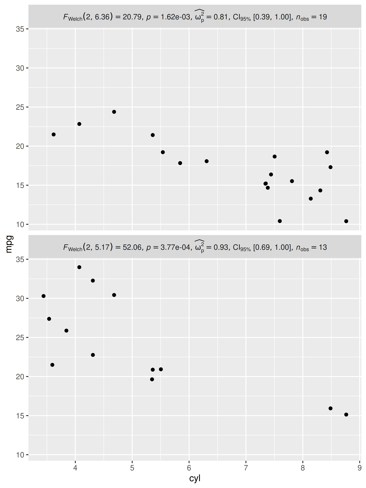

## 11. How to customize which pairs are shown in pairwise comparisons?

Currently, for `ggbetweenstats` and `ggwithinstats`, you can either
display all **significant** comparisons, all **non-significant**
comparisons, or **all** comparisons. But what if I am only interested in
just one particular comparison?

Here is a workaround using
[ggsignif](https://const-ae.github.io/ggsignif/):

``` r

library(ggsignif)

ggbetweenstats(mtcars, cyl, wt, pairwise.display = "none") +
  geom_signif(comparisons = list(c("4", "6")), test.args = list(exact = FALSE))
```


## 12. How to access data frame with results from pairwise comparisons?

Behind the scenes,
[ggstatsplot](https://indrajeetpatil.github.io/ggstatsplot/) uses
[`statsExpressions::pairwise_comparisons()`](https://indrajeetpatil.github.io/statsExpressions/reference/pairwise_comparisons.html)
function.

You can use it to extract actual data frames used in
[ggstatsplot](https://indrajeetpatil.github.io/ggstatsplot/) functions.

``` r

library(ggplot2)

pairwise_comparisons(mtcars, cyl, wt)
#> # A tibble: 3 × 9
#>   group1 group2 statistic   p.value alternative distribution p.adjust.method
#>   <chr>  <chr>      <dbl>     <dbl> <chr>       <chr>        <chr>          
#> 1 4      6           5.39 0.00831   two.sided   q            Holm           
#> 2 4      8           9.11 0.0000124 two.sided   q            Holm           
#> 3 6      8           5.12 0.00831   two.sided   q            Holm           
#>   test         expression
#>   <chr>        <list>    
#> 1 Games-Howell <language>
#> 2 Games-Howell <language>
#> 3 Games-Howell <language>
```

## 13. How can I change annotation in pairwise comparisons?

[ggstatsplot](https://indrajeetpatil.github.io/ggstatsplot/) defaults to
displaying exact p-values or logged Bayes Factor values for pairwise
comparisons. But what if you wish to adopt a different annotation
labels?

You will have to customize them yourself:

``` r

library(ggplot2)
library(ggsignif)

# converting to factor
mtcars$cyl <- as.factor(mtcars$cyl)

# creating the base plot
p <- ggbetweenstats(mtcars, cyl, wt, pairwise.display = "none")

# using `pairwise_comparisons()` function to create a data frame with results
df <- pairwise_comparisons(mtcars, cyl, wt) %>%
  dplyr::mutate(groups = purrr::pmap(.l = list(group1, group2), .f = c)) %>%
  dplyr::arrange(group1) %>%
  dplyr::mutate(asterisk_label = c("**", "***", "**"))

df
#> # A tibble: 3 × 11
#>   group1 group2 statistic   p.value alternative distribution p.adjust.method
#>   <chr>  <chr>      <dbl>     <dbl> <chr>       <chr>        <chr>          
#> 1 4      6           5.39 0.00831   two.sided   q            Holm           
#> 2 4      8           9.11 0.0000124 two.sided   q            Holm           
#> 3 6      8           5.12 0.00831   two.sided   q            Holm           
#>   test         expression groups    asterisk_label
#>   <chr>        <list>     <list>    <chr>         
#> 1 Games-Howell <language> <chr [2]> **            
#> 2 Games-Howell <language> <chr [2]> ***           
#> 3 Games-Howell <language> <chr [2]> **

# adding pairwise comparisons using `{ggsignif}` package
p +
  ggsignif::geom_signif(
    comparisons = df$groups,
    map_signif_level = TRUE,
    annotations = df$asterisk_label,
    y_position = c(5.5, 5.75, 6.0),
    test = NULL,
    na.rm = TRUE
  )
```

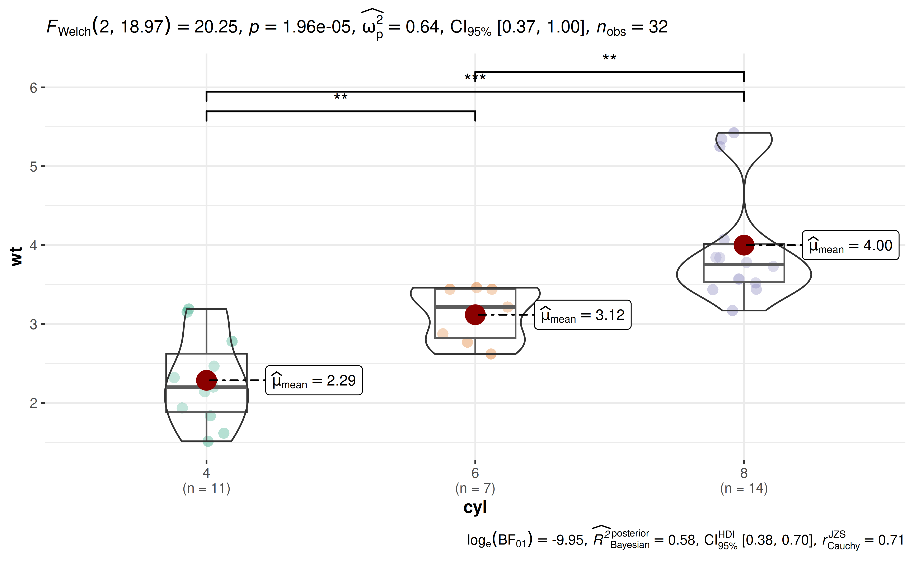

## 14. How to access data frame containing statistical analyses?

You can use the
[`extract_stats()`](https://indrajeetpatil.github.io/ggstatsplot/reference/extract_stats.md)
helper function for this.

``` r

library(ggplot2)

p <- ggpiestats(mtcars, am, cyl)

# data frame with results
extract_stats(p)
#> $subtitle_data
#> # A tibble: 1 × 13
#>   statistic    df p.value method                     effectsize        estimate
#>       <dbl> <int>   <dbl> <chr>                      <chr>                <dbl>
#> 1      8.74     2  0.0126 Pearson's Chi-squared test Cramer's V (adj.)    0.464
#>   conf.level conf.low conf.high conf.method conf.distribution n.obs expression
#>        <dbl>    <dbl>     <dbl> <chr>       <chr>             <int> <list>    
#> 1       0.95        0     0.820 ncp         chisq                32 <language>
#> 
#> $caption_data
#> # A tibble: 1 × 15
#>   term  conf.level effectsize estimate conf.low conf.high
#>   <chr>      <dbl> <chr>         <dbl>    <dbl>     <dbl>
#> 1 Ratio       0.95 Cramers_v     0.415        0     0.669
#>   prior.distribution      prior.location prior.scale  bf10
#>   <chr>                            <dbl>       <dbl> <dbl>
#> 1 independent multinomial              0           1  16.8
#>   method                              conf.method log_e_bf10 n.obs expression
#>   <chr>                               <chr>            <dbl> <int> <list>    
#> 1 Bayesian contingency table analysis ETI               2.82    32 <language>
#> 
#> $pairwise_comparisons_data
#> NULL
#> 
#> $descriptive_data
#> # A tibble: 6 × 5
#>   cyl   am    counts  perc .label
#>   <fct> <fct>  <int> <dbl> <chr> 
#> 1 4     1          8  72.7 73%   
#> 2 6     1          3  42.9 43%   
#> 3 8     1          2  14.3 14%   
#> 4 4     0          3  27.3 27%   
#> 5 6     0          4  57.1 57%   
#> 6 8     0         12  85.7 86%   
#> 
#> $one_sample_data
#> # A tibble: 3 × 19
#>   cyl   counts  perc N        statistic    df p.value
#>   <fct>  <int> <dbl> <chr>        <dbl> <dbl>   <dbl>
#> 1 8         14  43.8 (n = 14)     7.14      1 0.00753
#> 2 6          7  21.9 (n = 7)      0.143     1 0.705  
#> 3 4         11  34.4 (n = 11)     2.27      1 0.132  
#>   method                                   effectsize  estimate conf.level
#>   <chr>                                    <chr>          <dbl>      <dbl>
#> 1 Chi-squared test for given probabilities Pearson's C    0.581       0.95
#> 2 Chi-squared test for given probabilities Pearson's C    0.141       0.95
#> 3 Chi-squared test for given probabilities Pearson's C    0.414       0.95
#>   conf.low conf.high conf.method conf.distribution n.obs expression
#>      <dbl>     <dbl> <chr>       <chr>             <int> <list>    
#> 1    0.186     0.778 ncp         chisq                14 <language>
#> 2    0         0.652 ncp         chisq                 7 <language>
#> 3    0         0.723 ncp         chisq                11 <language>
#>   .label                                                                 
#>   <glue>                                                                 
#> 1 list(~chi['gof']^2~(1)==7.14, ~italic(p)=='7.53e-03', ~italic(n)=='14')
#> 2 list(~chi['gof']^2~(1)==0.14, ~italic(p)=='0.71', ~italic(n)=='7')     
#> 3 list(~chi['gof']^2~(1)==2.27, ~italic(p)=='0.13', ~italic(n)=='11')    
#>   .p.label                    
#>   <glue>                      
#> 1 list(~italic(p)=='7.53e-03')
#> 2 list(~italic(p)=='0.71')    
#> 3 list(~italic(p)=='0.13')    
#> 
#> $tidy_data
#> NULL
#> 
#> $glance_data
#> NULL
#> 
#> attr(,"class")
#> [1] "ggstatsplot_stats" "list"
```

## 15. How can I remove a particular `geom` layer from the plot?

Sometimes you may not want a particular `geom` layer to be displayed.
You can remove them by setting transparency (`alpha`) for that layer to
0.

For example, let’s say I want to remove the points from
`ggwithintstats()` plot:

``` r


# before
ggwithinstats(
  data = bugs_long,
  x = condition,
  y = desire,
  results.subtitle = FALSE,
  pairwise.display = "none"
)
```


``` r


# after
ggwithinstats(
  data = bugs_long,
  x = condition,
  y = desire,
  point.args = list(alpha = 0),
  results.subtitle = FALSE,
  pairwise.display = "none"
)
```


## 16. How can I modify the fill colors with custom values?

Sometimes you may not be satisfied with the available color palette
values. In this case, you can also change the colors by manually
specifying these values.

``` r

library(ggplot2)

ggbarstats(mtcars, am, cyl, results.subtitle = FALSE) +
  scale_fill_manual(values = c("#E7298A", "#66A61E"))
```

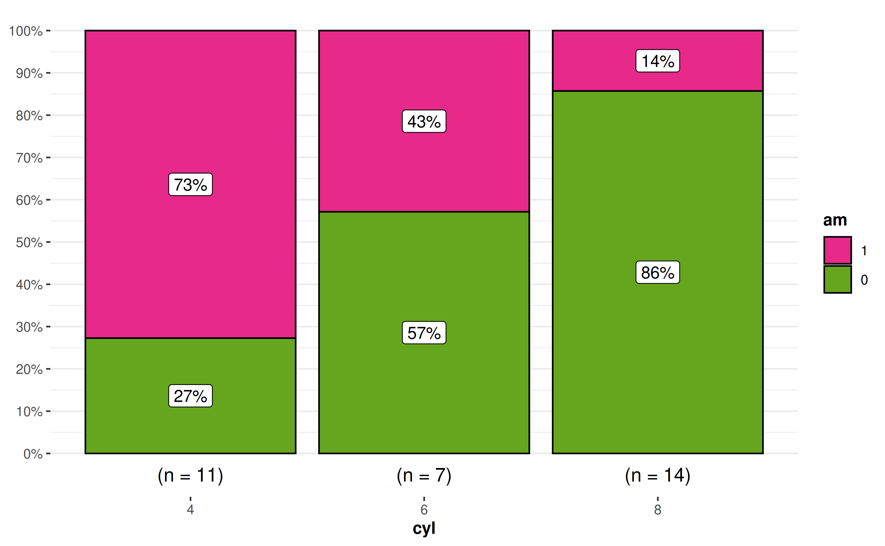

The same can also be done for `grouped_` functions:

``` r

grouped_ggpiestats(
  data = mtcars,
  grouping.var = am,
  x = cyl,
  ggplot.component = ggplot2::scale_fill_grey()
)
```

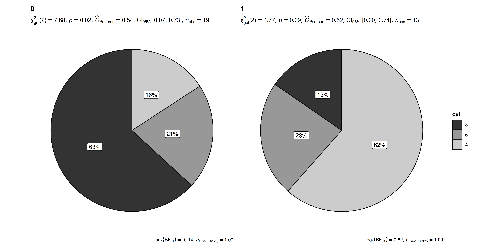

## 17. How can I modify `grouped_` outputs using `{ggplot2}` functions?

All [ggstatsplot](https://indrajeetpatil.github.io/ggstatsplot/) are
`ggplot` objects, which can be further modified, just like any other
`ggplot` object. But exception to these are all plots returned by
`grouped_` functions, but there is a way to tackle this.

``` r

library(paletteer)
library(ggplot2)

grouped_ggbetweenstats(
  mtcars,
  cyl,
  wt,
  grouping.var = am,
  results.subtitle = FALSE,
  pairwise.display = "none",
  # modify further with `{ggplot2}` functions
  ggplot.component = list(
    scale_color_manual(values = paletteer::paletteer_c("viridis::viridis", 3)),
    theme(axis.text.x = element_text(angle = 90))
  )
)
```

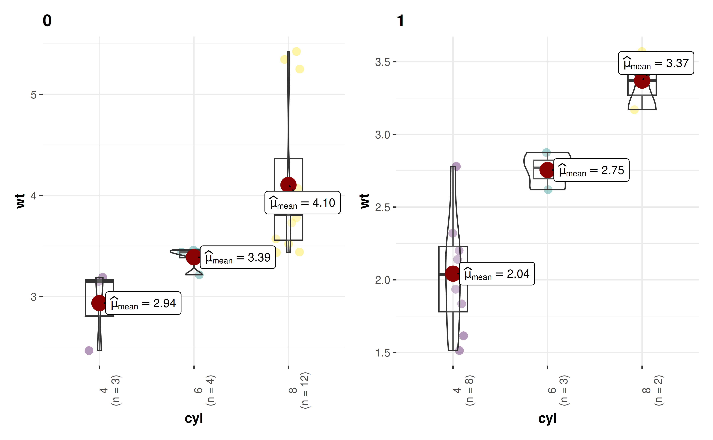

## 18. How can I extract data frame containing results from `{ggstatsplot}`?

[ggstatsplot](https://indrajeetpatil.github.io/ggstatsplot/) can return
expressions in the subtitle and caption, but what if you want to
actually get back data frame containing the results?

You have two options:

- Use
  [`ggstatsplot::extract_stats()`](https://indrajeetpatil.github.io/ggstatsplot/reference/extract_stats.md)
  function
- Or go to the source package
  [statsExpressions](https://indrajeetpatil.github.io/statsExpressions/)
  (see
  [examples](https://indrajeetpatil.github.io/statsExpressions/articles/dataframe_outputs.html))

## 19. How can I remove sample size labels for `ggbarstats`?

    library(gginnards)

    ## create a plot
    p <- ggbarstats(mtcars, am, cyl)

    ## remove layer corresponding to sample size
    delete_layers(p, "GeomText")

## 20. Statistical analysis I want to carry out is not available. What can I do?

By default, since
[ggstatsplot](https://indrajeetpatil.github.io/ggstatsplot/) always
allows just **one** type of test per statistical approach, sometimes
your favorite test might not be available. For example,
[ggstatsplot](https://indrajeetpatil.github.io/ggstatsplot/) provides
only Spearman’s $`\rho`$, but not Kendall’s $`\tau`$ as a non-parametric
correlation test.

In such cases, you can override the defaults and use
[statsExpressions](https://indrajeetpatil.github.io/statsExpressions/)
to create custom expressions to display in the plot. But be forewarned
that the expression building function in
[statsExpressions](https://indrajeetpatil.github.io/statsExpressions/)
is not stable yet.

``` r

library(correlation)
library(statsExpressions)
library(ggplot2)

# data with two variables of interest
df <- dplyr::select(mtcars, wt, mpg)

# correlation results
results <- correlation(df, method = "kendall") %>%
  insight::standardize_names(style = "broom")

# creating expression out of these results
df_results <- statsExpressions::add_expression_col(
  data           = results,
  no.parameters  = 0L,
  statistic.text = list(quote(italic("T"))),
  effsize.text   = list(quote(widehat(italic(tau))["Kendall"])),
  n              = results$n.obs[[1]]
)

# using custom expression in plot
ggscatterstats(df, wt, mpg, results.subtitle = FALSE) +
  labs(subtitle = df_results$expression[[1]])
```

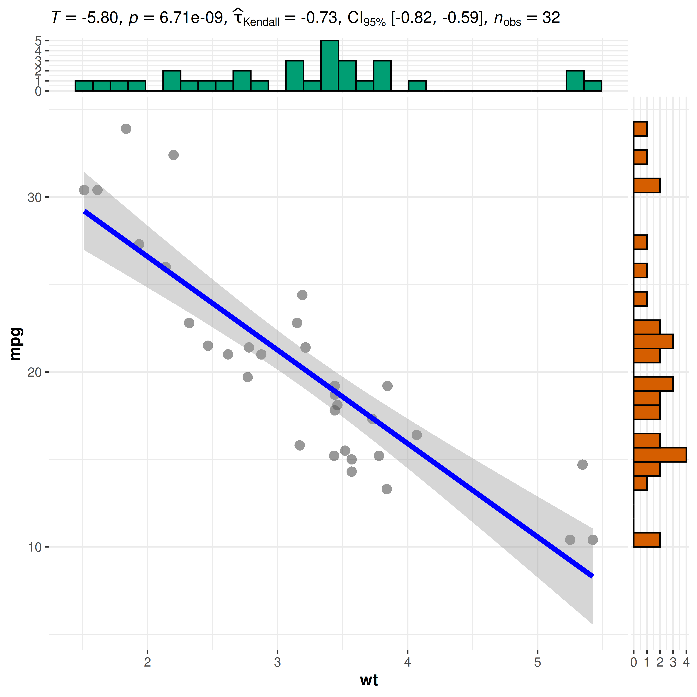

## 21. Is there way to adjust my alpha level?

No, there is no way to adjust alpha if you use `grouped_` functions
(e.g., `grouped_ggwithinstats`). You will have to just report in the
paper/article/report, what your adjusted alpha is.

So, for example, iif 2 tests are being carried out, the alpha is going
to be `0.05/2 = 0.025`. So, when you describe the *Methods* section, you
can mention that only those tests should be considered significant where
`p < 0.025`. Or you can even mention this in the caption.

## 22. How can I build a `Shiny` app using `{ggstatsplot}` functions?

Below is an example using `ggbetweenstats` function.

``` r

library(shiny)
library(rlang)

ui <- fluidPage(
  headerPanel("Example - ggbetweenstats"),
  sidebarPanel(
    selectInput("x", "xcol", "X Variable", choices = names(iris)[5]),
    selectInput("y", "ycol", "Y Variable", choices = names(iris)[1:4])
  ),
  mainPanel(plotOutput("plot"))
)

server <- function(input, output) {
  output$plot <- renderPlot({
    ggbetweenstats(iris, !!input$x, !!input$y)
  })
}

shinyApp(ui, server)
```

## 23. How to change size of annotations for combined plot in `grouped_*` functions?

``` r

library(ggplot2)

grouped_ggbetweenstats(
  data = dplyr::filter(ggplot2::mpg, drv != "4"),
  x = year,
  y = hwy,
  grouping.var = drv,
  results.subtitle = FALSE,
  ## arguments given to `{patchwork}` for combining plots
  annotation.args = list(
    title = "this is my title",
    subtitle = "this is my subtitle",
    theme = ggplot2::theme(
      plot.subtitle = element_text(size = 20),
      plot.title = element_text(size = 30)
    )
  )
)
```

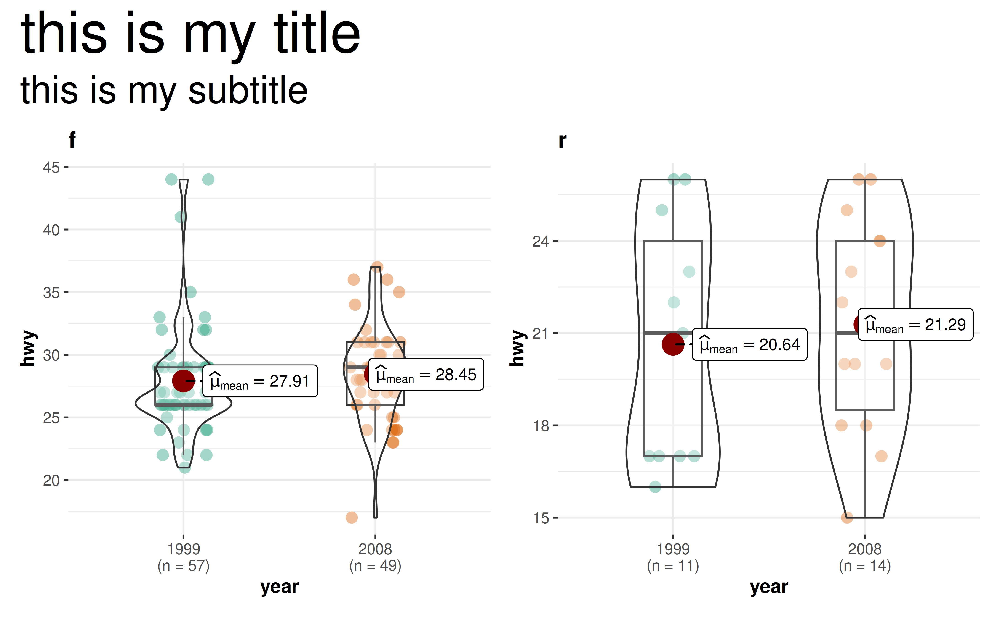

## 24. How to change size of text in the subtitle?

``` r

ggbetweenstats(
  data = iris,
  x = Species,
  y = Sepal.Length,
  ggplot.component = list(theme(plot.subtitle = element_text(size = 20, face = "bold")))
)
```

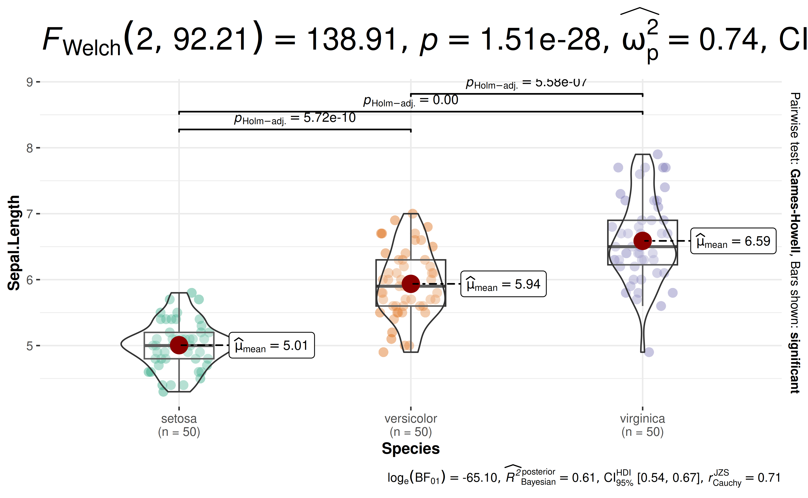

## 25. How to display pairwise comparison letter in a plot?

This is not possible out of the box, but see
[this](https://github.com/IndrajeetPatil/ggstatsplot/issues/654#issuecomment-948862514)
comment.

## 26. Does `{ggstatsplot}` carry out assumption checks?

No, [ggstatsplot](https://indrajeetpatil.github.io/ggstatsplot/) does
not carry out any analysis of whether assumptions are met or not. It
will just carry out whatever test you ask it to carry out.

To check these assumptions, you can use a different package called
[performance](https://easystats.github.io/performance/):

<https://easystats.github.io/performance/reference/index.html#check-model-assumptions-or-data-properties>

## 27. I am on Ubuntu and have trouble installing `{PMCMRplus}`?

Linux users may encounter some installation problems. In particular, the
[ggstatsplot](https://indrajeetpatil.github.io/ggstatsplot/) package
depends on the `{PMCMRplus}` package.

``` r
ERROR: dependencies ‘gmp’, ‘Rmpfr’ are not available for package ‘PMCMRplus’
```

This means that your operating system lacks `gmp` and `Rmpfr` libraries.

If you use `Ubuntu`, you can install these dependencies:

    sudo apt-get install libgmp3-dev
    sudo apt-get install libmpfr-dev

The following `README` file briefly describes the installation
procedure:
<https://CRAN.R-project.org/package=PMCMRplus/readme/README.html>

For MacOS, have a look at this
[post](https://stackoverflow.com/questions/35360885/installing-finding-gmp-under-osx).

## 28. How to modify the secondary Y-axis title?

``` r

ggbetweenstats(
  mtcars, cyl, wt,
  ggplot.component = list(
    ggplot2::scale_y_continuous(sec.axis = ggplot2::dup_axis(name = "My custom test"))
  )
)
```

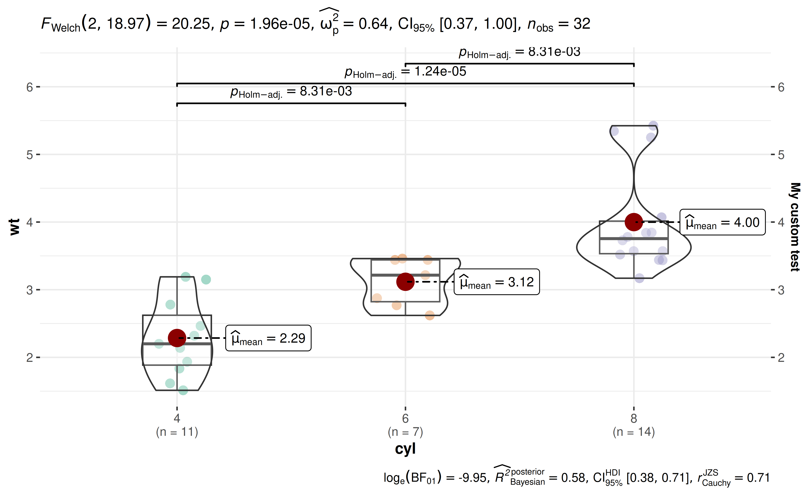

## 29. How to turn off scientific notation in expressions?

``` r

set.seed(123)
library(ggstatsplot)
library(WRS2)

ggwithinstats(
  WineTasting,
  Wine,
  Taste,
  paired = TRUE
)
```


``` r


ggwithinstats(
  WineTasting,
  Wine,
  Taste,
  paired = TRUE,
  digits = 4L
)
```

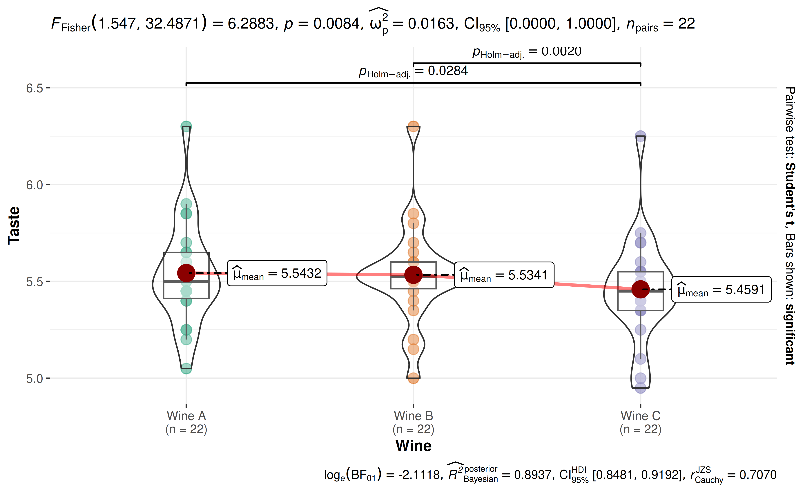

## 30. How to modify the whiskers in box plots from ggbetweenstats?

By default, the whiskers in
[`ggbetweenstats()`](https://indrajeetpatil.github.io/ggstatsplot/reference/ggbetweenstats.md)
box plots extend to 1.5 times the interquartile range (IQR) from the
box, following the Tukey method. You can customize this using the `coef`
parameter in `boxplot.args`:

``` r

# Default whiskers (1.5 * IQR)
ggbetweenstats(
  data = mtcars,
  x = am,
  y = wt,
  results.subtitle = FALSE
)
```


``` r


# Longer whiskers (3 * IQR)
ggbetweenstats(
  data = mtcars,
  x = am,
  y = wt,
  boxplot.args = list(coef = 3),
  results.subtitle = FALSE
)
```


``` r


# Whiskers only to data range (no multiplier)
ggbetweenstats(
  data = mtcars,
  x = am,
  y = wt,
  boxplot.args = list(coef = 0),
  results.subtitle = FALSE
)
```


## Suggestions

If you find any bugs or have any suggestions/remarks, please file an
issue on `GitHub`:
<https://github.com/IndrajeetPatil/ggstatsplot/issues>
