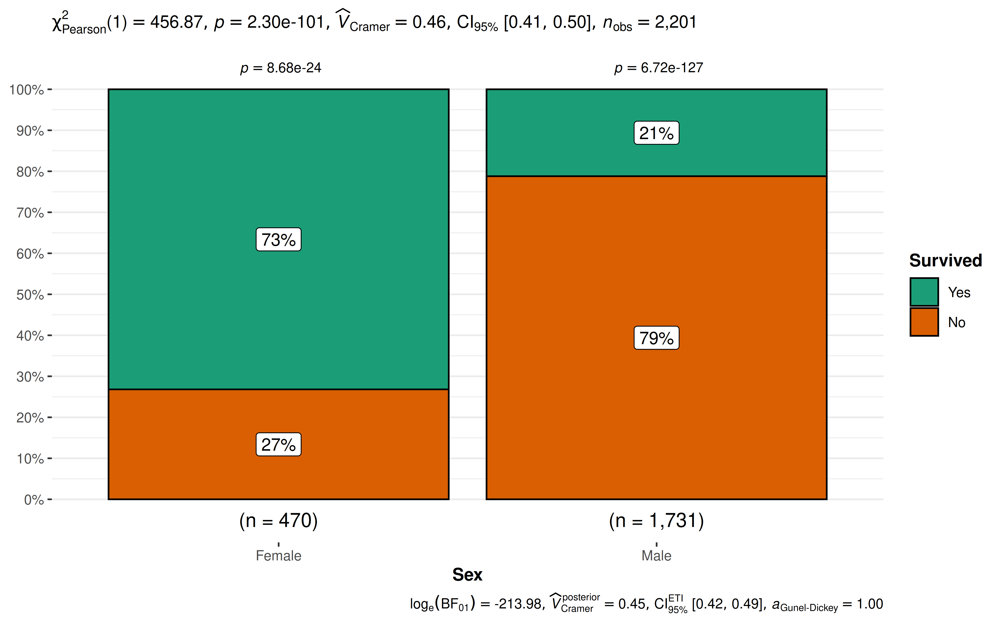
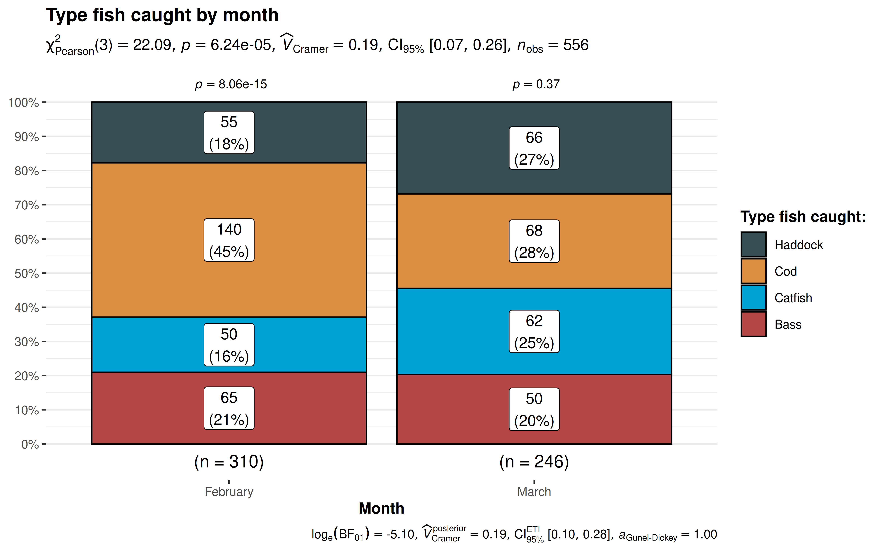
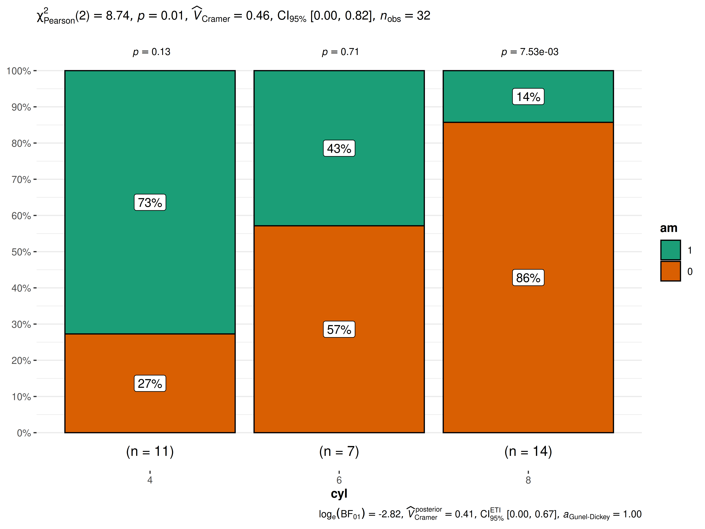

# ggbarstats

------------------------------------------------------------------------

You can cite this package/vignette as:

    To cite package 'ggstatsplot' in publications use:

      Patil, I. (2021). Visualizations with statistical details: The
      'ggstatsplot' approach. Journal of Open Source Software, 6(61), 3167,
      doi:10.21105/joss.03167

    A BibTeX entry for LaTeX users is

      @Article{,
        doi = {10.21105/joss.03167},
        url = {https://doi.org/10.21105/joss.03167},
        year = {2021},
        publisher = {{The Open Journal}},
        volume = {6},
        number = {61},
        pages = {3167},
        author = {Indrajeet Patil},
        title = {{Visualizations with statistical details: The {'ggstatsplot'} approach}},
        journal = {{Journal of Open Source Software}},
      }

------------------------------------------------------------------------

Lifecycle:
[](https://lifecycle.r-lib.org/articles/stages.html)

## Introduction to `ggbarstats`

The function `ggbarstats` can be used for quick **data exploration**
and/or to prepare **publication-ready pie charts** to summarize the
statistical relationship(s) among one or more categorical variables. We
will see examples of how to use this function in this vignette.

To begin with, here are some instances where you would want to use
`ggbarstats`-

- to check if the proportion of observations matches our hypothesized
  proportion, this is typically known as a “Goodness of Fit” test

- to see if the frequency distribution of two categorical variables are
  independent of each other using the contingency table analysis

- to check if the proportion of observations at each level of a
  categorical variable is equal

**Note:** The following demo uses the pipe operator (`%>%`), if you are
not familiar with this operator, here is a good explanation:
[http://r4ds.had.co.nz/pipes.html](http://r4ds.had.co.nz/pipes.md).

`ggbarstats` works **only** with data organized in data frames or
tibbles. It will not work with other data structures like base-R tables
or matrices. It can operate on data frames that are organized with one
row per observation or data frames that have one column containing
counts. This vignette provides examples of both (see examples below).

To help demonstrate how `ggbarstats` can be used with categorical (also
known as nominal) data, a modified version of the original `Titanic`
dataset (from the `datasets` library) has been provided in the
[ggstatsplot](https://indrajeetpatil.github.io/ggstatsplot/) package
with the name `Titanic_full`. The Titanic Passenger Survival Dataset
provides information “on the fate of passengers on the fatal maiden
voyage of the ocean liner *Titanic*, including economic status (class),
sex, age, and survival.”

Let’s have a look at the structure of both.

``` r

library(dplyr)

# looking at the original data in tabular format
dplyr::glimpse(Titanic)
#>  'table' num [1:4, 1:2, 1:2, 1:2] 0 0 35 0 0 0 17 0 118 154 ...
#>  - attr(*, "dimnames")=List of 4
#>   ..$ Class   : chr [1:4] "1st" "2nd" "3rd" "Crew"
#>   ..$ Sex     : chr [1:2] "Male" "Female"
#>   ..$ Age     : chr [1:2] "Child" "Adult"
#>   ..$ Survived: chr [1:2] "No" "Yes"

# looking at the dataset as a tibble or data frame
dplyr::glimpse(Titanic_full)
#> Rows: 2,201
#> Columns: 5
#> $ id       <dbl> 1, 2, 3, 4, 5, 6, 7, 8, 9, 10, 11, 12, 13, 14, 15, 16, 17, 18…
#> $ Class    <fct> 3rd, 3rd, 3rd, 3rd, 3rd, 3rd, 3rd, 3rd, 3rd, 3rd, 3rd, 3rd, 3…
#> $ Sex      <fct> Male, Male, Male, Male, Male, Male, Male, Male, Male, Male, M…
#> $ Age      <fct> Child, Child, Child, Child, Child, Child, Child, Child, Child…
#> $ Survived <fct> No, No, No, No, No, No, No, No, No, No, No, No, No, No, No, N…
```

## Independence (or association) with `ggbarstats`

Let’s next investigate whether the passenger’s sex was independent of,
or associated with, their survival status, i.e., we want to test whether
the proportion of people who survived was different between the sexes.

``` r

ggbarstats(
  data = Titanic_full,
  x = Survived,
  y = Sex
)
```



The plot clearly shows that survival rates were very different between
males and females. The Pearson’s $`\chi^2`$-test of independence is
significant given our large sample size. Additionally, for both females
and males, the survival rates were significantly different than 50% as
indicated by a goodness of fit test for each gender.

## Grouped analysis with `grouped_ggbarstats`

What if we want to do the same analysis of gender but also factor in the
passenger’s age (Age)? We have information that classifies the
passengers as Child or Adult, perhaps that makes a difference to their
survival rate?

[ggstatsplot](https://indrajeetpatil.github.io/ggstatsplot/) provides a
special helper function for such instances: `grouped_ggbarstats`. It is
a convenient wrapper function around `combine_plots`. It applies
`ggbarstats` across all **levels** of a specified **grouping variable**
and then combines the list of individual plots into a single plot. Note
that the grouping variable can be anything: conditions in a given study,
groups in a study sample, different studies, etc.

``` r

grouped_ggbarstats(
  # arguments relevant for `ggbarstats()`
  data = Titanic_full,
  x = Survived,
  y = Sex,
  grouping.var = Age,
  digits.perc = 1,
  package = "ggsci",
  palette = "category10_d3",
  # arguments relevant for `combine_plots()`
  title.text = "Passenger survival on the Titanic by gender and age",
  caption.text = "Asterisks denote results from proportion tests; \n***: p < 0.001, ns: non-significant",
  plotgrid.args = list(nrow = 2L)
)
```


The resulting pie charts and statistics make the story clear. For adults
gender very much matters. Women survived at much higher rates than men.
For children gender is not significantly associated with survival and
both male and female children have a survival rate that is not
significantly different from 50/50.

## Grouped analysis with `ggbarstats` + `{purrr}`

Although `grouped_ggbarstats` provides a quick way to explore the data,
it leaves much to be desired. For example, we may want to add different
captions, titles, themes, or palettes for each level of the grouping
variable, etc. For cases like these, it would be better to use
[purrr](https://purrr.tidyverse.org/) package.

See the associated vignette here:
<https://indrajeetpatil.github.io/ggstatsplot/articles/web_only/purrr_examples.html>

## Working with data organized by `counts`

`ggbarstats` can also work with data frame containing counts (aka tabled
data), i.e., when each row doesn’t correspond to a unique observation.
For example, consider the following notional `fishing` data frame
containing data from two boats (`A` and `B`) about the number of
different types fish they caught in the months of `February` and
`March`. In this data frame, each row corresponds to a unique
combination of `Boat` and `Month`.

``` r


# (this is completely fictional; I don't know first thing about fishing!)

fishing <- tibble::as_tibble(data.frame(
  Boat = c(rep("B", 4), rep("A", 4), rep("A", 4), rep("B", 4)),
  Month = c(rep("February", 2), rep("March", 2), rep("February", 2), rep("March", 2)),
  Fish = c(
    "Bass",
    "Catfish",
    "Cod",
    "Haddock",
    "Cod",
    "Haddock",
    "Bass",
    "Catfish",
    "Bass",
    "Catfish",
    "Cod",
    "Haddock",
    "Cod",
    "Haddock",
    "Bass",
    "Catfish"
  ),
  SumOfCaught = c(25, 20, 35, 40, 40, 25, 30, 42, 40, 30, 33, 26, 100, 30, 20, 20)
))

fishing
#> # A tibble: 16 × 4
#>    Boat  Month    Fish    SumOfCaught
#>    <chr> <chr>    <chr>         <dbl>
#>  1 B     February Bass             25
#>  2 B     February Catfish          20
#>  3 B     March    Cod              35
#>  4 B     March    Haddock          40
#>  5 A     February Cod              40
#>  6 A     February Haddock          25
#>  7 A     March    Bass             30
#>  8 A     March    Catfish          42
#>  9 A     February Bass             40
#> 10 A     February Catfish          30
#> 11 A     March    Cod              33
#> 12 A     March    Haddock          26
#> 13 B     February Cod             100
#> 14 B     February Haddock          30
#> 15 B     March    Bass             20
#> 16 B     March    Catfish          20
```

When the data is organized this way, we make a slightly different call
to the
[`ggbarstats()`](https://indrajeetpatil.github.io/ggstatsplot/reference/ggbarstats.md)
function: we use the `counts` argument.

If we want to investigate the relationship of type of fish by month (a
test of independence), our command would be:

``` r

ggbarstats(
  data = fishing,
  x = Fish,
  y = Month,
  counts = SumOfCaught,
  label = "both",
  package = "ggsci",
  palette = "default_jama",
  title = "Type fish caught by month",
  caption = "Source: completely made up",
  legend.title = "Type fish caught: "
)
```



The results support our hypothesis that the type of fish caught is
related to the month in which we’re fishing. The $`\chi^2`$ independence
test results at the top of the plot. In February we catch significantly
more Haddock than we would hypothesize for an equal distribution.
Whereas in March our results indicate there’s no strong evidence that
the distribution isn’t equal.

## Within-subjects designs

Let’s imagine we’re conducting clinical trials for some new imaginary
wonder drug. We have 134 subjects entering the trial. Some of them enter
healthy (*n* = 96), some of them enter the trial already being sick (*n*
= 38). All of them receive our treatment or intervention. Then we check
back in a month to see if they are healthy or sick. A classic pre/post
experimental design. We’re interested in seeing the change in both
groupings. In the case of within-subjects designs, you can set
`paired = TRUE`, which will display results from **McNemar test** in the
subtitle.

(**Note:** If you forget to set `paired = TRUE`, the results will be
inaccurate.)

``` r

# create imaginary data
clinical_trial <- tibble::tribble(
  ~SickBefore, ~SickAfter, ~Counts,
  "No", "Yes", 4,
  "Yes", "No", 25,
  "Yes", "Yes", 13,
  "No", "No", 92
)

ggbarstats(
  data = clinical_trial,
  x = SickAfter,
  y = SickBefore,
  counts = Counts,
  paired = TRUE,
  label = "both",
  title = "Results from imaginary clinical trial",
  package = "ggsci",
  palette = "default_ucscgb"
)
```


The results bode well for our experimental wonder drug. Of the 96 who
started out healthy only 4% were sick after a month. Ideally, we would
have hoped for zero but reality is seldom perfect. On the other side of
the 38 who started out sick that number has reduced to just 13 or 34%
which is a marked improvement.

## Summary of graphics and tests

Details about underlying functions used to create graphics and
statistical tests carried out can be found in the function
documentation:
<https://indrajeetpatil.github.io/ggstatsplot/reference/ggbarstats.html>

## Reporting

If you wish to include statistical analysis results in a
publication/report, the ideal reporting practice will be a hybrid of two
approaches:

- the [ggstatsplot](https://indrajeetpatil.github.io/ggstatsplot/)
  approach, where the plot contains both the visual and numerical
  summaries about a statistical model, and

- the *standard* narrative approach, which provides interpretive context
  for the reported statistics.

For example, let’s see the following example:

``` r

ggbarstats(mtcars, am, cyl)
```



The narrative context (assuming `type = "parametric"`) can complement
this plot either as a figure caption or in the main text-

> Pearson’s $`\chi^2`$-test of independence revealed that, across 32
> automobiles, showed that there was a significant association between
> transmission engine and number of cylinders. The Bayes Factor for the
> same analysis revealed that the data were 16.78 times more probable
> under the alternative hypothesis as compared to the null hypothesis.
> This can be considered strong evidence (Jeffreys, 1961) in favor of
> the alternative hypothesis.

## Suggestions

If you find any bugs or have any suggestions/remarks, please file an
issue on GitHub: <https://github.com/IndrajeetPatil/ggstatsplot/issues>
