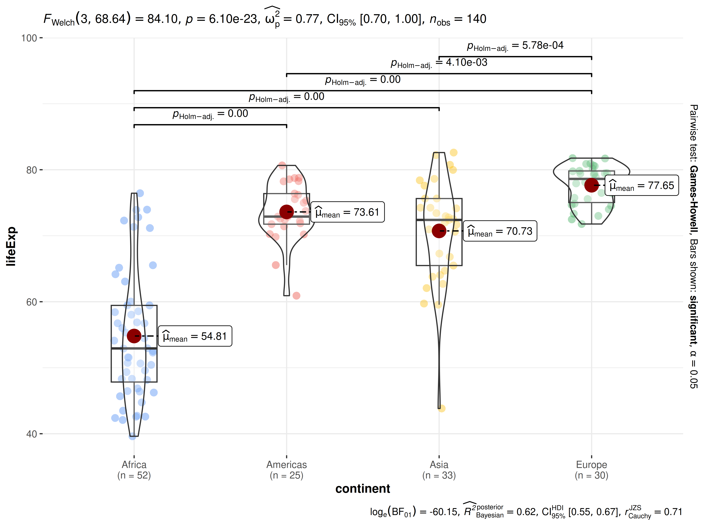
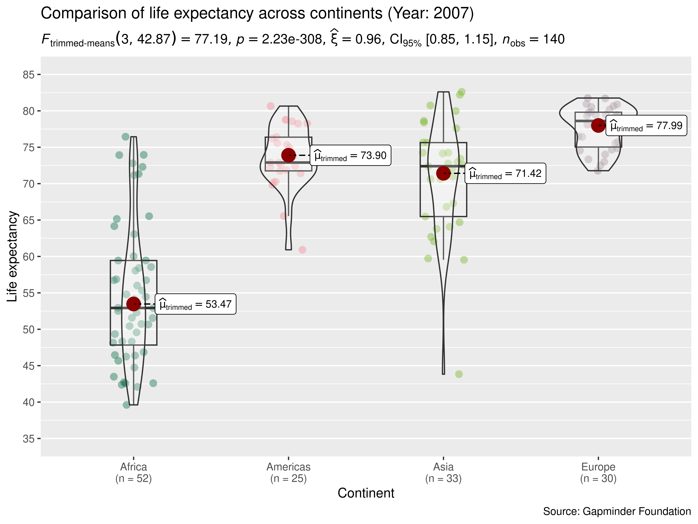
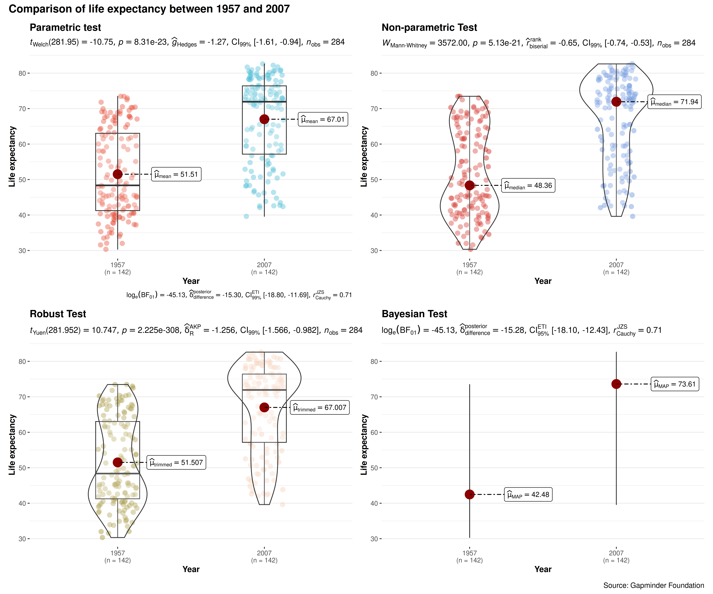
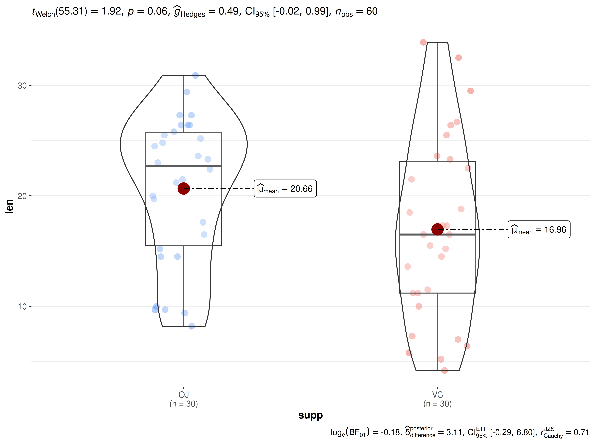

# ggbetweenstats

------------------------------------------------------------------------

You can cite this package/vignette as:

    To cite package 'ggstatsplot' in publications use:

      Patil, I. (2021). Visualizations with statistical details: The
      'ggstatsplot' approach. Journal of Open Source Software, 6(61), 3167,
      doi:10.21105/joss.03167

    A BibTeX entry for LaTeX users is

      @Article{,
        doi = {10.21105/joss.03167},
        url = {https://doi.org/10.21105/joss.03167},
        year = {2021},
        publisher = {{The Open Journal}},
        volume = {6},
        number = {61},
        pages = {3167},
        author = {Indrajeet Patil},
        title = {{Visualizations with statistical details: The {'ggstatsplot'} approach}},
        journal = {{Journal of Open Source Software}},
      }

------------------------------------------------------------------------

Lifecycle:

The function `ggbetweenstats` is designed to facilitate **data
exploration**, and for making highly customizable **publication-ready
plots**, with relevant statistical details included in the plot itself
if desired. We will see examples of how to use this function in this
vignette.

To begin with, here are some instances where you would want to use
`ggbetweenstats`-

- to check if a continuous variable differs across multiple
  groups/conditions

- to compare distributions visually

## Comparisons between groups with `ggbetweenstats`

To illustrate how this function can be used, we will use the `gapminder`
dataset throughout this vignette. This dataset provides values for life
expectancy, GDP per capita, and population, at 5 year intervals, from
1952 to 2007, for each of 142 countries (courtesy [Gapminder
Foundation](https://www.gapminder.org/)). Let’s have a look at the data-

\
[`library`](https://rdrr.io/r/base/library.html)`(`[`gapminder`](https://github.com/jennybc/gapminder)`)`\
\
`dplyr``::`[`glimpse`](https://pillar.r-lib.org/reference/glimpse.html)`(``gapminder``::`[`gapminder`](https://jennybc.github.io/gapminder/reference/gapminder.html)`)`\
`#> Rows: 1,704`\
`#> Columns: 6`\
`#> $ ``country  `` ``<fct>`` "Afghanistan"``, ``"Afghanistan"``, ``"Afghanistan"``, ``"Afghanistan"``, ``…`\
`#> $ ``continent`` ``<fct>`` Asia``, ``Asia``, ``Asia``, ``Asia``, ``Asia``, ``Asia``, ``Asia``, ``Asia``, ``Asia``, ``Asia``, ``…`\
`#> $ ``year     `` ``<int>`` 1952``, ``1957``, ``1962``, ``1967``, ``1972``, ``1977``, ``1982``, ``1987``, ``1992``, ``1997``, ``…`\
`#> $ ``lifeExp  `` ``<dbl>`` 28.801``, ``30.332``, ``31.997``, ``34.020``, ``36.088``, ``38.438``, ``39.854``, ``40.8…`\
`#> $ ``pop      `` ``<int>`` 8425333``, ``9240934``, ``10267083``, ``11537966``, ``13079460``, ``14880372``, ``12…`\
`#> $ ``gdpPercap`` ``<dbl>`` 779.4453``, ``820.8530``, ``853.1007``, ``836.1971``, ``739.9811``, ``786.1134``, ``…`

**Note**: For the remainder of the vignette, we’re going to exclude
*Oceania* from the analysis simply because there are so few observations
(countries).

Suppose the first thing we want to inspect is the distribution of life
expectancy for the countries of a continent in 2007. We also want to
know if the mean differences in life expectancy between the continents
is statistically significant.

The simplest form of the function call is-

\
[`ggbetweenstats`](https://www.indrapatil.com/ggstatsplot/reference/ggbetweenstats.md)`(`\
`  data ``=`` ``dplyr``::`[`filter`](https://dplyr.tidyverse.org/reference/filter.html)`(``gapminder``::`[`gapminder`](https://jennybc.github.io/gapminder/reference/gapminder.html)`, ``year`` ``==`` ``2007``, ``continent`` ``!=`` ``"Oceania"``)``,`\
`  x ``=`` ``continent``,`\
`  y ``=`` ``lifeExp`\
`)`

**Note**:

- The function automatically decides whether an independent samples
  *t*-test (for 2 groups) or a one-way ANOVA (3 or more groups) is
  carried out, based on the number of levels in the grouping variable.
  By default, Welch’s versions of these tests are used, i.e., equal
  variances are not assumed.

- The output of the function is a `ggplot` object which means that it
  can be further modified with [ggplot2](https://ggplot2.tidyverse.org)
  functions.

As can be seen from the plot, the function by default also returns Bayes
Factor for the test in the caption. If the null hypothesis can’t be
rejected with the null hypothesis significance testing (NHST) approach,
the Bayesian approach can help index evidence in favor of the null
hypothesis (i.e., $`BF_{01}`$).

By default, natural logarithms are shown because Bayes Factor values can
sometimes be pretty large. Having values on logarithmic scale also makes
it easy to compare evidence in favor of alternative ($`BF_{10}`$) versus
null ($`BF_{01}`$) hypotheses (since
$`log_{e}(BF_{01}) = - log_{e}(BF_{10})`$).

We can make the output much more aesthetically pleasing as well as
informative by making use of the many optional parameters in
`ggbetweenstats`. We’ll add a title and caption, better `x` and `y` axis
labels. We can and will change the overall theme as well as the color
palette in use. This time, let’s also use a robust test.

\
[`ggbetweenstats`](https://www.indrapatil.com/ggstatsplot/reference/ggbetweenstats.md)`(`\
`  data ``=`` ``dplyr``::`[`filter`](https://dplyr.tidyverse.org/reference/filter.html)`(``gapminder``, ``year`` ``==`` ``2007``, ``continent`` ``!=`` ``"Oceania"``)``,`\
`  x ``=`` ``continent``, ``## grouping/independent variable`\
`  y ``=`` ``lifeExp``, ``## dependent variables`\
`  type ``=`` ``"robust"``, ``## type of statistics`\
`  xlab ``=`` ``"Continent"``, ``## label for the x-axis`\
`  ylab ``=`` ``"Life expectancy"``, ``## label for the y-axis`\
`  ggtheme ``=`` ``ggplot2``::`[`theme_gray`](https://ggplot2.tidyverse.org/reference/ggtheme.html)`(``)``, ``## a different theme`\
`  palette ``=`` ``"yarrr::info2"``, ``## choosing a different color palette`\
`  title ``=`` ``"Comparison of life expectancy across continents (Year: 2007)"``,`\
`  caption ``=`` ``"Source: Gapminder Foundation"`\
`)`` ``+`` ``## modifying the plot further`\
`  ``ggplot2``::`[`scale_y_continuous`](https://ggplot2.tidyverse.org/reference/scale_continuous.html)`(`\
`    limits ``=`` `[`c`](https://rdrr.io/r/base/c.html)`(``35``, ``85``)``,`\
`    breaks ``=`` `[`seq`](https://rdrr.io/r/base/seq.html)`(``from ``=`` ``35``, to ``=`` ``85``, by ``=`` ``5``)`\
`  ``)`

As can be appreciated from the robust effect size (explanatory measure
of effect size $`\xi`$) of 0.96, there are large differences in the
(trimmed) mean life expectancy across continents. Importantly, this plot
also helps us appreciate the distributions within any given continent.
For example, although Asian countries are doing much better than African
countries, on average, Afghanistan has a particularly grim average for
the Asian continent, possibly reflecting the war and the political
turmoil.

So far we have used the default box + violin plot, but there are other
available options:

- The `type` (of test) argument also accepts the following
  abbreviations: `"p"` (for *parametric*), `"np"` (for *nonparametric*),
  `"r"` (for *robust*), `"bf"` (for *Bayes Factor*).

- Any of the plot components can be hidden via its `*.args` argument:
  e.g., `violin.args = list(width = 0)` removes the violin plot,
  `boxplot.args = list(width = 0)` removes the box plot, and
  `point.args = list(alpha = 0)` hides the raw data points.

- The color palettes can be modified (`palette` takes a
  `"package::palette"` string from
  [paletteer](https://emilhvitfeldt.github.io/paletteer/)).

Let’s use the `combine_plots` function to make one plot from four
separate plots that demonstrates all of these options. Let’s compare
life expectancy for all countries between 1957 and 2007. We will
generate the plots one by one and then use `combine_plots` to merge them
into one plot with some common labeling. It is possible, but not
necessarily recommended, to make each plot have different colors or
themes.

For example,

\
`## selecting subset of the data`\
`df_year`` ``<-`` ``dplyr``::`[`filter`](https://dplyr.tidyverse.org/reference/filter.html)`(``gapminder``::`[`gapminder`](https://jennybc.github.io/gapminder/reference/gapminder.html)`, ``year`` ``==`` ``2007`` ``|`` ``year`` ``==`` ``1957``)`\
\
`p1`` ``<-`` `[`ggbetweenstats`](https://www.indrapatil.com/ggstatsplot/reference/ggbetweenstats.md)`(`\
`  data ``=`` ``df_year``,`\
`  x ``=`` ``year``,`\
`  y ``=`` ``lifeExp``,`\
`  xlab ``=`` ``"Year"``,`\
`  ylab ``=`` ``"Life expectancy"``,`\
`  ``# to remove violin plot`\
`  violin.args ``=`` `[`list`](https://rdrr.io/r/base/list.html)`(``width ``=`` ``0``)``,`\
`  type ``=`` ``"p"``,`\
`  conf.level ``=`` ``0.99``,`\
`  title ``=`` ``"Parametric test"``,`\
`  palette ``=`` ``"ggsci::nrc_npg"`\
`)`\
\
`p2`` ``<-`` `[`ggbetweenstats`](https://www.indrapatil.com/ggstatsplot/reference/ggbetweenstats.md)`(`\
`  data ``=`` ``df_year``,`\
`  x ``=`` ``year``,`\
`  y ``=`` ``lifeExp``,`\
`  xlab ``=`` ``"Year"``,`\
`  ylab ``=`` ``"Life expectancy"``,`\
`  ``# to remove box plot`\
`  boxplot.args ``=`` `[`list`](https://rdrr.io/r/base/list.html)`(``width ``=`` ``0``)``,`\
`  type ``=`` ``"np"``,`\
`  conf.level ``=`` ``0.99``,`\
`  title ``=`` ``"Non-parametric Test"``,`\
`  palette ``=`` ``"ggsci::uniform_startrek"`\
`)`\
\
`p3`` ``<-`` `[`ggbetweenstats`](https://www.indrapatil.com/ggstatsplot/reference/ggbetweenstats.md)`(`\
`  data ``=`` ``df_year``,`\
`  x ``=`` ``year``,`\
`  y ``=`` ``lifeExp``,`\
`  xlab ``=`` ``"Year"``,`\
`  ylab ``=`` ``"Life expectancy"``,`\
`  type ``=`` ``"r"``,`\
`  conf.level ``=`` ``0.99``,`\
`  title ``=`` ``"Robust Test"``,`\
`  tr ``=`` ``0.005``,`\
`  palette ``=`` ``"wesanderson::Royal2"``,`\
`  digits ``=`` ``3`\
`)`\
\
`## Bayes Factor for parametric t-test, showing only centrality measures`\
`p4`` ``<-`` `[`ggbetweenstats`](https://www.indrapatil.com/ggstatsplot/reference/ggbetweenstats.md)`(`\
`  data ``=`` ``df_year``,`\
`  x ``=`` ``year``,`\
`  y ``=`` ``lifeExp``,`\
`  xlab ``=`` ``"Year"``,`\
`  ylab ``=`` ``"Life expectancy"``,`\
`  type ``=`` ``"bayes"``,`\
`  violin.args ``=`` `[`list`](https://rdrr.io/r/base/list.html)`(``width ``=`` ``0``)``,`\
`  boxplot.args ``=`` `[`list`](https://rdrr.io/r/base/list.html)`(``width ``=`` ``0``)``,`\
`  point.args ``=`` `[`list`](https://rdrr.io/r/base/list.html)`(``alpha ``=`` ``0``)``,`\
`  title ``=`` ``"Bayesian Test"``,`\
`  palette ``=`` ``"ggsci::nrc_npg"`\
`)`\
\
`## combining the individual plots into a single plot`\
[`combine_plots`](https://www.indrapatil.com/ggstatsplot/reference/combine_plots.md)`(`\
`  `[`list`](https://rdrr.io/r/base/list.html)`(``p1``, ``p2``, ``p3``, ``p4``)``,`\
`  plotgrid.args ``=`` `[`list`](https://rdrr.io/r/base/list.html)`(``nrow ``=`` ``2L``)``,`\
`  annotation.args ``=`` `[`list`](https://rdrr.io/r/base/list.html)`(`\
`    title ``=`` ``"Comparison of life expectancy between 1957 and 2007"``,`\
`    caption ``=`` ``"Source: Gapminder Foundation"`\
`  ``)`\
`)`

## Grouped analysis with `grouped_ggbetweenstats`

What if we want to analyze both by continent and between 1957 and 2007?
A combination of our two previous efforts.

[ggstatsplot](https://www.indrapatil.com/ggstatsplot/) provides a
special helper function for such instances: `grouped_ggbetweenstats`.
This is merely a wrapper function around `combine_plots`. It applies
`ggbetweenstats` across all **levels** of a specified **grouping
variable** and then combines list of individual plots into a single
plot. Note that the grouping variable can be anything: conditions in a
given study, groups in a study sample, different studies, etc.

Let’s focus on the same 4 continents for the following years: 1967,
1987, 2007. Also, let’s carry out pairwise comparisons to see if there
are differences between every pair of continents.

\
`## select part of the dataset and use it for plotting`\
`gapminder``::`[`gapminder`](https://jennybc.github.io/gapminder/reference/gapminder.html)` ``|>`\
`  ``dplyr``::`[`filter`](https://dplyr.tidyverse.org/reference/filter.html)`(``year`` `[`%in%`](https://rdrr.io/r/base/match.html)` `[`c`](https://rdrr.io/r/base/c.html)`(``1967``, ``1987``, ``2007``)``, ``continent`` ``!=`` ``"Oceania"``)`` ``|>`\
`  `[`grouped_ggbetweenstats`](https://www.indrapatil.com/ggstatsplot/reference/grouped_ggbetweenstats.md)`(`\
`    ``## arguments relevant for ggbetweenstats`\
`    x ``=`` ``continent``,`\
`    y ``=`` ``lifeExp``,`\
`    grouping.var ``=`` ``year``,`\
`    xlab ``=`` ``"Continent"``,`\
`    ylab ``=`` ``"Life expectancy"``,`\
`    pairwise.display ``=`` ``"significant"``, ``## display only significant pairwise comparisons`\
`    pairwise.alpha ``=`` ``0.01``, ``## use a stricter alpha threshold to reduce clutter`\
`    p.adjust.method ``=`` ``"fdr"``, ``## adjust p-values for multiple tests using this method`\
`    palette ``=`` ``"ggsci::default_jco"``,`\
`    ``## arguments relevant for combine_plots`\
`    annotation.args ``=`` `[`list`](https://rdrr.io/r/base/list.html)`(``title ``=`` ``"Changes in life expectancy across continents (1967-2007)"``)``,`\
`    plotgrid.args ``=`` `[`list`](https://rdrr.io/r/base/list.html)`(``nrow ``=`` ``3``)`\
`  ``)`

As seen from the plot, although the life expectancy has been improving
steadily across all continents as we go from 1967 to 2007, this
improvement has not been happening at the same rate for all continents.
Additionally, irrespective of which year we look at, we still find
significant differences in life expectancy across continents which have
been surprisingly consistent across four decades (based on the observed
effect sizes).

## Grouped analysis with `ggbetweenstats` + `{purrr}`

Although this grouping function provides a quick way to explore the
data, it leaves much to be desired. For example, the same type of plot
and test is applied for all years, but maybe we want to change this for
different years, or maybe we want to have different effect sizes for
different years. This type of customization for different levels of a
grouping variable is not possible with `grouped_ggbetweenstats`, but
this can be easily achieved using the
[purrr](https://purrr.tidyverse.org/) package.

See the associated vignette here:
<https://www.indrapatil.com/ggstatsplot/articles/web_only/purrr_examples.html>

## Within-subjects designs

For repeated measures designs,
[`ggwithinstats()`](https://www.indrapatil.com/ggstatsplot/reference/ggwithinstats.md)
function can be used:
<https://www.indrapatil.com/ggstatsplot/articles/web_only/ggwithinstats.html>

## Summary of graphics and tests

| graphical element | `geom` used | argument for further modification |
|:---|:---|:---|
| raw data | [`ggplot2::geom_point()`](https://ggplot2.tidyverse.org/reference/geom_point.html) | `point.args` |
| box plot | [`ggplot2::geom_boxplot()`](https://ggplot2.tidyverse.org/reference/geom_boxplot.html) | `boxplot.args` |
| density plot | [`ggplot2::geom_violin()`](https://ggplot2.tidyverse.org/reference/geom_violin.html) | `violin.args` |
| centrality measure point | [`ggplot2::geom_point()`](https://ggplot2.tidyverse.org/reference/geom_point.html) | `centrality.point.args` |
| centrality measure label | [`ggrepel::geom_label_repel()`](https://ggrepel.slowkow.com/reference/geom_text_repel.html) | `centrality.label.args` |
| pairwise comparisons | [`ggsignif::geom_signif()`](https://const-ae.github.io/ggsignif/reference/stat_signif.html) | `ggsignif.args` |

The statistical tests and effect sizes carried out for each `type` are
listed in the function documentation:
<https://www.indrapatil.com/ggstatsplot/reference/ggbetweenstats.html>

## Extracting statistical details

All statistical details shown in the plot are also available as data
frames, which can be extracted with
[`extract_stats()`](https://www.indrapatil.com/ggstatsplot/reference/extract_stats.md).
The returned list contains results from the test in the subtitle
(`subtitle_data`), the Bayesian test in the caption (`caption_data`),
and the pairwise comparisons (`pairwise_comparisons_data`).

\
`p`` ``<-`` `[`ggbetweenstats`](https://www.indrapatil.com/ggstatsplot/reference/ggbetweenstats.md)`(``mtcars``, ``cyl``, ``mpg``)`\
\
[`extract_stats`](https://www.indrapatil.com/ggstatsplot/reference/extract_stats.md)`(``p``)``$``subtitle_data`\
`#> ``# A tibble: 1 × 14`\
`#>   ``statistic``    ``df`` ``df.error``    ``p.value`\
`#>       ``<dbl>`` ``<dbl>``    ``<dbl>``      ``<dbl>`\
`#> ``1``      31.6     2     18.0 ``0.000``00``1``27`\
`#>   ``method``                                                   ``effectsize`` ``estimate`\
`#>   ``<chr>``                                                    ``<chr>``         ``<dbl>`\
`#> ``1`` One-way analysis of means (not assuming equal variances) Omega2        ``0.``744`\
`#>   ``conf.level`` ``conf.low`` ``conf.high`` ``conf.method`` ``conf.distribution`` ``n.obs`` ``expression`\
`#>        ``<dbl>``    ``<dbl>``     ``<dbl>`` ``<chr>``       ``<chr>``             ``<int>`` ``<list>``    `\
`#> ``1``       ``0.``95    ``0.``531         1 ncp         F                    32 ``<language>`\
\
[`extract_stats`](https://www.indrapatil.com/ggstatsplot/reference/extract_stats.md)`(``p``)``$``pairwise_comparisons_data`\
`#> ``# A tibble: 3 × 9`\
`#>   ``group1`` ``group2`` ``statistic``   ``p.value`` ``alternative`` ``distribution`` ``p.adjust.method`\
`#>   ``<chr>``  ``<chr>``      ``<dbl>``     ``<dbl>`` ``<chr>``       ``<chr>``        ``<chr>``          `\
`#> ``1`` 4      6          -``6.67`` ``0.00``1``10``   two.sided   q            Holm           `\
`#> ``2`` 4      8         -``10.7``  ``0.000``0``14``0 two.sided   q            Holm           `\
`#> ``3`` 6      8          -``7.48`` ``0.000``257``  two.sided   q            Holm           `\
`#>   ``test``         ``expression`\
`#>   ``<chr>``        ``<list>``    `\
`#> ``1`` Games-Howell ``<language>`\
`#> ``2`` Games-Howell ``<language>`\
`#> ``3`` Games-Howell ``<language>`

For
[`grouped_ggbetweenstats()`](https://www.indrapatil.com/ggstatsplot/reference/grouped_ggbetweenstats.md)
plots,
[`extract_stats()`](https://www.indrapatil.com/ggstatsplot/reference/extract_stats.md)
returns one such list for each level of the grouping variable.

## Reporting

If you wish to include statistical analysis results in a
publication/report, the ideal reporting practice will be a hybrid of two
approaches:

- the [ggstatsplot](https://www.indrapatil.com/ggstatsplot/) approach,
  where the plot contains both the visual and numerical summaries about
  a statistical model, and

- the *standard* narrative approach, which provides interpretive context
  for the reported statistics.

For example, let’s see the following example:

\
[`ggbetweenstats`](https://www.indrapatil.com/ggstatsplot/reference/ggbetweenstats.md)`(``ToothGrowth``, ``supp``, ``len``)`

The narrative context (assuming `type = "parametric"`) can complement
this plot either as a figure caption or in the main text-

> Welch’s *t*-test revealed that, across 60 guinea pigs, although the
> tooth length was higher when the animal received vitamin C via orange
> juice as compared to via ascorbic acid, this effect was not
> statistically significant. The effect size $`(g = 0.49)`$ was medium,
> as per Cohen’s (1988) conventions. The Bayes Factor for the same
> analysis revealed that the data were 1.2 times more probable under the
> alternative hypothesis as compared to the null hypothesis. This can be
> considered weak evidence (Jeffreys, 1961) in favor of the alternative
> hypothesis.

Similar reporting style can be followed when the function performs
one-way ANOVA instead of a *t*-test.

## Suggestions

If you find any bugs or have any suggestions/remarks, please file an
issue on `GitHub`:
<https://github.com/IndrajeetPatil/ggstatsplot/issues>
