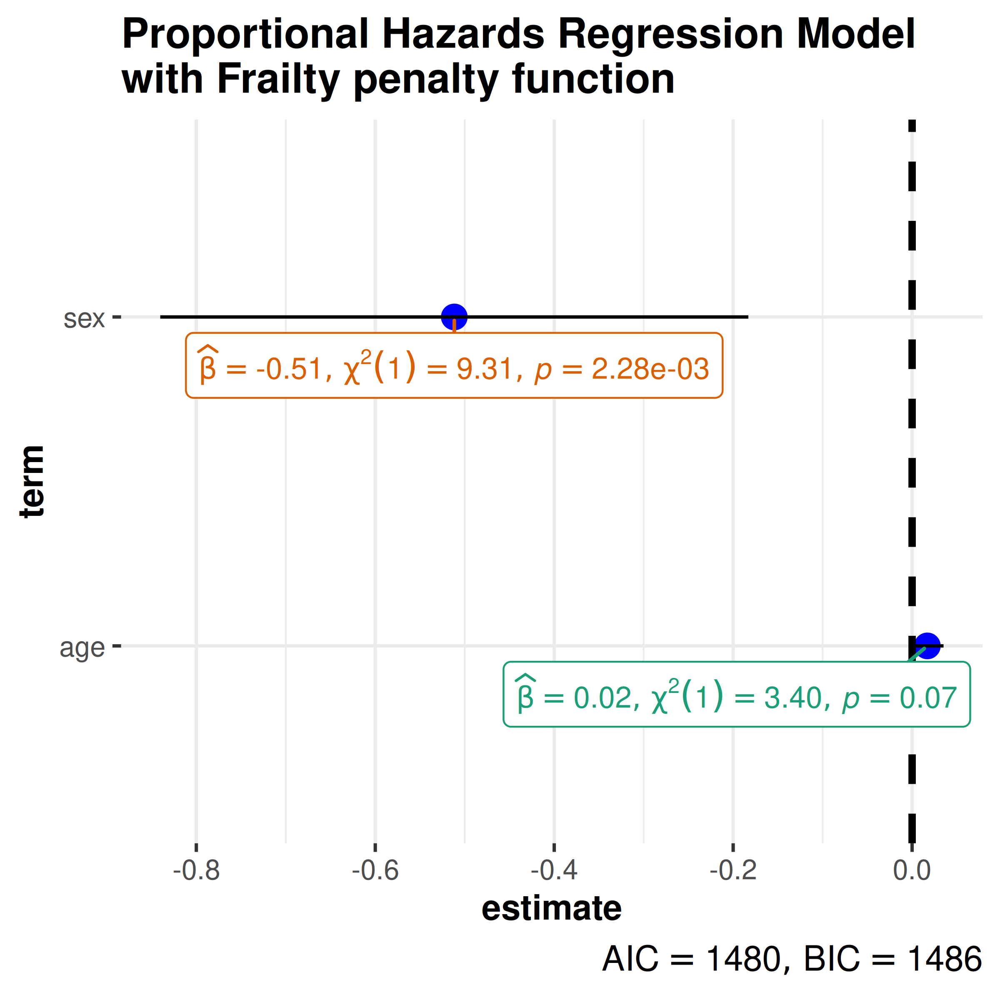
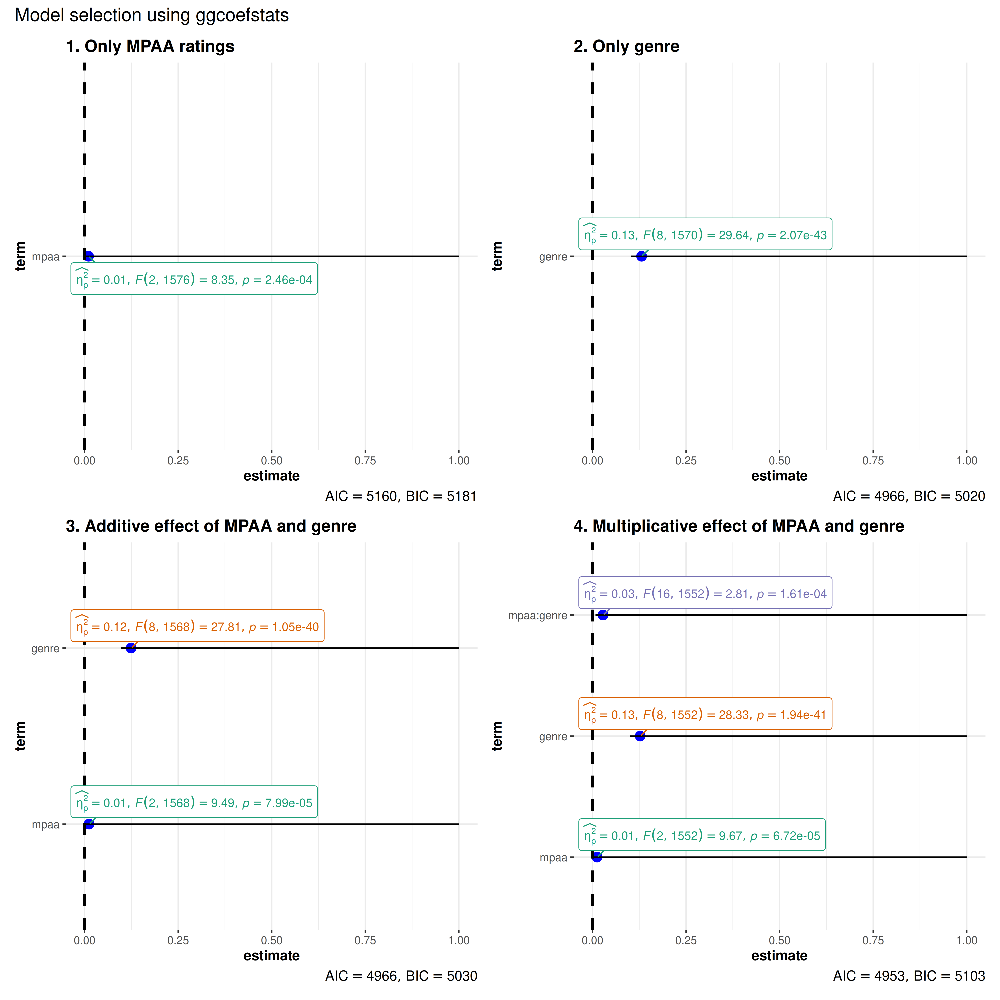
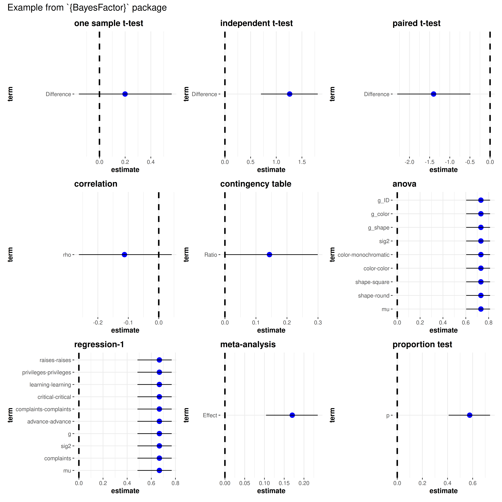
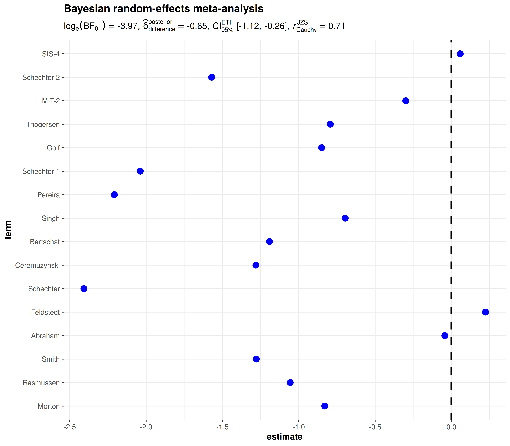

# ggcoefstats

------------------------------------------------------------------------

You can cite this package/vignette as:

    To cite package 'ggstatsplot' in publications use:

      Patil, I. (2021). Visualizations with statistical details: The
      'ggstatsplot' approach. Journal of Open Source Software, 6(61), 3167,
      doi:10.21105/joss.03167

    A BibTeX entry for LaTeX users is

      @Article{,
        doi = {10.21105/joss.03167},
        url = {https://doi.org/10.21105/joss.03167},
        year = {2021},
        publisher = {{The Open Journal}},
        volume = {6},
        number = {61},
        pages = {3167},
        author = {Indrajeet Patil},
        title = {{Visualizations with statistical details: The {'ggstatsplot'} approach}},
        journal = {{Journal of Open Source Software}},
      }

------------------------------------------------------------------------

Lifecycle:
[](https://lifecycle.r-lib.org/articles/stages.html)

The function `ggcoefstats` generates **dot-and-whisker plots** for
regression models saved in a tidy data frame. The tidy data frames are
prepared using
[`parameters::model_parameters`](https://easystats.github.io/parameters/reference/model_parameters.html).
Additionally, if available, the model summary indices are also extracted
from
[`performance::model_performance`](https://easystats.github.io/performance/reference/model_performance.html).

In this vignette, we will see examples of how to use this function. We
will try to cover as many classes of objects as possible. Unfortunately,
there is no single dataset that will be helpful for carrying out all
types of regression analyses and, therefore, we will use various
datasets to explore data-specific hypotheses using regression models.

## General structure of the plots

Although the statistical models displayed in the plot may differ based
on the class of models being investigated, there are few aspects of the
plot that will be invariant across models:

- The dot-whisker plot contains a dot representing the **estimate** and
  their **confidence intervals** (`95%` is the default). The estimate
  can either be effect sizes (for tests that depend on the
  `F`-statistic) or regression coefficients (for tests with `t`-,
  $`\chi^{2}`$-, and `z`-statistic), etc. The confidence intervals can
  sometimes be asymmetric if bootstrapping was used.

- The label attached to dot will provide more details from the
  statistical test carried out and it will typically contain estimate,
  statistic, and *p*-value.

- The caption will contain diagnostic information, if available, about
  models that can be useful for model selection: The smaller the
  Akaike’s Information Criterion (**AIC**) and the Bayesian Information
  Criterion (**BIC**) values, the “better” the model is.

- The output of this function will be a
  [ggplot2](https://ggplot2.tidyverse.org) object and, thus, it can be
  further modified (e.g., change themes, etc.) with
  [ggplot2](https://ggplot2.tidyverse.org) functions.

## Supported models

Most of the regression models that are supported in the underlying
packages are also supported by
[`ggcoefstats()`](https://indrajeetpatil.github.io/ggstatsplot/reference/ggcoefstats.md).

``` r

insight::supported_models()
#>   [1] "aareg"                   "afex_aov"               
#>   [3] "AKP"                     "Anova.mlm"              
#>   [5] "anova.rms"               "aov"                    
#>   [7] "aovlist"                 "Arima"                  
#>   [9] "asym"                    "averaging"              
#>  [11] "bamlss"                  "bamlss.frame"           
#>  [13] "bayesQR"                 "bayesx"                 
#>  [15] "BBmm"                    "BBreg"                  
#>  [17] "bcplm"                   "betamfx"                
#>  [19] "betaor"                  "betareg"                
#>  [21] "BFBayesFactor"           "bfsl"                   
#>  [23] "BGGM"                    "bife"                   
#>  [25] "bifeAPEs"                "bigglm"                 
#>  [27] "biglm"                   "blavaan"                
#>  [29] "blrm"                    "bracl"                  
#>  [31] "brglm"                   "brmsfit"                
#>  [33] "brmultinom"              "btergm"                 
#>  [35] "censReg"                 "cgam"                   
#>  [37] "cgamm"                   "cglm"                   
#>  [39] "clm"                     "clm2"                   
#>  [41] "clmm"                    "clmm2"                  
#>  [43] "clogit"                  "coeftest"               
#>  [45] "complmrob"               "confusionMatrix"        
#>  [47] "coxme"                   "coxph"                  
#>  [49] "coxph_weightit"          "coxph.penal"            
#>  [51] "coxr"                    "cpglm"                  
#>  [53] "cpglmm"                  "crch"                   
#>  [55] "crq"                     "crqs"                   
#>  [57] "crr"                     "dep.effect"             
#>  [59] "DirichletRegModel"       "draws"                  
#>  [61] "drc"                     "eglm"                   
#>  [63] "elm"                     "emmGrid"                
#>  [65] "epi.2by2"                "ergm"                   
#>  [67] "estimate_contrasts"      "estimate_means"         
#>  [69] "estimate_slopes"         "externVar"              
#>  [71] "externX"                 "fdm"                    
#>  [73] "feglm"                   "feis"                   
#>  [75] "felm"                    "fitdistr"               
#>  [77] "fixest"                  "flac"                   
#>  [79] "flexsurvreg"             "flic"                   
#>  [81] "gam"                     "Gam"                    
#>  [83] "gamlss"                  "gamm"                   
#>  [85] "gamm4"                   "garch"                  
#>  [87] "gbm"                     "gee"                    
#>  [89] "geeglm"                  "ggcomparisons"          
#>  [91] "glht"                    "glimML"                 
#>  [93] "glm"                     "Glm"                    
#>  [95] "glm_weightit"            "glmerMod"               
#>  [97] "glmgee"                  "glmm"                   
#>  [99] "glmmadmb"                "glmmPQL"                
#> [101] "glmmTMB"                 "glmrob"                 
#> [103] "glmRob"                  "glmx"                   
#> [105] "gls"                     "gmnl"                   
#> [107] "hglm"                    "HLfit"                  
#> [109] "htest"                   "hurdle"                 
#> [111] "iv_robust"               "ivFixed"                
#> [113] "ivprobit"                "ivreg"                  
#> [115] "joint"                   "lavaan"                 
#> [117] "lcmm"                    "lm"                     
#> [119] "lm_robust"               "lme"                    
#> [121] "lmerMod"                 "lmerModLmerTest"        
#> [123] "lmodel2"                 "lmrob"                  
#> [125] "lmRob"                   "logistf"                
#> [127] "logitmfx"                "logitor"                
#> [129] "logitr"                  "LORgee"                 
#> [131] "lqm"                     "lqmm"                   
#> [133] "lrm"                     "manova"                 
#> [135] "MANOVA"                  "marginaleffects"        
#> [137] "marginaleffects.summary" "margins"                
#> [139] "maxLik"                  "mblogit"                
#> [141] "mclogit"                 "mcmc"                   
#> [143] "mcmc.list"               "MCMCglmm"               
#> [145] "mcp1"                    "mcp12"                  
#> [147] "mcp2"                    "med1way"                
#> [149] "mediate"                 "merMod"                 
#> [151] "merModList"              "meta_bma"               
#> [153] "meta_fixed"              "meta_random"            
#> [155] "metaplus"                "mhurdle"                
#> [157] "mipo"                    "mira"                   
#> [159] "mixed"                   "MixMod"                 
#> [161] "mixor"                   "mjoint"                 
#> [163] "mle"                     "mle2"                   
#> [165] "mlm"                     "mlogit"                 
#> [167] "mmclogit"                "mmlogit"                
#> [169] "mmrm"                    "mmrm_fit"               
#> [171] "mmrm_tmb"                "model_fit"              
#> [173] "multinom"                "multinom_weightit"      
#> [175] "mvord"                   "negbinirr"              
#> [177] "negbinmfx"               "nestedLogit"            
#> [179] "ols"                     "onesampb"               
#> [181] "oohbchoice"              "ordinal_weightit"       
#> [183] "orm"                     "pgmm"                   
#> [185] "phyloglm"                "phylolm"                
#> [187] "plm"                     "PMCMR"                  
#> [189] "poissonirr"              "poissonmfx"             
#> [191] "polr"                    "probitmfx"              
#> [193] "psm"                     "Rchoice"                
#> [195] "ridgelm"                 "riskRegression"         
#> [197] "rjags"                   "rlm"                    
#> [199] "rlmerMod"                "RM"                     
#> [201] "rma"                     "rma.uni"                
#> [203] "rms"                     "robmixglm"              
#> [205] "robtab"                  "rq"                     
#> [207] "rqs"                     "rqss"                   
#> [209] "rvar"                    "Sarlm"                  
#> [211] "scam"                    "sdmTMB"                 
#> [213] "selection"               "sem"                    
#> [215] "SemiParBIV"              "semLm"                  
#> [217] "semLme"                  "seqanova.svyglm"        
#> [219] "serp"                    "slm"                    
#> [221] "speedglm"                "speedlm"                
#> [223] "stanfit"                 "stanmvreg"              
#> [225] "stanreg"                 "summary.lm"             
#> [227] "survfit"                 "survreg"                
#> [229] "svy_vglm"                "svy2lme"                
#> [231] "svychisq"                "svycoxph"               
#> [233] "svyglm"                  "svyolr"                 
#> [235] "svysurvreg"              "systemfit"              
#> [237] "t1way"                   "tobit"                  
#> [239] "trimcibt"                "truncreg"               
#> [241] "vgam"                    "vglm"                   
#> [243] "wbgee"                   "wblm"                   
#> [245] "wbm"                     "wmcpAKP"                
#> [247] "yuen"                    "yuend"                  
#> [249] "zcpglm"                  "zeroinfl"               
#> [251] "zerotrunc"
```

## Examples of supported models

The following examples are organized by statistics type.

There used to be a much longer vignette with examples of a wide
collection of regression models, but for the sake of maintainability, I
have removed it. The old version can be found
[here](https://github.com/IndrajeetPatil/ggstatsplot/blob/master/old/effsize_interpretation.Rmd).

### *t*-statistic

linear model (`lm`) and linear mixed-effects model (`lmer`/`lmerMod`)

``` r

library(lme4)

# lm model
mod1 <- stats::lm(formula = Reaction ~ Days, data = sleepstudy)

# merMod model
mod2 <- lme4::lmer(Reaction ~ Days + (Days | Subject), sleepstudy)

# combining the two different plots
combine_plots(
  plotlist = list(
    ggcoefstats(mod1) +
      ggplot2::labs(x = parse(text = "'regression coefficient' ~italic(beta)")),
    ggcoefstats(mod2) +
      ggplot2::labs(
        x = parse(text = "'regression coefficient' ~italic(beta)"),
        y = "fixed effects"
      )
  ),
  plotgrid.args = list(nrow = 2L),
  annotation.args = list(title = "Relationship between movie budget and its IMDB rating")
)
```


Note that for mixed-effects models, only the *fixed* effects are shown
because there are no confidence intervals for *random* effects terms. In
case, you would like to see these terms, you can use
[`parameters::model_parameters()`](https://easystats.github.io/parameters/reference/model_parameters.html).

### *z*-statistic

Aalen’s additive regression model for censored data (`aareg`)

``` r

library(survival)

# model
afit <- survival::aareg(
  formula = Surv(time, status) ~ age + sex + ph.ecog,
  data = lung,
  dfbeta = TRUE
)

ggcoefstats(
  x = afit,
  title = "Aalen's additive regression model",
  subtitle = "(for censored data)",
  digits = 3
)
```


### $`\chi^2`$-statistic

Cox proportional hazards regression model (`coxph`)

``` r

library(survival)

# create the simplest-test data set
test1 <- list(
  time = c(4, 3, 1, 1, 2, 2, 3),
  status = c(1, 1, 1, 0, 1, 1, 0),
  x = c(0, 2, 1, 1, 1, 0, 0),
  sex = c(0, 0, 0, 0, 1, 1, 1)
)

# fit a stratified model
mod_coxph <-
  survival::coxph(
    formula = Surv(time, status) ~ x + strata(sex),
    data = test1
  )


ggcoefstats(
  x = mod_coxph,
  title = "Cox proportional hazards regression model"
)
```


Another example with `frailty` term.

``` r

library(survival)

# model
mod_coxph <- survival::coxph(
  formula = Surv(time, status) ~ age + sex + frailty(inst),
  data = lung
)


ggcoefstats(
  x = mod_coxph,
  title = "Proportional Hazards Regression Model\nwith Frailty penalty function"
)
```



### *F*-statistic

omnibus ANOVA (`aov`)

``` r

library(ggplot2)

# model
mod_aov <- stats::aov(formula = rating ~ mpaa * genre, data = movies_long)

ggcoefstats(
  x = mod_aov,
  effectsize.type = "omega", # changing the effect size estimate being displayed
  point.args = list(color = "red", size = 4, shape = 15), # changing the point geom
  package = "dutchmasters", # package from which color palette is to be taken
  palette = "milkmaid", # color palette for labels
  title = "omnibus ANOVA", # title for the plot
  exclude.intercept = TRUE
) +
  # further modification with the ggplot2 commands
  # note the order in which the labels are entered
  ggplot2::scale_y_discrete(labels = c("MPAA", "Genre", "Interaction term")) +
  ggplot2::labs(x = "effect size estimate (eta-squared)", y = NULL)
```


Note that we can also use this function for model selection. You can try
out different models with the code below and see how the AIC and BIC
values change.

``` r

combine_plots(
  plotlist = list(
    # model 1
    ggcoefstats(
      x = stats::aov(formula = rating ~ mpaa, data = movies_long),
      title = "1. Only MPAA ratings"
    ),
    # model 2
    ggcoefstats(
      x = stats::aov(formula = rating ~ genre, data = movies_long),
      title = "2. Only genre"
    ),
    # model 3
    ggcoefstats(
      x = stats::aov(formula = rating ~ mpaa + genre, data = movies_long),
      title = "3. Additive effect of MPAA and genre"
    ),
    # model 4
    ggcoefstats(
      x = stats::aov(formula = rating ~ mpaa * genre, data = movies_long),
      title = "4. Multiplicative effect of MPAA and genre"
    )
  ),
  annotation.args = list(title = "Model selection using ggcoefstats")
)
```



### Bayesian models - no statistic

``` r

library(BayesFactor)

# one sample t-test
mod1 <- ttestBF(mtcars$wt, mu = 3)

# independent t-test
mod2 <- ttestBF(formula = wt ~ am, data = mtcars)

# paired t-test
mod3 <- ttestBF(x = sleep$extra[1:10], y = sleep$extra[11:20], paired = TRUE)

# correlation
mod4 <- correlationBF(y = iris$Sepal.Length, x = iris$Sepal.Width)

# contingency tabs (not supported)
data("raceDolls")
mod5 <- contingencyTableBF(
  raceDolls,
  sampleType = "indepMulti",
  fixedMargin = "cols"
)

# anova
data("puzzles")
mod6 <- anovaBF(
  formula = RT ~ shape * color + ID,
  data = puzzles,
  whichRandom = "ID",
  whichModels = "top",
  progress = FALSE
)

# regression-1
mod7 <- regressionBF(rating ~ ., data = attitude, progress = FALSE)

# meta-analysis
t <- c(-0.15, 2.39, 2.42, 2.43, -0.15, 2.39, 2.42, 2.43)
N <- c(100, 150, 97, 99, 99, 97, 100, 150)
mod8 <- meta.ttestBF(t, N, rscale = 1, nullInterval = c(0, Inf))

# proportion test
mod9 <- proportionBF(y = 15, N = 25, p = 0.5)

# list of plots
combine_plots(
  plotlist = list(
    ggcoefstats(mod1, title = "one sample t-test"),
    ggcoefstats(mod2, title = "independent t-test"),
    ggcoefstats(mod3, title = "paired t-test"),
    ggcoefstats(mod4, title = "correlation"),
    ggcoefstats(mod5, title = "contingency table", effectsize.type = "cramers_v"),
    ggcoefstats(mod6, title = "anova"),
    ggcoefstats(mod7, title = "regression-1"),
    ggcoefstats(mod8, title = "meta-analysis"),
    ggcoefstats(mod9, title = "proportion test")
  ),
  annotation.args = list(title = "Example from `{BayesFactor}` package")
)
```



### Regression models with `list` outputs

Note that a number of regression models will return an object of class
`list`, in which case this function will fail. But often you can extract
the object of interest from this list and use it to plot the regression
coefficients.

``` r

library(gamm4)

# data
dat <- gamSim(1, n = 400, scale = 2)

# now add 20 level random effect `fac'...
dat$fac <- fac <- as.factor(sample(1:20, 400, replace = TRUE))
dat$y <- dat$y + model.matrix(~ fac - 1) %*% rnorm(20) * .5

# model object
br <- gamm4::gamm4(
    formula = y ~ s(x0) + x1 + s(x2),
    data = dat,
    random = ~ (1 | fac)
  )

# looking at the classes of the objects contained in the list
purrr::map(br, class)

combine_plots(
  plotlist = list(
    # first object plot (only parametric terms are shown)
    ggcoefstats(
      x = br$gam,
      title = "generalized additive model (parametric terms)",
      digits = 3
    ),
    # second object plot
    ggcoefstats(
      x = br$mer,
      title = "linear mixed-effects model",
      digits = 3
    )
  ),
  plotgrid.args = list(nrow = 1)
)
```

## Meta-analysis

In case the estimates you are displaying come from multiple studies, you
can also use this function to carry out random-effects meta-analysis.
The data frame you enter **must** contain at the minimum the following
three columns-

- `term`: a column with names/identifiers to annotate each study/effect
- `estimate`: a column with the observed effect sizes or outcomes
- `std.error`: a column the corresponding standard errors

### parametric

``` r

library(metaplus)

# renaming to what the function expects
df <- dplyr::rename(mag, estimate = yi, std.error = sei, term = study)

ggcoefstats(
  x = df,
  meta.analytic.effect = TRUE,
  bf.message = TRUE,
  meta.type = "parametric",
  title = "parametric random-effects meta-analysis"
)
```


### robust

``` r

library(metaplus)

# renaming to what the function expects
df <- dplyr::rename(mag, estimate = yi, std.error = sei, term = study)

ggcoefstats(
  x = df,
  meta.analytic.effect = TRUE,
  meta.type = "robust",
  title = "robust random-effects meta-analysis"
)
```


### Bayesian

``` r

library(metaplus)

# renaming to what the function expects
df <- dplyr::rename(mag, estimate = yi, std.error = sei, term = study)

ggcoefstats(
  x = df,
  meta.analytic.effect = TRUE,
  meta.type = "bayes",
  title = "Bayesian random-effects meta-analysis"
)
```



## Data frames

Sometimes you don’t have a model object but a custom data frame that you
want display using this function. If a data frame is to be plotted, it
**must** contain columns named `term` (names of predictors), and
`estimate` (corresponding estimates of coefficients or other quantities
of interest). Other optional columns are `conf.low` and `conf.high` (for
confidence intervals), and `p.value`. You will also have to specify the
type of statistic relevant for regression models (`"t"`, `"z"`, `"f"`,
`"chi"`) in case you want to display statistical labels.

You can also provide a data frame containing all the other relevant
information for additionally displaying labels with statistical
information.

``` r

# let's create a data frame
df_full <- tibble::tribble(
  ~term, ~statistic, ~estimate, ~std.error, ~p.value, ~df.error,
  "study1", 0.158, 0.0665, 0.778, 0.875, 5L,
  "study2", 1.33, 0.542, 0.280, 0.191, 10L,
  "study3", 1.24, 0.045, 0.030, 0.001, 12L,
  "study4", 0.156, 0.500, 0.708, 0.885, 8L,
  "study5", 0.33, 0.032, 0.280, 0.101, 2L,
  "study6", 1.04, 0.085, 0.030, 0.001, 3L
)

ggcoefstats(
  x = df_full,
  meta.analytic.effect = TRUE,
  statistic = "t",
  package = "LaCroixColoR",
  palette = "paired"
)
```


## Non-plot outputs

This function can also be used to extract outputs other than a plot,
although it is much more preferable to use the underlying functions
instead
([`parameters::model_parameters`](https://easystats.github.io/parameters/reference/model_parameters.html)).

``` r

# data
DNase1 <- subset(DNase, Run == 1)

# using a selfStart model
nlmod <- stats::nls(density ~ SSlogis(log(conc), Asym, xmid, scal), DNase1)

# data frames
ggcoefstats(nlmod) %>% extract_stats()
#> $subtitle_data
#> NULL
#> 
#> $caption_data
#> NULL
#> 
#> $pairwise_comparisons_data
#> NULL
#> 
#> $descriptive_data
#> NULL
#> 
#> $one_sample_data
#> NULL
#> 
#> $tidy_data
#> # A tibble: 3 × 11
#>   term  estimate std.error conf.level conf.low conf.high statistic df.error
#>   <fct>    <dbl>     <dbl>      <dbl>    <dbl>     <dbl>     <dbl>    <int>
#> 1 Asym      2.35    0.0782       0.95    2.18       2.51      30.0       13
#> 2 xmid      1.48    0.0814       0.95    1.31       1.66      18.2       13
#> 3 scal      1.04    0.0323       0.95    0.972      1.11      32.3       13
#>    p.value conf.method expression
#>      <dbl> <chr>       <list>    
#> 1 2.17e-13 Wald        <language>
#> 2 1.22e-10 Wald        <language>
#> 3 8.51e-14 Wald        <language>
#> 
#> $glance_data
#> # A tibble: 0 × 0
#> 
#> attr(,"class")
#> [1] "ggstatsplot_stats" "list"
```

## Summary of graphics and tests

Details about underlying functions used to create graphics and
statistical tests carried out can be found in the function
documentation:
<https://indrajeetpatil.github.io/ggstatsplot/reference/gghistostats.html>

## Not supported

This vignette was supposed to give a comprehensive account of regression
models supported by `ggcoefstats`. The list of supported models will
keep expanding as additional tidiers are added to the `parameters` and
`performance` packages.

Note that not **all** models supported in these packages will be
supported by
[`ggcoefstats()`](https://indrajeetpatil.github.io/ggstatsplot/reference/ggcoefstats.md).
In particular, classes of objects for which there is no column for
`estimate` (e.g., `kmeans`, `optim`, `muhaz`, `survdiff`, `zoo`, etc.)
are not supported.

## Suggestions

If you find any bugs or have any suggestions/remarks, please file an
issue on `GitHub`:
<https://github.com/IndrajeetPatil/ggstatsplot/issues>
