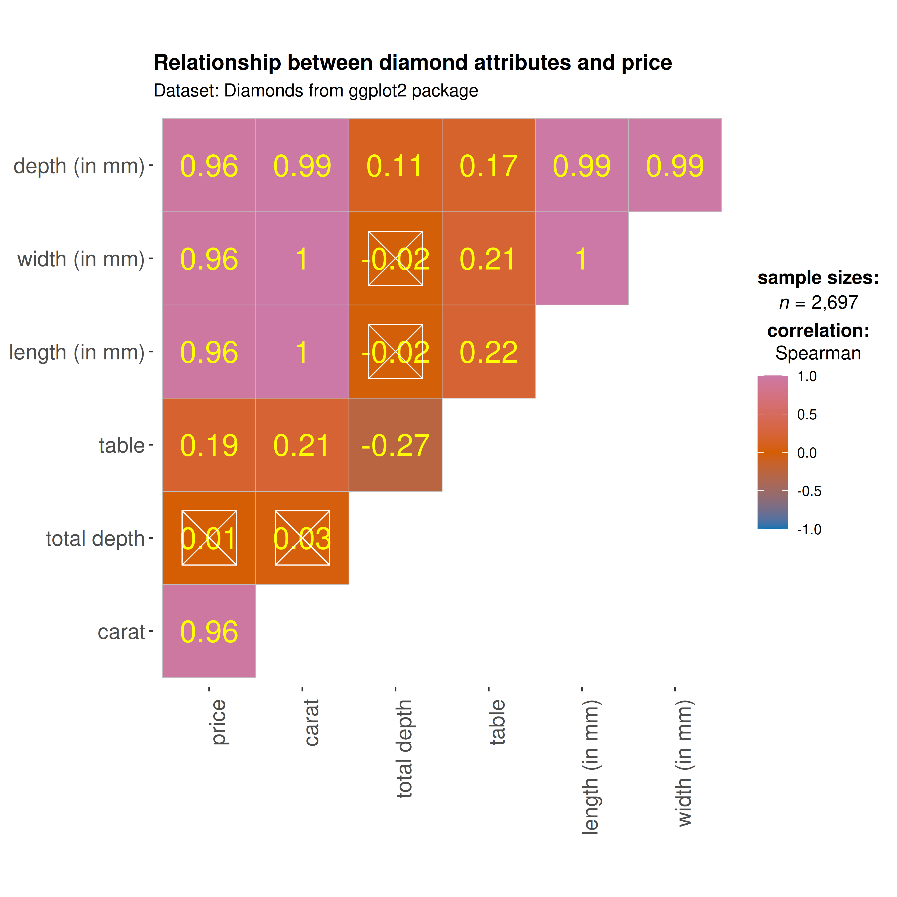

# ggcorrmat

------------------------------------------------------------------------

You can cite this package/vignette as:

    To cite package 'ggstatsplot' in publications use:

      Patil, I. (2021). Visualizations with statistical details: The
      'ggstatsplot' approach. Journal of Open Source Software, 6(61), 3167,
      doi:10.21105/joss.03167

    A BibTeX entry for LaTeX users is

      @Article{,
        doi = {10.21105/joss.03167},
        url = {https://doi.org/10.21105/joss.03167},
        year = {2021},
        publisher = {{The Open Journal}},
        volume = {6},
        number = {61},
        pages = {3167},
        author = {Indrajeet Patil},
        title = {{Visualizations with statistical details: The {'ggstatsplot'} approach}},
        journal = {{Journal of Open Source Software}},
      }

------------------------------------------------------------------------

Lifecycle:
[](https://lifecycle.r-lib.org/articles/stages.html)

The function
[`ggcorrmat()`](https://indrajeetpatil.github.io/ggstatsplot/reference/ggcorrmat.md)
provides a quick way to produce **publication-ready correlation matrix**
(aka *correlalogram*) plot. The function can also be used for quick
**data exploration**. In addition to the plot, it can also be used to
get a correlation coefficient matrix or the associated *p*-value matrix.
This function is a convenient wrapper around
[`ggcorrplot::ggcorrplot()`](https://rdrr.io/pkg/ggcorrplot/man/ggcorrplot.html)
function with some additional functionality.

We will see examples of how to use this function in this vignette with
the `gapminder` and `diamonds` dataset.

To begin with, here are some instances where you would want to use
`ggcorrmat`-

- to easily visualize a correlation matrix using
  [ggplot2](https://ggplot2.tidyverse.org)
- to quickly explore correlation between (all) numeric variables in the
  dataset

## Correlation matrix plot with `ggcorrmat()`

For the first example, we will use the `gapminder` dataset (available in
eponymous [package](https://CRAN.R-project.org/package=gapminder) on
CRAN) provides values for life expectancy, Gross Domestic Product (GDP)
per capita, and population, every five years, from 1952 to 2007, for
each of 142 countries and was collected by the Gapminder Foundation.
Let’s have a look at the data-

``` r

library(gapminder)
library(dplyr)

dplyr::glimpse(gapminder)
#> Rows: 1,704
#> Columns: 6
#> $ country   <fct> "Afghanistan", "Afghanistan", "Afghanistan", "Afghanistan", …
#> $ continent <fct> Asia, Asia, Asia, Asia, Asia, Asia, Asia, Asia, Asia, Asia, …
#> $ year      <int> 1952, 1957, 1962, 1967, 1972, 1977, 1982, 1987, 1992, 1997, …
#> $ lifeExp   <dbl> 28.801, 30.332, 31.997, 34.020, 36.088, 38.438, 39.854, 40.8…
#> $ pop       <int> 8425333, 9240934, 10267083, 11537966, 13079460, 14880372, 12…
#> $ gdpPercap <dbl> 779.4453, 820.8530, 853.1007, 836.1971, 739.9811, 786.1134, …
```

Let’s say we are interested in studying correlation between population
of a country, average life expectancy, and GDP per capita across
countries only for the year 2007.

The simplest way to get a correlation matrix is to stick to the
defaults-

``` r

## select data only from the year 2007
gapminder_2007 <- dplyr::filter(gapminder::gapminder, year == 2007)

## producing the correlation matrix
ggcorrmat(
  data = gapminder_2007, ## data from which variable is to be taken
  cor.vars = lifeExp:gdpPercap ## specifying correlation matrix variables
)
```


This plot can be further modified with additional arguments-

``` r

ggcorrmat(
  data = gapminder_2007, ## data from which variable is to be taken
  cor.vars = lifeExp:gdpPercap, ## specifying correlation matrix variables
  cor.vars.names = c(
    "Life Expectancy",
    "population",
    "GDP (per capita)"
  ),
  type = "np", ## which correlation coefficient is to be computed
  lab.col = "red", ## label color
  ggtheme = ggplot2::theme_light(), ## selected ggplot2 theme
  ## turn off default ggestatsplot theme overlay
  matrix.type = "lower", ## correlation matrix structure
  colors = NULL, ## turning off manual specification of colors
  palette = "category10_d3", ## choosing a color palette
  package = "ggsci", ## package to which color palette belongs
  title = "Gapminder correlation matrix", ## custom title
  subtitle = "Source: Gapminder Foundation" ## custom subtitle
)
```


As seen from this correlation matrix, although there is no relationship
between population and life expectancy worldwide, at least in 2007,
there is a strong positive relationship between GDP, a well-established
indicator of a country’s economic performance.

Given that there were only three variables, this doesn’t look that
impressive. So let’s work with another example from
[ggplot2](https://ggplot2.tidyverse.org) package: the `diamonds`
[dataset](http://ggplot2.tidyverse.org/reference/diamonds.md). This
dataset contains the prices and other attributes of almost 54,000
diamonds.

Let’s have a look at the data-

``` r

library(ggplot2)

dplyr::glimpse(ggplot2::diamonds)
#> Rows: 53,940
#> Columns: 10
#> $ carat   <dbl> 0.23, 0.21, 0.23, 0.29, 0.31, 0.24, 0.24, 0.26, 0.22, 0.23, 0.…
#> $ cut     <ord> Ideal, Premium, Good, Premium, Good, Very Good, Very Good, Ver…
#> $ color   <ord> E, E, E, I, J, J, I, H, E, H, J, J, F, J, E, E, I, J, J, J, I,…
#> $ clarity <ord> SI2, SI1, VS1, VS2, SI2, VVS2, VVS1, SI1, VS2, VS1, SI1, VS1, …
#> $ depth   <dbl> 61.5, 59.8, 56.9, 62.4, 63.3, 62.8, 62.3, 61.9, 65.1, 59.4, 64…
#> $ table   <dbl> 55, 61, 65, 58, 58, 57, 57, 55, 61, 61, 55, 56, 61, 54, 62, 58…
#> $ price   <int> 326, 326, 327, 334, 335, 336, 336, 337, 337, 338, 339, 340, 34…
#> $ x       <dbl> 3.95, 3.89, 4.05, 4.20, 4.34, 3.94, 3.95, 4.07, 3.87, 4.00, 4.…
#> $ y       <dbl> 3.98, 3.84, 4.07, 4.23, 4.35, 3.96, 3.98, 4.11, 3.78, 4.05, 4.…
#> $ z       <dbl> 2.43, 2.31, 2.31, 2.63, 2.75, 2.48, 2.47, 2.53, 2.49, 2.39, 2.…
```

Let’s see the correlation matrix between different attributes of the
diamond and the price.

``` r

## let's use just 5% of the data to speed it up
ggcorrmat(
  data = dplyr::sample_frac(ggplot2::diamonds, size = 0.05),
  cor.vars = c(carat, depth:z), ## note how the variables are getting selected
  cor.vars.names = c(
    "carat",
    "total depth",
    "table",
    "price",
    "length (in mm)",
    "width (in mm)",
    "depth (in mm)"
  ),
  ggcorrplot.args = list(outline.color = "black", hc.order = TRUE)
)
```


We can make a number of changes to this basic correlation matrix. For
example, since we were interested in relationship between price and
other attributes, let’s make the `price` column to the the first column.

``` r

## let's use just 5% of the data to speed it up
ggcorrmat(
  data = dplyr::sample_frac(ggplot2::diamonds, size = 0.05),
  cor.vars = c(price, carat, depth:table, x:z), ## note how the variables are getting selected
  cor.vars.names = c(
    "price",
    "carat",
    "total depth",
    "table",
    "length (in mm)",
    "width (in mm)",
    "depth (in mm)"
  ),
  type = "np",
  title = "Relationship between diamond attributes and price",
  subtitle = "Dataset: Diamonds from ggplot2 package",
  colors = c("#0072B2", "#D55E00", "#CC79A7"),
  pch = "square cross",
  ## additional aesthetic arguments passed to `ggcorrmat()`
  ggcorrplot.args = list(
    lab_col = "yellow",
    lab_size = 6,
    tl.srt = 90,
    pch.col = "white",
    pch.cex = 14
  )
) + ## modification outside `{ggstatsplot}` using `{ggplot2}` functions
  ggplot2::theme(
    axis.text.x = ggplot2::element_text(
      margin = ggplot2::margin(t = 0.15, r = 0.15, b = 0.15, l = 0.15, unit = "cm")
    )
  )
```



As seen here, and unsurprisingly, the strongest predictor of the diamond
price is its carat value, which a unit of mass equal to 200 mg. In other
words, the heavier the diamond, the more expensive it is going to be.

## Grouped analysis with `grouped_ggcorrmat`

What if we want to do the same analysis separately for each quality of
the diamond `cut` (Fair, Good, Very Good, Premium, Ideal)?

[ggstatsplot](https://indrajeetpatil.github.io/ggstatsplot/) provides a
special helper function for such instances:
[`grouped_ggcorrmat()`](https://indrajeetpatil.github.io/ggstatsplot/reference/grouped_ggcorrmat.md).
This is merely a wrapper function around
[`combine_plots()`](https://indrajeetpatil.github.io/ggstatsplot/reference/combine_plots.md).
It applies
[`ggcorrmat()`](https://indrajeetpatil.github.io/ggstatsplot/reference/ggcorrmat.md)
across all **levels** of a specified **grouping variable** and then
combines list of individual plots into a single plot.

``` r

grouped_ggcorrmat(
  ## arguments relevant for `ggcorrmat()`
  data = ggplot2::diamonds,
  cor.vars = c(price, carat, depth),
  grouping.var = cut,
  ## arguments relevant for `combine_plots()`
  plotgrid.args = list(nrow = 3),
  annotation.args = list(
    tag_levels = "a",
    title = "Relationship between diamond attributes and price across cut",
    caption = "Dataset: Diamonds from ggplot2 package"
  )
)
```


Note that this function also makes it easy to run the same correlation
matrix across different levels of a factor/grouping variable.

## Data frame

If you want a data frame of (grouped) correlation matrix, use
[`correlation::correlation()`](https://easystats.github.io/correlation/reference/correlation.html)
instead. It can also do grouped analysis when used with output from
[`dplyr::group_by()`](https://dplyr.tidyverse.org/reference/group_by.html).

## Grouped analysis with `ggcorrmat()` + `{purrr}`

Although `grouped_` function is good for quickly exploring the data, it
reduces the flexibility with which this function can be used. This is
the because the common parameters used are applied to plots
corresponding to all levels of the grouping variable and there is no way
to customize the arguments for different levels of the grouping
variable. We will see how this can be done using the
[purrr](https://purrr.tidyverse.org/) package.

See the associated vignette here:
<https://indrajeetpatil.github.io/ggstatsplot/articles/web_only/purrr_examples.html>

## Summary of graphics and tests

Details about underlying functions used to create graphics and
statistical tests carried out can be found in the function
documentation:
<https://indrajeetpatil.github.io/ggstatsplot/reference/gghistostats.html>

## Suggestions

If you find any bugs or have any suggestions/remarks, please file an
issue on `GitHub`:
<https://github.com/IndrajeetPatil/ggstatsplot/issues>
