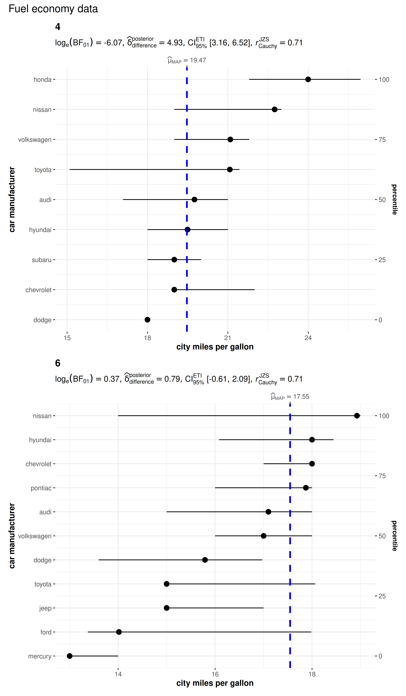

# ggdotplotstats

------------------------------------------------------------------------

You can cite this package/vignette as:

    To cite package 'ggstatsplot' in publications use:

      Patil, I. (2021). Visualizations with statistical details: The
      'ggstatsplot' approach. Journal of Open Source Software, 6(61), 3167,
      doi:10.21105/joss.03167

    A BibTeX entry for LaTeX users is

      @Article{,
        doi = {10.21105/joss.03167},
        url = {https://doi.org/10.21105/joss.03167},
        year = {2021},
        publisher = {{The Open Journal}},
        volume = {6},
        number = {61},
        pages = {3167},
        author = {Indrajeet Patil},
        title = {{Visualizations with statistical details: The {'ggstatsplot'} approach}},
        journal = {{Journal of Open Source Software}},
      }

------------------------------------------------------------------------

Lifecycle:
[](https://lifecycle.r-lib.org/articles/stages.html)

The function `ggdotplotstats` can be used for **data exploration** and
to provide an easy way to make **publication-ready dot plots/charts**
with appropriate and selected statistical details embedded in the plot
itself. In this vignette, we will explore several examples of how to use
it.

This function is a sister function of `gghistostats` with the difference
being it expects a labeled numeric variable.

## Distribution of a sample with `ggdotplotstats`

Let’s begin with a very simple example from the
[ggplot2](https://ggplot2.tidyverse.org) package
([`ggplot2::mpg`](https://ggplot2.tidyverse.org/reference/mpg.html)), a
subset of the fuel economy data that the EPA makes available on
<http://fueleconomy.gov>.

``` r

## looking at the structure of the data using glimpse
dplyr::glimpse(ggplot2::mpg)
#> Rows: 234
#> Columns: 11
#> $ manufacturer <chr> "audi", "audi", "audi", "audi", "audi", "audi", "audi", "…
#> $ model        <chr> "a4", "a4", "a4", "a4", "a4", "a4", "a4", "a4 quattro", "…
#> $ displ        <dbl> 1.8, 1.8, 2.0, 2.0, 2.8, 2.8, 3.1, 1.8, 1.8, 2.0, 2.0, 2.…
#> $ year         <int> 1999, 1999, 2008, 2008, 1999, 1999, 2008, 1999, 1999, 200…
#> $ cyl          <int> 4, 4, 4, 4, 6, 6, 6, 4, 4, 4, 4, 6, 6, 6, 6, 6, 6, 8, 8, …
#> $ trans        <chr> "auto(l5)", "manual(m5)", "manual(m6)", "auto(av)", "auto…
#> $ drv          <chr> "f", "f", "f", "f", "f", "f", "f", "4", "4", "4", "4", "4…
#> $ cty          <int> 18, 21, 20, 21, 16, 18, 18, 18, 16, 20, 19, 15, 17, 17, 1…
#> $ hwy          <int> 29, 29, 31, 30, 26, 26, 27, 26, 25, 28, 27, 25, 25, 25, 2…
#> $ fl           <chr> "p", "p", "p", "p", "p", "p", "p", "p", "p", "p", "p", "p…
#> $ class        <chr> "compact", "compact", "compact", "compact", "compact", "c…
```

Let’s say we want to visualize the distribution of mileage by car
manufacturer.

``` r

## removing factor level with very few no. of observations
df <- dplyr::filter(ggplot2::mpg, cyl %in% c("4", "6"))

## creating a vector of colors using `paletteer` package
paletter_vector <- paletteer::paletteer_d(
  palette = "palettetown::venusaur",
  n = nlevels(as.factor(df$manufacturer)),
  type = "discrete"
)

ggdotplotstats(
  data = df,
  x = cty,
  y = manufacturer,
  xlab = "city miles per gallon",
  ylab = "car manufacturer",
  test.value = 15.5,
  point.args = list(
    shape = 16,
    color = paletter_vector,
    size = 5
  ),
  title = "Distribution of mileage of cars",
  ggtheme = ggplot2::theme_dark()
)
```


## Grouped analysis with `grouped_ggdotplotstats`

What if we want to do the same analysis separately for different engines
with different numbers of cylinders?

[ggstatsplot](https://indrajeetpatil.github.io/ggstatsplot/) provides a
special helper function for such instances: `grouped_ggdotplotstats`.
This is merely a wrapper function around `combine_plots`. It applies
`ggdotplotstats` across all **levels** of a specified **grouping
variable** and then combines the individual plots into a single plot.

Let’s see how we can use this function to apply `ggdotplotstats` to
accomplish our task.

``` r

## removing factor level with very few no. of observations
df <- dplyr::filter(ggplot2::mpg, cyl %in% c("4", "6"))

grouped_ggdotplotstats(
  ## arguments relevant for ggdotplotstats
  data = df,
  grouping.var = cyl, ## grouping variable
  x = cty,
  y = manufacturer,
  xlab = "city miles per gallon",
  ylab = "car manufacturer",
  type = "bayes",
  test.value = 15.5,
  ## arguments relevant for `combine_plots`
  annotation.args = list(title = "Fuel economy data"),
  plotgrid.args = list(nrow = 2L)
)
```



## Grouped analysis with `{purrr}`

Although this is a quick and dirty way to explore a large amount of data
with minimal effort, it does come with an important limitation: reduced
flexibility. For example, if we wanted to add, let’s say, a separate
`test.value` argument for each gender, this is not possible with
`grouped_ggdotplotstats`. For cases like these, or to run separate kinds
of tests (robust for some, parametric for other, while Bayesian for some
other levels of the group) it would be better to use
[purrr](https://purrr.tidyverse.org/).

See the associated vignette here:
<https://indrajeetpatil.github.io/ggstatsplot/articles/web_only/purrr_examples.html>

## Summary of graphics and tests

Details about underlying functions used to create graphics and
statistical tests carried out can be found in the function
documentation:
<https://indrajeetpatil.github.io/ggstatsplot/reference/ggdotplotstats.html>

## Reporting

If you wish to include statistical analysis results in a
publication/report, the ideal reporting practice will be a hybrid of two
approaches:

- the [ggstatsplot](https://indrajeetpatil.github.io/ggstatsplot/)
  approach, where the plot contains both the visual and numerical
  summaries about a statistical model, and

- the *standard* narrative approach, which provides interpretive context
  for the reported statistics.

For example, let’s see the following example:

``` r

ggdotplotstats(morley, Speed, Expt, test.value = 800)
```


The narrative context (assuming `type = "parametric"`) can complement
this plot either as a figure caption or in the main text-

> Student’s *t*-test revealed that, across 5 experiments, the speed of
> light was significantly different than posited speed. The effect size
> $`(g = 1.22)`$ was very large, as per Cohen’s (1988) conventions. The
> Bayes Factor for the same analysis revealed that the data were 3.46
> times more probable under the alternative hypothesis as compared to
> the null hypothesis. This can be considered moderate evidence
> (Jeffreys, 1961) in favor of the alternative hypothesis.

## Suggestions

If you find any bugs or have any suggestions/remarks, please file an
issue on GitHub: <https://github.com/IndrajeetPatil/ggstatsplot/issues>
