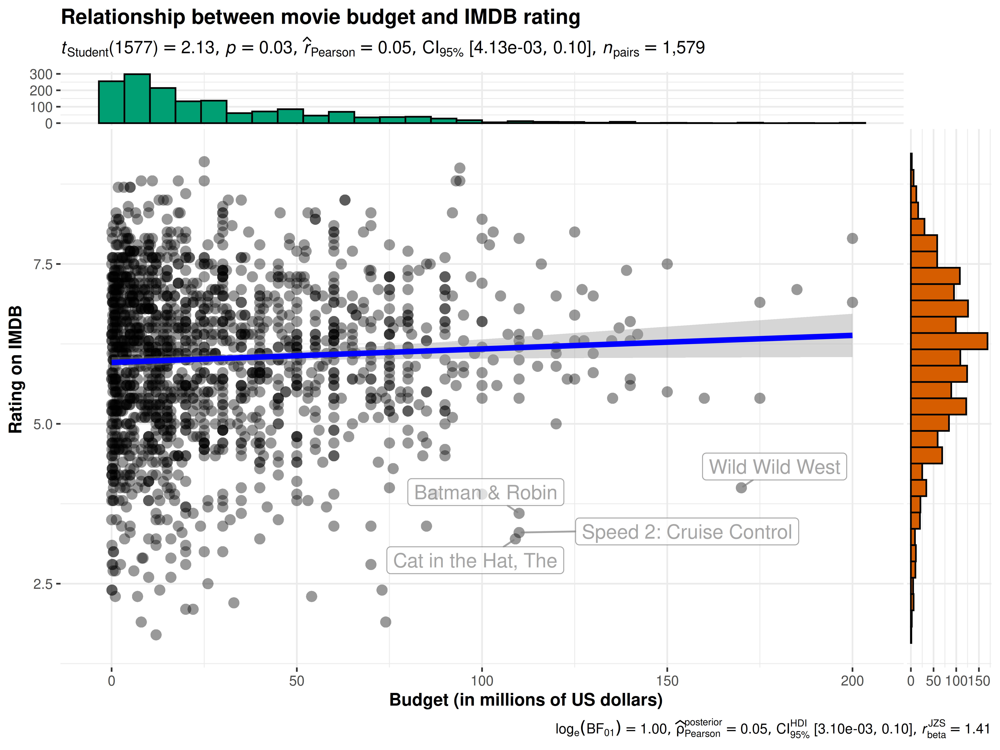

# ggscatterstats

Lifecycle:
[](https://lifecycle.r-lib.org/articles/stages.html)

The function `ggscatterstats` is meant to provide a **publication-ready
scatterplot** with all statistical details included in the plot itself
to show association between two continuous variables. This function is
also helpful during the **data exploration** phase. We will see examples
of how to use this function in this vignette with the `ggplot2movies`
dataset.

To begin with, here are some instances where you would want to use
`ggscatterstats`-

- to check linear association between two continuous variables
- to check distribution of two continuous variables

**Note before**: The following demo uses the pipe operator (`%>%`), so
in case you are not familiar with this operator, here is a good
explanation:
[http://r4ds.had.co.nz/pipes.html](http://r4ds.had.co.nz/pipes.md)

## Correlation plot with `ggscatterstats`

To illustrate how this function can be used, we will rely on the
`ggplot2movies` dataset. This dataset provides information about movies
scraped from [IMDB](https://www.imdb.com/). Specifically, we will be
using cleaned version of this dataset included in the
[ggstatsplot](https://indrajeetpatil.github.io/ggstatsplot/) package
itself.

``` r

## see the selected data (we have data from 1813 movies)
dplyr::glimpse(movies_long)
#> Rows: 1,579
#> Columns: 8
#> $ title  <chr> "Shawshank Redemption, The", "Lord of the Rings: The Return of …
#> $ year   <int> 1994, 2003, 2001, 2002, 1994, 1993, 1977, 1980, 1968, 2002, 196…
#> $ length <int> 142, 251, 208, 223, 168, 195, 125, 129, 158, 135, 93, 113, 108,…
#> $ budget <dbl> 25.0, 94.0, 93.0, 94.0, 8.0, 25.0, 11.0, 18.0, 5.0, 3.3, 1.8, 5…
#> $ rating <dbl> 9.1, 9.0, 8.8, 8.8, 8.8, 8.8, 8.8, 8.8, 8.7, 8.7, 8.7, 8.7, 8.6…
#> $ votes  <int> 149494, 103631, 157608, 114797, 132745, 97667, 134640, 103706, …
#> $ mpaa   <fct> R, PG-13, PG-13, PG-13, R, R, PG, PG, PG-13, R, PG, R, R, R, R,…
#> $ genre  <fct> Drama, Action, Action, Action, Drama, Drama, Action, Action, Dr…
```

Now that we have a clean dataset, we can start asking some interesting
questions. For example, let’s see if the average IMDB rating for a movie
has any relationship to its budget. Additionally, let’s also see which
movies had a high budget but low IMDB rating by labeling those data
points.

To reduce the processing time, let’s only work with 30% of the dataset.

``` r

ggscatterstats(
  data = movies_long, ## data frame from which variables are taken
  x = budget, ## predictor/independent variable
  y = rating, ## dependent variable
  xlab = "Budget (in millions of US dollars)", ## label for the x-axis
  ylab = "Rating on IMDB", ## label for the y-axis
  label.var = title, ## variable to use for labeling data points
  label.expression = rating < 5 & budget > 100, ## expression for deciding which points to label
  point.label.args = list(alpha = 0.7, size = 4, color = "grey50"),
  xfill = "#CC79A7", ## fill for marginals on the x-axis
  yfill = "#009E73", ## fill for marginals on the y-axis
  title = "Relationship between movie budget and IMDB rating",
  caption = "Source: www.imdb.com"
)
```



There is indeed a small, but significant, positive correlation between
the amount of money studio invests in a movie and the ratings given by
the audiences.

## Grouped analysis with `grouped_ggscatterstats`

What if we want to do the same analysis do the same analysis for movies
with different MPAA (Motion Picture Association of America) film ratings
(NC-17, PG, PG-13, R)?

[ggstatsplot](https://indrajeetpatil.github.io/ggstatsplot/) provides a
special helper function for such instances: `grouped_ggstatsplot`. This
is merely a wrapper function around `combine_plots`. It applies
[ggstatsplot](https://indrajeetpatil.github.io/ggstatsplot/) across all
**levels** of a specified **grouping variable** and then combines list
of individual plots into a single plot. Note that the grouping variable
can be anything: conditions in a given study, groups in a study sample,
different studies, etc.

Let’s see how we can use this function to apply `ggscatterstats` for all
MPAA ratings. Also, let’s run a robust test this time.

``` r

grouped_ggscatterstats(
  ## arguments relevant for ggscatterstats
  data = movies_long,
  x = budget,
  y = rating,
  grouping.var = mpaa,
  label.var = title,
  label.expression = rating < 5 & budget > 80,
  type = "r",
  # ggtheme = ggthemes::theme_tufte(),
  ## arguments relevant for combine_plots
  annotation.args = list(
    title = "Relationship between movie budget and IMDB rating",
    caption = "Source: www.imdb.com"
  ),
  plotgrid.args = list(nrow = 3, ncol = 1)
)
```


As seen from the plot, this analysis has revealed something interesting:
The relationship we found between budget and IMDB rating holds only for
PG-13 and R-rated movies.

## Grouped analysis with `ggscatterstats` + `{purrr}`

Although this is a quick and dirty way to explore large amount of data
with minimal effort, it does come with an important limitation: reduced
flexibility. For example, if we wanted to add, let’s say, a separate
type of marginal distribution plot for each MPAA rating or if we wanted
to use different types of correlations across different levels of MPAA
ratings (NC-17 has only 6 movies, so a robust correlation would be a
good idea), this is not possible. But this can be easily done using
[purrr](https://purrr.tidyverse.org/).

See the associated vignette here:
<https://indrajeetpatil.github.io/ggstatsplot/articles/web_only/purrr_examples.html>

## Summary of graphics and tests

Details about underlying functions used to create graphics and
statistical tests carried out can be found in the function
documentation:
<https://indrajeetpatil.github.io/ggstatsplot/reference/ggscatterstats.html>

## Reporting

If you wish to include statistical analysis results in a
publication/report, the ideal reporting practice will be a hybrid of two
approaches:

- the [ggstatsplot](https://indrajeetpatil.github.io/ggstatsplot/)
  approach, where the plot contains both the visual and numerical
  summaries about a statistical model, and

- the *standard* narrative approach, which provides interpretive context
  for the reported statistics.

For example, let’s see the following example:

``` r

ggscatterstats(mtcars, qsec, drat)
```


The narrative context (assuming `type = "parametric"`) can complement
this plot either as a figure caption or in the main text-

> Pearson’s correlation test revealed that, across 32 cars, a measure of
> acceleration (1/4 mile time; `qsec`) was positively correlated with
> rear axle ratio (`drat`), but this effect was not statistically
> significant. The effect size $`(r = 0.09)`$ was small, as per Cohen’s
> (1988) conventions. The Bayes Factor for the same analysis revealed
> that the data were 3.32 times more probable under the null hypothesis
> as compared to the alternative hypothesis. This can be considered
> moderate evidence (Jeffreys, 1961) in favor of the null hypothesis (of
> absence of any correlation between these two variables).

## Suggestions

If you find any bugs or have any suggestions/remarks, please file an
issue on GitHub: <https://github.com/IndrajeetPatil/ggstatsplot/issues>
