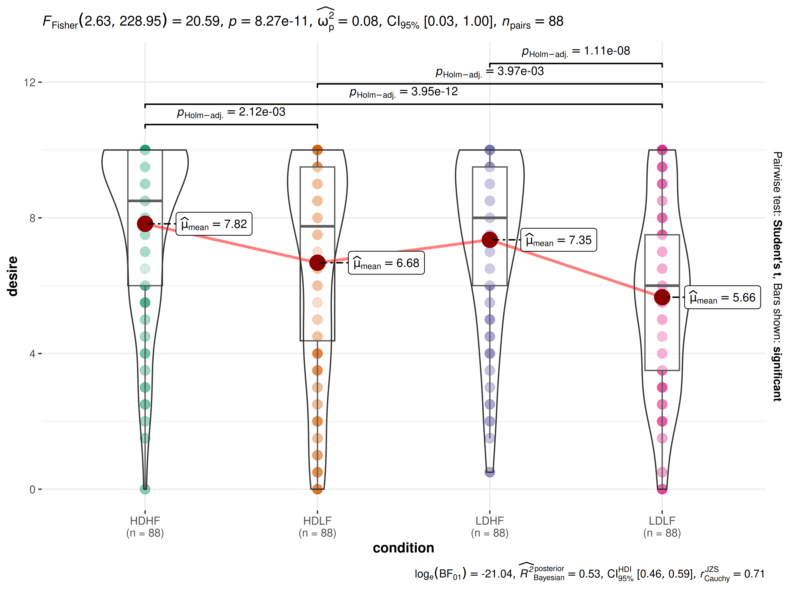
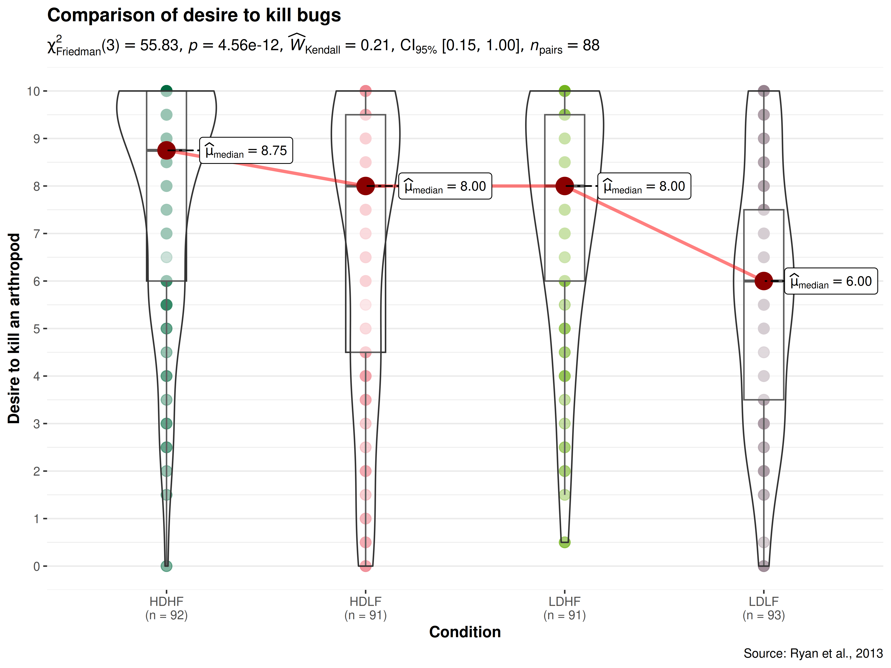
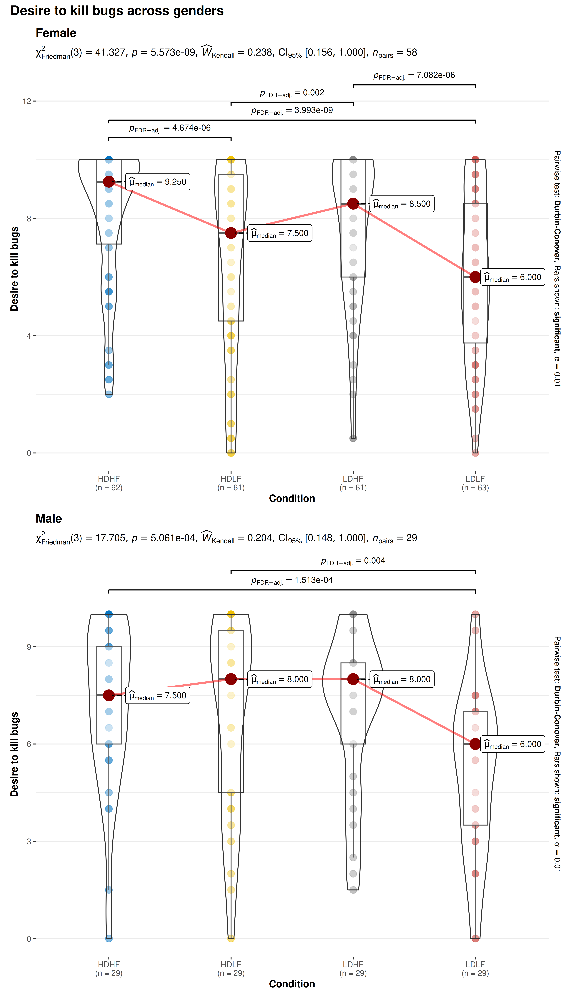
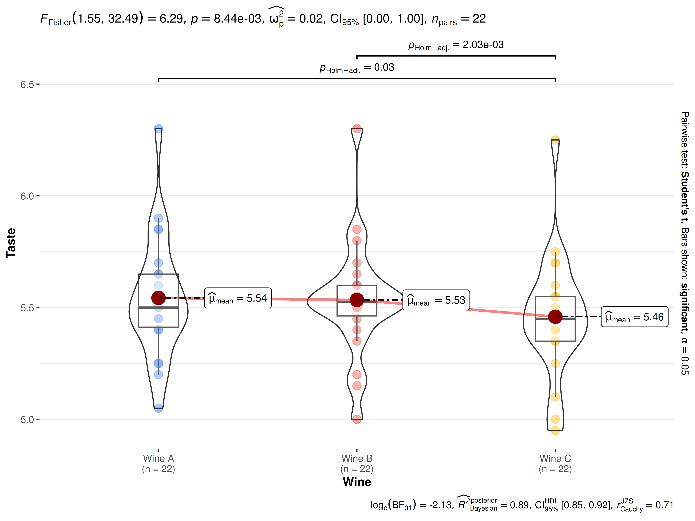

# ggwithinstats

------------------------------------------------------------------------

You can cite this package/vignette as:

    To cite package 'ggstatsplot' in publications use:

      Patil, I. (2021). Visualizations with statistical details: The
      'ggstatsplot' approach. Journal of Open Source Software, 6(61), 3167,
      doi:10.21105/joss.03167

    A BibTeX entry for LaTeX users is

      @Article{,
        doi = {10.21105/joss.03167},
        url = {https://doi.org/10.21105/joss.03167},
        year = {2021},
        publisher = {{The Open Journal}},
        volume = {6},
        number = {61},
        pages = {3167},
        author = {Indrajeet Patil},
        title = {{Visualizations with statistical details: The {'ggstatsplot'} approach}},
        journal = {{Journal of Open Source Software}},
      }

------------------------------------------------------------------------

Lifecycle:
[](https://lifecycle.r-lib.org/articles/stages.html)

The function `ggwithinstats` is designed to facilitate **data
exploration**, and for making highly customizable **publication-ready
plots**, with relevant statistical details included in the plot itself
if desired. We will see examples of how to use this function in this
vignette.

To begin with, here are some instances where you would want to use
`ggwithinstats`-

- to check if a continuous variable differs across multiple conditions
  measured on the same subjects (repeated measures or within-subjects
  designs)

- to compare distributions visually

To illustrate how this function can be used, we will use the `bugs_long`
dataset throughout this vignette. This data set, “Bugs”, provides the
extent to which men and women want to kill arthropods that vary in
frighteningness (low, high) and disgustingness (low, high). Each
participant rates their attitudes towards all arthropods. Subset of the
data reported by [Ryan et
al. (2013)](https://www.sciencedirect.com/science/article/pii/S0747563213000277).
Note that this is a repeated measures design because the same
participant gave four different ratings across four different conditions
(LDLF, LDHF, HDLF, HDHF).

## Data format

[`ggwithinstats()`](https://www.indrapatil.com/ggstatsplot/reference/ggwithinstats.md)
expects data in the **long** format: one row per observation, with one
column for the condition (`x`), one for the measurement (`y`), and,
ideally, one identifying the subject (`subject.id`). This is how
`bugs_long` is organized:

\
`dplyr``::`[`glimpse`](https://pillar.r-lib.org/reference/glimpse.html)`(``bugs_long``)`\
`#> Rows: 372`\
`#> Columns: 6`\
`#> $ ``subject  `` ``<int>`` 1``, ``2``, ``3``, ``4``, ``5``, ``6``, ``7``, ``8``, ``9``, ``10``, ``11``, ``12``, ``13``, ``14``, ``15``, ``16``, ``17``, ``1…`\
`#> $ ``gender   `` ``<fct>`` Female``, ``Female``, ``Female``, ``Female``, ``Female``, ``Female``, ``Female``, ``Fema…`\
`#> $ ``region   `` ``<fct>`` North America``, ``North America``, ``Europe``, ``North America``, ``North A…`\
`#> $ ``education`` ``<fct>`` some``, ``advance``, ``college``, ``college``, ``some``, ``some``, ``some``, ``high``, ``hig…`\
`#> $ ``condition`` ``<chr>`` "LDLF"``, ``"LDLF"``, ``"LDLF"``, ``"LDLF"``, ``"LDLF"``, ``"LDLF"``, ``"LDLF"``, ``"LDL…`\
`#> $ ``desire   `` ``<dbl>`` 6.0``, ``10.0``, ``5.0``, ``6.0``, ``3.0``, ``2.0``, ``10.0``, ``10.0``, ``9.5``, ``8.5``, ``0.0``, ``9.…`

If your data are in the **wide** format (one row per subject and one
column per condition), first reshape them with
[`tidyr::pivot_longer()`](https://tidyr.tidyverse.org/reference/pivot_longer.html):

\
`# a data frame in the wide format`\
`df_wide`` ``<-`` ``tidyr``::`[`pivot_wider`](https://tidyr.tidyverse.org/reference/pivot_wider.html)`(``bugs_long``, names_from ``=`` ``condition``, values_from ``=`` ``desire``)`\
[`head`](https://rdrr.io/r/utils/head.html)`(``df_wide``)`\
`#> ``# A tibble: 6 × 8`\
`#>   ``subject`` ``gender`` ``region``        ``education``  ``LDLF``  ``LDHF``  ``HDLF``  ``HDHF`\
`#>     ``<int>`` ``<fct>``  ``<fct>``         ``<fct>``     ``<dbl>`` ``<dbl>`` ``<dbl>`` ``<dbl>`\
`#> ``1``       1 Female North America some          6   6     9    10  `\
`#> ``2``       2 Female North America advance      10  ``NA``    10    10  `\
`#> ``3``       3 Female Europe        college       5  10    10    10  `\
`#> ``4``       4 Female North America college       6   9     6     9  `\
`#> ``5``       5 Female North America some          3   6.5   5.5   8.5`\
`#> ``6``       6 Female Europe        some          2   ``0.``5   7.5   3`\
\
`# converting it to the long format`\
`df_long`` ``<-`` ``tidyr``::`[`pivot_longer`](https://tidyr.tidyverse.org/reference/pivot_longer.html)`(`\
`  ``df_wide``,`\
`  cols ``=`` `[`c`](https://rdrr.io/r/base/c.html)`(``LDLF``, ``LDHF``, ``HDLF``, ``HDHF``)``,`\
`  names_to ``=`` ``"condition"``,`\
`  values_to ``=`` ``"desire"`\
`)`\
[`head`](https://rdrr.io/r/utils/head.html)`(``df_long``)`\
`#> ``# A tibble: 6 × 6`\
`#>   ``subject`` ``gender`` ``region``        ``education`` ``condition`` ``desire`\
`#>     ``<int>`` ``<fct>``  ``<fct>``         ``<fct>``     ``<chr>``      ``<dbl>`\
`#> ``1``       1 Female North America some      LDLF           6`\
`#> ``2``       1 Female North America some      LDHF           6`\
`#> ``3``       1 Female North America some      HDLF           9`\
`#> ``4``       1 Female North America some      HDHF          10`\
`#> ``5``       2 Female North America advance   LDLF          10`\
`#> ``6``       2 Female North America advance   LDHF          ``NA`

Supplying `subject.id` is strongly recommended: it is used to pair
observations of the same subject across conditions. If it is omitted,
the function assumes that the rows are already sorted in the same
subject order within every condition. Subjects with missing values in
any condition are excluded from the statistical analysis.

## Comparisons between conditions with `ggwithinstats`

Suppose the first thing we want to inspect is the distribution of desire
to kill across all conditions (disregarding the factorial structure of
the experiment). We also want to know if the mean differences in this
desire across conditions is statistically significant.

The simplest form of the function call is-

\
[`ggwithinstats`](https://www.indrapatil.com/ggstatsplot/reference/ggwithinstats.md)`(`\
`  data       ``=`` ``bugs_long``,`\
`  x          ``=`` ``condition``,`\
`  y          ``=`` ``desire``,`\
`  subject.id ``=`` ``subject`\
`)`



**Note**:

- The function automatically decides whether a paired samples test (for
  2 conditions) or a repeated measures ANOVA (3 or more conditions) is
  carried out, based on the number of levels in the `x` variable.

- The output of the function is a `ggplot` object which means that it
  can be further modified with [ggplot2](https://ggplot2.tidyverse.org)
  functions.

As can be seen from the plot, the function by default also returns Bayes
Factor for the test in the caption. If the null hypothesis can’t be
rejected with the null hypothesis significance testing (NHST) approach,
the Bayesian approach can help index evidence in favor of the null
hypothesis (i.e., $`BF_{01}`$).

By default, natural logarithms are shown because Bayes Factor values can
sometimes be pretty large. Having values on logarithmic scale also makes
it easy to compare evidence in favor of alternative ($`BF_{10}`$) versus
null ($`BF_{01}`$) hypotheses (since
$`log_{e}(BF_{01}) = - log_{e}(BF_{10})`$).

We can make the output much more aesthetically pleasing as well as
informative by making use of the many optional parameters in
`ggwithinstats`. We’ll add a title and caption, better `x` and `y` axis
labels. We can and will change the color palette in use as well. This
time, let’s also use a nonparametric test.

\
[`ggwithinstats`](https://www.indrapatil.com/ggstatsplot/reference/ggwithinstats.md)`(`\
`  data       ``=`` ``bugs_long``,`\
`  x          ``=`` ``condition``,`\
`  y          ``=`` ``desire``,`\
`  subject.id ``=`` ``subject``,`\
`  type       ``=`` ``"nonparametric"``, ``## type of statistical test`\
`  xlab       ``=`` ``"Condition"``, ``## label for the x-axis`\
`  ylab       ``=`` ``"Desire to kill an arthropod"``, ``## label for the y-axis`\
`  palette    ``=`` ``"yarrr::info2"``, ``## choosing a different color palette`\
`  title      ``=`` ``"Comparison of desire to kill bugs"``,`\
`  caption    ``=`` ``"Source: Ryan et al., 2013"`\
`)`` ``+`` ``## modifying the plot further`\
`  ``ggplot2``::`[`scale_y_continuous`](https://ggplot2.tidyverse.org/reference/scale_continuous.html)`(`\
`    limits ``=`` `[`c`](https://rdrr.io/r/base/c.html)`(``0``, ``10``)``,`\
`    breaks ``=`` `[`seq`](https://rdrr.io/r/base/seq.html)`(``from ``=`` ``0``, to ``=`` ``10``, by ``=`` ``1``)`\
`  ``)`



As can be appreciated from the effect size (Kendall’s *W*) of 0.21,
there are small differences in the desire to kill across conditions.
Importantly, this plot also helps us appreciate the distributions within
any given condition.

We can also use other available options: The `type` (of test) argument
also accepts the following abbreviations: `"p"` (for *parametric*),
`"np"` (for *nonparametric*), `"r"` (for *robust*), `"bf"` (for *Bayes
Factor*).

Let’s use the `combine_plots` function to make one plot from four
separate plots that demonstrates all of these options. Let’s compare
desire to kill bugs only for low versus high disgust conditions to see
how much of a difference whether a bug is disgusting-looking or not
makes to the desire to kill that bug. We will generate the plots one by
one and then use `combine_plots` to merge them into one plot with some
common labeling. It is possible, but not necessarily recommended, to
make each plot have different colors or themes.

For example,

\
`## selecting subset of the data`\
`df_disgust`` ``<-`` ``dplyr``::`[`filter`](https://dplyr.tidyverse.org/reference/filter.html)`(``bugs_long``, ``condition`` `[`%in%`](https://rdrr.io/r/base/match.html)` `[`c`](https://rdrr.io/r/base/c.html)`(``"LDHF"``, ``"HDHF"``)``)`\
\
`## parametric t-test`\
`p1`` ``<-`` `[`ggwithinstats`](https://www.indrapatil.com/ggstatsplot/reference/ggwithinstats.md)`(`\
`  data ``=`` ``df_disgust``,`\
`  x ``=`` ``condition``,`\
`  y ``=`` ``desire``,`\
`  subject.id ``=`` ``subject``,`\
`  xlab ``=`` ``"Condition"``,`\
`  ylab ``=`` ``"Desire to kill bugs"``,`\
`  type ``=`` ``"p"``,`\
`  conf.level ``=`` ``0.99``,`\
`  title ``=`` ``"Parametric test"``,`\
`  palette ``=`` ``"ggsci::nrc_npg"`\
`)`\
\
`## Wilcoxon signed-rank test (nonparametric test)`\
`p2`` ``<-`` `[`ggwithinstats`](https://www.indrapatil.com/ggstatsplot/reference/ggwithinstats.md)`(`\
`  data       ``=`` ``df_disgust``,`\
`  x          ``=`` ``condition``,`\
`  y          ``=`` ``desire``,`\
`  subject.id ``=`` ``subject``,`\
`  xlab       ``=`` ``"Condition"``,`\
`  ylab       ``=`` ``"Desire to kill bugs"``,`\
`  type       ``=`` ``"np"``,`\
`  conf.level ``=`` ``0.99``,`\
`  title      ``=`` ``"Non-parametric Test"``,`\
`  palette    ``=`` ``"ggsci::uniform_startrek"`\
`)`\
\
`## Yuen's paired trimmed means test (robust test)`\
`p3`` ``<-`` `[`ggwithinstats`](https://www.indrapatil.com/ggstatsplot/reference/ggwithinstats.md)`(`\
`  data       ``=`` ``df_disgust``,`\
`  x          ``=`` ``condition``,`\
`  y          ``=`` ``desire``,`\
`  subject.id ``=`` ``subject``,`\
`  xlab       ``=`` ``"Condition"``,`\
`  ylab       ``=`` ``"Desire to kill bugs"``,`\
`  type       ``=`` ``"r"``,`\
`  conf.level ``=`` ``0.99``,`\
`  title      ``=`` ``"Robust Test"``,`\
`  palette    ``=`` ``"wesanderson::Royal2"`\
`)`\
\
`## Bayes Factor for parametric t-test`\
`p4`` ``<-`` `[`ggwithinstats`](https://www.indrapatil.com/ggstatsplot/reference/ggwithinstats.md)`(`\
`  data       ``=`` ``df_disgust``,`\
`  x          ``=`` ``condition``,`\
`  y          ``=`` ``desire``,`\
`  subject.id ``=`` ``subject``,`\
`  xlab       ``=`` ``"Condition"``,`\
`  ylab       ``=`` ``"Desire to kill bugs"``,`\
`  type       ``=`` ``"bayes"``,`\
`  title      ``=`` ``"Bayesian Test"``,`\
`  palette    ``=`` ``"ggsci::nrc_npg"`\
`)`\
\
`## combining the individual plots into a single plot`\
[`combine_plots`](https://www.indrapatil.com/ggstatsplot/reference/combine_plots.md)`(`\
`  plotlist ``=`` `[`list`](https://rdrr.io/r/base/list.html)`(``p1``, ``p2``, ``p3``, ``p4``)``,`\
`  plotgrid.args ``=`` `[`list`](https://rdrr.io/r/base/list.html)`(``nrow ``=`` ``2L``)``,`\
`  annotation.args ``=`` `[`list`](https://rdrr.io/r/base/list.html)`(`\
`    title ``=`` ``"Effect of disgust on desire to kill bugs"``,`\
`    caption ``=`` ``` "Source: Bugs dataset from `jmv` R package" ``\
`  ``)`\
`)`


## Grouped analysis with `grouped_ggwithinstats`

What if we want to carry out this same analysis but for each region (or
gender)?

[ggstatsplot](https://www.indrapatil.com/ggstatsplot/) provides a
special helper function for such instances: `grouped_ggwithinstats`.
This is merely a wrapper function around `combine_plots`. It applies
`ggwithinstats` across all **levels** of a specified **grouping
variable** and then combines list of individual plots into a single
plot. Note that the grouping variable can be anything: conditions in a
given study, groups in a study sample, different studies, etc.

Let’s carry out the analysis separately for each gender. Also, let’s
carry out pairwise comparisons to see if there are differences between
every pair of conditions.

\
[`grouped_ggwithinstats`](https://www.indrapatil.com/ggstatsplot/reference/grouped_ggwithinstats.md)`(`\
`  ``## arguments relevant for ggwithinstats`\
`  data             ``=`` ``bugs_long``,`\
`  x                ``=`` ``condition``,`\
`  y                ``=`` ``desire``,`\
`  subject.id       ``=`` ``subject``,`\
`  grouping.var     ``=`` ``gender``,`\
`  xlab             ``=`` ``"Condition"``,`\
`  ylab             ``=`` ``"Desire to kill bugs"``,`\
`  type             ``=`` ``"nonparametric"``, ``## type of test`\
`  pairwise.display ``=`` ``"significant"``, ``## display only significant pairwise comparisons`\
`  pairwise.alpha   ``=`` ``0.01``, ``## use a stricter alpha threshold to reduce clutter`\
`  p.adjust.method  ``=`` ``"BH"``, ``## adjust p-values for multiple tests using this method`\
`  palette          ``=`` ``"ggsci::default_jco"``,`\
`  digits           ``=`` ``3``,`\
`  ``## arguments relevant for combine_plots`\
`  annotation.args  ``=`` `[`list`](https://rdrr.io/r/base/list.html)`(``title ``=`` ``"Desire to kill bugs across genders"``)``,`\
`  plotgrid.args    ``=`` `[`list`](https://rdrr.io/r/base/list.html)`(``ncol ``=`` ``1``)`\
`)`



## Grouped analysis with `ggwithinstats` + `{purrr}`

Although this grouping function provides a quick way to explore the
data, it leaves much to be desired. For example, the same type of test
and theme is applied for all genders, but maybe we want to change this
for different genders, or maybe we want to have different types of tests
for different genders. This type of customization for different levels
of a grouping variable is not possible with `grouped_ggwithinstats`, but
this can be easily achieved using the
[purrr](https://purrr.tidyverse.org/) package.

See the associated vignette here:
<https://www.indrapatil.com/ggstatsplot/articles/web_only/purrr_examples.html>

## Between-subjects designs

For independent measures designs, `ggbetweenstats` function can be used:
<https://www.indrapatil.com/ggstatsplot/articles/web_only/ggbetweenstats.html>

## Summary of graphics and tests

| graphical element | `geom` used | argument for further modification |
|:---|:---|:---|
| raw data | [`ggplot2::geom_point()`](https://ggplot2.tidyverse.org/reference/geom_point.html) | `point.args` |
| point path | [`ggplot2::geom_path()`](https://ggplot2.tidyverse.org/reference/geom_path.html) | `point.path.args` |
| box plot | [`ggplot2::geom_boxplot()`](https://ggplot2.tidyverse.org/reference/geom_boxplot.html) | `boxplot.args` |
| density plot | [`ggplot2::geom_violin()`](https://ggplot2.tidyverse.org/reference/geom_violin.html) | `violin.args` |
| centrality measure point | [`ggplot2::geom_point()`](https://ggplot2.tidyverse.org/reference/geom_point.html) | `centrality.point.args` |
| centrality measure point path | [`ggplot2::geom_path()`](https://ggplot2.tidyverse.org/reference/geom_path.html) | `centrality.path.args` |
| centrality measure label | [`ggrepel::geom_label_repel()`](https://ggrepel.slowkow.com/reference/geom_text_repel.html) | `centrality.label.args` |
| pairwise comparisons | [`ggsignif::geom_signif()`](https://const-ae.github.io/ggsignif/reference/stat_signif.html) | `ggsignif.args` |

The statistical tests and effect sizes carried out for each `type` are
listed in the function documentation:
<https://www.indrapatil.com/ggstatsplot/reference/ggwithinstats.html>

## Extracting statistical details

All statistical details shown in the plot are also available as data
frames, which can be extracted with
[`extract_stats()`](https://www.indrapatil.com/ggstatsplot/reference/extract_stats.md).
The returned list contains results from the test in the subtitle
(`subtitle_data`), the Bayesian test in the caption (`caption_data`),
and the pairwise comparisons (`pairwise_comparisons_data`).

\
`p`` ``<-`` `[`ggwithinstats`](https://www.indrapatil.com/ggstatsplot/reference/ggwithinstats.md)`(``bugs_long``, ``condition``, ``desire``, subject.id ``=`` ``subject``)`\
\
[`extract_stats`](https://www.indrapatil.com/ggstatsplot/reference/extract_stats.md)`(``p``)``$``subtitle_data`\
`#> ``# A tibble: 1 × 18`\
`#>   ``term``      ``sumsq`` ``sum.squares.error``    ``df`` ``df.error`` ``meansq`` ``statistic``  ``p.value`\
`#>   ``<chr>``     ``<dbl>``             ``<dbl>`` ``<dbl>``    ``<dbl>``  ``<dbl>``     ``<dbl>``    ``<dbl>`\
`#> ``1`` condition  233.              984.  2.63     229.   4.30      20.6 8.27``e``-11`\
`#>   ``method``                                              ``effectsize``       ``estimate`\
`#>   ``<chr>``                                               ``<chr>``               ``<dbl>`\
`#> ``1`` ANOVA estimation for factorial designs using 'afex' Omega2 (partial)   ``0.0``78``3`\
`#>   ``conf.level`` ``conf.low`` ``conf.high`` ``conf.method`` ``conf.distribution`` ``n.obs`` ``expression`\
`#>        ``<dbl>``    ``<dbl>``     ``<dbl>`` ``<chr>``       ``<chr>``             ``<int>`` ``<list>``    `\
`#> ``1``       ``0.``95   ``0.0``28``0``         1 ncp         F                    88 ``<language>`\
\
[`extract_stats`](https://www.indrapatil.com/ggstatsplot/reference/extract_stats.md)`(``p``)``$``pairwise_comparisons_data`\
`#> ``# A tibble: 6 × 6`\
`#>   ``group1`` ``group2``  ``p.value`` ``p.adjust.method`` ``test``        ``expression`\
`#>   ``<chr>``  ``<chr>``     ``<dbl>`` ``<chr>``           ``<chr>``       ``<list>``    `\
`#> ``1`` HDHF   HDLF   2.12``e``- 3`` Holm            Student's t ``<language>`\
`#> ``2`` HDHF   LDHF   1.12``e``- 1`` Holm            Student's t ``<language>`\
`#> ``3`` HDHF   LDLF   3.95``e``-12`` Holm            Student's t ``<language>`\
`#> ``4`` HDLF   LDHF   1.12``e``- 1`` Holm            Student's t ``<language>`\
`#> ``5`` HDLF   LDLF   3.97``e``- 3`` Holm            Student's t ``<language>`\
`#> ``6`` LDHF   LDLF   1.11``e``- 8`` Holm            Student's t ``<language>`

For
[`grouped_ggwithinstats()`](https://www.indrapatil.com/ggstatsplot/reference/grouped_ggwithinstats.md)
plots,
[`extract_stats()`](https://www.indrapatil.com/ggstatsplot/reference/extract_stats.md)
returns one such list for each level of the grouping variable.

## Reporting

If you wish to include statistical analysis results in a
publication/report, the ideal reporting practice will be a hybrid of two
approaches:

- the [ggstatsplot](https://www.indrapatil.com/ggstatsplot/) approach,
  where the plot contains both the visual and numerical summaries about
  a statistical model, and

- the *standard* narrative approach, which provides interpretive context
  for the reported statistics.

For example, let’s see the following example:

\
[`ggwithinstats`](https://www.indrapatil.com/ggstatsplot/reference/ggwithinstats.md)`(``WRS2``::`[`WineTasting`](https://rdrr.io/pkg/WRS2/man/WineTasting.html)`, ``Wine``, ``Taste``, subject.id ``=`` ``Taster``)`



The narrative context (assuming `type = "parametric"`) can complement
this plot either as a figure caption or in the main text-

> Fisher’s repeated measures one-way ANOVA revealed that, across 22
> friends to taste each of the three wines, there was a statistically
> significant difference across persons preference for each wine. The
> effect size $`(\omega_{p}^2 = 0.02)`$ was small, as per Field’s (2013)
> conventions. The Bayes Factor for the same analysis revealed that the
> data were 8.41 times more probable under the alternative hypothesis as
> compared to the null hypothesis. This can be considered moderate
> evidence (Jeffreys, 1961) in favor of the alternative hypothesis. This
> global effect was followed by post hoc pairwise *t*-tests, which
> revealed that Wine C was preferred across participants to be the least
> desirable compared to Wines A and B.

Similar reporting style can be followed when the function performs
*t*-test instead of a one-way ANOVA.

## Suggestions

If you find any bugs or have any suggestions/remarks, please file an
issue on `GitHub`:
<https://github.com/IndrajeetPatil/ggstatsplot/issues>
