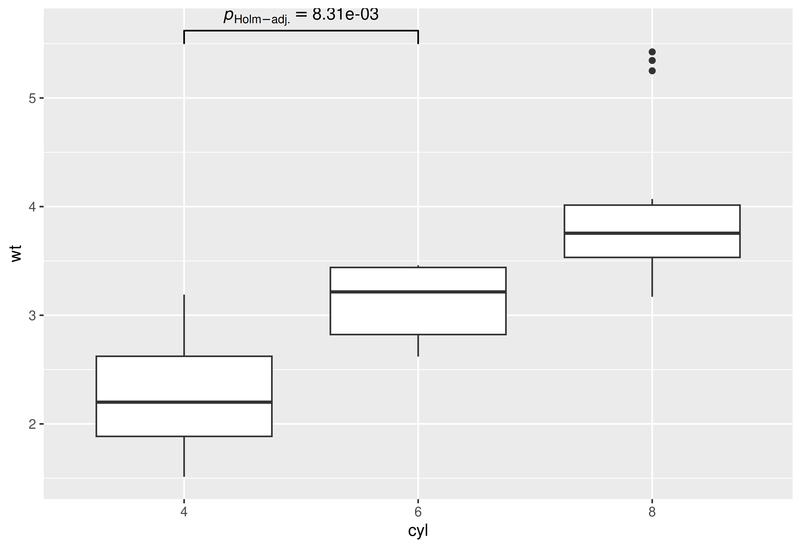
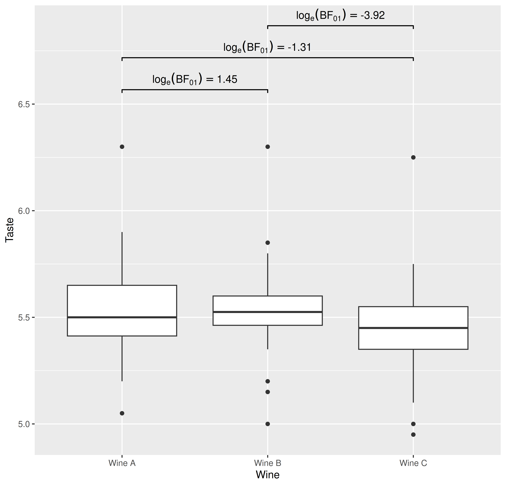

# Pairwise comparisons with \`{ggstatsplot}\`

------------------------------------------------------------------------

You can cite this package/vignette as:

    To cite package 'ggstatsplot' in publications use:

      Patil, I. (2021). Visualizations with statistical details: The
      'ggstatsplot' approach. Journal of Open Source Software, 6(61), 3167,
      doi:10.21105/joss.03167

    A BibTeX entry for LaTeX users is

      @Article{,
        doi = {10.21105/joss.03167},
        url = {https://doi.org/10.21105/joss.03167},
        year = {2021},
        publisher = {{The Open Journal}},
        volume = {6},
        number = {61},
        pages = {3167},
        author = {Indrajeet Patil},
        title = {{Visualizations with statistical details: The {'ggstatsplot'} approach}},
        journal = {{Journal of Open Source Software}},
      }

------------------------------------------------------------------------

## Introduction

When the grouping variable `x` has more than two levels,
[`ggbetweenstats()`](https://www.indrapatil.com/ggstatsplot/reference/ggbetweenstats.md)
and
[`ggwithinstats()`](https://www.indrapatil.com/ggstatsplot/reference/ggwithinstats.md)
follow up the omnibus test (ANOVA or its non-parametric, robust, or
Bayesian counterpart) with pairwise comparisons between all pairs of
groups and display them using
[ggsignif](https://const-ae.github.io/ggsignif/) brackets. The
comparisons themselves are carried out by
[`statsExpressions::pairwise_comparisons()`](https://www.indrapatil.com/statsExpressions/reference/pairwise_comparisons.html).

## Summary of types of statistical analyses

The tests used for each `type` (and the functions used internally to
compute them) are listed in the *Pairwise comparison tests* section of
the documentation for
[`ggbetweenstats()`](https://www.indrapatil.com/ggstatsplot/reference/ggbetweenstats.html)
(between-subjects designs) and
[`ggwithinstats()`](https://www.indrapatil.com/ggstatsplot/reference/ggwithinstats.html)
(within-subjects designs).

A few points worth noting:

- For between-subjects designs,
  [`ggbetweenstats()`](https://www.indrapatil.com/ggstatsplot/reference/ggbetweenstats.md)
  always uses the Games-Howell test for `type = "parametric"`, which
  doesn’t assume equal variances. If you want Student’s *t*-test
  instead, call
  [`statsExpressions::pairwise_comparisons()`](https://www.indrapatil.com/statsExpressions/reference/pairwise_comparisons.html)
  directly with `var.equal = TRUE`.
- *p*-values are adjusted for multiple comparisons using the method
  specified in `p.adjust.method` (default: `"holm"`); use `"none"` for
  no adjustment.
- `pairwise.display` decides which comparisons are shown
  (`"significant"`, `"non-significant"`, `"all"`, or `"none"`), and
  `pairwise.alpha` sets the cutoff used for this decision.
- For `type = "bayes"`, there is no *p*-value adjustment, and all
  comparisons are displayed with $`\log_{e}(BF_{01})`$ values unless
  `pairwise.display = "none"`.
- For within-subjects designs, specify `subject.id` and make sure that
  there is exactly one observation per subject per condition.

## Data frame outputs

The results of the pairwise comparisons shown in a plot can be extracted
with
[`extract_stats()`](https://www.indrapatil.com/ggstatsplot/reference/extract_stats.md):

\
`p`` ``<-`` `[`ggbetweenstats`](https://www.indrapatil.com/ggstatsplot/reference/ggbetweenstats.md)`(``mtcars``, ``cyl``, ``wt``)`\
\
[`extract_stats`](https://www.indrapatil.com/ggstatsplot/reference/extract_stats.md)`(``p``)``$``pairwise_comparisons_data`\
`#> ``# A tibble: 3 × 9`\
`#>   ``group1`` ``group2`` ``statistic``   ``p.value`` ``alternative`` ``distribution`` ``p.adjust.method`\
`#>   ``<chr>``  ``<chr>``      ``<dbl>``     ``<dbl>`` ``<chr>``       ``<chr>``        ``<chr>``          `\
`#> ``1`` 4      6           5.39 ``0.00``8``31``   two.sided   q            Holm           `\
`#> ``2`` 4      8           9.11 ``0.000``0``12``4 two.sided   q            Holm           `\
`#> ``3`` 6      8           5.12 ``0.00``8``31``   two.sided   q            Holm           `\
`#>   ``test``         ``expression`\
`#>   ``<chr>``        ``<list>``    `\
`#> ``1`` Games-Howell ``<language>`\
`#> ``2`` Games-Howell ``<language>`\
`#> ``3`` Games-Howell ``<language>`

For more examples of data frame outputs from
[`statsExpressions::pairwise_comparisons()`](https://www.indrapatil.com/statsExpressions/reference/pairwise_comparisons.html),
see
[here](https://www.indrapatil.com/statsExpressions/articles/web_only/dataframe_outputs.html#pairwise-comparisons-for-one-way-design).

## Using `statsExpressions::pairwise_comparisons()` with `ggsignif`

### Example-1: between-subjects

\
[`library`](https://rdrr.io/r/base/library.html)`(`[`ggplot2`](https://ggplot2.tidyverse.org)`)`\
[`library`](https://rdrr.io/r/base/library.html)`(`[`ggsignif`](https://const-ae.github.io/ggsignif/)`)`\
\
`## converting to factor`\
`mtcars``$``cyl`` ``<-`` `[`as.factor`](https://rdrr.io/r/base/factor.html)`(``mtcars``$``cyl``)`\
\
`## creating a basic plot`\
`p`` ``<-`` `[`ggplot`](https://ggplot2.tidyverse.org/reference/ggplot.html)`(``mtcars``, `[`aes`](https://ggplot2.tidyverse.org/reference/aes.html)`(``cyl``, ``wt``)``)`` ``+`\
`  `[`geom_boxplot`](https://ggplot2.tidyverse.org/reference/geom_boxplot.html)`(``)`\
\
`` ## using `statsExpressions::pairwise_comparisons()` function to create a data frame with results ``\
`df`` ``<-`\
`  ``statsExpressions``::`[`pairwise_comparisons`](https://www.indrapatil.com/statsExpressions/reference/pairwise_comparisons.html)`(``mtcars``, ``cyl``, ``wt``)`` ``|>`\
`  ``dplyr``::`[`mutate`](https://dplyr.tidyverse.org/reference/mutate.html)`(``groups ``=`` ``purrr``::`[`pmap`](https://purrr.tidyverse.org/reference/pmap.html)`(``.l ``=`` `[`list`](https://rdrr.io/r/base/list.html)`(``group1``, ``group2``)``, .f ``=`` ``c``)``)`` ``|>`\
`  ``dplyr``::`[`arrange`](https://dplyr.tidyverse.org/reference/arrange.html)`(``group1``)`\
\
`df`\
`#> ``# A tibble: 3 × 10`\
`#>   ``group1`` ``group2`` ``statistic``   ``p.value`` ``alternative`` ``distribution`` ``p.adjust.method`\
`#>   ``<chr>``  ``<chr>``      ``<dbl>``     ``<dbl>`` ``<chr>``       ``<chr>``        ``<chr>``          `\
`#> ``1`` 4      6           5.39 ``0.00``8``31``   two.sided   q            Holm           `\
`#> ``2`` 4      8           9.11 ``0.000``0``12``4 two.sided   q            Holm           `\
`#> ``3`` 6      8           5.12 ``0.00``8``31``   two.sided   q            Holm           `\
`#>   ``test``         ``expression`` ``groups``   `\
`#>   ``<chr>``        ``<list>``     ``<list>``   `\
`#> ``1`` Games-Howell ``<language>`` ``<chr [2]>`\
`#> ``2`` Games-Howell ``<language>`` ``<chr [2]>`\
`#> ``3`` Games-Howell ``<language>`` ``<chr [2]>`\
\
`` ## using `geom_signif` to display results ``\
`## (note that you can choose not to display all comparisons)`\
`p`` ``+`\
`  ``ggsignif``::`[`geom_signif`](https://const-ae.github.io/ggsignif/reference/stat_signif.html)`(`\
`    comparisons ``=`` `[`list`](https://rdrr.io/r/base/list.html)`(``df``$``groups``[[``1``]``]``)``,`\
`    annotations ``=`` `[`as.character`](https://rdrr.io/r/base/character.html)`(``df``$``expression``)``[[``1``]``]``,`\
`    test        ``=`` ``NULL``,`\
`    na.rm       ``=`` ``TRUE``,`\
`    parse       ``=`` ``TRUE`\
`  ``)`

### Example-2: within-subjects

\
[`library`](https://rdrr.io/r/base/library.html)`(`[`ggplot2`](https://ggplot2.tidyverse.org)`)`\
[`library`](https://rdrr.io/r/base/library.html)`(`[`ggsignif`](https://const-ae.github.io/ggsignif/)`)`\
\
`## creating a basic plot`\
`p`` ``<-`` `[`ggplot`](https://ggplot2.tidyverse.org/reference/ggplot.html)`(``WRS2``::`[`WineTasting`](https://rdrr.io/pkg/WRS2/man/WineTasting.html)`, `[`aes`](https://ggplot2.tidyverse.org/reference/aes.html)`(``Wine``, ``Taste``)``)`` ``+`\
`  `[`geom_boxplot`](https://ggplot2.tidyverse.org/reference/geom_boxplot.html)`(``)`\
\
`` ## using `statsExpressions::pairwise_comparisons()` function to create a data frame with results ``\
`df`` ``<-`\
`  ``statsExpressions``::`[`pairwise_comparisons`](https://www.indrapatil.com/statsExpressions/reference/pairwise_comparisons.html)`(`\
`    ``WRS2``::`[`WineTasting`](https://rdrr.io/pkg/WRS2/man/WineTasting.html)`,`\
`    ``Wine``,`\
`    ``Taste``,`\
`    subject.id ``=`` ``Taster``,`\
`    type ``=`` ``"bayes"``,`\
`    paired ``=`` ``TRUE`\
`  ``)`` ``|>`\
`  ``dplyr``::`[`mutate`](https://dplyr.tidyverse.org/reference/mutate.html)`(``groups ``=`` ``purrr``::`[`pmap`](https://purrr.tidyverse.org/reference/pmap.html)`(``.l ``=`` `[`list`](https://rdrr.io/r/base/list.html)`(``group1``, ``group2``)``, .f ``=`` ``c``)``)`` ``|>`\
`  ``dplyr``::`[`arrange`](https://dplyr.tidyverse.org/reference/arrange.html)`(``group1``)`\
\
`df`\
`#> ``# A tibble: 3 × 19`\
`#>   ``group1`` ``group2`` ``term``       ``effectsize``      ``estimate`` ``conf.level`` ``conf.low`\
`#>   ``<chr>``  ``<chr>``  ``<chr>``      ``<chr>``              ``<dbl>``      ``<dbl>``    ``<dbl>`\
`#> ``1`` Wine A Wine B Difference Bayesian t-test  ``0.00``8``39``       ``0.``95  -``0.0``41``1`\
`#> ``2`` Wine A Wine C Difference Bayesian t-test  ``0.0``74``8``        ``0.``95   ``0.0``13``7`\
`#> ``3`` Wine B Wine C Difference Bayesian t-test  ``0.0``69``6``        ``0.``95   ``0.0``31``8`\
`#>   ``conf.high``    ``pd`` ``prior.distribution`` ``prior.location`` ``prior.scale``   ``bf10`\
`#>       ``<dbl>`` ``<dbl>`` ``<chr>``                       ``<dbl>``       ``<dbl>``  ``<dbl>`\
`#> ``1``    ``0.0``58``1`` ``0.``634 cauchy                          ``0``       ``0.``707  ``0.``235`\
`#> ``2``    ``0.``139  ``0.``990 cauchy                          ``0``       ``0.``707  3.71 `\
`#> ``3``    ``0.``110  1.000 cauchy                          ``0``       ``0.``707 50.5  `\
`#>   ``conf.method`` ``log_e_bf10`` ``n.obs`` ``expression`` ``test``        ``groups``   `\
`#>   ``<chr>``            ``<dbl>`` ``<int>`` ``<list>``     ``<chr>``       ``<list>``   `\
`#> ``1`` ETI              -``1.45``    22 ``<language>`` Student's t ``<chr [2]>`\
`#> ``2`` ETI               1.31    22 ``<language>`` Student's t ``<chr [2]>`\
`#> ``3`` ETI               3.92    22 ``<language>`` Student's t ``<chr [2]>`\
\
`` ## using `geom_signif` to display results ``\
`p`` ``+`\
`  ``ggsignif``::`[`geom_signif`](https://const-ae.github.io/ggsignif/reference/stat_signif.html)`(`\
`    comparisons      ``=`` ``df``$``groups``,`\
`    map_signif_level ``=`` ``TRUE``,`\
`    tip_length       ``=`` ``0.01``,`\
`    y_position       ``=`` `[`c`](https://rdrr.io/r/base/c.html)`(``6.5``, ``6.65``, ``6.8``)``,`\
`    annotations      ``=`` `[`as.character`](https://rdrr.io/r/base/character.html)`(``df``$``expression``)``,`\
`    test             ``=`` ``NULL``,`\
`    na.rm            ``=`` ``TRUE``,`\
`    parse            ``=`` ``TRUE`\
`  ``)`

