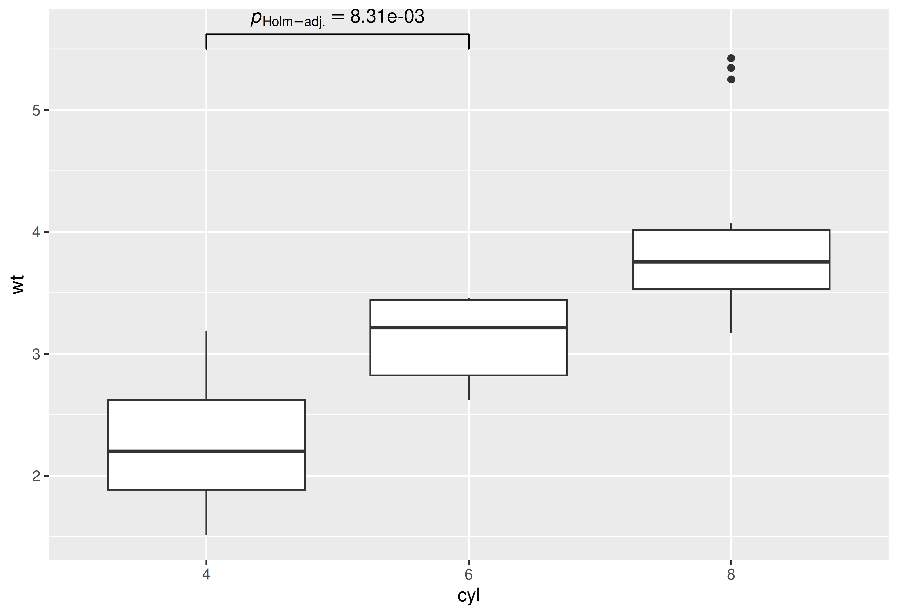
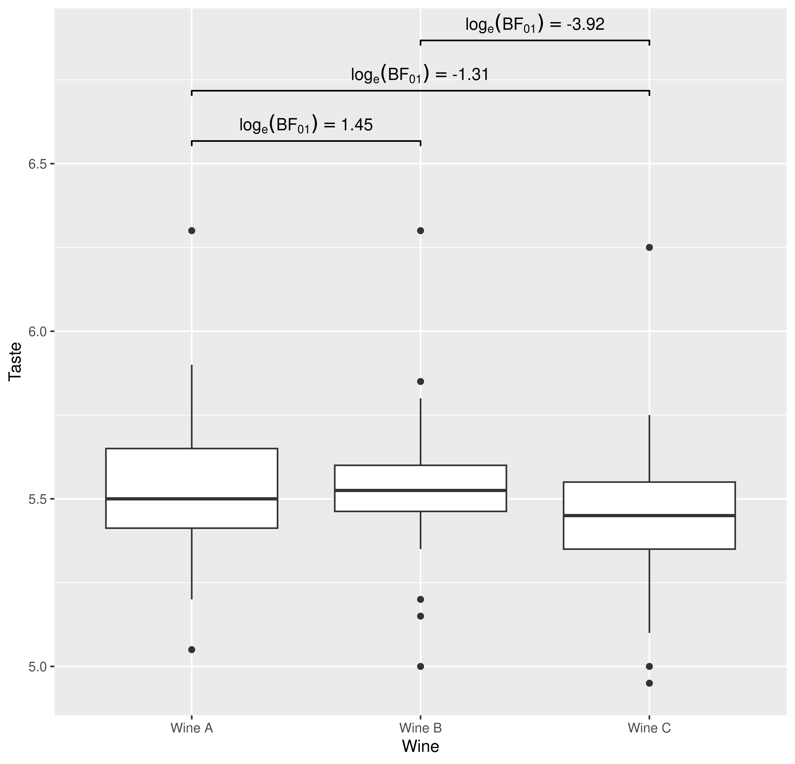

# Pairwise comparisons with \`{ggstatsplot}\`

------------------------------------------------------------------------

You can cite this package/vignette as:

    To cite package 'ggstatsplot' in publications use:

      Patil, I. (2021). Visualizations with statistical details: The
      'ggstatsplot' approach. Journal of Open Source Software, 6(61), 3167,
      doi:10.21105/joss.03167

    A BibTeX entry for LaTeX users is

      @Article{,
        doi = {10.21105/joss.03167},
        url = {https://doi.org/10.21105/joss.03167},
        year = {2021},
        publisher = {{The Open Journal}},
        volume = {6},
        number = {61},
        pages = {3167},
        author = {Indrajeet Patil},
        title = {{Visualizations with statistical details: The {'ggstatsplot'} approach}},
        journal = {{Journal of Open Source Software}},
      }

------------------------------------------------------------------------

## Introduction

Pairwise comparisons with
[ggstatsplot](https://indrajeetpatil.github.io/ggstatsplot/).

## Summary of types of statistical analyses

Following table contains a brief summary of the currently supported
pairwise comparison tests-

### Between-subjects design

| Type | Equal variance? | Test | *p*-value adjustment? | Function used |
|----|----|----|----|----|
| Parametric | No | Games-Howell test | ✅ | [`PMCMRplus::gamesHowellTest`](https://rdrr.io/pkg/PMCMRplus/man/gamesHowellTest.html) |
| Parametric | Yes | Student’s *t*-test | ✅ | [`stats::pairwise.t.test`](https://rdrr.io/r/stats/pairwise.t.test.html) |
| Non-parametric | No | Dunn test | ✅ | [`PMCMRplus::kwAllPairsDunnTest`](https://rdrr.io/pkg/PMCMRplus/man/kwAllPairsDunnTest.html) |
| Robust | No | Yuen’s trimmed means test | ✅ | [`WRS2::lincon`](https://rdrr.io/pkg/WRS2/man/t1way.html) |
| Bayesian | `NA` | Student’s *t*-test | `NA` | [`BayesFactor::ttestBF`](https://rdrr.io/pkg/BayesFactor/man/ttestBF.html) |

### Within-subjects design

| Type | Test | *p*-value adjustment? | Function used |
|----|----|----|----|
| Parametric | Student’s *t*-test | ✅ | [`stats::pairwise.t.test`](https://rdrr.io/r/stats/pairwise.t.test.html) |
| Non-parametric | Durbin-Conover test | ✅ | [`PMCMRplus::durbinAllPairsTest`](https://rdrr.io/pkg/PMCMRplus/man/durbinAllPairsTest.html) |
| Robust | Yuen’s trimmed means test | ✅ | [`WRS2::rmmcp`](https://rdrr.io/pkg/WRS2/man/rmanova.html) |
| Bayesian | Student’s *t*-test | `NA` | [`BayesFactor::ttestBF`](https://rdrr.io/pkg/BayesFactor/man/ttestBF.html) |

## Data frame outputs

See data frame outputs
[here](https://indrajeetpatil.github.io/statsExpressions/articles/web_only/dataframe_outputs.html#pairwise-comparisons).

## Using `pairwise_comparisons()` with `ggsignif`

### Example-1: between-subjects

``` r

library(ggplot2)
library(ggsignif)

## converting to factor
mtcars$cyl <- as.factor(mtcars$cyl)

## creating a basic plot
p <- ggplot(mtcars, aes(cyl, wt)) +
  geom_boxplot()

## using `pairwise_comparisons()` package to create a data frame with results
df <-
  pairwise_comparisons(mtcars, cyl, wt) %>%
  dplyr::mutate(groups = purrr::pmap(.l = list(group1, group2), .f = c)) %>%
  dplyr::arrange(group1)

df
#> # A tibble: 3 × 10
#>   group1 group2 statistic   p.value alternative distribution p.adjust.method
#>   <chr>  <chr>      <dbl>     <dbl> <chr>       <chr>        <chr>          
#> 1 4      6           5.39 0.00831   two.sided   q            Holm           
#> 2 4      8           9.11 0.0000124 two.sided   q            Holm           
#> 3 6      8           5.12 0.00831   two.sided   q            Holm           
#>   test         expression groups   
#>   <chr>        <list>     <list>   
#> 1 Games-Howell <language> <chr [2]>
#> 2 Games-Howell <language> <chr [2]>
#> 3 Games-Howell <language> <chr [2]>

## using `geom_signif` to display results
## (note that you can choose not to display all comparisons)
p +
  ggsignif::geom_signif(
    comparisons = list(df$groups[[1]]),
    annotations = as.character(df$expression)[[1]],
    test        = NULL,
    na.rm       = TRUE,
    parse       = TRUE
  )
```



### Example-2: within-subjects

``` r

library(ggplot2)
library(ggsignif)

## creating a basic plot
p <- ggplot(WRS2::WineTasting, aes(Wine, Taste)) +
  geom_boxplot()

## using `pairwise_comparisons()` package to create a data frame with results
df <-
  pairwise_comparisons(
    WRS2::WineTasting,
    Wine,
    Taste,
    subject.id = Taster,
    type = "bayes",
    paired = TRUE
  ) %>%
  dplyr::mutate(groups = purrr::pmap(.l = list(group1, group2), .f = c)) %>%
  dplyr::arrange(group1)

df
#> # A tibble: 3 × 19
#>   group1 group2 term       effectsize      estimate conf.level conf.low
#>   <chr>  <chr>  <chr>      <chr>              <dbl>      <dbl>    <dbl>
#> 1 Wine A Wine B Difference Bayesian t-test  0.00721       0.95  -0.0418
#> 2 Wine A Wine C Difference Bayesian t-test  0.0755        0.95   0.0127
#> 3 Wine B Wine C Difference Bayesian t-test  0.0693        0.95   0.0303
#>   conf.high    pd prior.distribution prior.location prior.scale   bf10
#>       <dbl> <dbl> <chr>                       <dbl>       <dbl>  <dbl>
#> 1    0.0562 0.624 cauchy                          0       0.707  0.235
#> 2    0.140  0.990 cauchy                          0       0.707  3.71 
#> 3    0.110  1.000 cauchy                          0       0.707 50.5  
#>   conf.method log_e_bf10 n.obs expression test        groups   
#>   <chr>            <dbl> <int> <list>     <chr>       <list>   
#> 1 ETI              -1.45    22 <language> Student's t <chr [2]>
#> 2 ETI               1.31    22 <language> Student's t <chr [2]>
#> 3 ETI               3.92    22 <language> Student's t <chr [2]>

## using `geom_signif` to display results
p +
  ggsignif::geom_signif(
    comparisons      = df$groups,
    map_signif_level = TRUE,
    tip_length       = 0.01,
    y_position       = c(6.5, 6.65, 6.8),
    annotations      = as.character(df$expression),
    test             = NULL,
    na.rm            = TRUE,
    parse            = TRUE
  )
```


